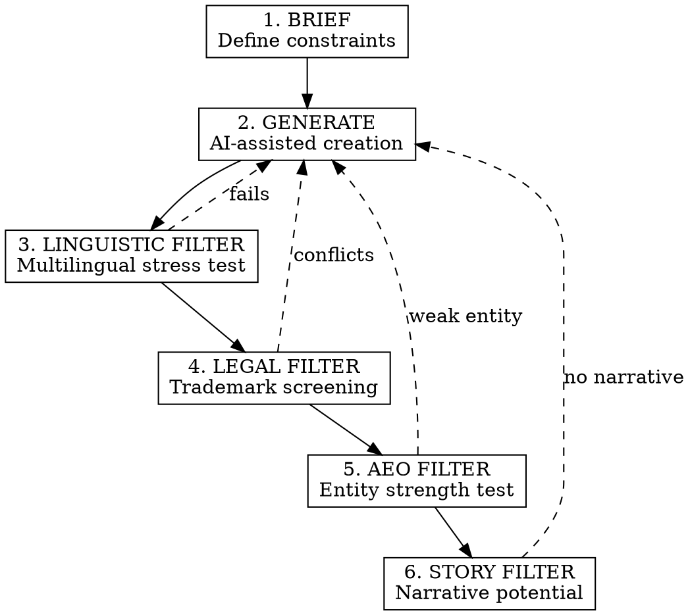

# Naming 6-Gates Protocol

## Overview

Brand naming in 2026 is architectural engineering, not creative brainstorming. A name must be:
1. **Machine-compatible** - tokenized efficiently by LLMs, citeable by AI engines
2. **Legally defensible** - clear of trademark conflicts across jurisdictions
3. **Voice-ready** - pronounceable by assistants, invocable without friction
4. **Narratively loaded** - capable of carrying a brand story

**Core principle:** Optimize for AEO (Answer Engine Optimization) first, aesthetics second.

## When to Use

- Creating a new brand, product, or company name
- Replacing a name due to trademark conflict
- Expanding internationally (multilingual requirements)
- Launching a voice-activated product or skill
- Naming for AI-first discovery (ChatGPT, Perplexity, Gemini recommendations)

## When NOT to Use

- Internal project codenames (no legal/AEO requirements)
- Temporary campaign names
- Personal projects with no commercial intent

## The 6-Gate Naming Process



---

## Gate 1: BRIEF (Constraints Definition)

Define hard constraints BEFORE generating:

| Constraint | Target | Why |
|------------|--------|-----|
| **Length** | 7-8 letters max | Mobile icons, cognitive load, tokenization |
| **Syllables** | 1-3 syllables | Voice invocation, memorability |
| **Character set** | A-Z only | Domain availability, global keyboards |
| **Forbidden sequences** | ght, ough, silent letters | Pronunciation barriers |

**Output format:**
```yaml
brief:
  max_letters: 8
  max_syllables: 3
  target_markets: [FR, ES, US, UK]
  nice_classes: [9, 35, 42]
  avoid_phonemes: [ʒ, θ, ð]  # Hard for non-native speakers
  competitor_names: [Notion, Figma, Linear]  # Style reference
  forbidden_associations: [medical, financial, religious]
```

---

## Gate 2: GENERATE (AI-Assisted Creation)

Use structured prompting with 5 typologies:

### Typology 1: Analogical (Real-Word Transfer)
Words from unrelated domains applied to new context.
- Examples: Apple (tech), Amazon (retail), Jaguar (auto)
- Prompt: "Find words from [nature/mythology/geography] that evoke [core attribute]"

### Typology 2: Metaphorical (Abstract Concept)
Abstract concepts made concrete.
- Examples: Slack (workspace tension release), Notion (idea capture)
- Prompt: "What single word captures the transformation from [pain] to [outcome]?"

### Typology 3: Neologism (Invented Word)
New words with phonetic engineering.
- Examples: Kodak, Xerox, Häagen-Dazs
- Prompt: "Create a 2-syllable word with [plosive start] + [open vowel] + [soft ending]"

### Typology 4: Portmanteau (Fusion)
Blend of two meaningful words.
- Examples: Instagram (instant + telegram), Pinterest (pin + interest)
- Prompt: "Blend [word1] + [word2] keeping recognition of both roots"

### Typology 5: Empty Vessel
Meaningless but phonetically pleasing.
- Examples: Rolex, Vimeo, Skype
- Prompt: "Generate 5-letter combinations: CVCVC pattern, no existing meaning"

**Generation Contract:**
```
CONSTRAINTS:
- Max 8 letters
- Pronounceable in French, Spanish, English
- No existing trademark in Class 42
- Distinct from: [competitor list]

OUTPUT FORMAT per candidate:
- Name: [word]
- Typology: [1-5]
- Phonetic: /IPA transcription/
- Syllables: [count]
- Rationale: [1 sentence]
```

---

## Gate 3: LINGUISTIC FILTER (Multilingual Stress Test)

Test each candidate across target markets:

### Pronunciation Test
Run through TTS engines in 15+ languages:
- Google TTS, Amazon Polly, Azure Speech
- Listen for: mispronunciation, confusion, awkwardness

### Cultural Connotation Check
Verify no negative meanings in:
- Target market slang (TikTok, Douyin, RedNote trends)
- Historical associations
- Religious/political sensitivities
- Homophones in local languages

### Phonetic Hazards to Avoid
| Hazard | Example | Impact |
|--------|---------|--------|
| Silent letters | "Knight" | Voice assistant failure |
| Consonant clusters | "Strengths" | Non-native difficulty |
| Ambiguous vowels | "Read" (reed/red) | Confusion |
| Cross-language homophones | "Gift" (poison in German) | Negative association |

**Kill criterion:** If TTS mispronounces in >2 target markets, reject.

---

## Gate 4: LEGAL FILTER (Trademark Screening)

### Phase 1: Quick Disqualification
- Google: "[name] company" / "[name] brand" / "[name] trademark"
- Domain check: .com, .co, .io, .fr, .eu
- Social handles: Namechk scan all platforms

### Phase 2: Formal Trademark Search
| Registry | Tool | Check For |
|----------|------|-----------|
| France | INPI data.inpi.fr | Exact + phonetic similarity |
| EU | EUIPO eSearch / TMview | Same Nice classes |
| US | USPTO TESS | Registered + pending |
| International | WIPO Global Brand Database | Madrid Protocol |

### Phase 3: AI-Assisted Similarity Detection
EUIPO "Early TM Screening" detects:
- Phonetic similarity (sounds-like)
- Visual similarity (looks-like)
- Conceptual similarity (means-like)

**Kill criterion:** Any conflict in target Nice classes → reject.

---

## Gate 5: AEO FILTER (Entity Strength Test)

A name must be recognizable as a distinct entity by AI systems.

### Entity Strength Checklist
- [ ] **Unique token:** Does the name tokenize as a single unit or get split?
- [ ] **No collision:** Search "[name]" - does it return your intended context or noise?
- [ ] **Semantic boundaries:** Can AI distinguish "[name] the company" from generic usage?

### Testing AEO Strength
```
Prompt to test:
"What is [NAME]?"

GOOD response: "I don't have information about [NAME]" (clean slate)
BAD response: "[NAME] is a common word meaning..." (collision)
BAD response: "[NAME] could refer to several things..." (ambiguity)
```

### Keyword Difficulty Check
Use Semrush/Ahrefs:
- Keyword difficulty < 30 = good
- Keyword difficulty > 60 = buried by generics

**Kill criterion:** If name collides with high-volume generic term, reject.

---

## Gate 6: STORY FILTER (Narrative Potential)

A name must be "tell-able" - capable of carrying a brand story.

### The 5 Narrative Pillars Test
For each candidate, verify you can build:

| Pillar | Question | Example Answer Required |
|--------|----------|------------------------|
| **Origin story** | "Why this name?" | Must have a genuine, shareable reason |
| **Belief story** | What does the brand stand for? | Values must connect to name |
| **Product truth** | What does it actually do? | Name should hint at function |
| **Transformation** | What changes for the customer? | Before/after must be nameable |
| **Culture** | What kind of community forms? | Name should enable identity |

### Empty Vessel vs. Loaded Name
- **Empty vessel** (Kodak, Google): Brand fills meaning over time
- **Loaded name** (Instagram, Airbnb): Meaning is built-in

Both work. But you must choose consciously and build accordingly.

### Vocal Signature Test
Say the name aloud 10 times. Ask:
- Does it feel good in the mouth?
- Would customers enjoy saying it?
- Does it have a "sticky" quality?

**Kill criterion:** If you can't tell a compelling origin story, reject.

---

## Voice Assistant Constraints (2026)

| Assistant | Invocation Rules | Rejection Risks |
|-----------|-----------------|-----------------|
| **Alexa** | 2+ words required (unless trademarked) | Single generic words |
| **Siri** | Must be phonetically distinct | Confusion with system commands |
| **Google** | Strong Knowledge Graph presence needed | Names too similar to famous brands |
| **Bixby** | Avoid wake-word conflicts | "Open", "cancel", common verbs |

**Test procedure:**
1. Say "[Name], do [action]" to each assistant
2. Note recognition rate
3. Reject if < 80% accurate invocation

---

## Output: Naming Dossier

For the final candidate, produce:

```markdown
## [NAME] - Naming Dossier

### Basic Info
- **Name:** [word]
- **Typology:** [1-5]
- **Phonetic:** /IPA/
- **Length:** X letters, Y syllables

### Linguistic Clearance
- FR pronunciation: [pass/fail + notes]
- ES pronunciation: [pass/fail + notes]
- EN pronunciation: [pass/fail + notes]
- Cultural flags: [none / list]

### Legal Clearance
- INPI (FR): [clear / conflict]
- EUIPO (EU): [clear / conflict]
- USPTO (US): [clear / conflict]
- Domains available: [list]
- Social handles: [list]

### AEO Score
- Entity uniqueness: [1-10]
- Keyword difficulty: [score]
- Tokenization: [single/split]

### Narrative Potential
- Origin story hook: [1 sentence]
- Brand values connection: [1 sentence]
- Community identity: [suggested demonym]

### Voice Readiness
- Alexa: [pass/fail]
- Siri: [pass/fail]
- Google: [pass/fail]

### Recommendation
[APPROVED / NEEDS WORK / REJECTED]
[Final reasoning]
```

---

## Common Mistakes

| Mistake | Why It Fails | Fix |
|---------|-------------|-----|
| Starting with brainstorming | Generates unusable names | Start with constraints (Gate 1) |
| Skipping TTS test | Voice assistant failures | Always test pronunciation |
| Ignoring Nice class overlap | Trademark conflicts | Check specific classes, not just exact matches |
| Choosing descriptive names | Weak AEO, hard to trademark | Prefer distinctive/invented |
| No narrative test | Brand can't tell its story | Always verify storytelling potential |

---

## Quick Reference

**The 7-8 Letter Rule:** Shorter = better for mobile, voice, memory, tokenization.

**Phonetic Gold Standard:** CVCV pattern (consonant-vowel-consonant-vowel) works globally.

**AEO Priority:** If AI can't cite you as a distinct entity, you don't exist in 2026.

**Empty Vessel Strategy:** Meaningless names (Kodak) require more brand-building but face fewer conflicts.

**Voice-First:** If Alexa can't invoke it, 8.4 billion assistants can't recommend it.

---

## What Claude Does vs What You Decide

| Claude handles | You provide |
|---------------|-------------|
| Generating candidates by typology | Brief constraints (markets, classes) |
| Running linguistic stress tests | Final pronunciation judgment |
| Checking trademark databases | Legal professional validation |
| Evaluating AEO/entity strength | Strategic brand direction |
| Producing naming dossier | Final selection and approval |

---

## Skill Boundaries

### This skill excels for:
- Brand, product, or company naming
- Names requiring international deployment
- Voice-assistant compatible names
- AI-discoverable entity creation

### This skill is NOT ideal for:
- Internal codenames → No legal/AEO requirements
- Temporary campaign names → Overhead unnecessary
- Personal projects → Simplified process sufficient

---

## Skill Metadata

```yaml
name: naming-6-gates
category: branding
version: 2.0
author: GUIA
source_expert: 6-Gate Protocol (AEO-first naming)
difficulty: advanced
mode: centaur
tags: [naming, branding, trademark, voice-assistant, aeo, entity]
created: 2026-02-03
updated: 2026-02-03
```
