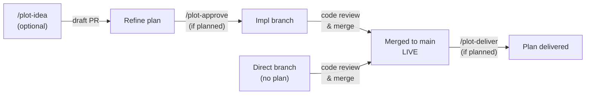
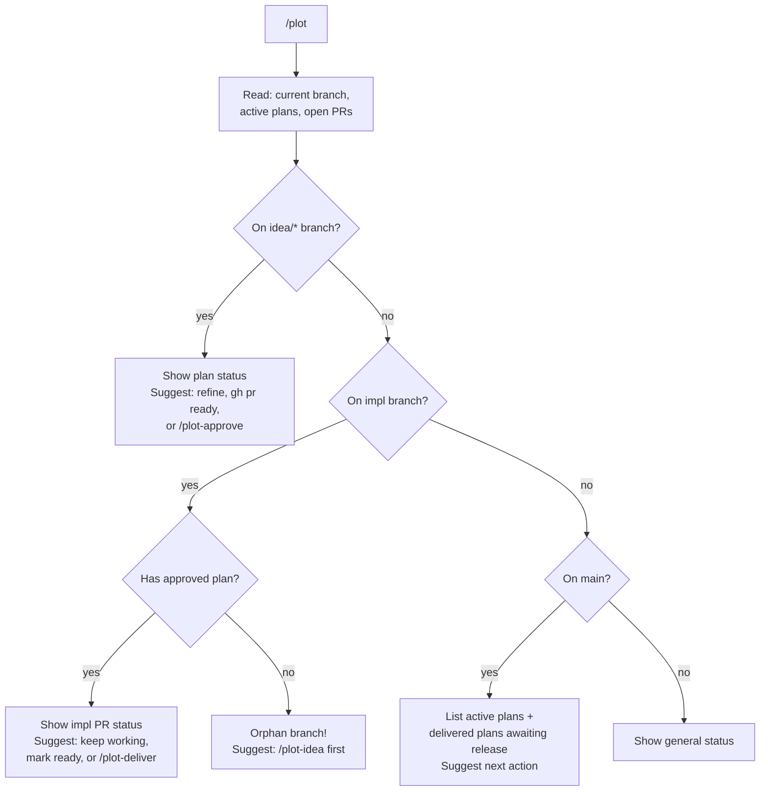

# Plot

Lean, git-native planning system. Plans are markdown files on branches, PRs are workflow metadata, git is the source of truth. Plans merge to main before implementation begins; one plan can spawn multiple parallel implementation branches. Works with any team composition — human, AI-assisted, or fully agentic.

## Setup

Add a `## Plot Config` section to the adopting project's `CLAUDE.md`:

    ## Plot Config
    - **Project board:** <your-project-name> (#<number>)  <!-- optional, for `gh pr edit --add-project` -->
    - **Branch prefixes:** idea/, feature/, bug/, docs/, infra/
    - **Plan directory:** docs/plans/
    - **Active index:** docs/plans/active/
    - **Delivered index:** docs/plans/delivered/

## Model Guidance

| Steps | Min. Tier | Notes |
|-------|-----------|-------|
| 1. Read State | Small | Git/gh commands, file listing |
| 2. Detect Context | Small | Branch name pattern matching |
| 3. Detect Issues | Small (most), Mid (overlap) | Overlapping plans (3+ shared words) needs mid-tier |
| 4. Status Summary | Small | Template formatting |

All dispatcher steps are mechanical except the "Overlapping plans" heuristic in step 3, which requires comparing plan titles. A small model should skip title comparison and only flag exact slug duplicates.

## Lifecycle

### Feature / Bug (full lifecycle)

```mermaid
flowchart LR
    subgraph Planning
        A["/plot-idea"] -->|draft PR| B["Refine &<br/>slice branches"]
        B -->|"⏳ gh pr ready"| C["Review plan"]
    end
    subgraph Approval
        C -->|"⏳ /plot-approve<br/>(or PR already merged)"| D["Plan merged<br/>impl PRs created"]
    end
    subgraph Implementation
        D -->|"⚡ create branches"| E["Work on<br/>impl branches"]
        E -->|"⏸ draft → review → merge<br/>(standard code review)"| F["All impls<br/>merged to main"]
    end
    subgraph Delivery
        F -->|"⚡ /plot-deliver"| G["Plan delivered"]
    end
    subgraph Release
        G -->|"⚡ /plot-release rc"| H["RC tag +<br/>checklist"]
        H -->|"⏸ endgame testing"| I{"All verified?"}
        I -->|"no: fix → new RC"| H
        I -->|"⏳ sign-off"| J["⚡ /plot-release"]
    end
```



Legend: ⚡ automate ASAP · ⏸ natural pause · ⏳ human-paced

### Docs / Infra (live when merged)



### Direct Work (no planning step)

Small features, bug fixes, docs, and infra tasks go directly to a PR:

```
feature/<slug>  →  PR  →  merge
bug/<slug>      →  PR  →  merge
docs/<slug>     →  PR  →  merge
infra/<slug>    →  PR  →  merge
```

## Phases

| Phase | Meaning | Trigger | Transition Pacing |
|-------|---------|---------|-------------------|
| Draft | Plan being written/refined | `/plot-idea` | ⏸ natural pause (writing) |
| Approved | Plan merged, impl branches created | `/plot-approve` | ⏳ human-paced (review) → ⚡ automate (branch creation) |
| Delivered | All impl PRs merged, plan delivered | `/plot-deliver` | ⏸ natural pause (implementation) → ⚡ automate (delivery) |
| Released | Included in a versioned release | `/plot-release` | ⚡ automate (RC tag) → ⏸ endgame → ⏳ sign-off → ⏳ human-paced (version bump, tag, push) |

The Release phase includes an RC verification loop. Individual plans don't track a "Testing" phase — the release checklist does. See the Pacing section in the manifesto for details.

## Conventions

- **Branch prefixes:** `idea/` (plans), `feature/`, `bug/`, `docs/`, `infra/` (implementation)
- **Plan files:** `docs/plans/YYYY-MM-DD-<slug>.md` — date-prefixed, never move once created
- **Active index:** `docs/plans/active/<slug>.md` — symlinks to Draft/Approved plans
- **Delivered index:** `docs/plans/delivered/<slug>.md` — symlinks to Delivered plans
- **Plan PR:** starts as draft (being refined), marked ready with `gh pr ready`, titled `Plan: <title>`
- **Impl PRs:** draft, created by `/plot-approve`, reference the plan on main

## Guardrails

- `/plot-approve` requires plan PR to be non-draft or already merged — no approving unreviewed plans
- `/plot-deliver` requires all impl PRs merged — no premature delivery
- `/plot-release` requires delivered plans — cannot release undelivered work; verifies readiness but does not execute release steps without user confirmation
- `/plot` detects orphan impl branches (no approved plan) — prevents coding without context
- Phase field in plan files is machine-readable — every command checks current phase before acting

## Dispatcher

The `/plot` command analyzes current git state and suggests the next action.

### Decision Tree



### 1. Read State

Gather context in parallel:

```bash
# Current branch
BRANCH=$(git branch --show-current)

# Active plans on main
ls docs/plans/active/ 2>/dev/null

# Delivered plans
ls docs/plans/delivered/ 2>/dev/null

# Open PRs on idea/ branches
gh pr list --json number,title,headRefName,isDraft,state --jq '.[] | select(.headRefName | startswith("idea/"))'

# Open PRs on impl branches (feature/, bug/, docs/, infra/)
gh pr list --json number,title,headRefName,isDraft,state --jq '.[] | select(.headRefName | startswith("feature/") or startswith("bug/") or startswith("docs/") or startswith("infra/"))'
```

Also run the bash helpers if a specific slug is in context:
- `./scripts/plot-pr-state.sh <slug>` — plan PR state
- `./scripts/plot-impl-status.sh <slug>` — impl PR states

### 2. Detect Current Context

**If on an `idea/*` branch:**
- Read the plan file from `docs/plans/<slug>.md` on this branch
- Check plan PR state (draft / ready / merged)
- Suggest:
  - If plan PR is draft: "Plan is still a draft. Refine it, then run `gh pr ready <number>` when ready for review."
  - If plan PR is non-draft (ready for review): "Plan is ready for review. Run `/plot-approve <slug>` to merge and create impl branches."
  - If plan PR is merged: "Plan is already approved. Run `/plot-approve <slug>` to create impl branches (if not already created)."

**If on an impl branch (`feature/*`, `bug/*`, `docs/*`, `infra/*`):**
- Check if there's a corresponding approved plan via `docs/plans/active/<slug>.md` on main
- If plan exists: show impl PR status, suggest keep working / mark ready / `/plot-deliver`
- If no plan exists: warn "Orphan branch — no approved plan found. Consider running `/plot-idea` first."

**If on `main`:**
- List all active plans with their phases
- List any delivered plans awaiting release (from `docs/plans/delivered/`)
- Show overall status summary
- Suggest next action based on what's pending

**Otherwise:**
- Show general status: active plans, open PRs, recent deliveries

### 3. Detect Issues

Flag any problems found:

- **Orphan impl branches**: branches with `feature/`, `bug/`, `docs/`, `infra/` prefix that have no corresponding plan in `docs/plans/`
- **Phase mismatches**: plan says Draft but PR is non-draft, or plan says Approved but PR is still open
- **Stale drafts**: impl PRs that have been in draft state for more than 7 days
- **Overlapping plans**: Draft/Approved plans with titles sharing 3+ significant words — flag in the status summary as informational (no blocking)

> **Smaller models:** Skip title-similarity detection. Only report exact slug matches (identical filenames). Title overlap detection requires mid-tier reasoning.

### 4. Status Summary

Print a clear summary:

```
## Plot Status

### Active Plans
- `<slug>` — Phase: <phase> | Plan PR: #<n> (<state>) | Impl PRs: <count> merged / <count> total

### Issues
- <issue description>

### Suggested Next Step
> <specific command or action>
```
