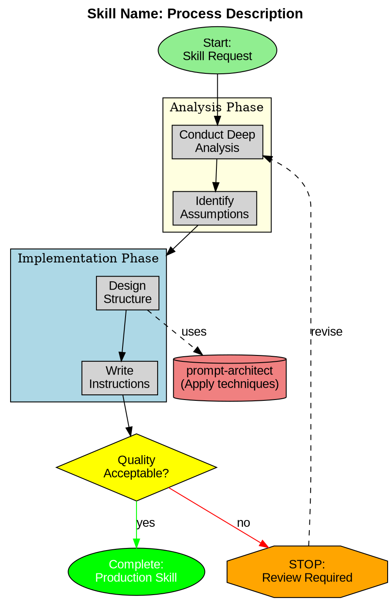

# Skill Forge

An advanced skill creation system that helps craft sophisticated, well-engineered skills for Claude Code by combining deep intent analysis, evidence-based prompting principles, and systematic skill engineering methodology.

## Overview

Skill Forge represents a meta-cognitive approach to skill creation. Rather than simply generating skill templates, it guides you through a comprehensive process that ensures every skill you create is strategically designed, follows best practices, and incorporates sophisticated prompt engineering techniques.

This skill operates as an intelligent collaborator that helps you think deeply about what you're trying to achieve, identifies the optimal structure for your skill, and applies evidence-based techniques to maximize effectiveness. The result is skills that are not just functional but genuinely powerful extensions of Claude's capabilities.

## When to Use This Skill

Activate Skill Forge when creating new skills for Claude Code, refining or restructuring existing skills that aren't performing optimally, wanting to apply prompt engineering best practices to skill design, building skills that will be used repeatedly or shared with others, or creating complex skills that require sophisticated workflows or multiple components.

This skill is particularly valuable when the skill being created has significant strategic importance, when clarity about requirements is incomplete, when the skill will need to work reliably across varied contexts, or when teaching others about effective skill design.

## The Skill Forge Process

Skill Forge follows a seven-phase methodology that ensures comprehensive analysis, strategic design, and effective implementation. Each phase builds on insights from previous phases while remaining flexible enough to adapt to the unique requirements of different skill types.

### Phase 1: Intent Archaeology

The first phase engages in deep analysis to understand what skill truly needs to be created. This goes beyond surface-level descriptions to excavate the underlying goals, constraints, and success criteria.

**Conduct Deep Analysis**: Begin by applying extrapolated-volition principles to understand the true intent behind the skill request. Ask yourself what the person is ultimately trying to achieve, not just what they're explicitly asking for. Consider whether they're solving a one-time problem, establishing a repeatable workflow, codifying institutional knowledge, or enabling future capabilities.

**Identify Hidden Assumptions**: Surface implicit assumptions about what the skill will do, how it will be used, who will use it, and what constitutes success. Many skill requests carry unstated assumptions that significantly impact design decisions. Make these explicit early to avoid building the wrong thing.

**Map the Problem Space**: Understand the broader context in which this skill will operate. What workflows precede its use? What happens after? What other skills or tools might it interact with? How does it fit into the user's larger ecosystem? This contextual understanding prevents creating isolated skills that don't integrate well.

**Clarify Through Strategic Questions**: When genuine uncertainty exists about intent or requirements, engage in targeted questioning designed to reveal critical information. Focus questions on disambiguating between different design approaches rather than gathering exhaustive details. Quality questions at this phase prevent extensive rework later.

Example strategic questions include what triggers the need for this skill in real workflows, what makes this workflow challenging or repetitive enough to warrant skill creation, what the desired outputs or outcomes look like concretely, what variations or edge cases the skill needs to handle, and what constraints or requirements must be satisfied.

**Document Core Understanding**: Synthesize the analysis into a clear statement of what the skill needs to accomplish and why. This becomes the foundation for all subsequent design decisions. Include the primary use cases, key requirements, important constraints, and success criteria.

### Phase 2: Use Case Crystallization

Transform abstract understanding into concrete examples that demonstrate how the skill will actually be used. Concrete examples prevent building overly general or insufficiently specified skills.

**Generate Representative Examples**: Create three to five specific, realistic examples of how the skill would be used. Each example should represent a different aspect or variation of the skill's functionality. These examples serve as design targets that keep the skill grounded in real usage.

**Validate Examples**: Confirm that the examples accurately represent intended usage patterns. If creating the skill collaboratively, verify examples with the person requesting the skill. If designing independently, pressure-test examples against the understood requirements.

**Identify Pattern Variations**: Analyze examples to identify commonalities and variations. What stays consistent across examples? What changes? This analysis reveals which aspects should be standardized in the skill and which need flexibility.

**Establish Coverage**: Ensure the examples adequately cover the skill's intended scope. If the skill needs to handle edge cases, include examples that demonstrate those. If certain usage patterns are particularly important, ensure they're represented.

### Phase 3: Structural Architecture

Design the skill's structure based on the progressive disclosure principle and evidence-based prompting patterns. This phase determines what goes in SKILL.md versus bundled resources, and how information should be organized.

**Apply Progressive Disclosure**: Determine what information belongs at each level of the skill's three-tier loading system. Metadata should concisely communicate the skill's purpose and trigger conditions. SKILL.md should contain core procedural knowledge and workflow guidance. Bundled resources should include detailed references, executable scripts, and reusable assets.

**Identify Resource Requirements**: Based on the use cases, determine what bundled resources the skill needs. Consider whether any operations would benefit from deterministic scripts rather than token generation. Identify if reference documentation is needed for complex schemas, APIs, or domain knowledge. Determine if asset files like templates, icons, or boilerplate code would be valuable.

**Structure SKILL.md Content**: Plan the organization of SKILL.md using hierarchical structure that guides Claude naturally through the skill's usage. Critical information should appear early and late in the document where attention is highest. Complex workflows should be broken into clear steps. Related information should be grouped logically.

**Apply Prompting Principles**: Incorporate evidence-based techniques appropriate to the skill's purpose. For analytical skills, build in self-consistency mechanisms. For complex multi-step workflows, use plan-and-solve structure. For tasks requiring precise outputs, specify explicit success criteria and output formats. For skills with known failure modes, include guardrails and negative examples.

**Optimize for Clarity**: Ensure the skill's structure makes it easy for Claude to quickly understand when to use it and how to use it. Use clear section headers, consistent formatting, and explicit connection between instructions and examples.

### Phase 4: Metadata Engineering

Craft the skill's metadata (name and description) with strategic precision. These approximately 100 words determine when Claude discovers and activates the skill, making them among the most important words in the entire skill.

**Choose a Strategic Name**: Select a name that is memorable, descriptive, and distinct from other skills. The name should suggest the skill's purpose without being overly long or abstract. Avoid generic terms that could apply to many skills. Consider how the name will appear in skill lists and whether it clearly indicates the skill's domain.

**Engineer the Description**: Write a description that serves three critical purposes - clearly communicating what the skill does, explicitly stating when it should be used, and providing enough detail for Claude to assess relevance to specific queries. The description should be comprehensive but concise, typically three to five sentences.

**Incorporate Trigger Patterns**: Include terminology and phrases that match how users would naturally request the skill's functionality. If users might ask to "analyze spreadsheet data" or "create pivot tables," ensure those phrases appear in the description. This improves skill discovery and activation.

**Specify Clear Boundaries**: Indicate what the skill does NOT do as well as what it does. This prevents inappropriate activation when similar but distinct functionality is needed. Boundaries can be stated explicitly or implied through specificity about what the skill covers.

**Use Third-Person Voice**: Write the description objectively using third-person construction. Instead of "Use this skill when you need to..." write "This skill should be used when..." or "Use when..." This maintains consistency with skill metadata conventions.

### Phase 5: Instruction Crafting

Write the actual skill content using imperative voice, clear structure, and evidence-based prompting patterns. This is where prompting principles and skill creation methodology fully integrate.

**Adopt Imperative Voice**: Write all instructions using verb-first, imperative form. Instead of "You should first analyze the data" write "Analyze the data first." Instead of "The next step is to create a summary" write "Create a summary." This style is clearer, more concise, and better suited for AI consumption.

**Provide Procedural Clarity**: When describing workflows or processes, break them into clear, numbered or structured steps. Each step should have a single clear action. Complex steps should be decomposed into substeps. The progression from one step to the next should be logical and explicit.

**Include Rationale for Non-Obvious Decisions**: When instructions include non-obvious design choices or techniques, briefly explain why. This helps Claude understand the reasoning behind the instructions and adapt them intelligently to specific situations. For example, "Begin by analyzing data structure before processing to handle edge cases effectively."

**Specify Success Criteria**: Make it clear what constitutes successful execution of the skill's instructions. Define what good outputs look like. Specify how to handle ambiguous cases. Provide guidance on when to seek clarification versus making reasonable assumptions.

**Build in Quality Mechanisms**: Incorporate self-checking mechanisms where appropriate. For analytical tasks, include validation steps. For generation tasks, specify quality criteria. For multi-step processes, include checkpoints to verify correct progression.

**Address Known Failure Modes**: If the skill domain has common pitfalls or failure patterns, build in guardrails. Use negative examples to illustrate what to avoid. Provide fallback strategies for error cases. Make edge case handling explicit.

**Reference Bundled Resources**: Clearly indicate when and how to use bundled scripts, references, or assets. Make the connection between instructions and resources explicit. Provide enough context that Claude understands the purpose and proper usage of each resource.

### Phase 6: Resource Development

Create the actual scripts, references, and assets identified in the structural architecture phase. This is where the skill's reusable components come to life.

**Develop Scripts Strategically**: Create executable scripts for operations that benefit from deterministic code execution rather than token generation. Scripts should be well-commented to explain their purpose and usage. Include error handling for common failure cases. Make scripts flexible enough to handle reasonable variations in input while remaining focused on their core purpose.

**Compile Reference Documentation**: Create reference files that contain detailed information Claude should access as needed rather than loading it all into context. References might include API documentation, database schemas, company policies, detailed workflows, or domain-specific knowledge. Structure references with clear headers and searchable content. Consider including grep search patterns in SKILL.md if reference files are large.

**Curate Asset Files**: Gather or create asset files that will be used in the skill's outputs. Assets might include templates, boilerplate code, images, fonts, or sample documents. Ensure assets are production-quality and properly formatted. Document any special usage requirements or customization points in the assets.

**Create Process Visualization Diagram**: Generate a GraphViz .dot file that visualizes the skill's workflow, phases, and decision points. This diagram serves as both documentation and a quick-reference guide for understanding the skill's structure. Follow the semantic GraphViz best practices for clarity and AI comprehension:

**Semantic Shape Guidelines** (following https://blog.fsck.com/2025/09/29/using-graphviz-for-claudemd/):
- **`ellipse`** for start/end points to clearly mark entry and exit
- **`diamond`** for genuine binary/ternary decisions requiring user choice
- **`box`** (default) for actions and process steps
- **`octagon`** for warnings or critical checkpoints
- **`cylinder`** for external skill/data references
- **`folder`** for principle or concept groups

**Color Coding by Function**:
- **`fillcolor=red, fontcolor=white`** for absolute prohibitions or stop points
- **`fillcolor=orange`** for critical warnings requiring attention
- **`fillcolor=yellow`** for decision points needing confirmation
- **`fillcolor=green`** for approved actions or successful completion
- **`fillcolor=lightblue`** for standard process steps
- **`fillcolor=lightyellow`** for phase groupings
- **`fillcolor=lightcoral`** for external references
- **`fillcolor=lightsalmon`** for guidelines or best practices

**Structural Best Practices**:
- Use **quoted strings** for all labels to improve readability
- Use **`subgraph cluster_*`** to group related processes with descriptive labels
- Apply **`style=filled`** with strategic colors to create visual urgency/hierarchy
- Use **`style=dashed`** edges for conditional or cross-process flows
- Label edges clearly with outcomes ("yes"/"no", "pass"/"fail", "uses", "feeds to")
- Avoid deep nesting; prefer multiple subgraphs for clarity
- Use `compound=true` for cleaner inter-cluster connections when needed

Name the file `<skill-name>-process.dot` and place it in the skill's root directory. Use this enhanced template:

**Key Principles from Blog Post**:
- Semantic shapes create visual patterns Claude can follow
- Dot format removes ambiguity better than prose descriptions
- Modular, focused designs work better than overly complex diagrams
- Consistent color coding establishes clear visual language
- Quoted labels improve both human and AI readability

The diagram makes the skill's logic visually accessible, aids onboarding, removes ambiguity for Claude, and serves as living documentation that evolves with the skill.

**Maintain Separation of Concerns**: Keep clear boundaries between what goes in each type of resource. SKILL.md contains procedural instructions. Scripts contain executable code. References contain detailed documentation. Assets contain output materials. GraphViz diagrams visualize process flow. Avoid duplication across resource types.

**Document Resource Usage**: Update SKILL.md to reference each bundled resource with clear guidance on when and how Claude should use it. Make the connection between workflow steps and specific resources explicit.

### Phase 7: Validation and Iteration

Validate the completed skill against quality criteria and iterate based on testing results. This phase ensures the skill meets standards before deployment.

**Run Validation Script**: Use the packaging script to validate skill structure, metadata quality, and organizational conventions. The validator checks YAML frontmatter format, naming conventions, description completeness, file organization, and resource references. Address any validation errors before considering the skill complete.

**Conduct Functionality Testing**: Test the skill in realistic scenarios that match the use cases identified in Phase 2. Verify that Claude discovers and activates the skill appropriately. Confirm that the skill's instructions produce expected results. Check that bundled resources are used correctly.

**Assess Clarity and Usability**: Evaluate whether the skill is intuitive and easy to use. Consider whether someone unfamiliar with the skill's development could understand its purpose and usage from the metadata and SKILL.md. Identify any confusing or ambiguous instructions.

**Check for Anti-Patterns**: Review the skill against common anti-patterns in prompting and skill design. Look for vague instructions, contradictory requirements, over-complexity, insufficient edge case handling, and other known failure modes. Refine to eliminate anti-patterns.

**Iterate Based on Feedback**: After initial use, gather feedback about the skill's effectiveness. Note where Claude struggles or produces suboptimal results. Identify instructions that could be clearer or more specific. Update the skill to address discovered issues.

**Package for Distribution**: Once validated and tested, use the packaging script to create a distributable zip file. The packaged skill maintains proper directory structure and includes all necessary files for deployment.

## Strategic Design Principles

Throughout the Skill Forge process, apply these overarching principles that ensure skills are strategically designed rather than ad-hoc created.

**Design for Discovery**: Create metadata that enables Claude to find and activate the skill at appropriate times. Use terminology that matches natural language queries. Be specific enough that false positives are rare but general enough that valid use cases aren't missed.

**Optimize for Learning**: Structure skills so they not only accomplish tasks but help Claude become more effective at those tasks over time. Include rationale for non-obvious decisions. Provide context that builds understanding. Use examples that illustrate key concepts.

**Balance Specificity and Flexibility**: Make skills specific enough to be genuinely useful without being so rigid they can't adapt to reasonable variations. Identify what must remain constant versus what can vary. Build flexibility into instruction phrasing while maintaining clear core requirements.

**Prioritize Maintainability**: Design skills that are easy to understand, update, and extend over time. Use clear structure and documentation. Avoid hidden dependencies. Keep related information together. Make the skill's logic and organization transparent.

**Think in Systems**: Consider how each skill fits into a larger ecosystem of skills. Avoid creating overlapping or conflicting skills. Look for opportunities to compose skills together. Design skills that complement rather than duplicate existing capabilities.

**Emphasize Quality Over Quantity**: Create fewer, well-engineered skills rather than many mediocre ones. Invest time in strategic design and thoughtful implementation. The goal is building genuinely powerful capabilities, not accumulating skill collections.

## Working with Existing Skills

When refining or restructuring existing skills rather than creating new ones, adapt the Skill Forge process appropriately.

**Analyze Current Performance**: Begin by understanding how the existing skill performs. Identify where it succeeds and where it struggles. Gather concrete examples of failure cases or suboptimal results. Determine whether issues stem from structural problems, unclear instructions, missing resources, or metadata that causes incorrect activation.

**Apply Diagnostic Framework**: Use the Phase 1 intent archaeology questions to determine if the skill's design matches its actual purpose. Check if the structural architecture follows progressive disclosure and prompting principles. Evaluate whether instructions are clear and complete. Assess metadata quality against discovery requirements.

**Prioritize Improvements**: Based on the diagnostic analysis, identify which improvements would provide the most value. Structural issues often have the biggest impact but require more extensive refactoring. Instruction clarity problems might be quicker to fix. Metadata improvements affect discovery and activation.

**Refactor Strategically**: When restructuring skills, maintain backward compatibility where possible if the skill is in active use. Consider whether changes warrant a new skill version or constitute a fundamental redesign. Preserve working components while improving problematic areas.

**Revalidate After Changes**: After refining an existing skill, revalidate using the same process as new skill creation. Ensure changes improve performance without introducing new problems. Test in scenarios that previously caused issues to confirm improvements are effective.

## Integration with Prompting Principles

Skill Forge directly incorporates evidence-based prompting techniques throughout skill creation. Understanding how these principles apply ensures skills leverage research-backed patterns.

**Self-Consistency for Analytical Skills**: When creating skills for analysis, evaluation, or fact-based tasks, build in self-consistency mechanisms. Instruct Claude to consider multiple perspectives, validate conclusions against evidence, and flag areas of uncertainty. This reduces errors and increases reliability.

**Program-of-Thought for Logical Tasks**: For skills involving mathematical operations, logical reasoning, or step-by-step problem solving, structure instructions to encourage explicit step-by-step thinking. Break complex operations into clear substeps. Have Claude show its work. This improves accuracy and makes reasoning transparent.

**Plan-and-Solve for Complex Workflows**: When skills involve multi-stage processes, use plan-and-solve structure. Instruct Claude to first plan the approach, then execute systematically, and finally verify results. This reduces errors in complex workflows and helps Claude handle variations intelligently.

**Structural Guardrails**: Apply structural optimization principles throughout skill design. Place critical information at the beginning and end of SKILL.md. Use clear delimiters and formatting to separate different types of information. Create hierarchical organization that guides natural progression through the skill's content.

**Negative Examples and Failure Modes**: For domains with known failure patterns, include negative examples that illustrate what to avoid. Make common mistakes explicit. Provide fallback strategies for edge cases. This prevents repetition of known anti-patterns.

## Advanced Techniques

For particularly sophisticated or complex skills, consider these advanced techniques that extend beyond basic skill creation.

**Composability Design**: Create skills designed to work together with other skills. Identify opportunities for skill composition where combining multiple skills produces emergent capabilities. Use consistent naming conventions and complementary functionality boundaries to enable composition.

**Dynamic Resource Loading**: For skills with extensive reference documentation, include instructions for Claude to selectively load only relevant sections. Provide grep patterns or search strategies that help Claude find specific information efficiently. This manages context window usage while maintaining access to comprehensive knowledge.

**Executable Scripts with Intelligence**: When bundling scripts, design them to be intelligent about their execution environment. Include command-line arguments that provide flexibility. Add configuration options that adapt behavior to different contexts. Balance determinism with adaptability.

**Layered Abstraction**: For complex domain skills, structure information in layers from high-level concepts to detailed implementation. Let Claude navigate between abstraction levels based on the specific query. This supports both quick execution of routine tasks and deep understanding when needed.

**Feedback Integration**: Design skills with mechanisms for continuous improvement. Include templates for collecting usage feedback. Structure skills so common refinements can be made easily. Consider versioning strategies for skills that will evolve significantly over time.

## Packaging and Distribution

After creating a skill using the Skill Forge process, package it properly for deployment and potential sharing.

**Validate Before Packaging**: Always run the validation script before packaging. The validator at `/mnt/skills/examples/skill-creator/scripts/package_skill.py` checks skill structure, metadata quality, and organizational conventions. Address validation errors before proceeding with packaging.

**Create Distribution Package**: Use the packaging script to create a properly structured zip file. The packaged skill maintains directory structure and includes all necessary files. The zip file is named after the skill for easy identification.

**Document Installation and Usage**: For skills that will be shared, include clear installation instructions. Document any dependencies or prerequisites. Provide examples of typical usage patterns. Consider creating a README that lives alongside the packaged skill.

**Consider Scope and Audience**: Determine whether the skill is personal, team-specific, or broadly useful. Personal skills optimize for individual workflows. Team skills balance specificity with shared context. Broadly useful skills require more extensive documentation and generality.

## Meta-Learning and Continuous Improvement

Skill Forge itself improves through practice and reflection. Each skill creation provides lessons that enhance future skills.

**Analyze Skill Performance**: After skills are in use, observe how well they perform. Note patterns in what works well versus what needs refinement. Identify whether issues stem from skill design, instruction clarity, or fundamental approach.

**Build Pattern Libraries**: Over time, develop a personal library of patterns that work well for specific types of skills. Reuse successful structural approaches, instruction phrasing, and resource organization. Codify lessons learned into reusable components.

**Share Knowledge**: When working in teams, share effective skill patterns and design principles. Build collective understanding of what makes skills successful. Contribute insights back to skill creation methodology.

**Stay Current with Research**: Prompt engineering and AI capabilities continue to evolve. Stay informed about new techniques and best practices. Integrate valuable innovations into your skill creation process. Revisit older skills to apply new insights.

**Embrace Iteration**: Accept that initial skill designs may not be perfect. Plan for iterative refinement based on actual usage. View skill creation as an ongoing process rather than a one-time event. Continuously improve skills as understanding deepens.

## Conclusion

Skill Forge transforms skill creation from template filling into strategic design. By combining deep intent analysis, evidence-based prompting principles, and systematic methodology, it ensures every skill you create is well-engineered and genuinely powerful.

The investment in thoughtful skill design pays dividends through skills that work reliably, handle edge cases gracefully, and become increasingly valuable over time. As you build a library of well-crafted skills, Claude Code becomes progressively more capable in your specific domain, ultimately becoming a true extension of your expertise.

Remember that skill creation is both art and science. This framework provides the science—the principles, patterns, and methodologies that research and practice have shown to be effective. The art comes from applying these principles with judgment, creativity, and deep understanding of your specific needs. Use Skill Forge as a foundation while developing your own expertise in skill design through practice and reflection.
