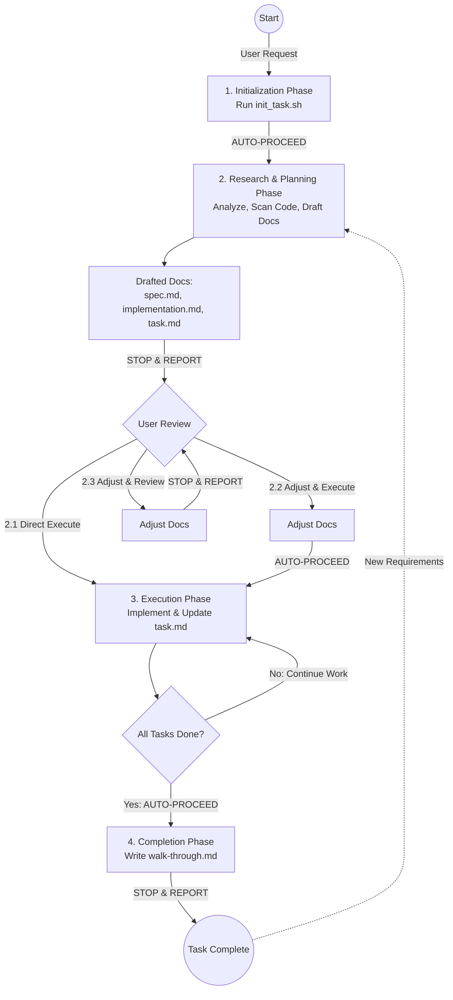

# Spec Driven Development

This skill implements an **AI-Spec-Driven Development** workflow that emulates "Antigravity Planning Mode". Ideally suited for complex, multi-step engineering tasks, it drastically reduces "hallucinated" solutions by forcing a structured "Think, Plan, then Act" lifecycle.

## Trigger
**IMPORTANT**: This skill is **ONLY** triggered when the AI model is explicitly requested by the user (e.g., "Use spec-driven-development", "Activate planning mode", "Create a spec for this"). 
- Do **NOT** auto-trigger this skill for simple Q&A or minor bug fixes.
- It is designed for tasks requiring architectural thought, multiple file changes, or a defined implementation strategy.

## Directory Structure
The workflow isolates its artifacts in a hidden directory to keep the workspace clean.

```
<PROJECT_ROOT>/
├── .spec-driven-development-tasks/      # Hidden directory for all tasks
│   ├── {YYYYMMDD}-{TASK_TITLE}/         # Specific task folder
│   │   ├── spec.md                      # "The WHAT": Requirements, Context, Scope
│   │   ├── implementation.md            # "The HOW": Architecture, File Changes, Steps
│   │   ├── task.md                      # "The WHEN": Real-time checklist & logs
│   │   └── walk-through.md              # "The SUMMARY": Verification Guide, Handover
│   └── ...
├── .gitignore                           # Excludes .spec-driven-development-tasks
└── ...
```

## Workflow Diagram



## Workflow Phases

### 1. Initialization Phase
**Input**: The user's natural language request (e.g., "Help me refactor the authentication module"). The user does **not** provide a specific task title; the Agent must analyze the request to generate one.

**Process**:
1.  **Generate a Task Title** (e.g., `refactor-auth-module`).
2.  **Run Script**: Call `skills/spec-driven-development/scripts/init_task.sh <TASK_TITLE>`.
    - Ensures `.spec-driven-development-tasks` exists and is added to `.gitignore`.
    - **Note**: The user must have "Gitignore Access" enabled for the AI tool to modify `.gitignore` and files within ignored directories.
    - Creates `{YYYYMMDD}-{TASK_TITLE}` directory with 4 empty template files.

**Output**: A clean, isolated workspace for the task.

**Transition**: **AUTO-PROCEED to Phase 2**. Do not stop to report "Initialization Complete".

### 2. Deep Research & Planning Phase
**Input**: The initialized workspace and user requirements.

**Process**:
1.  **Deep Research**: Scan relevant code/docs to understand the current system (avoid blind full-repo scans).
2.  **Draft Documentation**: Fill the empty files using templates:
    - **`spec.md`**: Context, Requirements, Scope (from `templates/spec-template.md`).
    - **`implementation.md`**: Architecture, Implementation Steps (from `templates/implementation-template.md`).
    - **`task.md`**: TODO Checklist (from `templates/task-template.md`).

**Output**: Drafted specification and planning documents.

**Transition**: **STOP & REPORT**. Present the plan to the user with **exactly** these 3 options:
- **2.1. Execute Immediately**: User agrees -> Proceed to Phase 3.
- **2.2. Adjust & Execute**: User gives minor feedback -> Update docs -> Proceed to Phase 3 (no second confirmation).
- **2.3. Adjust & Review**: User gives major feedback -> Update docs -> **STOP & REPORT** (ask for confirmation again).

### 3. Execution Phase
**Input**: Approved `spec.md`, `implementation.md`, `task.md`.

**Process**:
1.  **Execute**: Write code according to `implementation.md`.
2.  **Real-time Update**: Mark items in `task.md` as `[x]` immediately upon completion.
3.  **Check Completion**: Continue until all items in `task.md` are checked.

**Output**: Completed implementation and updated `task.md`.

**Transition**: **AUTO-PROCEED to Phase 4** immediately after all tasks are done. Do not stop to ask "Ready for next phase?".

### 4. Completion & Archiving Phase
**Input**: Finished code and completed `task.md`.

**Process**:
1.  **Summarize**: Create `walk-through.md` using `templates/walk-through-template.md`.
2.  **Iterative Requirement Handling**:
    - If user provides **New Requirements** after this phase:
    - Return to **Phase 2 (Option 2.2 Trigger)** workflow.
    - **Retain** old content in docs.
    - **Append** new scope to docs.
    - Resume at Phase 3.

**Output**: Final project summary.

**Transition**: **STOP & REPORT**. Inform the user the task is fully complete and present the `walk-through.md`.
