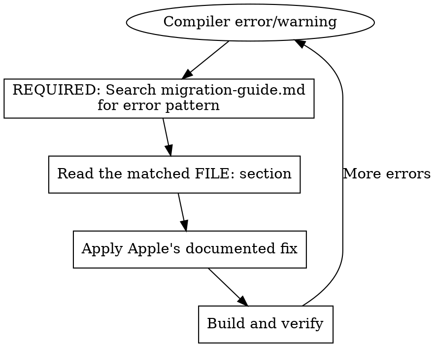

# Swift 6 Migration

## Overview

Swift 6 enforces data race safety at compile time. Migration involves making implicit isolation explicit and ensuring all shared state is thread-safe.

**This skill bundles Apple's complete migration guide.** You MUST search it for EVERY error before implementing a fix.

## Mandatory Workflow



**For EACH compiler error/warning:**

1. **FIRST** search migration-guide.md for the error pattern
2. **THEN** read the matched FILE: section
3. **THEN** apply the documented fix
4. **FINALLY** verify the fix

## Checklist

Use TodoWrite to track each item:

- [ ] Enable `-strict-concurrency=complete` warnings before Swift 6 mode
- [ ] For EACH error: grep migration-guide.md BEFORE implementing fix
- [ ] Read the relevant FILE: section from search results
- [ ] Verify fix matches Apple's documented approach
- [ ] Test runtime behavior after fixes (execution order may change)

## Required Searches by Error Type

**You MUST run these searches.** Do not skip to Quick Reference.

| Error Pattern                               | Required Search Command                                    |
| ------------------------------------------- | ---------------------------------------------------------- |
| `global variable is not concurrency-safe`   | `grep -n -A 30 "Unsafe Global" migration-guide.md`         |
| `does not conform to.*Sendable`             | `grep -n -A 30 "Sendable Types" migration-guide.md`        |
| `cannot pass argument of non-sendable type` | `grep -n -A 30 "ConformanceMismatches" migration-guide.md` |
| `actor-isolated.*cannot be referenced`      | `grep -n -A 30 "actor-isolated" migration-guide.md`        |
| `@preconcurrency` needed                    | `grep -n -A 30 "PreconcurrencyImport" migration-guide.md`  |
| `Task` or async/await migration             | `grep -n -A 30 "Boundaries.swift" migration-guide.md`      |
| GCD/DispatchQueue migration                 | `grep -n -A 30 "DispatchQueue" migration-guide.md`         |

## Quick Reference (Starting Points Only)

**These are shortcuts for orientation. You MUST verify against migration-guide.md before applying.**

| Problem               | Likely Direction                            | Verify With                                   |
| --------------------- | ------------------------------------------- | --------------------------------------------- |
| Mutable global var    | `let`, `@MainActor`, or actor               | `grep -n "Globals.swift" migration-guide.md`  |
| Non-Sendable class    | `Sendable`, `@unchecked Sendable`, or actor | `grep -n "Sendable" migration-guide.md`       |
| Actor isolation error | `await`, `nonisolated`, or `@MainActor`     | `grep -n "actor-isolated" migration-guide.md` |
| Closure capturing     | `@Sendable` closure or restructure          | `grep -n "closure" migration-guide.md`        |
| Legacy callback API   | `withCheckedContinuation`                   | `grep -n "continuation" migration-guide.md`   |

## Commands

```bash
# Build with complete concurrency checking (warnings)
swift build -Xswiftc -strict-concurrency=complete

# Build in Swift 6 mode (errors)
swift build -Xswiftc -swift-version -Xswiftc 6
```

**Package.swift settings:**

```swift
// Enable strict concurrency per target
.target(
    name: "MyTarget",
    swiftSettings: [.enableExperimentalFeature("StrictConcurrency")]
)

// Or enable Swift 6 mode
swiftLanguageVersions: [.v6]
```

## Common Mistakes

| Mistake                                 | Why It's Wrong                          | Better Approach                                              |
| --------------------------------------- | --------------------------------------- | ------------------------------------------------------------ |
| Adding `@unchecked Sendable` everywhere | Hides real data races                   | Search guide first: `grep -n "unchecked" migration-guide.md` |
| Using `nonisolated(unsafe)`             | Compiler trusts you but runtime doesn't | Search: `grep -n "nonisolated" migration-guide.md`           |
| Skipping the migration guide            | Miss Apple's recommended patterns       | ALWAYS search before fixing                                  |

## Red Flags - STOP and Search First

These thoughts mean you're about to skip required verification:

- "I know how to fix this"
- "The Quick Reference has the answer"
- "This is a common pattern"
- "I'll check the guide if this doesn't work"
- "My knowledge is sufficient"

**All of these mean: Search migration-guide.md FIRST.**

## Reference Documentation

The migration-guide.md file contains Apple's complete migration documentation (25 bundled files, 3700+ lines):

| Topic                    | Search Pattern                                       |
| ------------------------ | ---------------------------------------------------- |
| Common errors            | `FILE: Guide.docc/CommonProblems.md`                 |
| Data race safety         | `FILE: Guide.docc/DataRaceSafety.md`                 |
| Incremental adoption     | `FILE: Guide.docc/IncrementalAdoption.md`            |
| Swift 6 mode             | `FILE: Guide.docc/Swift6Mode.md`                     |
| Complete checking        | `FILE: Guide.docc/CompleteChecking.md`               |
| Sendable examples        | `FILE: Sources/Examples/ConformanceMismatches.swift` |
| Global variable patterns | `FILE: Sources/Examples/Globals.swift`               |

To find specific content: `grep -n "pattern" migration-guide.md`
