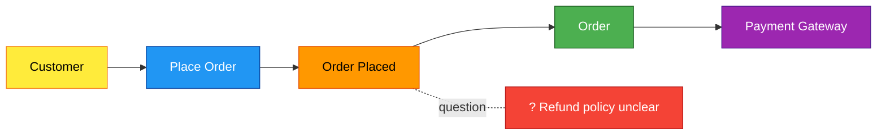
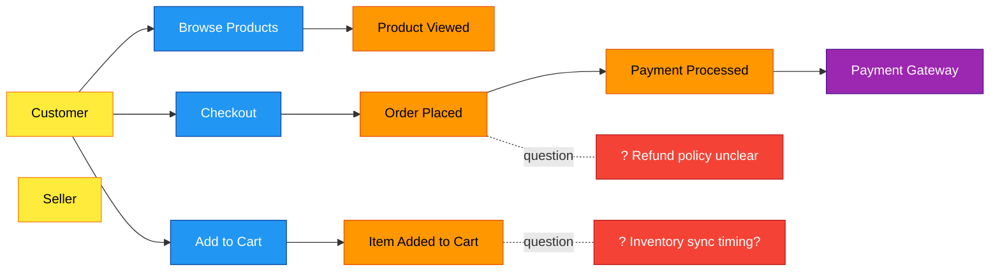

## 执行环境

| 路径类型 | 说明 |
|---------|------|
| **使用方式** | 此技能提供模板和指导，**无需本地脚本执行** |
| **调用场景** | 当用户需要系统设计、架构文档、技术选型时自动激活 |
| **输出位置** | `docs/design-catalog/` 目录（相对于项目根目录） |

## 路径说明

- **无本地脚本依赖**：此技能生成文档模板，不涉及本地脚本执行
- **生成的目录**：保存在执行命令时的当前目录下的 `docs/design-catalog/`
- **项目上下文**：基于当前工作目录确定项目根目录

# System Design Through EventStorming

## Overview

Transform requirements into navigable design catalogs using EventStorming methodology and Mermaid diagrams.

**Core principle:** Progressive elaboration through event-driven thinking, producing token-efficient visual artifacts in standardized catalog structure.

**Announce at start:** "I'm using the system-design skill to create a design catalog for your system."

## When to Use

**Use when:**
- User wants to design a new system
- Requirements exist but design doesn't
- Need structured thinking before implementation
- Team needs shared visual artifacts

**Don't use when:**
- Adding features to existing system (consider brainstorming instead)
- Implementation already started
- User wants code, not design

## Quick Reference

| Phase | Key Activities | Output Files |
|-------|---------------|-------------|
| **1. Requirements** | Ask questions, identify actors/constraints | requirements.md |
| **2. Big Picture** | EventStorming timeline with events/commands | big-picture.mmd |
| **3. Processes** | Zoom into critical processes, add aggregates | process-{name}.mmd |
| **4. Data & Flows** | ERD, state charts, sequences | erd.mmd, state-{entity}.mmd, sequence-{flow}.mmd |
| **5. Integration** | Generate catalog README | README.md |

## The Iron Laws

### Law 1: ASK QUESTIONS - No Assumptions

**NEVER make "industry-standard assumptions" without asking the user first.**

- Ask about actors, constraints, scale, budget, timeline
- Use AskUserQuestion tool for architectural choices
- Mark unclear areas as hotspots instead of assuming

**Bad:**
```
 "I'll assume standard PostgreSQL for data storage"
 "Proceeding with industry-standard assumptions"
 "I'll design for moderate scale (10K users)"
```

**Good:**
```
 "What database are you currently using?" (AskUserQuestion with options)
 "What scale are you targeting?" (AskUserQuestion: 100 users / 10K / 100K+)
 "Budget constraints for infrastructure?" (Ask directly)
```

### Law 2: MERMAID ONLY - No ASCII Diagrams

**All diagrams MUST use Mermaid format. NO exceptions.**

- No ASCII art
- No text-based diagrams
- No "version control friendly" excuses for avoiding Mermaid

**Bad:**
```
 ASCII art entity relationships
 Text-based flowcharts
 "I'll create ASCII diagrams because they're universal"
```

**Good:**
```
 Mermaid ER diagrams
 Mermaid flowcharts
 Mermaid sequence diagrams
 Mermaid state charts
```

### Law 3: EVENTSTORMING - Event-Driven Thinking

**Use EventStorming methodology for Phases 2-3. Required.**

- Identify domain events (what happens in the system)
- Add commands (what triggers events)
- Add actors (who initiates)
- Add systems (external integrations)
- Mark hotspots (unclear/risky areas)

**Bad:**
```
 "Using traditional waterfall analysis"
 "Creating use cases and functional specs"
 "Based on proven patterns" (without events)
```

**Good:**
```
 "Let's identify key business events" (EventStorming)
 "What triggers each event?" (Commands)
 "What data changes when this event happens?" (Aggregates)
```

### Law 4: CATALOG STRUCTURE - Standardized Organization

**All artifacts go into `docs/design-catalog/` with specific structure.**

```
docs/design-catalog/
  README.md              # Navigation hub
  requirements.md
  big-picture.mmd
  processes/
    process-{name}.mmd
  data/
    erd.mmd
    state-{entity}.mmd
  flows/
    sequence-{flow}.mmd
```

**No random file names. No mixed concerns.**

### Law 5: DESIGN NOT IMPLEMENTATION

**Stay at design abstraction. NO implementation details in design phase.**

**Forbidden in design artifacts:**
-  Database schemas (SQL, migrations)
-  Deployment guides (Docker, Kubernetes)
-  CI/CD pipelines
-  Specific technology choices (unless user specified)
-  Implementation timelines (16-week plans)
-  Team structure recommendations
-  Code examples (API endpoints, controllers, services, functions)
-  Configuration files (YAML, JSON, ENV)

**Allowed:**
-  Entity relationships (conceptual)
-  State transitions (conceptual)
-  Event flows (conceptual)
-  Integration points (generic)
-  Hotspots for technical decisions

### Law 6: TOKEN EFFICIENCY - Diagrams Over Prose

**Prefer Mermaid diagrams over lengthy text descriptions.**

**Token targets by project complexity:**
- Simple (single service, 5-10 entities): < 10K tokens
- Medium (2-3 services, 10-20 entities): < 20K tokens
- Complex (multiple services, 20+ entities): < 35K tokens

**If exceeding targets, check:**
- Are you writing prose that diagrams could show?
- Are you repeating information across files?
- Are you including implementation details?

**Bad:**
```
 4,000 lines of documentation
 Verbose explanations of every decision
 Repeating information across files
 "This is complex so 50K tokens is reasonable"
```

**Good:**
```
 Mermaid diagram with annotations
 Cross-reference: "See big-picture.mmd for event flow"
 Tables for entity attributes
 Minimal prose, maximum visual clarity
```

## The 5 Phases

**REQUIRED: Use TodoWrite to track phase progress.**

Copy this checklist:
```
System Design Progress:
- [ ] Phase 1: Requirements (actors, constraints, goals identified)
- [ ] Phase 2: Big Picture (EventStorming timeline created)
- [ ] Phase 3: Processes (Critical processes detailed)
- [ ] Phase 4: Data & Flows (ERD, state charts, sequences created)
- [ ] Phase 5: Integration (Catalog assembled, next steps planned)
```

### Phase 1: Requirements Understanding

**Goal:** Understand context before designing

**Activities:**
1. Ask questions ONE at a time (following brainstorming pattern)
2. Use AskUserQuestion for architectural choices with trade-offs
3. Identify: business goals, constraints, key actors, success criteria

**Questions to ask:**
- "What problem does this system solve?"
- "Who are the primary users/actors?"
- "What are the critical constraints?" (performance, scale, budget, timeline)
- "How do you define success?"
- "What systems need to integrate?"

**Output:** Create `docs/design-catalog/requirements.md`

**Validation:** Present requirements summary, ask: "Does this capture the scope?"

### Phase 2: EventStorming Big Picture

**Goal:** Understand business process through events

**Announce:** "Let's explore the business process through EventStorming."

**Activities:**
1. Ask: "What are the key business events that happen in this system?"
2. Build timeline collaboratively (add events as user describes)
3. Ask: "Who triggers each event? What commands cause them?"
4. Add actors and commands
5. Ask: "Are there external systems involved?"
6. Add external systems
7. Mark hotspots for unclear areas (DON'T assume, MARK AS HOTSPOT)

**EventStorming Color Conventions (Mermaid):**



**Output:** Create `docs/design-catalog/big-picture.mmd`

**Validation:** Present diagram, ask: "Does this capture the high-level flow?"

### Phase 3: Process EventStorming

**Goal:** Detail specific processes from big picture

**Activities:**
1. Identify **2-4 critical processes** to detail (not more)
2. For each process:
   - Ask: "Let's detail the {process name} process"
   - Ask: "What aggregates (data entities) are involved?"
   - Ask: "What state changes happen at each event?"
   - Build detailed process diagram with color coding

**Criteria for "critical" processes:**
- Touches multiple aggregates
- Has complex business rules
- High business value or risk
- User specifically mentioned as important

**Output:** Create `docs/design-catalog/processes/process-{name}.mmd` (one per process)

**Validation:** Review each process diagram before moving to next

### Phase 4: System Design Artifacts

**Goal:** Model data, state, and interactions

**4.1 Entity-Relationship Diagram**
- Extract entities from process diagrams
- Ask: "What are the relationships between these entities?"
- Define attributes (but NOT database schema)
- Use Mermaid ER diagram syntax

**Output:** `docs/design-catalog/data/erd.mmd`

**4.2 State Charts**
- Identify entities with complex lifecycles
- Ask: "Which entities have important state transitions?"
- Map states, transitions, triggers
- Annotate data changes per transition
- Use Mermaid stateDiagram-v2
- **Limit:** 2-4 entities max (only entities with complex lifecycles)

**Output:** `docs/design-catalog/data/state-{entity}.mmd` (one per entity)

**4.3 Sequence Diagrams**
- Ask: "Which flows need detailed interaction modeling?"
- Select critical/complex flows
- Map actor/system interactions
- Show success AND error paths
- Use Mermaid sequenceDiagram
- **Limit:** 2-4 flows max (only critical/complex flows)

**Output:** `docs/design-catalog/flows/sequence-{flow}.mmd` (one per flow)

**Don't diagram everything - focus on what adds clarity.**

**Validation:** Present all artifacts, ask: "Does this design feel complete?"

### Phase 5: Integration & Next Steps

**Goal:** Assemble catalog and plan next actions

**Activities:**
1. Generate catalog README with:
   - Project overview
   - Links to all artifacts
   - **EMBED ALL DIAGRAMS** (copy full Mermaid content from each .mmd file)
   - Navigation to processes, states, flows
   - All diagrams must be visible in README for easy preview
2. Present complete design catalog
3. Ask: "Ready to proceed with implementation planning?"

**CRITICAL:** The README must include the FULL Mermaid diagram content inline, not just links. Copy the entire contents of each .mmd file into the README's mermaid code blocks. This enables preview without opening individual files.

**Options:**
- **Standalone design:** Stop here, design complete
- **Implementation planning:** Use writing-plans skill
- **Pumped-design mapping:** (If backend + pumped-fn) Map to pumped-fn catalog

**Output:** `docs/design-catalog/README.md` (with all diagrams embedded)

## Iterative Refinement

**User can jump back to earlier phases when insights emerge.**

Support non-linear progression:
- "Let's refine requirements" → Return to Phase 1, update downstream
- "Big picture is missing X" → Return to Phase 2, revise
- "Process needs more detail" → Return to Phase 3, expand
- "Data model has issues" → Return to Phase 4, adjust

**Flexibility principle:** Design is discovery - support iteration

## Mermaid Templates

See `templates/` directory for:
- `big-picture-template.mmd` - EventStorming timeline
- `process-template.mmd` - Process EventStorming
- `erd-template.mmd` - Entity-Relationship
- `state-template.mmd` - State chart
- `sequence-template.mmd` - Sequence diagram
- `requirements-template.md` - Requirements structure
- `catalog-readme-template.md` - Catalog README

## Common Rationalizations (DON'T DO THESE)

| Excuse | Reality |
|--------|---------|
| "Industry-standard assumptions are fine" | Ask questions to understand THIS project |
| "ASCII diagrams are version control friendly" | Mermaid is required - renders AND version controls |
| "Comprehensive documentation is better" | Token-efficient diagrams beat verbose prose |
| "Traditional approach works" | EventStorming reveals events you'd miss otherwise |
| "Production-ready blueprint needed" | Design phase stays conceptual, not implementation |
| "All aspects should be covered" | Focus on design artifacts, defer implementation |
| "Database schema helps developers" | Too early - stay at entity/relationship level |
| "Technology choices are obvious" | Mark as hotspot or ask user, don't assume |

## Red Flags - STOP and Self-Check

If you catch yourself doing ANY of these, you're violating the skill:

- Making assumptions without asking
- Creating ASCII diagrams
- Skipping EventStorming
- Writing SQL schemas
- Creating deployment guides
- Making technology choices without user input
- Using > 35,000 tokens for complex design (see Law 6 targets)
- Not using TodoWrite for phases
- Creating README with only links to diagrams (must embed full content)

**All of these mean: Stop, re-read the skill, start over correctly.**

## Integration with Other Skills

### Brainstorming
- Phase 1 (Requirements) borrows question patterns
- Use AskUserQuestion tool similarly
- One question at a time

### Writing-Plans
- Optional handoff after Phase 5
- Design catalog provides context for implementation tasks

### Pumped-Design
- Optional mapping for backend systems
- Translate catalog to pumped-fn structure
- ERD → resources, Processes → flows

## Success Criteria

**Design is successful when:**
- User engaged through questions (not assumptions)
- All diagrams in Mermaid format
- EventStorming methodology followed
- Catalog structure created correctly
- Token usage efficient (< 15K for typical project)
- Hotspots marked instead of assumed
- Stayed at design level (no SQL, deployment, etc.)
- Phases tracked with TodoWrite

## Example: Minimal E-commerce Big Picture



This is minimal - real design would be more detailed. But shows the pattern.

## Summary

**System design through EventStorming:**
1. Ask questions (no assumptions)
2. Use Mermaid (no ASCII)
3. Follow EventStorming (event-driven thinking)
4. Create catalog structure (standardized)
5. Stay at design level (no implementation)
6. Be token-efficient (diagrams over prose)
7. Track with TodoWrite (phase discipline)

**Result:** Navigable design catalog that feeds into implementation planning.
