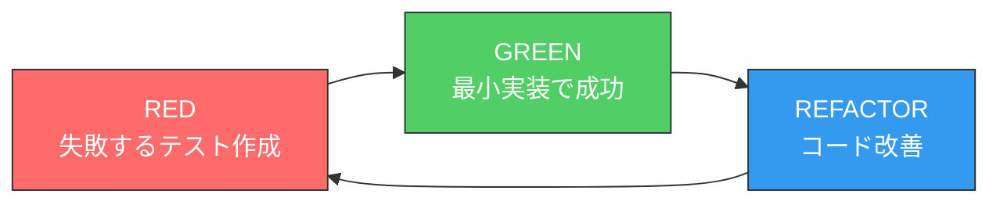

# Test-Driven Development (TDD) Workflow

**Version**: 1.0.0
**Last Updated**: 2025-11-26
**Priority**: P0 Level
**Purpose**: テスト駆動開発による高品質なコード実装

---

## 概要

MiyabiプロジェクトにおけるTDD（Test-Driven Development）の完全なワークフロー。
Red-Green-Refactorサイクルを通じて、堅牢で保守性の高いコードを実現します。

---

## 呼び出しトリガー

| トリガー | 例 |
|---------|-----|
| 新機能実装 | "implement feature X", "add new functionality" |
| バグ修正 | "fix bug", "resolve issue" |
| テスト追加 | "add tests", "write tests for" |
| リファクタリング | "refactor with tests", "improve code" |
| TDD依頼 | "use TDD", "test-driven" |

---

## TDDサイクル: Red-Green-Refactor



### Phase 1: RED (失敗するテストを書く)

**目的**: 実装したい機能の仕様をテストとして明文化

```rust
#[cfg(test)]
mod tests {
    use super::*;

    #[test]
    fn test_new_feature_basic() {
        // Arrange: テスト準備
        let input = "test_input";

        // Act: 実行
        let result = new_feature(input);

        // Assert: 検証
        assert_eq!(result, expected_output);
    }

    #[test]
    fn test_new_feature_edge_case() {
        // エッジケースのテスト
        let result = new_feature("");
        assert!(result.is_err());
    }
}
```

**実行**:
```bash
cargo test test_new_feature --no-run && cargo test test_new_feature
# 期待: FAILED (テストが失敗することを確認)
```

### Phase 2: GREEN (テストを通す最小実装)

**目的**: テストを通すための最小限のコード実装

```rust
pub fn new_feature(input: &str) -> Result<String, Error> {
    // 最小限の実装
    if input.is_empty() {
        return Err(Error::InvalidInput);
    }
    Ok(expected_output.to_string())
}
```

**実行**:
```bash
cargo test test_new_feature
# 期待: PASSED (全テスト成功)
```

### Phase 3: REFACTOR (コード改善)

**目的**: テストを維持しながらコード品質を改善

```rust
pub fn new_feature(input: &str) -> Result<String, Error> {
    // バリデーション分離
    validate_input(input)?;

    // 処理の明確化
    let processed = process_input(input);

    // 結果構築
    Ok(build_output(processed))
}

fn validate_input(input: &str) -> Result<(), Error> {
    if input.is_empty() {
        return Err(Error::InvalidInput);
    }
    Ok(())
}
```

**実行**:
```bash
cargo test test_new_feature && cargo clippy && cargo fmt -- --check
# 期待: 全テスト成功 + 警告なし + フォーマット済み
```

---

## テストピラミッド

```
          /\
         /  \        E2E Tests (10%)
        /----\       - 完全なユーザーフロー
       /      \      - 本番環境に近い状態
      /--------\
     /          \    Integration Tests (30%)
    /------------\   - コンポーネント間連携
   /              \  - 外部API模擬
  /----------------\
 /                  \ Unit Tests (60%)
/--------------------\ - 関数・メソッド単位
                       - 高速・独立・決定的
```

### 各レベルの目安

| レベル | カバレッジ目標 | 実行時間 | 頻度 |
|--------|--------------|---------|------|
| Unit | 80%+ | < 1秒/テスト | 常時 |
| Integration | Key paths | < 10秒/テスト | CI |
| E2E | Critical flows | < 60秒/テスト | 日次 |

---

## Rust TDD パターン集

### Pattern 1: Result型のテスト

```rust
#[test]
fn test_operation_success() {
    let result = operation(valid_input);
    assert!(result.is_ok());
    assert_eq!(result.unwrap(), expected);
}

#[test]
fn test_operation_error() {
    let result = operation(invalid_input);
    assert!(result.is_err());
    assert!(matches!(result.unwrap_err(), Error::InvalidInput));
}
```

### Pattern 2: async関数のテスト

```rust
#[tokio::test]
async fn test_async_operation() {
    let result = async_operation().await;
    assert!(result.is_ok());
}

#[tokio::test]
async fn test_async_with_timeout() {
    let result = tokio::time::timeout(
        Duration::from_secs(5),
        async_operation()
    ).await;
    assert!(result.is_ok());
}
```

### Pattern 3: モック使用

```rust
use mockall::predicate::*;
use mockall::mock;

mock! {
    pub ExternalService {
        async fn call(&self, input: &str) -> Result<String, Error>;
    }
}

#[tokio::test]
async fn test_with_mock() {
    let mut mock = MockExternalService::new();
    mock.expect_call()
        .with(eq("test"))
        .returning(|_| Ok("response".to_string()));

    let result = my_function(&mock).await;
    assert!(result.is_ok());
}
```

### Pattern 4: プロパティベーステスト

```rust
use proptest::prelude::*;

proptest! {
    #[test]
    fn test_property(input in ".*") {
        let result = process(&input);
        // 任意の入力に対して常に真な性質
        prop_assert!(result.len() >= 0);
    }

    #[test]
    fn test_roundtrip(input in any::<u32>()) {
        let encoded = encode(input);
        let decoded = decode(&encoded);
        prop_assert_eq!(input, decoded);
    }
}
```

### Pattern 5: テストフィクスチャ

```rust
struct TestFixture {
    db: TestDatabase,
    service: TestService,
}

impl TestFixture {
    async fn new() -> Self {
        let db = TestDatabase::setup().await;
        let service = TestService::new(&db);
        Self { db, service }
    }

    async fn teardown(self) {
        self.db.cleanup().await;
    }
}

#[tokio::test]
async fn test_with_fixture() {
    let fixture = TestFixture::new().await;

    // テスト実行
    let result = fixture.service.operation().await;
    assert!(result.is_ok());

    fixture.teardown().await;
}
```

### Pattern 6: スナップショットテスト

```rust
use insta::assert_snapshot;

#[test]
fn test_output_format() {
    let result = generate_output(input);
    assert_snapshot!(result);
}

#[test]
fn test_json_output() {
    let result = to_json(&data);
    assert_snapshot!(result);
}
```

---

## コマンドリファレンス

### 基本テストコマンド

```bash
# 全テスト実行
cargo test --workspace

# 特定パッケージのテスト
cargo test -p miyabi-agents

# 特定テストの実行
cargo test test_name

# テスト名のパターンマッチ
cargo test workflow_

# 並列度制御
cargo test -- --test-threads=1

# 出力表示
cargo test -- --nocapture

# 失敗時のみ出力
cargo test -- --show-output
```

### 高度なテストコマンド

```bash
# ドキュメントテスト
cargo test --doc

# 統合テストのみ
cargo test --test integration_test

# ベンチマーク
cargo bench

# カバレッジ (cargo-llvm-cov)
cargo llvm-cov --workspace --html

# プロパティテスト(長時間)
PROPTEST_CASES=10000 cargo test
```

### CI用コマンド

```bash
# フルチェック
cargo test --workspace --all-features && \
cargo clippy --workspace --all-targets --all-features -- -D warnings && \
cargo fmt --all -- --check

# カバレッジレポート
cargo llvm-cov --workspace --lcov --output-path lcov.info
```

---

## テスト構造

### ディレクトリ構成

```
crates/miyabi-xxx/
├── src/
│   ├── lib.rs
│   └── feature.rs         # 機能コード
├── tests/
│   ├── integration_test.rs # 統合テスト
│   └── e2e_test.rs         # E2Eテスト
└── benches/
    └── benchmark.rs        # ベンチマーク
```

### テストモジュール構成

```rust
// src/feature.rs

pub fn feature_function() -> Result<(), Error> {
    // 実装
}

#[cfg(test)]
mod tests {
    use super::*;

    mod success_cases {
        use super::*;

        #[test]
        fn test_basic_success() { }

        #[test]
        fn test_with_options() { }
    }

    mod error_cases {
        use super::*;

        #[test]
        fn test_invalid_input() { }

        #[test]
        fn test_network_error() { }
    }

    mod edge_cases {
        use super::*;

        #[test]
        fn test_empty_input() { }

        #[test]
        fn test_max_size() { }
    }
}
```

---

## ベストプラクティス

### DO (推奨)

1. **1テスト1アサーション原則**
   ```rust
   #[test]
   fn test_single_assertion() {
       let result = operation();
       assert_eq!(result, expected);
   }
   ```

2. **AAA パターン (Arrange-Act-Assert)**
   ```rust
   #[test]
   fn test_aaa_pattern() {
       // Arrange
       let input = setup_input();

       // Act
       let result = operation(input);

       // Assert
       assert!(result.is_ok());
   }
   ```

3. **意図を表すテスト名**
   ```rust
   #[test]
   fn when_input_is_empty_returns_validation_error() { }

   #[test]
   fn given_valid_user_when_login_then_returns_token() { }
   ```

4. **テストデータの明示化**
   ```rust
   #[test]
   fn test_with_explicit_data() {
       let user = User {
           id: 1,
           name: "Test User".to_string(),
           email: "test@example.com".to_string(),
       };
       // ...
   }
   ```

### DON'T (非推奨)

1. **テスト間の依存**
   ```rust
   // BAD: テストの実行順序に依存
   static mut SHARED_STATE: i32 = 0;
   ```

2. **実装詳細のテスト**
   ```rust
   // BAD: 内部構造に依存
   assert_eq!(result.internal_cache.len(), 5);
   ```

3. **非決定的テスト**
   ```rust
   // BAD: 時間依存
   assert!(Instant::now() > start_time);
   ```

4. **過度に複雑なセットアップ**
   ```rust
   // BAD: 50行のセットアップコード
   ```

---

## カバレッジガイドライン

### カバレッジ目標

| コンポーネント | 目標 | 優先度 |
|--------------|------|--------|
| Core Types | 90%+ | P0 |
| Business Logic | 85%+ | P0 |
| API Handlers | 80%+ | P1 |
| Utilities | 70%+ | P2 |
| CLI | 60%+ | P2 |

### カバレッジ測定

```bash
# インストール
cargo install cargo-llvm-cov

# 測定実行
cargo llvm-cov --workspace --html

# レポート確認
open target/llvm-cov/html/index.html
```

### カバレッジ除外

```rust
// カバレッジから除外
#[cfg(not(tarpaulin_include))]
fn debug_only_function() { }

// または
#[coverage(off)]
fn uncoverable_function() { }
```

---

## CI/CD統合

### GitHub Actions設定

```yaml
name: TDD Workflow

on: [push, pull_request]

jobs:
  test:
    runs-on: ubuntu-latest
    steps:
      - uses: actions/checkout@v4

      - name: Setup Rust
        uses: dtolnay/rust-action@stable

      - name: Run Tests
        run: |
          cargo test --workspace --all-features

      - name: Check Clippy
        run: |
          cargo clippy --workspace --all-targets -- -D warnings

      - name: Check Format
        run: |
          cargo fmt --all -- --check

      - name: Coverage
        run: |
          cargo llvm-cov --workspace --lcov --output-path lcov.info

      - name: Upload Coverage
        uses: codecov/codecov-action@v3
        with:
          files: lcov.info
```

---

## トラブルシューティング

### テストが不安定

**症状**: 同じテストが時々失敗する

**対処**:
```bash
# 並列実行を無効化
cargo test -- --test-threads=1

# 詳細ログ
RUST_LOG=debug cargo test

# 特定テストを100回実行
for i in {1..100}; do cargo test flaky_test || exit 1; done
```

### テストが遅い

**症状**: テスト実行に時間がかかる

**対処**:
```bash
# コンパイル時間の確認
cargo build --timings

# テスト時間の計測
cargo test -- -Z unstable-options --report-time

# 並列度調整
cargo test -- --test-threads=8
```

### モックが動作しない

**症状**: モックが呼び出されない

**対処**:
```rust
// expect_*のチェック
mock.checkpoint(); // 期待した呼び出しを検証

// より具体的なマッチャー
mock.expect_call()
    .with(eq("specific_input"))
    .times(1)
    .returning(|_| Ok(()));
```

---

## 成功基準

| チェック項目 | 基準 |
|-------------|------|
| Unit Tests | 100% pass |
| Integration Tests | 100% pass |
| Coverage | > 80% |
| No Warnings | cargo clippy clean |
| Formatted | cargo fmt clean |

### 出力フォーマット

```
TDD Workflow Results

RED Phase:
  New tests written: 5
  Tests failing: 5 (expected)

GREEN Phase:
  Implementation: Complete
  Tests passing: 5/5

REFACTOR Phase:
  Code improved: Yes
  Tests still passing: 5/5

Coverage: 87.3%
Clippy: 0 warnings
Format: Clean

Ready to commit
```

---

## 関連ドキュメント

| ドキュメント | 用途 |
|-------------|------|
| `context/rust.md` | Rust開発ガイドライン |
| `Skills/rust-development/` | Rustビルドワークフロー |
| `Skills/debugging-troubleshooting/` | デバッグ支援 |

---

## 関連Skills

- **Rust Development**: ビルド・テスト実行
- **Debugging Troubleshooting**: テスト失敗時のデバッグ
- **Git Workflow**: コミット前のテスト確認
- **Security Audit**: セキュリティテスト
