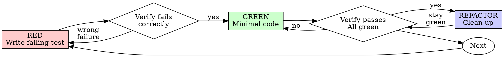

# Test-Driven Development (TDD)

## Overview

Write the test first. Watch it fail. Write minimal code to pass.

**Core principle:** If you didn't watch the test fail, you don't know if it tests the right thing.

**Violating the letter of the rules is violating the spirit of the rules.**

## When to Use

**Always:**
- New features
- Bug fixes
- Refactoring
- Behavior changes

**Exceptions (ask your human partner):**
- Throwaway prototypes
- Generated code
- Configuration files

Thinking "skip TDD just this once"? Stop. That's rationalization.

## The Iron Law

```
NO PRODUCTION CODE WITHOUT A FAILING TEST FIRST
```

Write code before the test? Delete it. Start over.

**No exceptions:**
- Don't keep it as "reference"
- Don't "adapt" it while writing tests
- Don't look at it
- Delete means delete

Implement fresh from tests. Period.

## Red-Green-Refactor



### RED - Write Failing Test

Write one minimal test showing what should happen.

<Good>
```typescript
test('retries failed operations 3 times', async () => {
  let attempts = 0;
  const operation = () => {
    attempts++;
    if (attempts < 3) throw new Error('fail');
    return 'success';
  };

  const result = await retryOperation(operation);

  expect(result).toBe('success');
  expect(attempts).toBe(3);
});
```
Clear name, tests real behavior, one thing
</Good>

<Bad>
```typescript
test('retry works', async () => {
  const mock = jest.fn()
    .mockRejectedValueOnce(new Error())
    .mockRejectedValueOnce(new Error())
    .mockResolvedValueOnce('success');
  await retryOperation(mock);
  expect(mock).toHaveBeenCalledTimes(3);
});
```
Vague name, tests mock not code
</Bad>

**Requirements:**
- One behavior
- Clear name
- Real code (no mocks unless unavoidable)

### Verify RED - Watch It Fail

**MANDATORY. Never skip.**

```bash
npm test path/to/test.test.ts
```

Confirm:
- Test fails (not errors)
- Failure message is expected
- Fails because feature missing (not typos)

**Test passes?** You're testing existing behavior. Fix test.

**Test errors?** Fix error, re-run until it fails correctly.

### GREEN - Minimal Code

Write simplest code to pass the test.

<Good>
```typescript
async function retryOperation<T>(fn: () => Promise<T>): Promise<T> {
  for (let i = 0; i < 3; i++) {
    try {
      return await fn();
    } catch (e) {
      if (i === 2) throw e;
    }
  }
  throw new Error('unreachable');
}
```
Just enough to pass
</Good>

<Bad>
```typescript
async function retryOperation<T>(
  fn: () => Promise<T>,
  options?: {
    maxRetries?: number;
    backoff?: 'linear' | 'exponential';
    onRetry?: (attempt: number) => void;
  }
): Promise<T> {
  // YAGNI
}
```
Over-engineered
</Bad>

Don't add features, refactor other code, or "improve" beyond the test.

### Verify GREEN - Watch It Pass

**MANDATORY.**

```bash
npm test path/to/test.test.ts
```

Confirm:
- Test passes
- Other tests still pass
- Output pristine (no errors, warnings)

**Test fails?** Fix code, not test.

**Other tests fail?** Fix now.

### REFACTOR - Clean Up

After green only:
- Remove duplication
- Improve names
- Extract helpers

Keep tests green. Don't add behavior.

### Repeat

Next failing test for next feature.

## Good Tests

| Quality | Good | Bad |
|---------|------|-----|
| **Minimal** | One thing. "and" in name? Split it. | `test('validates email and domain and whitespace')` |
| **Clear** | Name describes behavior | `test('test1')` |
| **Shows intent** | Demonstrates desired API | Obscures what code should do |

## Why Order Matters

**"I'll write tests after to verify it works"**

Tests written after code pass immediately. Passing immediately proves nothing:
- Might test wrong thing
- Might test implementation, not behavior
- Might miss edge cases you forgot
- You never saw it catch the bug

Test-first forces you to see the test fail, proving it actually tests something.

**"I already manually tested all the edge cases"**

Manual testing is ad-hoc. You think you tested everything but:
- No record of what you tested
- Can't re-run when code changes
- Easy to forget cases under pressure
- "It worked when I tried it" ≠ comprehensive

Automated tests are systematic. They run the same way every time.

**"Deleting X hours of work is wasteful"**

Sunk cost fallacy. The time is already gone. Your choice now:
- Delete and rewrite with TDD (X more hours, high confidence)
- Keep it and add tests after (30 min, low confidence, likely bugs)

The "waste" is keeping code you can't trust. Working code without real tests is technical debt.

**"TDD is dogmatic, being pragmatic means adapting"**

TDD IS pragmatic:
- Finds bugs before commit (faster than debugging after)
- Prevents regressions (tests catch breaks immediately)
- Documents behavior (tests show how to use code)
- Enables refactoring (change freely, tests catch breaks)

"Pragmatic" shortcuts = debugging in production = slower.

**"Tests after achieve the same goals - it's spirit not ritual"**

No. Tests-after answer "What does this do?" Tests-first answer "What should this do?"

Tests-after are biased by your implementation. You test what you built, not what's required. You verify remembered edge cases, not discovered ones.

Tests-first force edge case discovery before implementing. Tests-after verify you remembered everything (you didn't).

30 minutes of tests after ≠ TDD. You get coverage, lose proof tests work.

## Common Rationalizations

| Excuse | Reality |
|--------|---------|
| "Too simple to test" | Simple code breaks. Test takes 30 seconds. |
| "I'll test after" | Tests passing immediately prove nothing. |
| "Tests after achieve same goals" | Tests-after = "what does this do?" Tests-first = "what should this do?" |
| "Already manually tested" | Ad-hoc ≠ systematic. No record, can't re-run. |
| "Deleting X hours is wasteful" | Sunk cost fallacy. Keeping unverified code is technical debt. |
| "Keep as reference, write tests first" | You'll adapt it. That's testing after. Delete means delete. |
| "Need to explore first" | Fine. Throw away exploration, start with TDD. |
| "Test hard = design unclear" | Listen to test. Hard to test = hard to use. |
| "TDD will slow me down" | TDD faster than debugging. Pragmatic = test-first. |
| "Manual test faster" | Manual doesn't prove edge cases. You'll re-test every change. |
| "Existing code has no tests" | You're improving it. Add tests for existing code. |

## Red Flags - STOP and Start Over

- Code before test
- Test after implementation
- Test passes immediately
- Can't explain why test failed
- Tests added "later"
- Rationalizing "just this once"
- "I already manually tested it"
- "Tests after achieve the same purpose"
- "It's about spirit not ritual"
- "Keep as reference" or "adapt existing code"
- "Already spent X hours, deleting is wasteful"
- "TDD is dogmatic, I'm being pragmatic"
- "This is different because..."

**All of these mean: Delete code. Start over with TDD.**

## Example: Bug Fix

**Bug:** Empty email accepted

**RED**
```typescript
test('rejects empty email', async () => {
  const result = await submitForm({ email: '' });
  expect(result.error).toBe('Email required');
});
```

**Verify RED**
```bash
$ npm test
FAIL: expected 'Email required', got undefined
```

**GREEN**
```typescript
function submitForm(data: FormData) {
  if (!data.email?.trim()) {
    return { error: 'Email required' };
  }
  // ...
}
```

**Verify GREEN**
```bash
$ npm test
PASS
```

**REFACTOR**
Extract validation for multiple fields if needed.

## Verification Checklist

Before marking work complete:

- [ ] Every new function/method has a test
- [ ] Watched each test fail before implementing
- [ ] Each test failed for expected reason (feature missing, not typo)
- [ ] Wrote minimal code to pass each test
- [ ] All tests pass
- [ ] Output pristine (no errors, warnings)
- [ ] Tests use real code (mocks only if unavoidable)
- [ ] Edge cases and errors covered

Can't check all boxes? You skipped TDD. Start over.

## When Stuck

| Problem | Solution |
|---------|----------|
| Don't know how to test | Write wished-for API. Write assertion first. Ask your human partner. |
| Test too complicated | Design too complicated. Simplify interface. |
| Must mock everything | Code too coupled. Use dependency injection. |
| Test setup huge | Extract helpers. Still complex? Simplify design. |

## Debugging Integration

Bug found? Write failing test reproducing it. Follow TDD cycle. Test proves fix and prevents regression.

Never fix bugs without a test.

## Testing Anti-Patterns

When adding mocks or test utilities, read @testing-anti-patterns.md to avoid common pitfalls:
- Testing mock behavior instead of real behavior
- Adding test-only methods to production classes
- Mocking without understanding dependencies

## Final Rule

```
Production code → test exists and failed first
Otherwise → not TDD
```

No exceptions without your human partner's permission.

---

# Godot/GDScript TDD Guide

This section extends TDD principles for Godot 4.x and GDScript development using the GUT (Godot Unit Test) framework.

## GUT Testing Framework

This project uses **GUT** (Godot Unit Test) for testing. Tests are located in `tests/` directory.

### Running Tests

```bash
# Run all tests (headless)
.\Godot_v4.5.1-stable_win64.exe --headless --script tests/run_tests.gd

# Run specific test file
.\Godot_v4.5.1-stable_win64.exe --headless --script tests/run_tests.gd --test tests/test_inventory.gd

# Via MCP (if available)
mcp__godot__run_tests
```

### GUT Test Structure

<Good>
```gdscript
# tests/test_health_system.gd
extends GutTest

class TestHealthSystem:
    extends GutTest
    
    var health_system: HealthSystem
    
    func before_each():
        health_system = HealthSystem.new()
    
    func after_each():
        health_system.free()
    
    func test_take_damage_reduces_health():
        # RED: Write failing test
        health_system.max_health = 100
        health_system.current_health = 100
        
        # Act
        health_system.take_damage(25)
        
        # Assert
        assert_eq(health_system.current_health, 75, "Health should be reduced by damage amount")
```
Clear test name, setup/teardown, one behavior
</Good>

## Godot RED-GREEN-REFACTOR Examples

### Example 1: Player Movement

**RED - Write Failing Test**
```gdscript
# tests/test_player_movement.gd
class TestPlayerMovement:
    extends GutTest
    
    var player: Player
    
    func before_each():
        player = Player.new()
        player.speed = 100.0
    
    func after_each():
        player.free()
    
    func test_moves_right_when_input_pressed():
        # Arrange
        var delta = 0.016  # One frame at 60fps
        
        # Act
        player.handle_movement(Vector2.RIGHT, delta)
        
        # Assert
        assert_gt(player.position.x, 0.0, "Player should move right")
        assert_eq(player.position.y, 0.0, "Player should not move vertically")
```

**Verify RED**
```bash
$ .\Godot_v4.5.1-stable_win64.exe --headless --script tests/run_tests.gd --test tests/test_player_movement.gd
>> test_moves_right_when_input_pressed: FAILED
>> Expected X position > 0.0 but got 0.0
```

**GREEN - Minimal Implementation**
```gdscript
# game/player/player.gd
class_name Player
extends CharacterBody2D

@export var speed: float = 100.0

func handle_movement(direction: Vector2, delta: float) -> void:
    velocity = direction * speed
    move_and_slide()
```

**Verify GREEN**
```bash
$ .\Godot_v4.5.1-stable_win64.exe --headless --script tests/run_tests.gd --test tests/test_player_movement.gd
>> test_moves_right_when_input_pressed: PASSED
```

### Example 2: Inventory System

**RED - Write Failing Test**
```gdscript
# tests/test_inventory.gd
class TestInventory:
    extends GutTest
    
    var inventory: Inventory
    
    func before_each():
        inventory = Inventory.new()
        inventory.max_slots = 10
    
    func after_each():
        inventory.free()
    
    func test_add_item_increases_count():
        var herb = Item.new()
        herb.id = "herb"
        herb.stackable = true
        
        inventory.add_item(herb)
        
        assert_eq(inventory.get_item_count("herb"), 1, "Should have 1 herb")
```

**GREEN - Minimal Implementation**
```gdscript
# game/systems/inventory/inventory.gd
class_name Inventory
extends Resource

@export var max_slots: int = 10
var _items: Dictionary = {}  # item_id -> count

func add_item(item: Item) -> void:
    if item.stackable:
        _items[item.id] = _items.get(item.id, 0) + 1

func get_item_count(item_id: String) -> int:
    return _items.get(item_id, 0)
```

### Example 3: Signal Testing

<Good>
```gdscript
# tests/test_health_signals.gd
class TestHealthSignals:
    extends GutTest
    
    var health: HealthSystem
    var signal_received: bool = false
    var damage_received: int = 0
    
    func before_each():
        health = HealthSystem.new()
        health.max_health = 100
        health.current_health = 100
        signal_received = false
        damage_received = 0
        
        # Connect signal
        health.health_changed.connect(_on_health_changed)
    
    func _on_health_changed(new_health: int, damage: int):
        signal_received = true
        damage_received = damage
    
    func test_emits_signal_on_damage():
        health.take_damage(25)
        
        assert_true(signal_received, "Signal should be emitted")
        assert_eq(damage_received, 25, "Damage should be passed in signal")
```
Tests real signal behavior
</Good>

## Godot-Specific Testing Patterns

### Testing Scene Instancing

```gdscript
func test_scene_instantiates_correctly():
    var scene = load("res://game/enemies/enemy.tscn")
    var instance = scene.instantiate()
    add_child_autofree(instance)  # GUT will free this automatically
    
    assert_not_null(instance, "Scene should instantiate")
    assert_is(instance, Enemy, "Instance should be Enemy type")
```

### Testing with Autoloads (Singletons)

```gdscript
func before_each():
    # Store original state
    _original_inventory = GameState.inventory
    
    # Use test double
    GameState.inventory = Inventory.new()

func after_each():
    # Restore original state
    GameState.inventory = _original_inventory
```

### Testing Node Tree Operations

```gdscript
func test_find_player_in_scene():
    var level = Level.new()
    add_child_autofree(level)
    
    var player = Player.new()
    player.name = "Player"
    level.add_child(player)
    
    var found = level.find_child("Player", true, false)
    
    assert_not_null(found, "Should find player node")
    assert_is(found, Player, "Found node should be Player")
```

### Testing Physics/Process

```gdscript
func test_gravity_applies_over_time():
    var player = Player.new()
    add_child_autofree(player)
    player.position = Vector2.ZERO
    player.velocity = Vector2.ZERO
    
    # Simulate multiple frames
    await wait_frames(10)
    
    assert_gt(player.velocity.y, 0.0, "Gravity should increase Y velocity")
```

## Godot TDD Verification Checklist

Before marking work complete:

- [ ] Every new GDScript class has corresponding GUT tests
- [ ] Watched each test fail before implementing (RED)
- [ ] Wrote minimal GDScript code to pass test (GREEN)
- [ ] Refactored while keeping tests green (REFACTOR)
- [ ] All GUT tests pass: `.\Godot*.exe --headless --script tests/run_tests.gd`
- [ ] No Godot errors or warnings in output
- [ ] Scene tests use `add_child_autofree()` for cleanup
- [ ] Signal tests verify both emission and data
- [ ] Node tree tests verify correct hierarchy
- [ ] Resource tests use temporary instances

## Common Godot Testing Mistakes

| Mistake | Why It's Wrong | Fix |
|---------|---------------|-----|
| Not cleaning up nodes | Memory leaks, test pollution | Use `add_child_autofree()` or manual `free()` |
| Testing `_ready()` directly | Lifecycle timing issues | Test the behavior, not the callback |
| Testing private `_methods` | Tests become brittle | Test public API only |
| Modifying global state | Test isolation breaks | Save/restore in `before_each`/`after_each` |
| Not awaiting signals | Race conditions | Use `await` or signal asserts |

## Testing Anti-Patterns (Godot)

When adding mocks or test utilities, read @testing-anti-patterns.md. Godot-specific notes:

- **Don't test mock scenes:** Test real scenes with `add_child_autofree()`
- **Don't add test-only methods:** Use test utilities in `tests/utils/`
- **Don't mock Godot internals:** Mock your own systems, not Engine/SceneTree
- **Use real Resources:** Don't mock simple data containers

## Related Skills

- `systematic-debugging` - Find root cause before fixing bugs
- `verification-before-completion` - Verify tests pass before claiming complete
