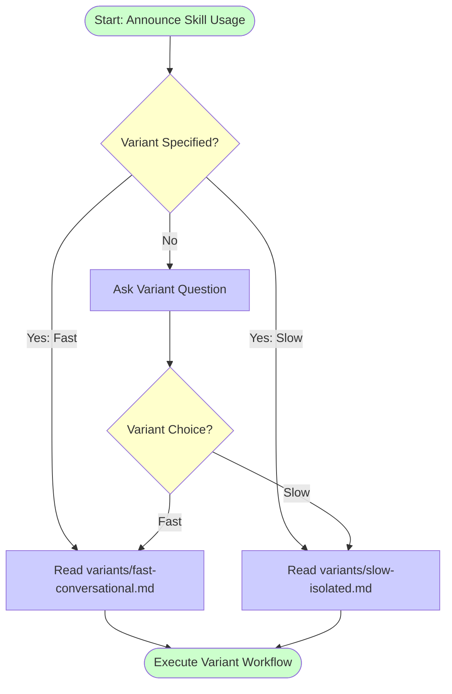

# Testing Skills With Subagents

## Overview

**Testing skills is just TDD applied to process documentation.**

Choose your testing approach based on development phase:
- **Fast variant**: Quick iteration during skill development (15-30 min)
- **Slow variant**: Rigorous validation before deployment (45-90 min)

**Announce at start:** "I'm using the testing-skills-with-subagents skill."

## Workflow

Follow this workflow exactly - do not skip steps:



**Design Rationale:** Mermaid flowchart provides visual enforcement of workflow sequence. Allows variant to be pre-specified to skip user question, enabling smoother workflow integration.

## Step 1: Determine Testing Variant

**First, check if variant was pre-specified:**

Check conversation history and skill invocation context for explicit variant specification:
- Keywords: "fast variant", "slow variant", "conversational testing", "worktree-based testing"
- Pattern: User or calling skill explicitly specified which variant to use

<critical-instruction>
**IF variant was pre-specified:**
- Skip AskUserQuestion tool
- Proceed directly to Step 2 with the specified variant

**IF variant was NOT specified:**
- Use the AskUserQuestion tool with these exact parameters:

**Question:** "Which testing variant do you want to use?"

**Options:**
1. **"Fast: Conversational testing with control scenarios"** - 15-30 min iteration, lightweight logging, good for skill development
2. **"Slow: Worktree-based isolated testing"** - 45-90 min validation, full infrastructure, deployment-ready confidence
</critical-instruction>

**Trade-offs:**

| Aspect | Fast Variant | Slow Variant |
|--------|-------------|--------------|
| Time | 15-30 min | 45-90 min |
| Infrastructure | Lightweight logs | Full worktree isolation |
| Confidence | Moderate | High (deployment-ready) |
| Best For | Iteration, hypothesis testing | Pre-deployment validation |

## Step 2: Execute Selected Variant

<critical-instruction>
Based on the user's variant choice from Step 1:

**IF user selected "Fast: Conversational testing":**
- Read the file: [variants/fast-conversational.md](variants/fast-conversational.md)
- Follow ALL instructions in that file

**IF user selected "Slow: Worktree-based testing":**
- Read the file: [variants/slow-isolated.md](variants/slow-isolated.md)
- Follow ALL instructions in that file

Do NOT proceed without reading the selected variant file.
</critical-instruction>

## Error Handling

**If variant file doesn't exist:**
Display this error message:

```text
❌ Error: Variant file not found

Expected file: variants/{variant-name}.md

This indicates incomplete skill installation. Please check:
1. File structure is correct (.claude/skills/testing-skills-with-subagents/variants/)
2. Variant files exist (fast-conversational.md, slow-isolated.md)
3. Repository is up to date

Cannot proceed without variant file.
```

**Design Rationale:**
- `<critical-instruction>` tags ensure LLM doesn't skip file read
- Context passed forward but doesn't override variant's workflow
- Clear error message for missing files
