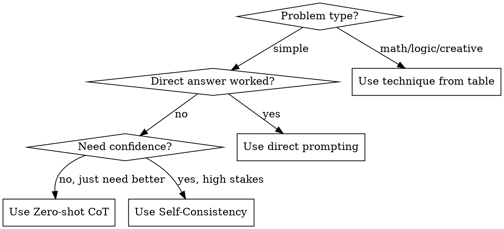

# Thought-Based Reasoning

## Overview

**Core principle:** Making reasoning explicit improves accuracy 20-70% on complex tasks.

Instead of jumping to answers, decompose problems into steps. This catches errors, enables backtracking, and produces verifiable reasoning.

## When to Use



**Use when:**
- Multi-step arithmetic or word problems
- Logic requiring deduction chains
- Decisions with multiple factors
- Creative problems needing exploration
- Any task where direct answer was wrong

**Don't use when:**
- Simple factual recall
- Single-step operations
- Time-critical responses where accuracy tradeoff acceptable

## Quick Reference

| Technique | Trigger | Template |
|-----------|---------|----------|
| **Zero-shot CoT** | Quick reasoning boost | "Let's think step by step..." |
| **Self-Consistency** | High-stakes decision | Run 3-5 paths, majority vote |
| **Tree of Thoughts** | Puzzle/creative block | Branch, evaluate, backtrack |
| **Least-to-Most** | Complex multi-part problem | Decompose → solve subproblems → combine |
| **ReAct** | Need external facts | Thought → Action → Observation loop |
| **PAL** | Math with computation | Generate code, execute it |

## Techniques

### 1. Zero-shot Chain-of-Thought

**When:** Quick prototype, no examples available

**Template:**
```
[Problem statement]

Let's think step by step:
```

**Example:**
```
A store has 45 apples. They sell 12 in the morning and receive a shipment of 30.
Then they sell 18 more. How many apples remain?

Let's think step by step:
1. Start: 45 apples
2. Sell 12: 45 - 12 = 33 apples
3. Receive 30: 33 + 30 = 63 apples
4. Sell 18: 63 - 18 = 45 apples

Answer: 45 apples remain.
```

**Accuracy gain:** +20-60%

---

### 2. Self-Consistency

**When:** High-stakes decisions, need confidence measure

**Process:**
1. Run Zero-shot CoT 3-5 times (vary temperature if possible)
2. Collect all final answers
3. Take majority vote
4. Report confidence as agreement ratio

**Template:**
```
[Problem]

I'll reason through this multiple ways to verify:

Path 1:
[reasoning...]
Answer: X

Path 2:
[reasoning...]
Answer: Y

Path 3:
[reasoning...]
Answer: X

Consensus: X (2/3 agreement = 67% confidence)
```

**Accuracy gain:** +10-20% over single CoT

---

### 3. Tree of Thoughts

**When:** Puzzles, creative problems, need to explore alternatives

**Process:**
1. Generate 2-3 initial approaches
2. Evaluate each (promising/uncertain/dead-end)
3. Expand promising branches
4. Backtrack from dead-ends
5. Continue until solution found

**Template:**
```
[Problem]

## Branch 1: [Approach A]
Evaluation: [promising/uncertain/dead-end]
[If promising, continue...]

## Branch 2: [Approach B]
Evaluation: [promising/uncertain/dead-end]
[If dead-end, note why and stop]

## Expanding Branch 1:
### Branch 1.1: [Sub-approach]
...

## Solution found in Branch 1.1
```

**Example (Game of 24: make 24 from 4, 7, 8, 8):**
```
Branch 1: Try multiplication first
- 4 × 7 = 28... need to subtract 4, but only have 8,8
- Evaluation: uncertain, continue

Branch 2: Try getting 3 × 8 = 24
- Need to make 3 from 4, 7, 8
- 7 - 4 = 3 ✓
- 3 × 8 = 24 ✓
- Evaluation: SOLUTION

Answer: (7 - 4) × 8 = 24 (using one 8, ignoring other)
Wait - must use all numbers. Backtrack.

Branch 3: Use both 8s
- 8 + 8 = 16, need +8 from 4,7... 7-4=3, not 8
- 8 × 8 = 64, need to subtract 40 from 4,7... no
- 8 - 8 = 0, useless
- 8 / 8 = 1, then 4 × 7 × 1 = 28, not 24

Branch 4: Division approach
- (8 - 4) = 4
- 8 / 4 = 2... not useful
- 4 / (8-8) = undefined

Branch 5: Fractions
- 8 / (1 - 7/8) = 8 / (1/8) = 64... no
- Actually: 8 × (7 - 8/4) = 8 × (7-2) = 8 × 5 = 40

Hmm, trying more systematically...
- Need operations on 4,7,8,8 = 24
- (4 - 8/8) × 7 = 3 × 7 = 21
- 4 × (8 - 8/7)... messy
- (8 - 4) × (8 - 2)... don't have 2

Let me try: 8 / (8 - 4/7)... no
Try: (7 + 8/8) × 4 = 8 × 4 = 32... nope that's wrong
Wait: (7 + 1) × 3 = 24, can I make 1 and 3?
8/8 = 1 ✓, but can't make 3 from just 4

Try factoring 24: 1×24, 2×12, 3×8, 4×6
- 3×8: need 3 from 4,7,8. (4+8)/7 ≈ 1.7, 7-4=3 ✓ but used 8 for the ×8
- 4×6: need 6 from 7,8,8. 8-8+7=7, (8+8)/7≈2.3, nope

Solution: (8 - 8/4) × 7 = (8 - 2) × 7 = 6 × 7 = 42... no

Actually: 4 × 8 - 8 + 7 - 7 = 32... wait no sevens wrong
Let me be systematic: 4 × 8 = 32, 32 - 8 = 24 ✓
What about 7? 32 - 8 × 7/7 = 32 - 8 = 24 ✓

Answer: 4 × 8 - 8 × 7/7 = 32 - 8 = 24
Or simpler: 4 × 8 - 8 + 7 - 7 = 24 (trivially using 7-7=0)
```

**Accuracy gain:** +50-70% on hard puzzles

---

### 4. Least-to-Most Prompting

**When:** Complex problem with subproblems

**Process:**
1. Decompose into subproblems
2. Solve easiest first
3. Use solutions to solve harder ones
4. Combine for final answer

**Template:**
```
[Complex problem]

## Subproblems (easiest to hardest):
1. [Subproblem A]
2. [Subproblem B, may need A's answer]
3. [Subproblem C, needs A and B]

## Solutions:

### Subproblem 1:
[solve...]
Answer: [X]

### Subproblem 2 (using X):
[solve...]
Answer: [Y]

### Subproblem 3 (using X, Y):
[solve...]

## Final Answer:
[Combine solutions]
```

**Accuracy gain:** +30-80% on compositional tasks

---

### 5. ReAct (Reasoning + Acting)

**When:** Need external information, reduce hallucination

**Process:**
1. Thought: reason about what's needed
2. Action: query external source
3. Observation: record result
4. Repeat until solved

**Template:**
```
Question: [Question requiring external info]

Thought 1: I need to find [X] to answer this.
Action 1: Search/Lookup [X]
Observation 1: [Result]

Thought 2: Now I know X. I also need [Y].
Action 2: Search/Lookup [Y]
Observation 2: [Result]

Thought 3: With X and Y, I can now answer.
Answer: [Final answer grounded in observations]
```

**Accuracy gain:** +15-35%, major hallucination reduction

---

### 6. PAL (Program-Aided Language)

**When:** Math with computation, eliminate arithmetic errors

**Process:**
1. Translate problem to code
2. Execute code
3. Return result

**Template:**
```
[Math problem]

Let me write code to solve this:

```python
# [Problem restated as comments]
initial = 45
after_morning_sales = initial - 12
after_shipment = after_morning_sales + 30
after_afternoon_sales = after_shipment - 18
print(f"Remaining: {after_afternoon_sales}")
```

[Execute]
Output: Remaining: 45

Answer: 45
```

**Accuracy gain:** Eliminates arithmetic errors entirely

## Decision Matrix

| Situation | Best Technique |
|-----------|----------------|
| Quick reasoning, no examples | Zero-shot CoT |
| High-stakes, need confidence | Self-Consistency |
| Puzzle, creative, exploration needed | Tree of Thoughts |
| Multi-part with dependencies | Least-to-Most |
| Need facts, reduce hallucination | ReAct |
| Math with many calculations | PAL |
| Iterative improvement | Reflexion (run, critique, retry) |

## Common Mistakes

| Mistake | Fix |
|---------|-----|
| Using CoT for simple queries | Direct answer is fine for 1-step problems |
| Not showing work | Explicit steps catch errors |
| Stopping at first answer | Self-consistency finds better answers |
| Linear thinking on puzzles | Tree of Thoughts enables backtracking |
| Computing mentally | PAL eliminates arithmetic errors |
| Guessing facts | ReAct grounds in external sources |

## Combining Techniques

For maximum accuracy on hard problems:

```
1. Least-to-Most: decompose into subproblems
2. For each subproblem:
   - PAL if computational
   - ReAct if needs facts
   - Tree of Thoughts if exploratory
3. Self-Consistency on final assembly
```

---

## What Claude Does vs What You Decide

| Claude handles | You provide |
|---------------|-------------|
| Selecting appropriate reasoning technique | Problem statement and constraints |
| Executing multi-step reasoning chains | Verification of intermediate steps |
| Generating multiple reasoning paths | Selection of best answer |
| Backtracking from dead-ends | Judgment on acceptable confidence |
| Computing via PAL when needed | Real-world validation of results |

---

## Skill Boundaries

### This skill excels for:
- Math and logic problems with multiple steps
- Decisions with competing factors
- Puzzles requiring exploration
- Tasks where initial answers were wrong

### This skill is NOT ideal for:
- Simple factual recall → Direct answer is faster
- Creative writing → Different techniques apply
- Time-critical responses → CoT adds latency

---

## Skill Metadata

```yaml
name: thought-based-reasoning
category: thinking
version: 2.0
author: GUIA
source_expert: Wei et al. (CoT), Yao et al. (ToT), Kojima et al. (Zero-shot CoT)
difficulty: intermediate
mode: both
tags: [reasoning, cot, tot, react, pal, logic, math, problem-solving]
created: 2026-02-03
updated: 2026-02-03
```
