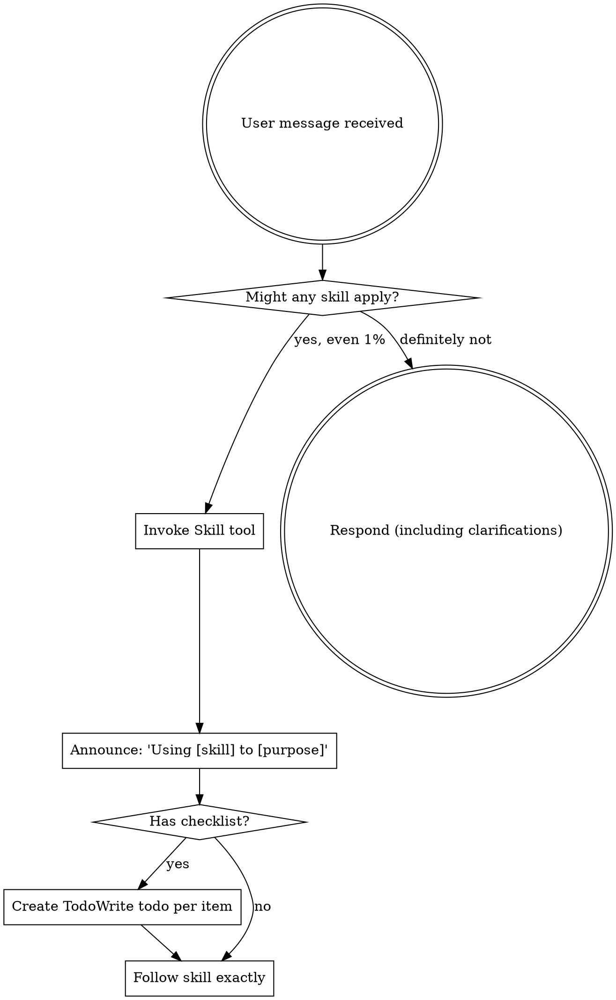
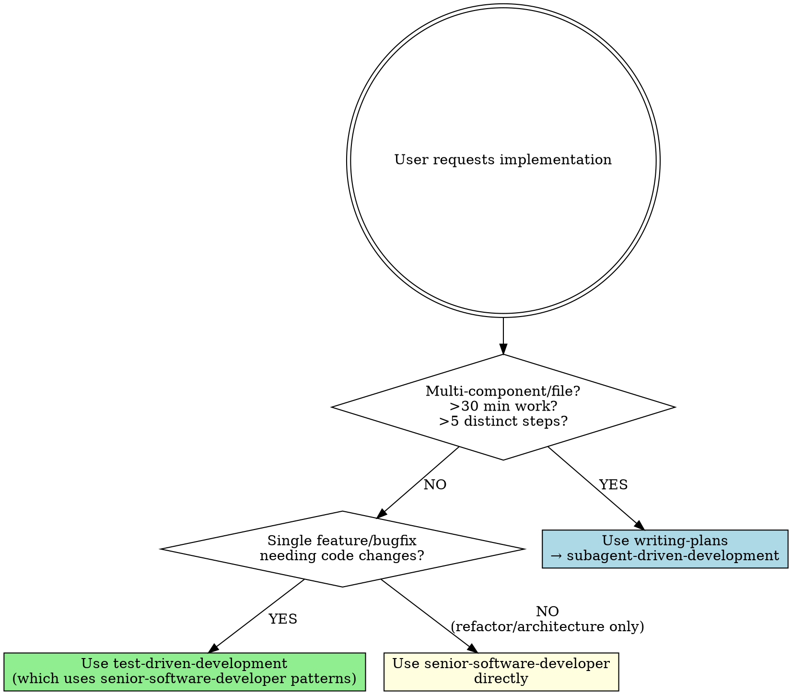
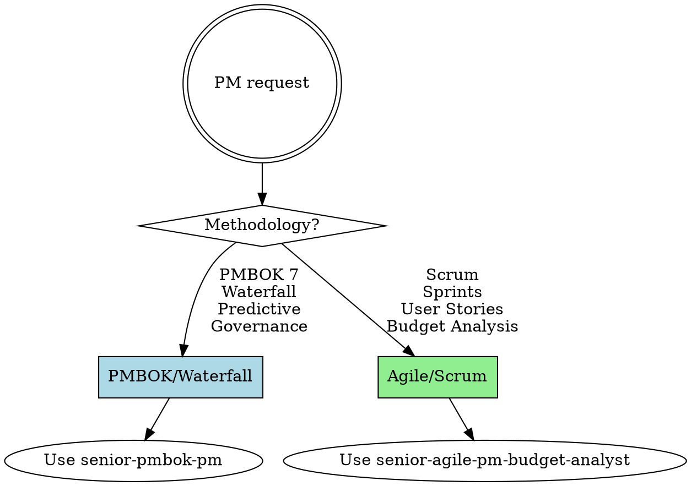

<EXTREMELY-IMPORTANT>
If you think there is even a 1% chance a skill might apply to what you are doing, you ABSOLUTELY MUST invoke the skill.

IF A SKILL APPLIES TO YOUR TASK, YOU DO NOT HAVE A CHOICE. YOU MUST USE IT.

This is not negotiable. This is not optional. You cannot rationalize your way out of this.
</EXTREMELY-IMPORTANT>

## How to Access Skills

**In Claude Code:** Use the `Skill` tool. When you invoke a skill, its content is loaded and presented to you—follow it directly. Never use the Read tool on skill files.

**In other environments:** Check your platform's documentation for how skills are loaded. If you can't find any documentation, then try to use the `READ` tool on the skill file path to load it.

# Using Skills

## The Rule

**Invoke relevant or requested skills BEFORE any response or action.** Even a 1% chance a skill might apply means that you should invoke the skill to check. If an invoked skill turns out to be wrong for the situation, you don't need to use it.

## Red Flags

These thoughts mean STOP—you're rationalizing:

| Thought | Reality |
|---------|---------|
| "This is just a simple question" | Questions are tasks. Check for skills. |
| "I need more context first" | Skill check comes BEFORE clarifying questions. |
| "Let me explore the codebase first" | Skills tell you HOW to explore. Check first. |
| "I can check git/files quickly" | Files lack conversation context. Check for skills. |
| "Let me gather information first" | Skills tell you HOW to gather information. |
| "This doesn't need a formal skill" | If a skill exists, use it. |
| "I remember this skill" | Skills evolve. Read current version. |
| "This doesn't count as a task" | Action = task. Check for skills. |
| "The skill is overkill" | Simple things become complex. Use it. |
| "I'll just do this one thing first" | Check BEFORE doing anything. |
| "This feels productive" | Undisciplined action wastes time. Skills prevent this. |
| "I know what that means" | Knowing the concept ≠ using the skill. Invoke it. |

## Implementation Decision Tree

When user asks you to implement something, follow this decision tree:

**Complexity thresholds:**

**Simple → Use `test-driven-development`:**
- Single function/class/module
- <30 minutes estimated work
- <5 distinct implementation steps
- Example: "Add input validation to login form"

**Complex → Use `writing-plans` → `subagent-driven-development`:**
- Multiple files/components
- >30 minutes estimated work
- >5 distinct implementation steps
- Requires architectural decisions
- Example: "Build user authentication system with JWT, refresh tokens, and role-based access"

**Architecture/Refactor → Use `senior-software-developer` directly:**
- No new features, only restructuring
- Requires senior-level judgment on patterns
- Example: "Refactor payment processing to use Strategy pattern"

**Key relationships:**
- `test-driven-development` is the default methodology for feature implementation
- `test-driven-development` uses `senior-software-developer` patterns for code quality
- `subagent-driven-development` uses both `test-driven-development` and `senior-software-developer`
- `senior-software-developer` is a pattern library, not invoked directly for new features

## Skill Priority

When multiple skills could apply, use this order:

1. **Process skills first** (brainstorming, debugging) - these determine HOW to approach the task
2. **Implementation skills second** (use decision tree above) - these guide execution

"Let's build X" → brainstorming first, then implementation decision tree.
"Fix this bug" → debugging first, then test-driven-development.

## Available Skills Catalog

### Development & Implementation
- **test-driven-development**: Primary methodology for implementing features and bugfixes - enforces test-first approach (RED-GREEN-REFACTOR)
- **senior-software-developer**: Production-quality patterns, standards, and language-specific best practices for Python, C#, Node.js, TypeScript
- **writing-plans**: Create comprehensive implementation plans for complex, multi-component tasks (>30 min, multiple files/modules)
- **subagent-driven-development**: Execute implementation plans by dispatching fresh subagents per task with two-stage review
- **verification-before-completion**: Use when about to claim work is complete - requires running verification commands and confirming output before any success claims

### Documentation & Content
- **docx**: Comprehensive document creation, editing, and analysis with support for tracked changes, comments, formatting preservation
- **writing-prompts**: Use when crafting prompts for LLMs to improve response quality, accuracy, consistency, and task performance
- **writing-skills**: Helps author concise, discoverable skills using TDD-style testing

### Project Management
- **senior-pmbok-pm**: PMBOK-specific PM using structured templates in Portuguese (`PM_DOCS_PT_BR`) or English (`PM_DOC_EN`)
- **senior-agile-pm-budget-analyst**: Agile/Scrum PM specialized in budget analysis, poker planning, Gantt charts, and critical path analysis with Python analytical tools

**PM Routing:**

**Triggers:**
- **senior-pmbok-pm**: "PMBOK", "waterfall", "predictive", "TAP", "termo de abertura", "governance", "compliance", "formal project management"
- **senior-agile-pm-budget-analyst**: "Scrum", "sprint", "user story", "poker planning", "BDD", "agile", "budget analysis", "story points", "velocity"

### Specialized Tools
- **mcp-builder**: Guide for creating high-quality MCP (Model Context Protocol) servers for LLM integration with external services

## Skill Types

**Rigid** (TDD, debugging): Follow exactly. Don't adapt away discipline.

**Flexible** (patterns): Adapt principles to context.

The skill itself tells you which.

## User Instructions

Instructions say WHAT, not HOW. "Add X" or "Fix Y" doesn't mean skip workflows.
