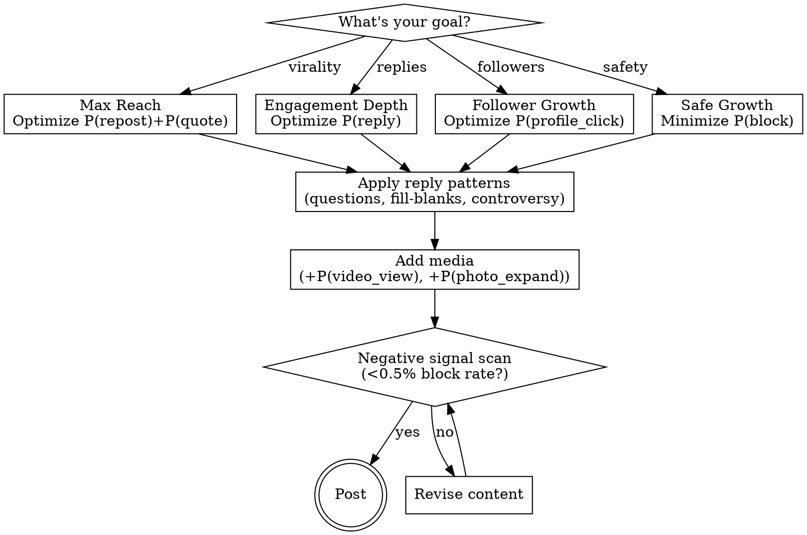

# X Algorithm Optimizer

Optimize content for X's 2026 neural recommendation system. Based on technical analysis of the `xai-org/x-algorithm` codebase, this skill provides both **tactical templates** for immediate use and **deep architectural understanding** for strategic advantage.

## The Paradigm Shift: Neural > Heuristics

X has abandoned the legacy heuristic approach (counting followers, matching hashtags, PageRank reputation). The new system uses **end-to-end neural architecture**:

- **Thunder**: In-network retrieval (posts from accounts you follow)
- **Phoenix**: Out-of-network retrieval + neural ranking (the "For You" discovery engine)
- **Grok-1 Transformer**: The "Heavy Ranker" that reads and scores every candidate post

**The implication**: You can't "hack" hashtags or posting times anymore. The algorithm **reads your content semantically** and predicts specific engagement probabilities. Alignment beats manipulation.

---

## Quick Start

**Analyze a post**: "Score this X post against the algorithm: [paste]"

**Generate optimized content**: "Write an algorithm-optimized X post about [topic]"

**Deep dive**: "Explain why this post would/wouldn't perform using Phoenix mechanics"

**Debug underperformance**: "Why isn't this post getting reach? Analyze against weighted scorer"

---

## Cheat Sheet

**DO:**
- Maximize P(reply): questions, fill-blanks, "hot take + nuance"
- Include media (image/video) for +P(video_view), +P(photo_expand)
- Space posts 4-6+ hours apart (author diversity penalty)
- Post when audience active (time decay is exponential)
- Build concentrated niche (strengthens your User Tower embedding)

**DON'T:**
- Use irrelevant hashtags (Grok detects semantic mismatch)
- Post rage-bait (high blocks destroy score even with high engagement)
- Link-only posts (forfeit all media probability terms)
- Posting sprees (3rd post = ~10% reach of 1st)
- Engagement pods (Grok detects coordination patterns)

**TARGET:** <0.5% block rate. Above 1% = systematic demotion.

---

## The Weighted Scorer Formula

Every post receives a score computed as:

```
Score = Σ (w_i × P(action_i))
```

Where the Phoenix transformer predicts probabilities for each action type, and configured weights determine their impact.

### Engagement Hierarchy (Inferred Weights)

| Tier | Actions | Est. Weight | Strategic Implication |
|------|---------|-------------|----------------------|
| **1. Multipliers** | P(reply), P(repost), P(quote) | w > 10.0 | High friction, network-extending actions. Algorithm prioritizes conversation. |
| **2. Validators** | P(like), P(video_view), P(photo_expand) | w ≈ 1.0 | Lower friction, validates relevance. Necessary but insufficient alone. |
| **3. Signals** | P(click), P(dwell), P(profile_click) | w < 1.0 | Passive signals for model training. Low weight prevents clickbait farming. |
| **4. Destroyers** | P(block), P(mute), P(report) | w ≈ -1000 | Catastrophic negative weight. One block negates hundreds of likes. |

### The Math in Practice

**Engaging post**:
```
P(reply)=0.15, P(like)=0.08, P(repost)=0.02, P(block)=0.001
Score = (15×0.15) + (1×0.08) + (12×0.02) + (-1000×0.001)
Score = 2.25 + 0.08 + 0.24 - 1.0 = 1.57 ✓
```

**Rage-bait post**:
```
P(reply)=0.25, P(like)=0.05, P(repost)=0.03, P(block)=0.02
Score = (15×0.25) + (1×0.05) + (12×0.03) + (-1000×0.02)
Score = 3.75 + 0.05 + 0.36 - 20.0 = -15.84 ✗ (demoted)
```

**Key insight**: The rage-bait generated MORE engagement but scored WORSE because of the 2% block rate.

---

## The Seven Alpha Mechanics

These are the specific, hard-coded mechanisms that determine content fate—derived directly from the codebase.

| # | Mechanic | Key Insight | Action |
|---|----------|-------------|--------|
| 1 | Candidate Isolation | Posts scored independently, not on a curve | Focus on intrinsic quality |
| 2 | Author Diversity Penalty | 0.3-0.7x penalty per consecutive post | Space posts 4-6+ hours apart |
| 3 | Negative Signal Asymmetry | Blocks weighted ~1000x vs likes | Target <0.5% block rate |
| 4 | Multimodal Bonus | Media adds P(video_view), P(photo_expand) | Always include media |
| 5 | Grok Semantic Reading | LLM detects topic mismatch, spam patterns | Hashtags must match content |
| 6 | Two-Tower Retrieval | dot(User, Item) vectors for discovery | Build concentrated niche first |
| 7 | Time Decay | Exponential decay after 24-48h | Post when audience is active |

### 1. Candidate Isolation (Fair Scoring)

The Phoenix transformer uses a custom **attention mask** that prevents "context bleeding" between posts in the same scoring batch. Each post is scored **independently** against only the user context.

**What this means**: Your content is judged solely on its relationship with the viewer—not graded on a curve against whatever else is in that millisecond's batch. Quality is intrinsic.

### 2. Author Diversity Penalty (Anti-Spam)

The `AuthorDiversityScorer` tracks which authors have already been selected for the timeline. If Author A appears at position 1, their next post gets an **attenuation penalty** (estimated 0.3-0.7x) for positions 2+.

**Optimal strategy**:
- Space posts 4-6+ hours apart to reset fatigue
- Quality over quantity is mathematically enforced
- "Posting sprees" compound penalties—your 3rd post in an hour may score 0.3 × 0.3 = 0.09x

### 3. Negative Signal Asymmetry (Harm Reduction)

Negative weights are ~1000x positive weights. The system operates on **harm reduction over engagement maximization**.

**The propagation effect**: A block doesn't just lower one post's score—it:
- Affects your reputation within that user's cluster
- Demotes future content to similar users
- Contributes to a hidden "author health" score

**Safe zone**: Target <0.5% block rate. Above 1% = systematic demotion.

### 4. Multimodal Shadow Algorithms

Phoenix predicts **media-specific probabilities**: P(video_view), P(photo_expand). These are distinct scoring terms.

**Text-only posts forfeit these entirely**:
```
Text:  Score = w_reply×P(reply) + w_like×P(like)
Media: Score = w_reply×P(reply) + w_like×P(like) + w_video×P(video_view)
```

**The media bonus is structural, not optional.**

### 5. Grok Semantic Understanding

The Heavy Ranker is adapted from Grok-1. It doesn't just count features—it **reads the content**.

**What Grok detects**:
- Semantic topic relevance to user's interest embedding
- Tone/style matching (formal, casual, technical, humorous)
- Sarcasm and irony patterns
- Hashtag-content mismatches (spam signal)
- Linguistic authenticity markers

**The death of hacks**: Irrelevant trending hashtags now hurt you. Grok sees the semantic mismatch and flags it as spam-like behavior.

### 6. Two-Tower Retrieval (Cold Start Solution)

Out-of-network discovery uses a **Two-Tower Neural Network**:
- **User Tower**: Encodes your engagement history, demographics, negative feedback into vector U
- **Item Tower**: Encodes post content, media, author features into vector I
- **Similarity**: dot(U, I) determines retrieval

**Cold start strategy**: New accounts have weak User Tower embeddings. Solutions:
1. Ride trending topics (aligns with global context vector)
2. Build niche first (concentrated topic cluster builds clear embedding)
3. Engage authentically (your reply history shapes your User Tower)

### 7. Time Decay Filter

The `AgeFilter` applies exponential decay. Content from 24 hours ago can survive with strong signals; 48+ hours requires exceptional engagement.

**Optimal timing**: Post when your audience is active to maximize early engagement velocity. Early signals compound through the decay function.

---

## Content Generation Framework



### Step 1: Choose Optimization Target

| Goal | Primary Metric | Format Bias |
|------|---------------|-------------|
| Maximum reach | P(repost) + P(quote) | Shareable insights, data, frameworks |
| Engagement depth | P(reply) | Questions, debates, incomplete statements |
| Follower growth | P(profile_click) | Thread hooks, expertise signals |
| Safe growth | Low P(block) | Nuanced takes, inclusive framing |

### Step 2: Apply the Reply Optimization

P(reply) carries ~10-15x weight. Structure content to maximize it:

**High P(reply) patterns**:
- Open questions demanding specific experience: "What's your biggest [X] failure?"
- Fill-in-the-blank: "The most underrated skill is ___"
- Intentional incompleteness: List with obvious gap
- Nuanced controversy: "Hot take: [statement]. But here's the nuance..."
- Correctability: Slightly wrong statement experts will correct

**Low P(reply) patterns**:
- Rhetorical questions (no answer expected)
- Perfect statements (nothing to add)
- Closed conclusions ("In summary...")

### Step 3: Add Media (Structural Bonus)

Media adds probability terms you otherwise forfeit.

**Image optimization**:
- Vertical aspect ratios get cropped → forces P(photo_expand)
- Data visualizations invite inspection
- High contrast catches scroll

**Video optimization**:
- Hook in first 3 seconds (before scroll-away)
- Captions for sound-off (80% watch muted)
- Loop-worthy endings increase replay

### Step 4: Negative Signal Scan

Before posting, check:
- Could any audience segment find this block-worthy?
- Is the engagement mechanism genuine or annoying?
- Does controversial content include nuance to reduce polarization?

**The rule**: If your post might generate 5+ blocks per 1000 impressions, reconsider.

---

## Thread Strategy (Per-Tweet Scoring)

Threads are scored **per tweet**. The algorithm evaluates Tweet 1 independently.

**Tweet 1 (The Hook)**:
- Must work standalone—this is what gets scored for reach
- Include the value proposition clearly
- Don't waste on "Thread!" or "🧵" alone

**Tweet 2-N (The Delivery)**:
- Scored only for users who click through
- Deliver on the hook's promise
- Each tweet should have standalone value

**Final Tweet (The CTA)**:
- Clear call to action (follow, comment, share)
- Summary of key insight
- Bookmark-worthy standalone

**Anti-pattern**: "Thread! 🧵" as Tweet 1 with thin content = spam signal to Grok.

---

## Platform Specs (Quick Reference)

| Element | Optimal | Why |
|---------|---------|-----|
| **Characters** | 71-100 (max 280) | No "Show more" friction |
| **Hashtags** | 0-1, semantically matched | Grok detects mismatch as spam |
| **Images** | 1200×675px or vertical | Full preview; vertical forces expand |
| **Video** | <2:20, hook in 3s, captioned | Autoplay + 80% watch muted |
| **Media source** | Native upload only | Links don't trigger media probabilities |

---

## Debugging Underperformance

When content underperforms, diagnose against the weighted scorer:

### Low Reach Despite Engagement
**Likely cause**: High P(block) rate negating positive signals
**Check**: Is content polarizing? Does it generate negative reactions alongside positive?

### High Impressions, Low Engagement
**Likely cause**: Weak P(reply) and P(repost) optimization
**Check**: Does content invite response? Is it shareable?

### New Account Struggling
**Likely cause**: Weak User Tower embedding, cold start problem
**Solution**: Build concentrated topic presence, ride trends, engage authentically

### Declining Reach Over Time
**Likely cause**: Author health score degradation from accumulated negative signals
**Solution**: Audit recent content for block-generating patterns, rebuild with safer content

---

## Anti-Patterns (Algorithmic Self-Sabotage)

### Engagement Pods
Grok detects artificial coordination patterns. Clustered engagement from the same accounts with unusual timing = spam signal.

### Hashtag Stuffing
Multiple irrelevant hashtags = semantic mismatch detection = spam adjacent score.

### Link-Only Posts
Zero media probability terms + low text engagement = structural disadvantage.

### Rage-Farming
High engagement + high blocks = net negative score. The math doesn't lie.

### Posting Sprees
Author diversity penalty compounds. Post #3 in an hour may reach 10% of Post #1's audience.

---

## Reference Files

| File | Contents |
|------|----------|
| `references/phoenix-architecture.md` | Two-Tower model, Grok adaptation, embedding dynamics |
| `references/weighted-scorer.md` | Complete weight hierarchy, probability math, examples |
| `references/post-templates.md` | 12+ proven formats with algorithm alignment notes |

## Analysis Script

Run the analyzer directly:
```bash
python scripts/analyze_x_post.py
```

Or import in Python:
```python
from scripts.analyze_x_post import analyze_post, format_report, calculate_weighted_score

# Analyze a post
result = analyze_post("Your post text", include_media=True, media_type="image")
print(format_report(result))

# Calculate raw weighted score
score = calculate_weighted_score(p_reply=0.15, p_like=0.08, p_block=0.001)
```

---

## The Meta-Strategy

**Old paradigm**: Game the algorithm with hacks (hashtags, timing, pods)
**New paradigm**: Align with the neural network's objective function

The algorithm optimizes for:
1. Conversation (P(reply) weighted highest)
2. Network extension (P(repost), P(quote))
3. User satisfaction (negative signals weighted catastrophically)
4. Semantic relevance (Grok reads everything)

**Your strategy**: Create content that genuinely maximizes these. The era of manipulation is over; the era of alignment has begun.
