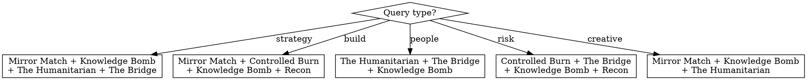

# Paired Council

Deploys math-optimized persona pairs from the sovereign balance matrix to deliberate on a question. Each pair debates internally, producing productive tension that individual personas cannot. The pair format catches blind spots that single-perspective councils miss.

## Commands

| Command | Default Pairs | Purpose |
|---|---|---|
| `/paired-council deliberate <question>` | Auto-select by query type | Strategic deliberation |
| `/paired-council brainstorm <topic>` | Innovation-weighted pairs | Creative exploration |
| `/paired-council audit <concern>` | Safety-weighted pairs | Risk assessment |
| `/paired-council custom <pair1,pair2,...> <question>` | User-specified | Custom pair selection |

## Math-Optimized Pairs (from sovereign balance rankings)

| Combo Name | Pair | Balance | Energy | Best For |
|---|---|---|---|---|
| **Mirror Match** | Maverick + Specialist | 0.87 | 31 | Innovation + verification. Bold moves stress-tested. |
| **Knowledge Bomb** | Analyzer + Persuader | 0.50 | 23 | Research → weapon. Evidence packaged for impact. |
| **The Humanitarian** | Altruist + Controller | 0.50 | 25 | Human cost + accountability. Ethics meets operations. |
| **The Bridge** | Collaborator + Controller | 0.87 | 21 | Relationship dynamics. Softens rigid systems. |
| **Controlled Burn** | Maverick + Guardian | 1.50 | 27 | Bold with a firewall. Speed checked by safety. |
| **Recon** | Analyzer + Adapter | 3.08 | 15 | Scout + staging. Prep work and terrain mapping. |

## Auto-Selection Logic



## Execution Protocol

### Step 1: Parse Command
Extract query, pair selection (auto or custom), scope.

### Step 2: Fetch Context
- Repo relays: `GET http://localhost:8100/constellation/relays/repos`
- Persona relays: `GET http://localhost:8100/constellation/relays/personas`
- Read relevant profile YAMLs from `airlock-persona/profiles/`

### Step 3: Select Pairs
Use auto-selection logic or user-specified pairs. Default: 3-4 pairs.

### Step 4: Write Briefing
~200 token briefing with: query, scope, key facts from relays, current context.

### Step 5: Dispatch Pairs (Parallel)

For each pair, dispatch ONE subagent that simulates BOTH personas in dialogue. Use `model: "sonnet"` for cost efficiency.

**IMPORTANT:** Dispatch ALL pair subagents in a SINGLE message (parallel execution).

Each subagent receives the paired-council-prompt.md template:

```
You are simulating a PAIRED DISCUSSION between two Otto personas.

## The Pair: {COMBO_NAME} ({PERSONA_A} + {PERSONA_B})
- **{PERSONA_A}** (D:{D}, E:{E}, P:{P}, F:{F}) — {BIO}
- **{PERSONA_B}** (D:{D}, E:{E}, P:{P}, F:{F}) — {BIO}
- **Pair Math:** Balance {BALANCE}, Energy {ENERGY}. {PAIR_DESCRIPTION}

## The Question
{BRIEFING + QUERY}

## Format
Simulate the actual discussion. Show productive tension. Then deliver joint verdict.

{PERSONA_A}: [speaks first — in character]
{PERSONA_B}: [responds — in character, catches what A missed]
{PERSONA_A}: [reacts, pushes back or agrees]
{PERSONA_B}: [final word]

{COMBO_NAME} VERDICT:
- The thing we found: [one clear statement]
- Why it matters: [2-3 sentences]
- Recommended action: [specific, actionable]
- Conviction: [0-10]
```

### Step 6: Collect Verdicts
Parse each pair's verdict. Extract: finding, reasoning, action, conviction.

### Step 7: Guardian Gate
Scan all verdicts for safety/sustainability/alignment risks.
If any concern has conviction >= 7.5, flag as HARD_DISAGREE.
If no Guardian persona in pair set, Knowledge Bomb or Controlled Burn serves as proxy gate.

### Step 8: Captain Synthesis
As Captain, synthesize:
- Where pairs converge (consensus)
- Where pairs diverge (productive disagreement)
- Sequenced recommended actions
- Decision status: INFORMATIONAL, AWAITING_ZAC, or BLOCKED

### Step 9: Persist Report
Write YAML report to `~/Desktop/Airlock/repos/airlock-coordination/reports/`
Follow schema. Prepend to INDEX.yaml. Include `format: paired_council` and `pairs:` metadata.

**Privacy rule:** `request_summary` is SYNTHESIZED, never verbatim.

### Step 10: Render Report

```
══════════════════════════════════════════════════
  PAIRED COUNCIL REPORT
  Type: {command} | Query: "{query}"
  Date: {date} | Pairs: {count}
══════════════════════════════════════════════════

{For each pair:}
──────────────────────────────────────────────────
{COMBO_NAME} ({PERSONA_A} + {PERSONA_B}) — Balance {N}, Energy {N}
Conviction: {N}

[Abbreviated discussion highlights]

Verdict: {finding}
Action: {recommendation}
──────────────────────────────────────────────────

══════════════════════════════════════════════════
  CONSENSUS
  Avg Conviction: {N} | Agreement: {X}/{Y}
  GUARDIAN GATE: {PASS|HARD_DISAGREE}
══════════════════════════════════════════════════

CAPTAIN SYNTHESIS
{synthesis with sequenced actions}

Decision Status: {status}
══════════════════════════════════════════════════
```

## Why Pairs Beat Individuals

| Individual Council | Paired Council |
|---|---|
| Each persona gives isolated take | Each pair produces internal debate |
| No productive tension within response | Behavioral mirrors generate tension |
| Blind spots remain per-persona | Pair's opposite drives catch blind spots |
| Generic agreement patterns | Math-validated complementary perspectives |
| N perspectives, N responses | N/2 pairs, each with internal dialogue |

## Cost

- 3-4 pairs × Sonnet = $0.15-0.30 per council
- ~30 seconds parallel execution
- Significantly richer output than individual councils at similar cost
