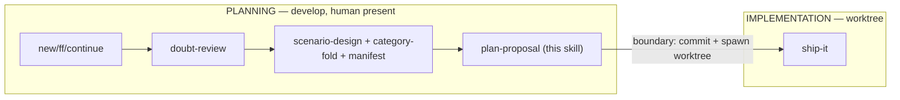

# plan-proposal

Orchestrates the **planning phase** of an OpenSpec change on `develop`. Composes
existing skills — it does **not** reimplement them. Twin of `ship-it`, which owns
the implementation phase inside the worktree. The two split at the **git-worktree
boundary**, which is also the **interactive/headless line**.

## Hard constraint — main session only (never a subagent)

`plan-proposal` MUST run in the main interactive session. It invokes
`doubt-driven-review` (which spawns a fresh-context reviewer, and a second
cross-model reviewer — automatically when a `@propose-review-N` role resolves,
offered interactively only when none does; nested subagent spawn is blocked) and
`scenario-design` (whose proposal/design-stage HARD gate calls `ask_user`). Both
need a live main session.

**Guard:** if you detect you are running inside a subagent context (nested
reviewer spawn would be blocked, or `ask_user` is unavailable), **STOP** and
surface: *"plan-proposal must run in the main session — doubt-review and the
scenario-design gate cannot run nested. Re-invoke from the main session on
`develop`."* Do not degrade the doubt-review to a self-questioning fallback.

## Preconditions

- On the `develop` branch (planning happens on develop; the worktree is spawned
  from the planning commit).
- `openspec` CLI available; resolve the change name from `--change <name>`, the
  conversation, or `openspec list --json` (ask if ambiguous).
- Announce: *"Planning change: `<change>` (override with `/plan-proposal <other>`)."*

## Procedure

### 1. Ensure planning artifacts exist

Bring the change to a drafted state using the existing generated skills — do not
hand-roll the directory:

- No change dir yet → `openspec-new-change` (or `-ff` for the fast path).
- Partial artifacts → `openspec-continue-change`.

State in the drafting request: **"plan-proposal is driving this change"**. The
`openspec/config.yaml` `rules.tasks` rule sees it and skips its "Run
plan-proposal now?" confirm (no re-entry). `rules.proposal` may still offer
pending mockups while `proposal.md` is written — that is expected; Step 1b only
re-offers rows not declined.

Artifacts live at `openspec/changes/<change>/`: `proposal.md`, `design.md` (when
the change warrants one), `specs/**/spec.md`, `tasks.md`.

**Cite code claims in `design.md`.** Instruct the author to cite the path (and
`:line` when the statement is line-specific) for every statement in `design.md`
about existing code behaviour — e.g. `packages/server/src/pi-core-checker.ts:42`.
Not gated: a citation makes a wrong-file or "does not exist" claim cheap to spot
before review.

### 1b. Adopt pending mockups (idempotent backstop)

Backstop for direct entry, `-continue` on an existing proposal, re-runs, and
`SHIP_IT_BLOCKED` hand-backs. Runs after the artifacts exist, **before**
doubt-review, so reviewers and `scenario-design` see the mockup at its final path.

1. Collect every root `mockups/AGENTS.md` row whose Purpose cell ends with
   `Pending change: <intent>`, minus rows that also carry `See change:` (owned
   by a change — never offered), minus rows already declined in this session
   (including a decline in the `rules.proposal` multiselect during Step 1).
2. None left → ask nothing, change nothing, go to Step 2.
3. Otherwise ONE `ask_user` multiselect offering every remaining row; the user
   matches, you do not judge similarity. Unchosen rows count as declined.
4. Adopt each chosen entry with the mechanics of the `explore-mockup-adoption`
   requirement (canonical, same as `rules.proposal`): File cell must resolve to
   an entry directly under `mockups/` (else skip + report); `mkdir -p
   <changeDir>/mockups`; refuse if `<changeDir>/mockups/<entry>` already exists;
   `git mv` (tracked) / `mv` (untracked), never copy; only after a successful
   move — recompute outward relative links, remove the row, add
   `Mockup: mockups/<entry> (in this change)` under What Changes in
   `proposal.md`. A failed move keeps its row.

An edited `proposal.md` is "modified in this session" → Step 2 reviews it.

### 2. Doubt-review proposal.md + design.md (trigger: drafted or modified)

Whenever `proposal.md` or `design.md` is created or changed in this session,
invoke `doubt-driven-review` on the changed artifact:

- Pass **ARTIFACT + CONTRACT only** — never the CLAIM, never your reasoning.
  - ARTIFACT = the proposal/design prose (decompose if large per doubt-review).
  - CONTRACT = the requirements/constraints the artifact must satisfy (the specs
    deltas, the non-goals, the invariants it asserts).
- **Run the spec-collateral scan before each doubt-review cycle** (the artifact
  changes between cycles): `node scripts/spec-collateral.mjs --change <change>`.
  Append its output to the CONTRACT under the heading **"Candidate conflicting
  requirements (advisory scan) — check each"**. The candidates are facts about
  the corpus, not the CLAIM. If the scan cannot run or exits non-zero, report
  the failure and proceed with the cycle without candidates — the scan never
  blocks planning.
- **Reviewer prompt hygiene** — the reviewer verifies claims against the
  repository, writes `unverified` for any claim it cannot check instead of
  asserting it, and reports every listed candidate the artifact contradicts.
  A contradicted candidate is resolved by a MODIFIED/REMOVED delta or an
  artifact correction; "unaffected" is reserved for a verified false positive.
- **Cross-model review** — runs automatically when a `@propose-review-N` role
  resolves; surface the interactive cross-model offer only when none does.
- **Reconcile every finding** against the artifact text using doubt-review's
  precedence (contract-misread → actionable → trade-off → noise). When a finding
  is valid + actionable, **PAUSE**: the artifact is corrected before proceeding.

Do not fold scenarios until the doubt cycle reaches a stop condition (trivial
findings, 3 cycles, or explicit "ship it").

### 3. scenario-design → category-routed fold into tasks.md (MANDATORY — never skip)

**`scenario-design` is a required step, not an option.** A change never reaches
the worktree boundary without a `test-plan.md` manifest and its automated rows
folded into `tasks.md`. Do **not** hand-author test tasks, infer scenarios from
the proposal, or skip straight to the commit — always drive the tasks from the
`scenario-design` output. Smoke-test-only `tasks.md` is a planning failure.

Run `scenario-design` for the change (proposal/design stage → HARD gate; it may
`ask_user` and STOP on a spec gap — that is expected, answer and continue). It
writes `openspec/changes/<change>/test-plan.md` — the **manifest**, carrying a
`level` + `disposition` (`automated` | `manual-only`) per scenario row. If
`test-plan.md` does not exist after this step, `scenario-design` did not run —
re-invoke it before folding.

Then **fold** each row into `tasks.md`:

- **`automated` rows** → one vanilla `- [ ]` task each, routed to its category:

  | manifest `level` | home | check-first (reuse infra) |
  |---|---|---|
  | L1 | `packages/*/**/__tests__/*.test.ts` (vitest) | sibling `*.test.ts` |
  | L2 | `qa/tests/*.sh` \| `*.ps1` | existing qa test for that OS |
  | L3 | `tests/e2e/*.spec.ts` (docker harness) | existing spec for that surface |
  | electron | `ci-electron.yml` / `_electron-build.yml` | existing electron job |
  | ci | `ci.yml` / workflow-level | existing workflow assertion |

  Before tasking new infra, scan for an existing test of that type to extend.
  Each folded test task MUST carry:
  1. a **harness-exemplar pointer** — the nearest existing spec/test of that
     category to copy harness glue from (e.g. `see tests/e2e/reconnect.spec.ts`).
     Bare "author X.spec.ts" tasks are forbidden — `ship-it` resolves the
     exemplar path into the task context it hands `apply`.
  2. the scenario **Triple** (`input · trigger · observable`) as plain text.
  3. a manifest reference as ordinary prose — either `(test-plan #<id>)` or an
     inline `(test-plan: automated)` — so `ship-it`/`ship-change` can map it back.

- **`manual-only` rows** → a plain manual task tagged `(test-plan: manual-only)`;
  **no test is folded**. `ship-change` defers these post-merge (its manifest-aware
  defer rule).

**Post-fold re-scan (before Step 4):** folded tasks can introduce identifiers
the doubt cycles never saw, so run `node scripts/spec-collateral.mjs --change
<change>` once more after the fold and report every candidate not seen in the
doubt-review cycles. A real conflict among them returns planning to Step 2; a
contradicted candidate is resolved by a delta or an artifact correction —
"unaffected" only for a verified false positive.

**Fold-completeness gate (before Step 4):** every `automated` row in
`test-plan.md` MUST map to exactly one folded test task in `tasks.md`, and every
`manual-only` row MUST map to one tagged manual task. Verify the count matches
the manifest — if any scenario row has no corresponding task, the fold is
incomplete; finish it before committing. Do not proceed to the boundary with an
unfolded manifest.

**Parser-safety (load-bearing):** `tasks.md` MUST stay vanilla checkbox format.
No custom token, no bracketed tag, no non-standard syntax on a task line — only
`- [ ] <text>` where the manifest reference is ordinary prose. `openspec status
--json` and the generated `apply` skill parse this file; a stray token could
break them. Verify `openspec status --change <change> --json` reports the same
task counts after folding as the plain checkboxes imply.

### 4. Commit planning artifacts + stop at the worktree boundary

**Precondition:** `test-plan.md` exists and the fold-completeness gate passed.
Never commit without the manifest — a missing `test-plan.md` means Step 3 was
skipped; go back and run `scenario-design`.

Commit `proposal.md`, `design.md`, `specs/**`, `tasks.md`, and `test-plan.md` to
`develop` — plus the change's `mockups/**` whenever it exists (adopted or
written there directly), and, when mockups were adopted, the adoption's
root-side edits (`mockups/AGENTS.md`, the renamed-away sources), so the
worktree `ship-it` builds in carries the mockup. The worktree is spawned from that commit via the existing worktree
flow (dashboard "start work" / `git worktree add`).

Then **STOP**. `plan-proposal` does not enter the implementation phase. Report:

> *Planning complete for `<change>`. Artifacts committed to `develop`; worktree
> ready. Automated scenarios folded to tasks (manifest dispositions in
> `test-plan.md`). **Next: run `ship-it` inside the worktree to build + ship.**
> If a design issue surfaces during build, `ship-it` writes `SHIP_IT_BLOCKED.md`
> and hands back here.*

## Guardrails

- **Main session only** — refuse and surface if nested (see Hard constraint).
- **Adopt pending mockups only via `ask_user`** (Step 1b) — never move a mockup
  unasked, never re-offer a row declined this session, never copy.
- **Never pass the CLAIM to the reviewer**; ARTIFACT + CONTRACT only.
- **Never fold before reconciling** actionable doubt-review findings.
- **`tasks.md` stays vanilla** — the manifest (`test-plan.md`), not a task tag,
  is the automated-vs-manual source of truth.
- **`scenario-design` is mandatory** — no `test-plan.md`, no commit. Never
  hand-author test tasks or skip scenario design; the manifest is the sole
  source of the folded test tasks.
- **Fold every manifest row** — the boundary is blocked until every `automated`
  and `manual-only` row maps to a task.
- **Never author test/app code here** — folding writes *tasks*; `ship-it` authors
  the tests. This skill plans; it does not implement.
- **Stop at the boundary** — do not continue into implementation.

## Composed skills

`openspec-new-change` / `-ff` / `-continue` · `doubt-driven-review` ·
`scenario-design` (+ its `test-plan.md` manifest) · handoff to `ship-it`.
