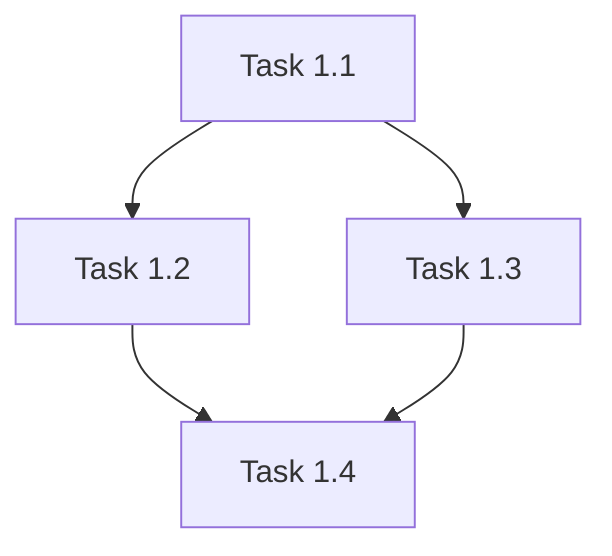

# Sprint Planner

<objective>
Transform PRD and SDD into actionable sprint plan with 2.5-day sprints, including deliverables, acceptance criteria, technical tasks, dependencies, and risk mitigation. Generate `grimoires/loa/sprint.md`.
</objective>

<zone_constraints>

## Zone Constraints

This skill operates under **Managed Scaffolding**:

| Zone                        | Permission | Notes                                 |
| --------------------------- | ---------- | ------------------------------------- |
| `.claude/`                  | NONE       | System zone - never suggest edits     |
| `grimoires/loa/`, `.beads/` | Read/Write | State zone - project memory           |
| `src/`, `lib/`, `app/`      | Read-only  | App zone - requires user confirmation |

**NEVER** suggest modifications to `.claude/`. Direct users to `.claude/overrides/` or `.loa.config.yaml`.
</zone_constraints>

<integrity_precheck>

## Integrity Pre-Check (MANDATORY)

Before ANY operation, verify System Zone integrity:

1. Check config: `yq eval '.integrity_enforcement' .loa.config.yaml`
2. If `strict` and drift detected -> **HALT** and report
3. If `warn` -> Log warning and proceed with caution
   </integrity_precheck>

<factual_grounding>

## Factual Grounding (MANDATORY)

Before ANY synthesis, planning, or recommendation:

1. **Extract quotes**: Pull word-for-word text from source files
2. **Cite explicitly**: `"[exact quote]" (file.md:L45)`
3. **Flag assumptions**: Prefix ungrounded claims with `[ASSUMPTION]`

**Grounded Example:**

```
The SDD specifies "PostgreSQL 15 with pgvector extension" (sdd.md:L123)
```

**Ungrounded Example:**

```
[ASSUMPTION] The database likely needs connection pooling
```

</factual_grounding>

<structured_memory_protocol>

## Structured Memory Protocol

### On Session Start

1. Read `grimoires/loa/NOTES.md`
2. Restore context from "Session Continuity" section
3. Check for resolved blockers

### During Execution

1. Log decisions to "Decision Log"
2. Add discovered issues to "Technical Debt"
3. Update sub-goal status
4. **Apply Tool Result Clearing** after each tool-heavy operation

### Before Compaction / Session End

1. Summarize session in "Session Continuity"
2. Ensure all blockers documented
3. Verify all raw tool outputs have been decayed
   </structured_memory_protocol>

<tool_result_clearing>

## Tool Result Clearing

After tool-heavy operations (grep, cat, tree, API calls):

1. **Synthesize**: Extract key info to NOTES.md or discovery/
2. **Summarize**: Replace raw output with one-line summary
3. **Clear**: Release raw data from active reasoning

Example:

```
# Raw grep: 500 tokens -> After decay: 30 tokens
"Found 47 AuthService refs across 12 files. Key locations in NOTES.md."
```

</tool_result_clearing>

<attention_budget>

## Attention Budget

This skill follows the **Tool Result Clearing Protocol** (`.claude/protocols/tool-result-clearing.md`).

### Token Thresholds

| Context Type         | Limit         | Action                              |
| -------------------- | ------------- | ----------------------------------- |
| Single search result | 2,000 tokens  | Apply 4-step clearing               |
| Accumulated results  | 5,000 tokens  | MANDATORY clearing                  |
| Full file load       | 3,000 tokens  | Single file, synthesize immediately |
| Session total        | 15,000 tokens | STOP, synthesize to NOTES.md        |

### Clearing Triggers for Sprint Planning

- [ ] PRD/SDD combined >3K tokens
- [ ] Task breakdown search >10 matches
- [ ] Dependency mapping >20 items
- [ ] Any analysis exceeding 2K tokens

### 4-Step Clearing

1. **Extract**: Max 10 files, 20 words per finding
2. **Synthesize**: Write to `grimoires/loa/NOTES.md`
3. **Clear**: Remove raw output from context
4. **Summary**: `"Planning: N requirements → M tasks → sprint.md"`
   </attention_budget>

<trajectory_logging>

## Trajectory Logging

Log each significant step to `grimoires/loa/a2a/trajectory/{agent}-{date}.jsonl`:

```json
{"timestamp": "...", "agent": "...", "action": "...", "reasoning": "...", "grounding": {...}}
```

</trajectory_logging>

<kernel_framework>

## Task (N - Narrow Scope)

Transform PRD and SDD into actionable sprint plan with 2.5-day sprints. Generate `grimoires/loa/sprint.md`.

## Context (L - Logical Structure)

- **Input**: `grimoires/loa/prd.md` (requirements), `grimoires/loa/sdd.md` (technical design)
- **Integration context**: `grimoires/loa/a2a/integration-context.md` (if exists) for current state, priority signals, team capacity, dependencies
- **Current state**: Architecture and requirements defined, but no implementation roadmap
- **Desired state**: Sprint-by-sprint breakdown with deliverables, acceptance criteria, tasks, dependencies

## Constraints (E - Explicit)

- DO NOT proceed until you've read both `grimoires/loa/prd.md` AND `grimoires/loa/sdd.md` completely
- DO NOT create sprints until clarifying questions are answered
- DO NOT plan more than 2.5 days of work per sprint
- DO NOT skip checking `grimoires/loa/a2a/integration-context.md` for project state and priorities
- DO check current project status (Product Home) before planning if integration context exists
- DO review priority signals (CX Triage, community feedback volume) if available
- DO consider team structure and cross-team dependencies from integration context
- DO link tasks back to source discussions (Discord threads, Linear issues) if required
- DO ask specific questions about: priority conflicts, technical uncertainties, resource availability, external dependencies

## Verification (E - Easy to Verify)

**Success** = Complete sprint plan saved to `grimoires/loa/sprint.md` + engineers can start immediately without clarification

Each sprint MUST include:

- Sprint Goal (1 sentence)
- Deliverables (checkbox list with measurable outcomes)
- Acceptance Criteria (checkbox list, testable)
- Technical Tasks (checkbox list, specific)
- Dependencies (explicit)
- Risks & Mitigation (specific)
- Success Metrics (quantifiable)

## Reproducibility (R - Reproducible Results)

- Use specific task descriptions: NOT "improve auth" → "Implement JWT token validation middleware with 401 error handling"
- Include exact file/component names when known from SDD
- Specify numeric success criteria: NOT "fast" → "API response < 200ms p99"
- Reference specific dates for sprint start/end: NOT "next week"
  </kernel_framework>

<uncertainty_protocol>

- If PRD or SDD is missing, STOP and inform user you cannot proceed without both
- If scope is too large for reasonable MVP, recommend scope reduction with specific suggestions
- If technical approach in SDD seems misaligned with PRD, flag discrepancy and seek clarification
- Say "I need more information about [X]" when lacking clarity to estimate effort
- Document assumptions explicitly when proceeding with incomplete information
  </uncertainty_protocol>

<grounding_requirements>
Before creating sprint plan:

1. Read `grimoires/loa/a2a/integration-context.md` (if exists) for organizational context
2. Read `grimoires/loa/prd.md` completely—extract all MVP features
3. Read `grimoires/loa/sdd.md` completely—understand technical architecture
4. Quote specific requirements when creating tasks: `> From prd.md: FR-1.2: "..."`
5. Reference SDD sections for technical tasks: `> From sdd.md: §3.2 Database Design`
   </grounding_requirements>

<citation_requirements>

- Reference PRD functional requirements by ID (FR-X.Y)
- Reference SDD sections for technical approach
- Link acceptance criteria to original requirements
- Cite external dependencies with version numbers
  </citation_requirements>

<workflow>
## Phase -1: Beads-First Preflight (v1.29.0)

Beads task tracking is the EXPECTED DEFAULT. Check health before starting sprint planning.

### Run Beads Health Check

```bash
health=$(.claude/scripts/beads/beads-health.sh --json)
status=$(echo "$health" | jq -r '.status')
```

### Status Handling

| Status             | Action                                         |
| ------------------ | ---------------------------------------------- |
| `HEALTHY`          | Proceed silently to Phase 0                    |
| `DEGRADED`         | Show recommendations, offer quick fix, proceed |
| `NOT_INSTALLED`    | Check opt-out, prompt if needed                |
| `NOT_INITIALIZED`  | Check opt-out, prompt if needed                |
| `MIGRATION_NEEDED` | Must address before proceeding                 |
| `UNHEALTHY`        | Must address before proceeding                 |

### If NOT_INSTALLED or NOT_INITIALIZED

1. **Check for valid opt-out**:

   ```bash
   opt_out=$(.claude/scripts/beads/update-beads-state.sh --opt-out-check 2>/dev/null || echo "NO_OPT_OUT")
   ```

2. **If no valid opt-out**, present HITL gate using AskUserQuestion:

   ```
   Beads Preflight Check
   ════════════════════════════════════════════════════════════

   Status: {status}

   Beads is not available. Task tracking is the EXPECTED DEFAULT
   for safe, auditable agent workflows.

   "We're building spaceships. Safety of operators and users is paramount."

   Options:
   [1] Install beads (Recommended)
       └─ .claude/scripts/beads/install-br.sh
       └─ Or: cargo install beads_rust

   [2] Initialize beads
       └─ br init

   [3] Continue without beads (24h acknowledgment)
       └─ Requires reason for audit trail

   [4] Abort
   ```

3. **If "Continue without beads" selected**:
   - Require reason (configurable via `beads.opt_out.require_reason`)
   - Record opt-out: `.claude/scripts/beads/update-beads-state.sh --opt-out "Reason"`
   - Log to trajectory: `grimoires/loa/a2a/trajectory/beads-preflight-{date}.jsonl`
   - Opt-out expires after 24h (configurable)

4. **Update state after health check**:
   ```bash
   .claude/scripts/beads/update-beads-state.sh --health "$status"
   ```

### If DEGRADED

Show recommendations but proceed:

```
Beads Health: DEGRADED
Recommendations:
$(echo "$health" | jq -r '.recommendations[]')

Proceeding with sprint planning...
```

### Protocol Reference

See `.claude/protocols/beads-preflight.md` for full specification.

## Phase 0: Check Feedback Files, Ledger, and Integration Context (CRITICAL—DO THIS FIRST)

### Step 0: Check for Sprint Ledger (NEW in v1.8.0)

Check if `grimoires/loa/ledger.json` exists:

```bash
[ -f "grimoires/loa/ledger.json" ] && echo "EXISTS" || echo "MISSING"
```

**If MISSING**, use AskUserQuestion to offer creation:

```
No Sprint Ledger found at grimoires/loa/ledger.json

A Sprint Ledger provides:
• Global sprint numbering across development cycles
• Cycle tracking with PRD/SDD references
• Sprint history and metrics for retrospectives

Options:
[1] Create ledger (recommended)
[2] Continue without ledger
```

**If user selects "Create ledger":**

Create `grimoires/loa/ledger.json` with initial schema:

```json
{
  "version": "1.0.0",
  "next_sprint_number": 1,
  "active_cycle": "cycle-001",
  "cycles": [
    {
      "id": "cycle-001",
      "label": null,
      "status": "active",
      "created_at": "<ISO timestamp>",
      "prd": "grimoires/loa/prd.md",
      "sdd": "grimoires/loa/sdd.md",
      "sprints": []
    }
  ]
}
```

Log creation to trajectory: `{"action": "ledger_created", "path": "grimoires/loa/ledger.json"}`

**If EXISTS**, proceed to Step 1.

### Step 1: Check for Security Audit Feedback

Check if `grimoires/loa/a2a/auditor-sprint-feedback.md` exists:

**If exists + "CHANGES_REQUIRED":**

- Previous sprint failed security audit
- Engineers must address feedback before new work
- STOP: "The previous sprint has unresolved security issues. Engineers should run /implement to address grimoires/loa/a2a/auditor-sprint-feedback.md before planning new sprints."

**If exists + "APPROVED - LETS FUCKING GO":**

- Previous sprint passed security audit
- Safe to proceed with next sprint planning

**If missing:**

- No security audit performed yet
- Proceed with normal workflow

### Step 2: Check for Integration Context

Check if `grimoires/loa/a2a/integration-context.md` exists:

```bash
[ -f "grimoires/loa/a2a/integration-context.md" ] && echo "EXISTS" || echo "MISSING"
```

**If EXISTS**, read it to understand:

- Current state tracking: Where to find project status
- Priority signals: Community feedback volume, CX Triage backlog
- Team capacity: Team structure
- Dependencies: Cross-team initiatives affecting sprint scope
- Context linking: How to link sprint tasks to source discussions
- Documentation locations: Where to update status
- Available MCP tools: Discord, Linear, GitHub integrations

**If MISSING**, proceed with standard workflow using only PRD/SDD.

## Phase 1: Deep Document Analysis

1. Read and synthesize both PRD and SDD, noting:
   - Core MVP features and user stories
   - Technical architecture and design decisions
   - Dependencies between features
   - Technical constraints and risks
   - Success metrics and acceptance criteria

2. Identify gaps:
   - Ambiguous requirements or acceptance criteria
   - Missing technical specifications
   - Unclear priorities or sequencing
   - Potential scope creep
   - Integration points needing clarification

## Phase 2: Strategic Questioning

Ask clarifying questions about:

- Priority conflicts or feature trade-offs
- Technical uncertainties impacting effort estimation
- Resource availability or team composition
- External dependencies or third-party integrations
- Underspecified requirements
- Risk mitigation strategies

Wait for responses before proceeding. Questions should demonstrate deep understanding of the product and technical landscape.

## Phase 3: Sprint Plan Creation

Design sprint breakdown with:

**Overall Structure:**

- Executive Summary: MVP scope and total sprint count
- Sprint-by-sprint breakdown
- Risk register and mitigation strategies
- Success metrics and validation approach

**Per Sprint (see template in `resources/templates/sprint-template.md`):**

- Sprint Goal (1 sentence)
- Duration: 2.5 days with specific dates
- Deliverables with checkboxes
- Acceptance Criteria (testable)
- Technical Tasks (specific) - annotate with goal contributions: `→ **[G-1]**`
- Dependencies
- Risks & Mitigation
- Success Metrics

### Goal Traceability (Appendix C)

**Extract Goals from PRD:**

1. Check PRD for goal table with ID column: `| ID | Goal | Measurement | Validation Method |`
2. If IDs present (G-1, G-2, etc.), use them directly
3. If IDs missing, auto-assign G-1, G-2, G-3 to numbered goals in "Primary Goals" section
4. Log auto-assigned IDs to trajectory

**Create Goal Mapping:**

1. For each task, identify which goal(s) it contributes to
2. Annotate tasks with `→ **[G-N]**` format
3. Populate Appendix C with goal-to-task mappings
4. Generate warnings for:
   - Goals without any contributing tasks: `⚠️ WARNING: Goal G-N has no contributing tasks`
   - Final sprint missing E2E validation task: `⚠️ WARNING: No E2E validation task found`

**E2E Validation Task:**

1. In the final sprint, include Task N.E2E: End-to-End Goal Validation
2. List all PRD goals with validation steps
3. This task is P0 priority (Must Complete)

## Phase 4: Quality Assurance

Self-Review Checklist:

- [ ] All MVP features from PRD are accounted for
- [ ] Sprints build logically on each other
- [ ] Each sprint is feasible within 2.5 days
- [ ] All deliverables have checkboxes for tracking
- [ ] Acceptance criteria are clear and testable
- [ ] Technical approach aligns with SDD
- [ ] Risks identified with mitigation strategies
- [ ] Dependencies explicitly called out
- [ ] Plan provides clear guidance for engineers
- [ ] All PRD goals mapped to tasks (Appendix C)
- [ ] All tasks annotated with goal contributions
- [ ] E2E validation task included in final sprint

Save to `grimoires/loa/sprint.md`.
</workflow>

<output_format>
See `resources/templates/sprint-template.md` for full structure.

Each sprint includes:

- Sprint number and theme
- Duration (2.5 days) with dates
- Sprint Goal (single sentence)
- Deliverables with checkboxes
- Acceptance Criteria with checkboxes
- Technical Tasks with checkboxes
- Dependencies
- Risks & Mitigation
- Success Metrics
  </output_format>

<success_criteria>

- **Specific**: Every task is actionable without additional clarification
- **Measurable**: Progress tracked via checkboxes
- **Achievable**: Each sprint is feasible within 2.5 days
- **Relevant**: All tasks trace back to PRD/SDD
- **Time-bound**: Sprint dates are specific
  </success_criteria>

<planning_principles>

- **Start with Foundation**: Early sprints establish core infrastructure
- **Build Incrementally**: Each sprint delivers demonstrable functionality
- **Manage Dependencies**: Sequence work to minimize blocking
- **Balance Risk**: Tackle high-risk items early for course correction
- **Maintain Flexibility**: Build buffer for unknowns in later sprints
- **Focus on MVP**: Ruthlessly prioritize essential features
  </planning_principles>

<beads_workflow>

## Beads Workflow (beads_rust)

When beads_rust (`br`) is installed, use it to track sprint structure:

### Session Start

```bash
br sync --import-only  # Import latest state from JSONL
```

### Creating Sprint Structure

Use helper scripts for epic and task creation:

```bash
# Create sprint epic
EPIC_ID=$(.claude/scripts/beads/create-sprint-epic.sh "Sprint N: Theme" 1)

# Create tasks under epic
.claude/scripts/beads/create-sprint-task.sh "$EPIC_ID" "Task description" 2 task

# Add blocking dependencies between tasks
br dep add <blocked-task-id> <blocker-task-id>
```

### Semantic Labels for Relationships

Use labels instead of dependency types:

| Relationship      | Label            | Example                               |
| ----------------- | ---------------- | ------------------------------------- |
| Sprint membership | `sprint:<n>`     | `br label add beads-xxx sprint:1`     |
| Epic association  | `epic:<epic-id>` | Auto-added by create-sprint-task.sh   |
| Review status     | `needs-review`   | `br label add beads-xxx needs-review` |

### Session End

```bash
br sync --flush-only  # Export SQLite → JSONL before commit
```

**Protocol Reference**: See `.claude/protocols/beads-integration.md`

### Beads Flatline Loop (v1.28.0)

After creating beads from the sprint plan, optionally run the Flatline Beads Loop to refine the task graph:

```bash
# Check if beads exist and br is available
if command -v br &>/dev/null && [[ $(br list --json 2>/dev/null | jq 'length') -gt 0 ]]; then
    # Run iterative multi-model refinement
    .claude/scripts/beads-flatline-loop.sh --max-iterations 6 --threshold 5
fi
```

This implements the "Check your beads N times, implement once" pattern:

1. Exports current beads to JSON
2. Runs Flatline Protocol review on task graph
3. Applies HIGH_CONSENSUS suggestions
4. Repeats until changes "flatline" (< 5% change for 2 iterations)
5. Syncs final state to git

**When to use:**

- After `/sprint-plan` creates tasks
- Before `/run sprint-plan` begins execution
- When task decomposition seems questionable

**Skip when:**

- Simple projects with <10 tasks
- Time-critical execution needed
- Flatline Protocol is disabled
  </beads_workflow>

<visual_communication>

## Visual Communication (Optional)

Follow `.claude/protocols/visual-communication.md` for diagram standards.

### When to Include Diagrams

Sprint plans may benefit from visual aids for:

- **Task Dependencies** (flowchart) - Show task blocking relationships
- **Sprint Workflow** (flowchart) - Illustrate sprint execution flow

### Output Format

If including diagrams, use Mermaid with preview URLs:

````markdown
## Appendix A: Task Dependencies


````

> **Preview**: [View diagram](https://agents.craft.do/mermaid?code=...&theme=github)

```

### Theme Configuration

Read theme from `.loa.config.yaml` visual_communication.theme setting.

Diagram inclusion is **optional** for sprint plans - use agent discretion.
</visual_communication>
```
