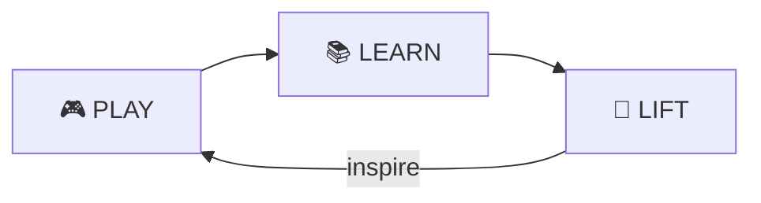
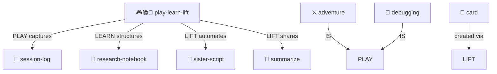

# Play Learn Lift

> **Start Playing. Keep Learning. Lift Others.**

The three-stage journey from curiosity to mastery to teaching. The core MOOLLM methodology.

> [!TIP]
> **This IS the methodology.** Every other skill is an expression of `PLAY-LEARN-LIFT`. Start here.

---

## The Cycle



| Stage | Motto | What Happens |
|-------|-------|--------------|
| **🎮 PLAY** | Jump in! | No prerequisites, can't break anything, curiosity drives discovery |
| **📚 LEARN** | Patterns emerge | Connections make sense, confidence builds naturally, "I noticed..." |
| **🚀 LIFT** | Help others play | Teaching solidifies learning, sharing multiplies impact |

---

## Why This Matters

Most learning is backwards:
- ❌ Study first, then do
- ❌ Master before sharing
- ❌ Fear mistakes

PLAY-LEARN-LIFT inverts it:
- ✅ **Do first**, understand emerges
- ✅ **Share while learning**, teaching accelerates mastery
- ✅ **Mistakes are features**, not bugs

---

## Philosophy

> **"Low floor, high ceiling, wide walls"**
> — Seymour Papert / Mitch Resnick

| Principle | Meaning |
|-----------|---------|
| **Low floor** | Easy to start. No prerequisites. |
| **High ceiling** | No limit to growth. Experts stay engaged. |
| **Wide walls** | Many paths to explore. Your way is valid. |

Papert's constructionism anchors PLAY: build first, learn by making, then share what you built. Drescher's schema learning maps the loop: PLAY surfaces patterns, LEARN revises and stabilizes schemas, and LIFT publishes them as reusable artifacts.

### Failure-Friendly

MOOLLM is unbreakable by design. Files remain transparent and inspectable. State can always be recovered. Experimentation is not just allowed but encouraged. Git acts as your safety net, catching every fall.

---

## Each Stage in Detail

### 🎮 PLAY

> *"What if I just..."*

- No prerequisites required
- Curiosity drives discovery
- Fun comes first
- "Oops" is learning data
- Everything is reversible (git, append-only logs)

**Capture everything**: Even dead ends teach something.

### 📚 LEARN

> *"I noticed you do this often..."*

- Patterns become visible through repetition
- Connections make sense
- Confidence builds naturally
- Knowledge deepens organically
- The "aha!" moments

**Document patterns**: Future-you will thank present-you.

#### LEARN Sub-Phases (Platform-Legible Self-Eval)

When LEARN involves potential rule changes or skill upgrades, use explicit sub-phases:

| Phase | Action | Gate |
|-------|--------|------|
| **OBSERVE** | Collect traces, note patterns, analyze behavior | None — always safe |
| **PROPOSE** | Draft changes, describe rationale, show diff | Review checkpoint |
| **COMMIT** | Apply changes after human approval | Human commit required |

This separation makes self-evaluation "platform-legible" — automated systems can see that observation is separate from action, and rule changes require explicit human approval. The agent never modifies its own rules unilaterally.

### 🚀 LIFT

> *"Here's what I learned..."*

- Teaching solidifies understanding
- Sharing multiplies impact
- Create tutorials from your journey
- Community grows stronger
- Everyone rises together

**Share the journey**: The path matters, not just the destination.

#### LIFT Provenance (Audit-Friendly Upgrades)

When LIFT produces reusable artifacts (skills, templates, procedures), include provenance:

```yaml
provenance:
  source_logs: ["session-2026-01-23.md", "research-notebook/pll-analysis.yml"]
  extracted_by: "claude-opus-4"  # or human author
  reviewed_by: "don-hopkins"     # human reviewer required for skill upgrades
  lifted_at: "2026-01-23T12:00:00Z"
  rationale: "Pattern appeared 5+ times across sessions; now crystallized."
```

This makes upgrades audit-friendly: anyone can trace back to the original observations, see who approved the lift, and understand why the pattern was worth crystallizing.

---

## The Cycle Continues

> *"Start with jazz, end with standards."*

After LIFT, you discover new areas to PLAY in:

```
PLAY → LEARN → LIFT → (inspire) → PLAY → ...
```

The pun is deliberate: **jazz** is free exploration (PLAY), and **standards** are both jazz classics everyone knows AND the reusable patterns you crystallize (LIFT). The learning happens in between!

- Teaching reveals gaps in your own understanding
- Helping others sparks new questions
- The cycle accelerates with practice

---

## In Practice

### Solo

1. **PLAY**: Try something new, log what happens
2. **LEARN**: Review logs, find patterns, update notes
3. **LIFT**: Write a README, create a template, share with future-self

### With Others

1. **PLAY**: Pair explore, capture together
2. **LEARN**: Compare notes, synthesize insights
3. **LIFT**: Write shared docs, teach newcomers

Edgebox's probe -> analyze -> call flow is an operational PLL precedent: PLAY probes, LEARN analyzes, LIFT calls.

---

## The Three Sister Directories

Every skill embodies PLL through three implementation directories:

| Sister | Role | PLL Phase | What Lives Here |
|--------|------|-----------|-----------------|
| **`templates/`** | Empathic seeds | **PLAY** | `{{~expression}}` with [YAML Jazz](../yaml-jazz/) meta-comments |
| **`examples/`** | Concrete instances | **LEARN** | Working code, real data, copyable patterns |
| **`scripts/`** | Lifted automation | **LIFT** | Doc-first tools born from repeated work |

```
PLAY with templates → LEARN from examples → LIFT into scripts
     ↓                      ↓                     ↓
 templates/              examples/            scripts/
 (seeds)                 (patterns)           (automation)
```

**Together:** `templates + examples + scripts = the complete PLL cycle`

> What was once "watch me do this" becomes "run this instead."

### Why This Matters

- **Templates** are prompts for exploration — they invite the LLM to instantiate
- **Examples** capture what works — they're templates that have been played with
- **Scripts** automate what repeats — they're the ultimate LIFT product

This is why MOOLLM skills have this structure. It's not arbitrary — it's PLL crystallized into filesystem layout.

See also:
- [MOOPMAP.md](../../designs/MOOPMAP.md) — The semantic pyramid, with three sisters at the base
- [sister-script/](../sister-script/) — Automation born from documentation
- [cursor-mirror/](../cursor-mirror/) — Python structured for LLM comprehension (sniffable-python exemplar)
- [no-ai-slop/examples/](../no-ai-slop/examples/) — Anti-patterns documented as learning material

---

## Related Skills

| Skill | Connection |
|-------|------------|
| [sister-script/](../sister-script/) | LIFT stage: automate proven patterns |
| [research-notebook/](../research-notebook/) | LEARN stage: structured capture |
| [session-log/](../session-log/) | PLAY stage: append-only exploration |
| [summarize/](../summarize/) | LEARN → LIFT: distill insights |

---

## Contents

| File | Purpose |
|------|---------|
| [SKILL.md](./SKILL.md) | Full methodology documentation |
| [CYCLE.yml.tmpl](./CYCLE.yml.tmpl) | Cycle template |
| [PLAY_LOG.md.tmpl](./PLAY_LOG.md.tmpl) | Play log template |

---

## Protocol Symbol

**PLAY-LEARN-LIFT** (alias: `PLL`)

```yaml
# PROTOCOLS.yml
PLAY-LEARN-LIFT:
  meaning: "Explore freely → find patterns → share wisdom"
  invoke_when: "Starting any new exploration, learning, or teaching"
  motto: "Start Playing. Keep Learning. Lift Others."
```

See: [PROTOCOLS.yml#PLAY-LEARN-LIFT](../../PROTOCOLS.yml)

---

## The Intertwingularity

PLL is the methodology. Other skills are its expressions.



---

## Navigation

| Direction | Destination |
|-----------|-------------|
| ⬆️ Up | [skills/](../) |
| ⬆️⬆️ Root | [Project Root](../../) |
| 👯 Sister | [sister-script/](../sister-script/) |
| 📓 Sister | [research-notebook/](../research-notebook/) |
| 📜 Sister | [session-log/](../session-log/) |
| 📋 Symbols | [PROTOCOLS.yml](../../PROTOCOLS.yml) |

---

*Start playing. The rest follows.*
