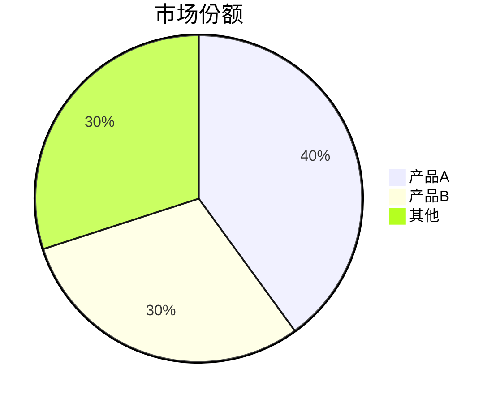

## 能力概述

PPT 生成能力让你能够将研究报告或任意内容快速转化为专业的演示文稿。

**核心特点**：
- 一键生成：从 Deep Research 报告直接生成 PPT
- 智能大纲：自动拆解内容为 10-15 页幻灯片
- 专业模板：商务、科技、简约等多种风格
- 图表支持：Mermaid 流程图、Chart.js 数据图表
- 多格式导出：PDF、HTML、PPTX

## 技术架构

### 生成方式：Template-Driven (MVP)

基于 Marp (Markdown Presentation Ecosystem) 的模板驱动方案：

```
用户输入/报告 → 大纲生成 → 内容填充 → Marp 渲染 → 导出
```

**选择理由**：
- ✅ 布局一致性强
- ✅ 完全可编辑（Markdown 源码）
- ✅ PDF/HTML 导出完美兼容
- ✅ 支持品牌定制（主题、颜色、字体）
- ✅ 实现相对简单，适合 MVP

## 工作流程

### Phase 1: 内容分析
分析输入内容，确定演示文稿结构：
- 识别核心主题和关键点
- 确定目标受众和演示时长
- 规划幻灯片数量（默认 10-15 页）

### Phase 2: 大纲生成
生成结构化大纲：
```yaml
slides:
  - type: title
    title: "演示标题"
    subtitle: "副标题/日期"
  - type: toc
    items: ["章节1", "章节2", ...]
  - type: section
    title: "章节标题"
  - type: content
    title: "页面标题"
    points: ["要点1", "要点2", ...]
  - type: data
    title: "数据展示"
    chart: { type: "bar", data: [...] }
  - type: conclusion
    points: ["结论1", "结论2", ...]
```

### Phase 3: 内容填充
根据大纲填充每页内容：
- 标题页：主标题、副标题、演讲者
- 目录页：章节概览
- 内容页：标题、要点、说明
- 数据页：图表、表格
- 总结页：结论、行动号召

### Phase 4: 样式应用
应用视觉模板：
- 主题选择（商务/科技/简约）
- 配色方案
- 字体搭配
- 布局调整

### Phase 5: 渲染导出
生成最终文件：
- HTML 预览
- PDF 导出
- Markdown 源码（可编辑）

## 工具使用

### generate_ppt_outline
**用途**：生成 PPT 大纲

**参数**：
- `content`: 输入内容（研究报告、文本等）
- `template_id`: 模板 ID（可选）
- `slide_count`: 目标幻灯片数量（默认 12）
- `style`: 风格偏好（business/tech/minimal）

**返回**：
```json
{
  "outline_id": "uuid",
  "slides": [
    {"type": "title", "title": "...", "subtitle": "..."},
    ...
  ],
  "estimated_duration": "15分钟"
}
```

### fill_ppt_content
**用途**：填充幻灯片内容

**参数**：
- `outline_id`: 大纲 ID
- `slide_index`: 幻灯片索引（可选，不填则填充所有）
- `additional_context`: 额外上下文（可选）

**返回**：
```json
{
  "slides": [
    {
      "type": "content",
      "title": "市场规模",
      "content": "# 市场规模\n\n- 要点1\n- 要点2\n\n> 引用数据"
    }
  ]
}
```

### render_ppt
**用途**：渲染 PPT 为 HTML 预览

**参数**：
- `outline_id`: 大纲 ID
- `theme`: 主题名称（default/gaia/uncover）
- `paginate`: 是否显示页码

**返回**：
```json
{
  "html_url": "/preview/ppt/{id}.html",
  "markdown_url": "/preview/ppt/{id}.md"
}
```

### export_ppt
**用途**：导出 PPT 文件

**参数**：
- `outline_id`: 大纲 ID
- `format`: 导出格式（pdf/html/pptx）
- `filename`: 输出文件名（可选）

**返回**：
```json
{
  "download_url": "/download/ppt/{filename}.pdf",
  "file_size": "2.3MB"
}
```

## 模板系统

### 内置模板

#### 1. 商业提案 (business_proposal)
- 风格：专业、稳重
- 配色：深蓝 + 金色
- 适用：商务汇报、项目提案

#### 2. 科技演示 (tech_showcase)
- 风格：现代、科技感
- 配色：深色背景 + 霓虹高亮
- 适用：产品发布、技术分享

#### 3. 简约报告 (minimal_report)
- 风格：简洁、留白
- 配色：黑白 + 单色强调
- 适用：日常汇报、内部分享

#### 4. 学术演讲 (academic)
- 风格：严谨、学术
- 配色：白底 + 深色文字
- 适用：学术报告、论文答辩

#### 5. 融资路演 (pitch_deck)
- 风格：大气、有冲击力
- 配色：品牌色 + 渐变
- 适用：投资路演、商业计划

### 自定义模板
支持通过 CSS 自定义主题：
```css
/* Custom theme */
section {
  background: linear-gradient(135deg, #1a1a2e 0%, #16213e 100%);
  color: #ffffff;
}
h1 { color: #e94560; }
```

## 图表支持

### Mermaid 图表
支持流程图、时序图、甘特图等：


### Chart.js 数据图表
支持柱状图、饼图、折线图等：
```markdown
<!-- chart: bar -->
| 季度 | 销售额 |
|------|--------|
| Q1   | 100    |
| Q2   | 150    |
| Q3   | 200    |
| Q4   | 250    |
```

## 最佳实践

### 1. 内容精简
- 每页 3-5 个要点
- 避免大段文字
- 使用图表代替数字堆砌

### 2. 视觉层次
- 标题突出
- 关键数据加粗
- 使用颜色引导注意力

### 3. 叙事逻辑
- 开头吸引注意
- 中间展开论述
- 结尾总结行动

### 4. 演示时长
| 幻灯片数 | 预计时长 |
|---------|---------|
| 8-10 页 | 5 分钟  |
| 12-15 页| 10-15 分钟|
| 20-25 页| 20-30 分钟|

## 输出格式

### Markdown 源码（可编辑）
```markdown
---
marp: true
theme: default
paginate: true
---

# 演示标题
副标题 | 日期

---

## 第一章
### 关键点

- 要点 1
- 要点 2
- 要点 3

---

## 数据展示



---

## 结论

1. 核心发现
2. 行动建议
3. 下一步计划
```

### PDF 导出
- A4 横向（16:9）
- 高清分辨率
- 嵌入字体

### HTML 导出
- 响应式设计
- 支持全屏演示
- 键盘导航

## 与 Deep Research 集成

当用户完成 Deep Research 后，可一键生成 PPT：

```
研究报告 → 提取关键信息 → 生成大纲 → 填充内容 → 渲染导出
```

**自动提取**：
- 摘要 → 标题页
- 目录 → 目录页
- 各章节 → 内容页
- 数据表格 → 图表页
- 结论 → 总结页
- 参考文献 → 附录页

## 注意事项

1. **内容版权**
   - 引用内容需标注来源
   - 图片需有使用权
   - 数据需注明出处

2. **文件大小**
   - PDF 通常 2-5MB
   - 包含图片时可能更大
   - 建议压缩后分享

3. **兼容性**
   - PDF 兼容所有平台
   - PPTX 需要 PowerPoint 2016+
   - HTML 需要现代浏览器

4. **隐私保护**
   - 敏感数据需脱敏
   - 内部信息需标注密级
   - 分享前检查内容
