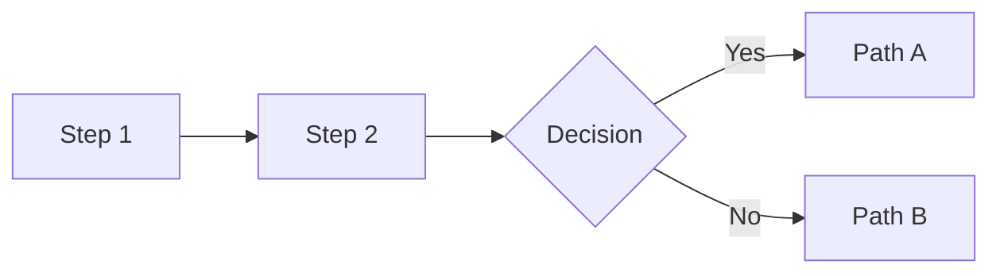

# PR Description Writer Skill

## When to Use This Skill

Use this Skill when:

- Creating or updating a PR description for a feature branch.
- The PR has multiple related changes that need clear organization.
- You want a description that helps reviewers understand the "why" and "what"
  quickly while having access to detailed context.
- You're preparing a PR for review and want it to be self-documenting.

This Skill is designed to work with any repository but is especially tuned for
Django/Python backends, React frontends, and infrastructure changes.

## Example Prompts

- "Use `pr-description-writer` to create a PR description for my current branch."
- "Generate a comprehensive PR description for PR #1234 using the
  `pr-description-writer` Skill."
- "Update the PR description for my feature branch to match our standard format."

---

## Workflow: Gathering Context

Before writing the PR description, **always gather the complete picture** of
all changes that will be included in the PR. This means:

1. Local uncommitted changes (staged + unstaged)
2. Local commits not yet pushed
3. Commits already pushed to the remote branch
4. Existing PR details (if a PR already exists)

### Step 1: Detect If Current Branch Has a PR

Use `gh pr view` to check if the current branch already has an associated PR:

```bash
# Check if current branch has a PR (returns 0 if PR exists, non-zero otherwise)
gh pr view --json number,title,body,url 2>/dev/null

# If you just need to know if a PR exists (boolean check):
gh pr view --json number 2>/dev/null && echo "PR exists" || echo "No PR yet"
```

**Interpretation:**
- Exit code `0` + JSON output → PR exists, use the PR number for updates
- Exit code non-zero → No PR yet, description will be for a new PR

### Step 2: Identify the Base Branch

Determine what branch the PR targets (or will target). Use this detection order:

```bash
# 1. If PR exists, get base from the PR (most reliable)
gh pr view --json baseRefName --jq '.baseRefName' 2>/dev/null

# 2. Get the repo's default branch via GitHub API
gh repo view --json defaultBranchRef --jq '.defaultBranchRef.name'

# 3. Fallback: check git remote HEAD
git remote show origin 2>/dev/null | grep "HEAD branch" | cut -d: -f2 | xargs

# 4. Last resort: check which common branches exist
git branch -r | grep -E "origin/(main|master|release|develop)$" | head -1 | sed 's|origin/||'
```

**Detection Priority:**
1. **Existing PR base** – If PR exists, always use its base branch
2. **GitHub default** – `gh repo view --json defaultBranchRef` is authoritative
3. **Git remote HEAD** – Works offline, reflects GitHub's default
4. **Common branch names** – Check for main/master/release/develop

**Smart Detection Script:**

```bash
detect_base_branch() {
  # Try existing PR first
  local pr_base=$(gh pr view --json baseRefName --jq '.baseRefName' 2>/dev/null)
  if [[ -n "$pr_base" ]]; then
    echo "$pr_base"
    return
  fi

  # Try GitHub API for default branch
  local gh_default=$(gh repo view --json defaultBranchRef --jq '.defaultBranchRef.name' 2>/dev/null)
  if [[ -n "$gh_default" ]]; then
    echo "$gh_default"
    return
  fi

  # Try git remote HEAD
  local remote_head=$(git remote show origin 2>/dev/null | grep "HEAD branch" | cut -d: -f2 | xargs)
  if [[ -n "$remote_head" ]]; then
    echo "$remote_head"
    return
  fi

  # Fallback to checking common branches
  for branch in main master release develop; do
    if git rev-parse --verify "origin/$branch" &>/dev/null; then
      echo "$branch"
      return
    fi
  done

  echo "main"  # Ultimate fallback
}

BASE_BRANCH=$(detect_base_branch)
echo "Using base branch: $BASE_BRANCH"
```

### Step 3: Gather ALL Changes

**CRITICAL**: The PR description must account for ALL changes, not just the
latest commit. This includes:

```bash
# 1. Get the base branch (adjust as needed)
BASE_BRANCH="origin/release"  # or origin/main, etc.

# 2. View ALL commits that will be in the PR
git log ${BASE_BRANCH}..HEAD --oneline

# 3. View the FULL diff of all changes (committed + uncommitted)
#    This shows what reviewers will see in the PR
git diff ${BASE_BRANCH}...HEAD --stat          # Files changed (committed only)
git diff ${BASE_BRANCH} --stat                 # Files changed (including uncommitted)

# 4. Check for uncommitted changes that should be included
git status --short

# 5. If there are uncommitted changes, include them in the diff
git diff --stat                                # Unstaged changes
git diff --cached --stat                       # Staged changes
```

### Step 4: Get Existing PR Details (If Updating)

When updating an existing PR, fetch current details to preserve/enhance:

```bash
# Get full PR details as JSON
gh pr view --json number,title,body,url,commits,files

# Get just the current body for reference
gh pr view --json body --jq '.body'

# Get list of files changed in the PR
gh pr view --json files --jq '.files[].path'

# Get commit history in the PR
gh pr view --json commits --jq '.commits[].messageHeadline'
```

### Step 5: Analyze Changes Comprehensively

```bash
# View the actual diff to understand what changed
git diff ${BASE_BRANCH}...HEAD

# For a specific file
git diff ${BASE_BRANCH}...HEAD -- path/to/file.py

# See commit messages for context on why changes were made
git log ${BASE_BRANCH}..HEAD --format="%h %s%n%b" | head -100
```

---

## Updating a PR with `gh` CLI

Once the description is generated, use `gh pr edit` to update:

```bash
# Update PR title and body
gh pr edit <number> --title "New Title" --body "$(cat <<'EOF'
## Summary
...full markdown body here...
EOF
)"

# Or update just the body
gh pr edit --body "$(cat <<'EOF'
...full markdown body here...
EOF
)"

# Update PR for current branch (no number needed if on the branch)
gh pr edit --body "..."
```

**Creating a new PR:**

```bash
gh pr create --title "Title" --body "$(cat <<'EOF'
## Summary
...
EOF
)" --base release
```

---

## Core Principles

### 1. Scannable First, Detailed Second

Reviewers should understand the PR in 30 seconds from the summary, then dive
deeper as needed. Structure content in layers:

1. **Summary table** – Quick overview of key features (30 seconds)
2. **Visual diagrams** – Understand flows without reading code (1-2 minutes)
3. **Detailed sections** – Full context for each feature (as needed)
4. **Collapsible file lists** – Reference without clutter

### 2. Visual Over Verbal

Use diagrams, tables, and structured formatting instead of prose where possible:

- Decision trees for conditional logic
- Flow diagrams for pipelines and processes
- Tables for feature summaries and comparisons
- Code blocks for commands and examples

### 3. Reviewer-Centric

Every section should answer a reviewer's question:

- "What does this PR do?" → Summary
- "Why was it done this way?" → Detailed sections with rationale
- "What files should I focus on?" → Collapsible file lists
- "How do I test this?" → Test commands + manual steps
- "Are there breaking changes?" → Explicit callouts

### 4. Complete Picture

**Never describe only the latest commit.** The PR description must reflect:

- All commits in the branch (from base to HEAD)
- Any uncommitted changes the user plans to include
- The cumulative effect of all changes together

---

## PR Description Structure

### Section 1: Summary

Start with a 1-2 sentence high-level summary, then provide a **Key Features
table** if the PR has 3+ distinct features:

```markdown
## Summary

This PR adds [brief description of the main change].

### Key Features

| Feature | Description |
|---------|-------------|
| **Feature A** | Short description of what it does |
| **Feature B** | Short description of what it does |
| **Feature C** | Short description of what it does |
```

For smaller PRs (1-2 features), a bullet list is acceptable.

### Section 2: Visual Diagrams

For any non-trivial flow, include a visual diagram. Choose the appropriate
format based on complexity:

#### ASCII Art (Simple Flows)

Use for decision trees and linear flows:

```markdown
## Feature Flow

```
First condition?
     │
    YES ──► Has prior state? ──► YES: Action A
     │                       └──► NO:  Action B
     │
    NO ───► Action C
```
```

#### Mermaid (Complex Flows)

Use for multi-step pipelines, state machines, or architectures:

```markdown
## Architecture


```

#### Box Diagrams (Pipelines)

Use for showing data flow or process stages:

```markdown
## Data Pipeline

```
┌─────────────────┐     ┌─────────────────┐     ┌─────────────────┐
│   Input Stage   │────►│  Process Stage  │────►│  Output Stage   │
│  (description)  │     │  (description)  │     │  (description)  │
└─────────────────┘     └─────────────────┘     └─────────────────┘
```
```

### Section 3: Detailed Feature Sections

For each major feature, provide a dedicated section with:

- **What it does** – Behavior description
- **Why this approach** – Rationale for key decisions
- **Key implementation details** – Important patterns or constraints

Use horizontal rules (`---`) to separate major features.

```markdown
---

## Feature A: Title

Description of what this feature does and why.

Key implementation details:
- Point 1
- Point 2

---

## Feature B: Title

...
```

### Section 4: Files Changed

Group files by category using collapsible sections:

```markdown
## Files Changed

<details>
<summary>Core modules (click to expand)</summary>

- `path/to/file1.py` - Brief description
- `path/to/file2.py` - Brief description

</details>

<details>
<summary>Tests (click to expand)</summary>

- `tests/test_file1.py` - What it tests
- `tests/test_file2.py` - What it tests

</details>
```

Categories to consider:
- Core modules / Services
- API / Views / Routes
- Models / Migrations
- Tests
- Configuration / Settings
- Documentation

### Section 5: How to Test

Provide both automated and manual testing instructions:

```markdown
## How to Test

```bash
# Run all related tests
.bin/pytest path/to/tests/ -v
```

### Manual Testing

1. **Test scenario A**: Step-by-step instructions
2. **Test scenario B**: Step-by-step instructions
```

### Section 6: Breaking Changes / Notes

Always include a section for special considerations:

```markdown
## Notes

- **No Migrations**: This PR has no schema changes.
```

Or for PRs with important notes:

```markdown
## Breaking Changes

- **API Change**: The `/api/endpoint` now returns X instead of Y.
- **Config Required**: Set `NEW_ENV_VAR` before deploying.

## Deploy Steps

1. Add environment variable `NEW_VAR=value`
2. Run migrations
3. Deploy code
```

---

## When to Use Each Element

| Scenario | Use |
|----------|-----|
| 3+ distinct features | Summary table |
| Conditional logic | ASCII decision tree |
| Multi-step process | Box diagram or Mermaid |
| 5+ files in a category | Collapsible details |
| Test commands exist | Code block with commands |
| Manual testing needed | Numbered step list |
| Schema changes | Explicit migration section |
| Breaking changes | Dedicated callout section |

---

## Common Patterns

### Feature Flag Pattern

```markdown
## Feature Flag

Controlled by `FEATURE_FLAG_NAME` (default: `False`).

When enabled:
- Behavior A
- Behavior B

When disabled:
- Falls back to original behavior
```

### Migration Pattern

```markdown
## Migrations

| Migration | Description | Reversible |
|-----------|-------------|------------|
| `0001_add_field.py` | Adds `new_field` to Model | Yes |
| `0002_backfill.py` | Backfills existing rows | Yes (data loss) |

### Rollback Plan

1. Revert code deployment
2. Run `./manage.py migrate app_name 0000_previous`
```

### API Change Pattern

```markdown
## API Changes

### New Endpoints

| Method | Path | Description |
|--------|------|-------------|
| `GET` | `/api/v2/resource` | Fetches resource with new format |

### Modified Endpoints

| Endpoint | Change |
|----------|--------|
| `GET /api/v1/old` | Now returns `new_field` in response |

### Deprecated

- `GET /api/v1/legacy` - Use `/api/v2/resource` instead
```

---

## Anti-Patterns to Avoid

1. **Wall of text** – Use formatting (tables, lists, diagrams) instead of
   paragraphs.

2. **Vague descriptions** – "Various bug fixes" tells reviewers nothing.
   Be specific.

3. **Missing test instructions** – Always include how to verify the changes.

4. **Buried breaking changes** – Put them in a dedicated, visible section.

5. **Listing every file** – Use collapsible sections and group by purpose.

6. **No visual aids for flows** – If you need more than 2 sentences to explain
   a flow, use a diagram.

7. **Describing only the latest commit** – The PR description should cover ALL
   commits and changes in the branch.

---

## Quick Reference: `gh` CLI Commands

### PR Detection & Info

```bash
# Check if current branch has a PR
gh pr view --json number 2>/dev/null && echo "Has PR" || echo "No PR"

# Get PR number for current branch
gh pr view --json number --jq '.number'

# Get full PR details
gh pr view --json number,title,body,baseRefName,headRefName,url,state,files,commits

# Get PR URL
gh pr view --json url --jq '.url'
```

### PR Creation & Updates

```bash
# Create new PR
gh pr create --title "Title" --body "Body" --base release

# Update existing PR (current branch)
gh pr edit --title "New Title" --body "New Body"

# Update specific PR by number
gh pr edit 1234 --title "New Title" --body "New Body"

# Add reviewers
gh pr edit --add-reviewer username1,username2

# Add labels
gh pr edit --add-label "enhancement,needs-review"
```

### Viewing Changes

```bash
# View PR diff
gh pr diff

# View PR diff for specific PR
gh pr diff 1234

# View PR files
gh pr view --json files --jq '.files[].path'

# View PR commits
gh pr view --json commits --jq '.commits[] | "\(.oid[0:7]) \(.messageHeadline)"'
```

---

## Compatibility Notes

This Skill works with both **Claude Code** and **OpenAI Codex**.

For Codex users:
- Install via skill-installer with `--repo DiversioTeam/agent-skills-marketplace
  --path plugins/pr-description-writer/skills/pr-description-writer`.
- Use `$skill pr-description-writer` to invoke.

For Claude Code users:
- Install via `/plugin install pr-description-writer@diversiotech`.
- Use `/pr-description-writer:write-pr` to invoke.

---

## Output

When this Skill generates a PR description, it should:

1. **Gather all context first** using the commands above.
2. **Analyze ALL changes** – not just the latest commit.
3. **Output the full markdown** for the PR description.
4. **Offer to update the PR** directly using `gh pr edit` if a PR exists, or
   create one using `gh pr create` if not.
5. **Be ready to iterate** based on user feedback.

The description should be copy-paste ready for GitHub.
