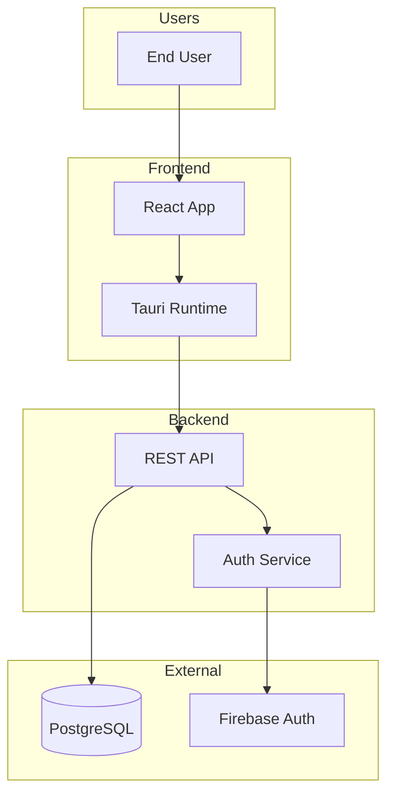
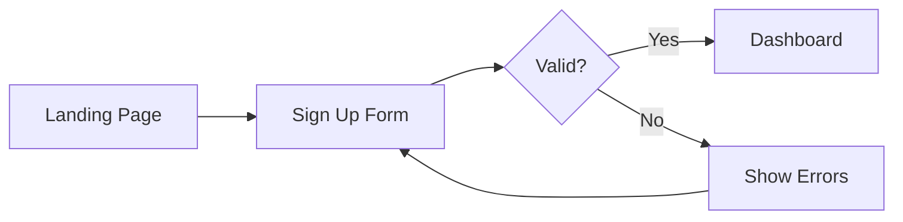
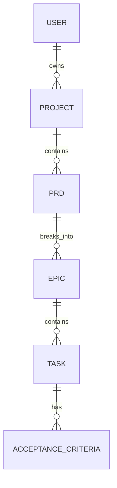
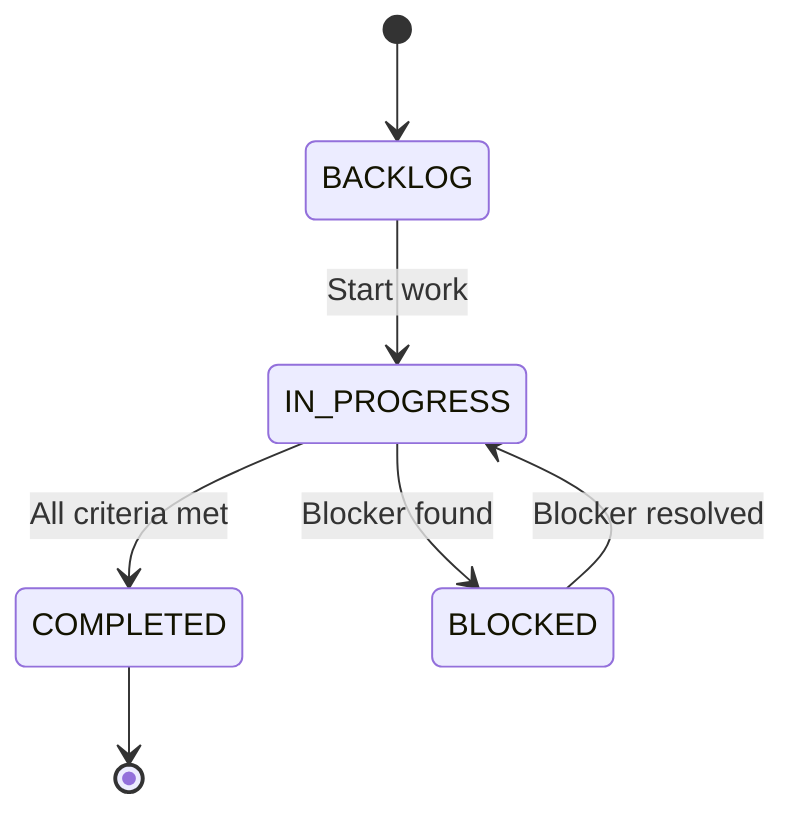

# PRD Template

When creating PRDs for SpecFlux projects, follow these patterns.

## Design Principles

1. **Concise for humans** - Core PRD is 1-2 pages, scannable
2. **Detailed for AI** - Supporting docs provide implementation context
3. **Mermaid diagrams** - Visual flows that are both readable and parseable
4. **Separate concerns** - Core PRD + supporting documents

## File Structure

```
.specflux/prds/{prd-slug}/
├── prd.md              # Core PRD (concise, 1-2 pages)
├── architecture.md     # System diagrams (optional)
├── user-flows.md       # User journey diagrams (optional)
├── data-model.md       # Entity relationships (optional)
├── wireframes.md       # UI layouts (optional)
└── mockups/            # HTML/visual files (optional)
```

## Core PRD Structure

```markdown
# {Project Name}

## Problem Statement
{1-2 paragraphs: Why does this need to exist? Who has this problem?}

## Target Users
- **Primary:** {who and why}
- **Secondary:** {who and why}

## Core Features (MVP)

### 1. {Feature Name}
{Brief description of what it does}
- {Capability 1}
- {Capability 2}

### 2. {Feature Name}
{Brief description}
- {Capability}

## User Flows
{Brief description of key journeys - reference diagrams in supporting docs}

See: [User Flows](./user-flows.md)

## Technical Constraints
- {Platform, language, integration requirements}

## Out of Scope (for now)
- {Feature explicitly not in MVP}
- {Feature deferred to future}

## Success Metrics
- {Measurable outcome 1}
- {Measurable outcome 2}

## Supporting Documents
- [Architecture](./architecture.md)
- [User Flows](./user-flows.md)
- [Wireframes](./wireframes.md)
```

## Supporting Document Templates

### Architecture Diagram (`architecture.md`)

```markdown
# Architecture Overview

## System Context



## Components

| Component | Responsibility |
|-----------|----------------|
| **Frontend** | {description} |
| **Backend** | {description} |
| **Database** | {description} |
```

### User Flows (`user-flows.md`)

```markdown
# User Flows

## {Flow Name} (e.g., "User Registration")



### Steps
1. User clicks "Sign Up"
2. Enters email and password
3. System validates input
4. On success: redirect to dashboard
5. On error: show validation messages

### Edge Cases
- Email already exists
- Password too weak
- Network timeout
```

### Data Model (`data-model.md`)

```markdown
# Data Model

## Entity Relationships



## Entities

### User
| Field | Type | Description |
|-------|------|-------------|
| id | UUID | Primary key |
| email | String | Unique, for auth |
| created_at | Timestamp | Auto-generated |

### Project
| Field | Type | Description |
|-------|------|-------------|
| id | UUID | Primary key |
| owner_id | UUID | FK to User |
| name | String | Display name |
```

### Wireframes (`wireframes.md`)

```markdown
# Wireframes

## {Screen Name}

```
+------------------------------------------+
|  Logo    [Search...]         [User Menu] |
+----------+-------------------------------+
|          |                               |
| Sidebar  |     Main Content Area         |
|          |                               |
| - Nav 1  |   +-------+  +-------+        |
| - Nav 2  |   | Card  |  | Card  |        |
| - Nav 3  |   +-------+  +-------+        |
|          |                               |
+----------+-------------------------------+
```

### Elements
- **Header**: Logo, search, user menu
- **Sidebar**: Navigation items
- **Content**: Card grid layout

### Interactions
- Click card → opens detail view
- Hover card → show quick actions
```

### State Machine (`states.md`)

```markdown
# State Machine

## {Entity} States (e.g., "Task Status")



### Transitions
| From | To | Trigger |
|------|-----|---------|
| BACKLOG | IN_PROGRESS | Developer starts task |
| IN_PROGRESS | COMPLETED | All tests pass |
| IN_PROGRESS | BLOCKED | External dependency |
```

## Best Practices

### Keep Core PRD Concise
- Problem statement: 1-2 paragraphs max
- Features: 3-5 for MVP
- No implementation details in core PRD

### Use Mermaid for All Diagrams
- Flowcharts for user journeys
- ERD for data models
- State diagrams for status flows
- Sequence diagrams for API interactions

### Reference Documents Correctly
- Always use relative paths: `./architecture.md`
- List all supporting docs at end of core PRD
- Cross-reference between documents

### Write for Both Audiences
- **Humans**: Scannable, no jargon, clear business value
- **AI Agents**: Specific requirements, clear acceptance criteria, implementation hints

---

## Vision PRD Template

Use this template when a project requires multiple PRDs (infrastructure + product phases). Vision PRDs do NOT have epics - they only link to child PRDs that contain the implementable features.

### When to Use
- User's idea is complex enough for multiple phases
- Project needs infrastructure setup before product work
- Clear separation between MVP and future features

### Template

```markdown
# {Project Name}

## The Idea
{1-2 paragraphs: What we're building and why. High-level vision that spans all phases.}

## Problem & Users
{Who has this problem? How does it affect them? What's the opportunity?}

## Success Looks Like
{What does success mean for this project? Key outcomes across all phases.}

## Roadmap

### Phase 0: Infrastructure
→ **[{displayKey}: Infrastructure Setup]({folderPath}/prd.md)**
- Repository structure and CI/CD
- Cloud hosting and deployment
- Development environment setup

### Phase 1: MVP
→ **[{displayKey}: {MVP Name}]({folderPath}/prd.md)**
- {Core feature 1}
- {Core feature 2}
- {Core feature 3}

### Phase 2: {Phase Name}
→ **[{displayKey}: {Phase Name}]({folderPath}/prd.md)**
- {Future feature 1}
- {Future feature 2}

### Future Ideas
- {Idea not yet assigned to a phase}
- {Another idea for later}

## Constraints
{Technical, timeline, budget constraints that apply across all phases}

## Notes
{Any other context, decisions made, trade-offs considered}
```

### Detecting Vision PRDs

A PRD is a Vision PRD if:
- It has a `## Roadmap` section
- The Roadmap contains links to other PRDs (pattern: `→ **[SPEC-P`)
- It does NOT have epics (epic breakdown happens in child PRDs)

---

## Infrastructure PRD Template

Use for Phase 0 infrastructure setup when the user is starting from scratch. This PRD covers all the technical foundation needed before product development begins.

### When to Use
- User mentions "starting from scratch"
- No existing repos, CI/CD, or cloud setup
- Need to make foundational technical decisions

### Template

```markdown
# Infrastructure Setup

## Objective
{What infrastructure needs to be in place before product development begins}

## Scope

### Repository & Code Structure
- Monorepo vs multi-repo decision
- Frontend/backend organization
- Shared code/types strategy

### CI/CD Pipeline
- Build automation (GitHub Actions, etc.)
- Test automation
- Deployment automation
- Branch protection rules

### Cloud Infrastructure
- Hosting provider and rationale
- Database setup and configuration
- Environment configuration (dev/staging/prod)
- Domain and SSL setup

### Development Environment
- Local setup requirements
- Docker configuration (if any)
- Environment variables management
- IDE/editor configuration

## Technical Decisions

| Decision | Choice | Rationale |
|----------|--------|-----------|
| Hosting | {choice} | {why} |
| Database | {choice} | {why} |
| CI/CD | {choice} | {why} |
| Package Manager | {choice} | {why} |

## Out of Scope
- Product features (handled by MVP PRD)
- Scaling/optimization (future phase)
- Advanced monitoring (can be added later)

## Success Criteria
- Developers can clone and run locally in < 15 minutes
- CI pipeline runs on every PR
- Automated deployment to staging on merge to main
- All environments documented in README
- Secrets properly managed (not in code)
```

---

## Stub PRD Template

Use when creating placeholder PRDs for future phases. Stubs are minimal documents that will be fleshed out when the user navigates to them and runs `/specflux:planning`.

### When to Use
- Creating child PRDs during Vision PRD flow
- Placeholder for Phase 2+ features
- User wants to note future work without detailing it now

### Template

```markdown
# {PRD Title}

*This PRD is a stub. Run `/specflux:planning` to complete the interview and flesh out details.*

## Overview
{One-line description from the Vision PRD}

## Planned Scope
- {Feature 1 from Vision PRD}
- {Feature 2 from Vision PRD}
- {Feature 3 from Vision PRD}

## Status
**Stub** - awaiting refinement

## Parent Vision
See: [{Vision PRD displayKey}: {Vision PRD Title}]({vision folderPath}/prd.md)
```

### Detecting Stub PRDs

A PRD is a Stub if it contains the text: `This PRD is a stub`

When a stub is detected, the planning workflow should continue the interview to flesh it out into a full PRD.

---

## Document Types for API

When registering documents via API:
- `PRD` - Primary PRD document
- `WIREFRAME` - UI layouts and mockups
- `DESIGN` - Architecture, data models, flows
- `MOCKUP` - Visual designs (HTML/images)
- `OTHER` - Any other supporting document
