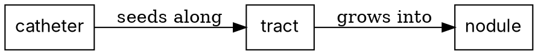

# Present-Paper Skill

## Phase 0: Init & Outline

### Step 0a — Load design references (read before drafting outline)

Read three files **now**, in full. Read the rest only **when the answer to Q0/Q2 tells you which one
you need** — a talk has one venue and one style, and reading the others teaches nothing you will use.

**Read now (always):**

**A. `references/ai_slide_tells.md`** — the marks a generated deck leaves. Read all of it, first.
Building against it is why the deck does not need catching later; `scripts/check_slide_tells.py`
catches what slips through (Step 3.6). It **overrules older guidance where they conflict** — in
particular eyebrow labels and brand footers on every slide, the single most-cited visual tell.

**B. `references/presentation_archetypes.md`** — the **skeleton**, chosen by where the speaker is
standing: conference oral, journal-club critique, case-anchored grand rounds, didactic lecture,
defence, keynote (Duarte's sparkline, the Jobs STAR moment, Takahashi/Lessig), lay talk, decision
brief (Minto's pyramid, action titles, Kawasaki's 10/20/30). The *archetype* (what the talk has to
**do**) and the *visual style* (what it **looks like**) are independent choices. **The skin is a
preference; the skeleton is not.** Its mechanical half is `scripts/check_deck_budget.py`.

**C. `references/presentation_design_guidelines.md`** — the enforceable rules (assertion headlines,
24-pt floor, negative space, ≤3 colours, colourblind-safe palettes, redraw-don't-screenshot,
animation discipline) plus the G1–G10 self-check the Phase 3.5 critic scores against.

**Read on demand — after Q0/Q2 tell you which one:**

| File | Read it when |
|---|---|
| `references/medical_presentation_templates.md` | the venue is one of the five medical ones — then read **that section only** |
| `references/slide_visual_styles/CATALOG.md` → one style file | Q2 has chosen a style |
| `references/slide_design_principles.md` | you are stuck on *why* a slide is not landing — the Reynolds / Duarte / Knaflic / Tufte theory under the rules in **C** |
| `references/generated_illustrations.md` | you are about to generate any image for a slide, or a text-only slide keeps failing the critic; its first rule (never generate a medical image) is not optional |
| `references/spoken_notes_and_bilingual.md` | you are drafting speaker notes, or the deck is not monolingual |

### Required Inputs

Collect these before starting. Do not draft until the target audience is defined.

| Input | Why |
|-------|-----|
| **Paper** | PDF path, DOI, or PMID |
| **Presentation time** | Determines depth and slide count |
| **Target audience** | Specialty mix, knowledge level — controls terminology depth |
| **Context** | Course name, conference, journal club format, prior session topics |
| **Template / visual style** | Institutional template (.pptx/.potx) to fill, or a visual style to generate in. Default: ask (Step 0b) |
| **Extension section** | Optional topic to include (e.g., AI directions, clinical implications). Default: none |

### Step 0b — Template & visual style selection

Before drafting the outline, settle how the deck will look. Ask (use `AskUserQuestion`; skip a
question the user already answered in their request):

**Q0 — "Where are you standing, and for how long?"** (venue + minutes)

This decides the **archetype** — the skeleton — before any question about looks. Map the answer with
the selector table in `references/presentation_archetypes.md`, and carry `archetype` + `minutes`
forward: Step 3.6 checks the built deck against them.

If the user gives only a topic and no venue, **ask**. Do not guess: a deck built for no particular
room comes out generic in exactly the way every reviewer can see.

**Q1 — "Do you have an institutional or branded template to use?"**
- **Yes** → the user supplies a `.pptx`/`.potx`. Switch to **Mode C** (Phase 3, "Fill an
  institutional template"). Do **not** also ask Q2 — the template's theme *is* the style.
- **No / none** → ask Q2.

**Q2 — "Which visual style should I generate in?"** Offer the `CATALOG.md` menu with a
one-line preview each (recommended option first, labelled):

| Option | One-line preview |
|--------|------------------|
| **Nature / Lancet** *(recommended for medical academic talks)* | White, navy + coral accent, hairline dividers, Inter/Pretendard — restrained editorial-academic |
| **Clinical Blue** | White/light-blue, navy-teal, calm and trustworthy, colorblind-safe — grand rounds / CME |
| **Editorial Mono** | High-contrast black-on-white, oversized type, one accent — single big-message keynote |
| **Dark Modern** | Deep-slate background, off-white text, electric accent — AI / method / tech talks |
| **Other** | Describe a palette/feel, or name a journal/brand to emulate |

Record the choice and pass the matching style spec to Phase 3. With no preference and a medical
academic talk, default to **Nature / Lancet**. Style changes only Phase 3 rendering — not the
outline, script, or Q&A.

**Q3 — conference decks only: is slide 1 a submission requirement?** Many societies require the
title slide to carry the title, authors, affiliations and country **exactly as entered in the
abstract submission**. Do not shorten them to satisfy the density check — **the requirement wins**.
Copy the fields from the submission portal, and record `SLIDE_TOO_DENSE` on slide 1 as consciously
overruled with that reason.

### Paper Analysis

Read the paper and produce a structured analysis:

```text
## Paper Analysis

### Citation
[Full citation with DOI]

### Background
- What gap does this paper address?
- What was known vs. unknown before this study?

### Study Design
- Type: [RCT / cohort / case series / meta-analysis / etc.]
- Subjects: [n, inclusion/exclusion]
- Methods: [key methodological choices]
- Primary outcome: [what was measured]

### Key Results
1. [Finding 1 with effect size and CI/p-value]
2. [Finding 2]

### Patient/Case Summary Table
[If applicable — structured table of individual cases or subgroups]

### Limitations
1. [Limitation 1]

### Significance
- Why does this matter? What changes because of this paper?
```

### Slide Outline

Create a slide-by-slide outline with time allocation:

```text
## Slide Outline ([N] slides, [M] minutes)

| # | Title | Time | Key Content |
|---|-------|------|-------------|
| 1 | Title slide | 0:30 | Paper citation, presenter |
| 2 | Context / Prior sessions | 1:00 | How this connects to prior knowledge |
| ... | ... | ... | ... |
| N | Take-home messages | 0:30 | 3-5 key points |
```

**Gate: User approves outline before proceeding.**

---

## Phase 1: Supporting Research

Limit supporting references to 5–8, and search only the categories the approved outline needs:
follow-up studies (replicated or extended?), large clinical-trial data that contextualizes the
findings, review articles that frame the topic, and contradicting evidence (for balanced Q&A). Do
not summarize every paper found — extract only the data points the slides need (incidence, OR/HR,
AUC), findings that support or challenge the main paper, and context for its significance.

Verify every reference via `/search-lit` (confirmed DOI or PMID). Mark any you cannot verify
`[UNVERIFIED - NEEDS MANUAL CHECK]`.

```text
## Verified References

### Main Paper
1. [Citation] — PMID: XXXXX, DOI: XX.XXXX/XXXXX

### Supporting References
2. [Citation] — PMID: XXXXX
   → Used for: [specific data point or context]

### Key Data for Slides
- [Statistic 1]: [value] — Source: [Ref #]
```

---

## Phase 2: Script & Content

### Speaker Script

Draft a complete speaker script:

1. **Language**: the user's preferred language for narration; English for technical terms.
2. **Audience adaptation**: depth set by the Phase 0 audience profile. For mixed audiences, add a
   one-line plain-language gloss for specialty terms ("FLAIR sequence — an MRI technique that
   suppresses fluid signal to highlight edema").
3. **Pronunciation guide** in the user's language for drug names and abbreviations
   ("lecanemab (leh-KAN-eh-mab)").
4. **Timing markers** per slide. Script length must match the allocated time (roughly 130–150
   words per minute for academic talks).
5. **Transition phrases** connecting each slide to the narrative arc.

Never invent clinical definitions, diagnostic criteria, or guideline recommendations; flag an
uncertain one with `[VERIFY]` and ask the user.

How the sentences are built — notes are spoken, not read — and the language split for a deck that is
not monolingual are in `references/spoken_notes_and_bilingual.md`. Read it before drafting if either
applies.

```text
## Speaker Script

### Slide 1: Title (0:30)
"[Opening — introduce yourself and the paper]"

### Slide N: Take-home Messages (0:30)
"[Summarize 3-5 key points. Thank audience. Invite questions.]"
```

### Extension Section (Optional)

Only if the user requested it in Phase 0 — e.g. AI/computational directions, clinical practice or
policy implications, connections to the user's own research.

**Gate: User reviews script before proceeding.**

---

## Phase 3: Slides & Notes

### Three Modes

**Mode A** = generate a new deck in a chosen visual style. **Mode B** = add notes to an
existing deck. **Mode C** = fill the user's institutional/branded template (chosen at
Step 0b). Pick the mode from the Step 0b answer.

**Mode A: Generate new slide deck**

Generate a fully-editable PPTX from structured inline data using `python-pptx`. Two template
libraries:

- `${CLAUDE_SKILL_DIR}/references/generate_pptx_templates.py` — generic T_lead / T_text / T_table /
  T_image_right / … templates (its docstring lists them; `build_demo_slides()` exercises each). Use
  for journal club, grand rounds, conference talk, and short paper talks.
- `${CLAUDE_SKILL_DIR}/templates/build_pptx_nature_lancet.py` — Nature/Lancet style (spec:
  `references/slide_visual_styles/nature_lancet.md`). Use for an **academic lecture multi-paper
  survey** (template #5). Functions: `new_presentation`, `add_title_slide`, `add_toc_slide`,
  `add_section_divider`, `add_transition_slide`, `add_content_slide`, `add_glossary_slide`,
  `add_closing_slide`, plus `apply_fonts(prs, en=..., ko=...)` and `fix_app_xml()`.

The Nature/Lancet defaults use 20 pt body text, subtitles and glossary entries. They suit the
`conference_oral`, `critique`, `case_anchored`, `didactic` and `defence` budget profiles with concise
content. `keynote`, `lay_talk` and `decision_brief` require larger type and layout adaptation;
selecting a profile in the checker does not restyle the deck. Capacity bounds do not guarantee
readable density or fit — render the actual content and inspect it.

For figures pulled from PDFs (rather than `/make-figures` output), use
`${CLAUDE_SKILL_DIR}/scripts/extract_pdf_figures.py` (pdftoppm + PIL crop with normalized 0–1 boxes;
single-crop CLI or YAML batch config), then strip journal headers, captions and surrounding
whitespace with `trim_caption.py`, which keeps multi-panel figures and table rows intact:

```bash
python3 "${CLAUDE_SKILL_DIR}/scripts/trim_caption.py" \
  --in-dir  figures/extracted \
  --out-dir figures/cropped
```

When the slot expects only the figure body (the default for `build_pptx_nature_lancet.py`), point
`FIG_DIR` at the cropped output dir.

### Word-boundary aware markdown parser (mandatory for HLA-rich decks)

A build script that parses inline `**bold**` / `*italic*` in slide body or notes must use
word-boundary lookarounds, or asterisk-bearing scientific tokens (`DRB1*07:01`, `HLA-A*02:01`, SNP
IDs, footnote markers) are eaten as italic delimiters and every allele in the deck is silently
corrupted:

```python
import re
pattern = re.compile(
    r"(\*\*(?:(?!\*\*).)+?\*\*"                           # bold; inner single * allowed
    r"|(?<![A-Za-z0-9])\*[^*\n]+?\*(?![A-Za-z0-9]))"      # italic (word-boundary)
)
```

The bold rule tolerates an inner single `*` so `**DRB1*04:02**` stays one bold span. Put this regex
in `add_styled()` (or equivalent) in every Nature/Lancet-style build script.

### Pronunciation auto-augment for non-native presenters

When the presenter is uncomfortable pronouncing acronyms, author names, drug names, or gene symbols,
append a per-slide `[ Pronunciation ]` section to the notes (Presenter View only):

```bash
python3 "${CLAUDE_SKILL_DIR}/scripts/inject_pronunciation_notes.py" \
  input.pptx output.pptx \
  --dict pron_dict.yaml \
  --header "[ 발음 ]"            # or any header you like
```

Supply a YAML/JSON dict (term → [reading, full_name]) assembled for the audience's language. Matching
is word-boundary, so short acronyms (`AE`, `OR`) match only standalone; allele tokens get a reading
synthesized from their base allele entry. Slides already carrying the header are skipped, so re-runs
are safe.

### Speaker notes statistics density

When the slide body already shows exact OR / 95% CI / p-values, the notes must not repeat them — the
presenter ends up reading statistics aloud and the audience cannot keep up. Notes are a narrative
with a one-line "see the slide body for the exact numbers"; exact numbers live in the body and
footnotes. More than 1,000 characters with ≥5 stat tokens → compress. The measurement snippet is in
`references/spoken_notes_and_bilingual.md` Part D §8.

### Numbers in the notes are numbers you will say out loud

- **Every external number in the notes is checked against the source, exactly like a number in the
  body.** A benchmark typed from memory ("95% of 152 models rated high risk" where the source said
  87%, of 148 of 171) survives a correctly cited reference list — only the digits were remembered.
- **When you edit generated text, the count of injection expressions must not fall.** Where a build
  script draws numbers from an artifact (`f"{N['primary']}"`), compressing the prose is where they
  get flattened into literals — the body stays gated and the notes silently disagree with it.
  Before and after:

```python
import re
len(re.findall(r"\{N\[", src))   # must not decrease across a rewrite
```

Invert the same regex to pull out anything numeric *not* inside an injection expression — that is a
literal somebody typed, and it gets checked.

### Sharing-ready notes-stripped variant

Stripping notes is **mandatory** before a deck circulates (e.g. a professor asks for the slides),
because they hold presenter-only material — second-language narrative, pronunciation hints,
self-referential reminders ("Prof. ○○ will likely ask about …"):

```bash
python3 "${CLAUDE_SKILL_DIR}/scripts/strip_notes_for_sharing.py" \
  presenter_v9.pptx share/<topic>_<initials>.pptx
```

It clears the text of every shape on every notes page (not only the notes placeholder), removes
review comments, blanks the author / last-modified-by / comments fields of `docProps/core.xml`,
syncs the `docProps/app.xml` counts, and verifies all of that against the raw XML of the written
file (body and figures untouched). A deck with hidden slides stops with exit 2 until you choose
`--drop-hidden` (remove them from the shared copy) or `--keep-hidden`. Share `<topic>_<initials>.pptx` (say in the cover email
that it is there for slide reuse), `<topic>_<initials>.pdf` (LibreOffice `--convert-to pdf` drops the
cleared notes pages), and optionally `<topic>_<initials>_references.zip` (a Drive link if it exceeds
the attachment limit).

### The companion documents leave with the deck — check them too

`_qa_prep.md`, `_quick_review.md` and any handout are drafted from the same material as the notes,
and they travel further. Before any of them goes out:

- **Retired numbers.** A gate on the deck is not a gate on its siblings — slides once said 26.3%
  while the review sheet the speaker would answer questions from still said 54.1%. Whenever the
  deck's numbers move, sweep the sibling `.md` files for the superseded values. Fence a deliberately
  quoted old figure (`<!-- superseded-quotation -->`) rather than exempting the file.
- **Operator material in an audience document.** A brief written to prepare *you* ("the point they
  will push back on", "the fallback position", a minute-by-minute plan) reads, handed to the person
  it describes, as a strategy for managing them. Make it two documents: an internal one with the
  contingencies, and a neutral one with the findings and what you ask them to confirm.
- **Live-only devices, and what points at them.** A redistributed deck is read at a desk: remove the
  break slide, the timer, "as we just saw in the exercise" — **then grep the whole deck, bodies and
  notes, for the sentences that referred to them.** Re-verify anything the material asserts about
  an upstream project (install commands, counts, versions) against that project's own source, not
  your months-old copy.

### Architecture

Every slide is a template-function call with explicit inline data, producing native, editable text
frames. Three rules keep slides stable:

1. **No markdown parsing.** Markdown auto-parsed into slides drifts on every regeneration.
2. **No `cur_top` cumulative position tracking.** Use the fixed coordinate zones defined at the top
   of `generate_pptx_templates.py` — `cur_top` accumulates rounding errors and breaks layout after
   ~10 slides.
3. **No Marp.** Marp renders to images; the deck becomes uneditable and reviewers cannot copy text or
   restyle.

### Figure source formats (when consuming `/make-figures` output)

- **Preferred**: PNG at ≥300 dpi via `add_picture()`. Set `img_pct` (`T_image_right`) so the figure
  occupies ≥40% of slide width on a 13.33 × 7.5-in layout.
- **Vector source**: convert PDF → PNG at the target DPI (`pdftoppm -r 300 input.pdf out_prefix`)
  before insertion; python-pptx PDF embedding is unreliable across PowerPoint versions.
- **Forbidden**: TIFF (Mac PowerPoint silently drops it); JPEG for line art (artifacts on
  diagonals); raw SVG (PowerPoint Mac handles it inconsistently).
- **Caption**: re-draft for a listener with 5–10 seconds of attention, not the journal legend.
- **Put the claim in the slide, not in the raster.** A conclusion or headline number drawn *into*
  the PNG stops tracking the talk the moment the bullet above it is edited, and no text search can
  find it. Numbers and conclusions live in the slide's own text.
- **Generated illustrations**: concepts and scenes only, never anything that could be mistaken for
  a measurement — no generated CT, MRI, histology, or radiograph, not even "as an illustration".
  Read `references/generated_illustrations.md` before the first prompt.

### Diagrams and plots are drawn as CODE, then inserted (not out of autoshapes)

**Hard rule, and the highest-yield rule in the skill.** Agent-built slides assembled in a PPT tool
almost always fail; drawing diagrams and plots in a well-known tool as code and inserting the result
is what works.

| Content | Draw it with | Never |
|---|---|---|
| Any chart | matplotlib / R (`/make-figures`) | Hand-placed shapes pretending to be a chart |
| Flow, mechanism, pipeline, hierarchy | matplotlib, or **Graphviz DOT** when the graph *is* the point | `python-pptx` autoshapes |
| Study flow (STROBE/PRISMA) | `/make-figures` flow builders | Boxes drawn one at a time |

Then insert the rendered PNG (≥300 dpi) with `add_picture()`.

**Check the rendered PNG before you insert it.** A stroke laid on the figure's boundary is half-cut
by the render and reads on the slide as a box with a side missing:

```bash
python3 scripts/check_diagram_edges.py diagrams/ --json qc/diagram_edges.json
```

`DIAGRAM_EDGE_CLIP` reports ink within a few pixels of the image border and leaves full-bleed images
alone. Run it straight after `savefig`, where the fix is an inner margin plus `bbox_inches="tight"`
and a pad — once the PNG exists, cropping cannot bring the stroke back.

**Why the ban.** An autoshape diagram produces two AI tells at once: identical rounded rectangles
(`SHAPE_MONOTONY`) joined by unlabelled arrows (`ARROW_NO_SEMANTICS`). In Graphviz an edge is written
with what it claims:



An arrow is a claim — *causes, becomes, flows into, is compared with, predicts*. Unlabelled, every
person in the room supplies a different verb. See `references/ai_slide_tells.md` §4–5.

**The one exception**: a single, deliberate, labelled shape used as an accent (a callout box, a
highlight frame). One shape is a choice; eight identical ones are a generator.

### The font is a delivery decision, not a taste decision

A typeface missing on the presenting machine is substituted silently: metrics change, lines re-break,
a box that fitted stops fitting — invisible on the authoring machine, visible on the projector.

```bash
python3 scripts/check_font_portability.py output/presentation.pptx --json qc/font_portability.json
```

`FONT_NOT_PORTABLE` names any typeface bundled with one operating system and absent on the other,
with a count per font. It is a blocklist, not an allowlist (a licensed brand face is not its
business); it exempts fonts the deck **embeds**, and treats a theme-level default as inert until the
deck contains text of the script that slot serves. A pass does not verify font installation or
renderer substitution. For the Nature/Lancet builder, call `apply_fonts` after adding slides and
before saving to select installed Latin and East Asian faces (it does not embed fonts or touch fonts
inside images, tables or charts). Verify the exported PDF's fonts as well as its layout.

Two ways to be safe:

- **Embed the fonts** (PowerPoint: Save > Embed fonts in the file). Licence permitting.
- **Carry a PDF** — but **PDF drops embedded video**, so a deck with a clip must ship its MP4s
  separately.

### Build script responsibilities

A from-scratch generation script must:

- **Reference every input by a path relative to the presentation directory, and keep every input
  that produced an artifact inside it.** A session scratch or temp directory is gone next week, and
  with it the ability to correct a label baked into a figure. Save figure-generation scripts next to
  the deck.
- Assign all four placeholder coordinates together (Step 3.7).
- Convert TIFF images to PNG before `add_picture`, and EXIF-transpose iPhone photos (else rotated 90°).
- After inserting/removing slides, sync `docProps/app.xml` (`<Slides>`, `<Notes>`, `HeadingPairs`,
  `TitlesOfParts`) to the actual count, or PowerPoint Mac raises a recovery dialog on open.
- Copy `<a:srcRect>` from another deck verbatim — values are 1/1000-percent (cap 100000), never EMU.
  A unit-conversion bug here crops 99% of the image off-slide.
- Print slide count, notes count, file size, and editability check at the end.

### Patch over Rebuild — editing an existing PPTX

For surgical edits to a supplied deck (textbox width, image crop, font swap, sp3d removal), patch the
unzipped XML with regex/sed rather than regenerating with `python-pptx`. A from-scratch rebuild
loses `<a:srcRect>` crops, intentional `<a:sp3d>` / `<a:scene3d>`, master/layout/theme details, and
`app.xml` / `core.xml` metadata.

```bash
unzip -q original.pptx -d /tmp/work
python3 -c "
from pathlib import Path
p = Path('/tmp/work/ppt/slides/slide23.xml')
p.write_text(p.read_text().replace('cx=\"9504720\"', 'cx=\"11200000\"'))
"
cd /tmp/work && zip -rq ../patched.pptx . -x '*.DS_Store'
```

`python-pptx` is reserved for (a) brand-new decks built via the templates above, and (b) appending
speaker notes via `slide.notes_slide.notes_text_frame.text`. `scripts/inject_speaker_notes.py` is
the canonical example of (b). It parses inline `**bold**` / `*italic*` into run-level styling by
default (python-pptx stores text verbatim, so the markers would otherwise show literally in Presenter
View); pass `--no-markdown` for legacy plain text. Every note run is written at `--font-pt` (default
18) — without it, notes inherit the notes master's 12 pt. A reproducible check lives at
`tests/test_speaker_notes_markdown.py`.

### Output

Save to `output/presentation.pptx`. Speaker notes go into the notes pane only — never modify slide
design when adding notes.

### Step 3.5 — Slide critic (run before delivering deck)

After exporting the PPTX, score each slide against `references/critic_rubrics/slide.md` as
PASS / PARTIAL / FAIL, and produce concrete edits for every FAIL or PARTIAL item before treating the
deck as ready.

The deck-level Mac PowerPoint checks (rubric Section F: no TIFF, no `<a:sp3d>`, `app.xml` counts
synced, no `srcRect` value > 100000) are **mandatory**; the rubric gives each detect command and
fix. Validate on **PDF export AND Mac PowerPoint** — neither alone catches all four; PDF misses
`sp3d` outlines and `srcRect` corruption.

Record `critic_pass: yes | partial | no` and `refine_rounds: N` in `_quick_review.md`.

### Step 3.6 — AI-tell audit (deterministic; run on the built deck, not the build script)

```bash
python3 scripts/check_slide_tells.py  output/presentation.pptx --json qc/slide_tells.json
python3 scripts/check_deck_budget.py  output/presentation.pptx --json qc/deck_budget.json \
        --archetype <from Q0> --minutes <from Q0>
```

**Write the `--json` under the project's own `qc/` directory**, not only to the terminal: a verdict
that exists only in scrollback cannot be counted later, and how often a check fires is the only
evidence that it is worth keeping.

`check_deck_budget.py` is the mechanical half of the archetype: slides against the clock
(`DECK_OVER_BUDGET`), words per slide against what *this* room can absorb while listening
(`SLIDE_TOO_DENSE`), and the type floor for the back row (`TYPE_TOO_SMALL`). `--list` prints the
budgets. It also reports `ZERO_AREA_TEXT`, which decides whether the other three mean anything —
see Step 3.7. Table text is measured with the rest; chart and SmartArt text lives in parts of its
own and is not. The clock stops at the first short headline that starts with "Backup",
"Appendix", "Q&A", "Reserve" or "Supplementary", and the output names the slide it stopped at;
pass `--backup-from N` when that is not where your backup begins.
**Known limits:** a short finding that opens with one of those words ("Appendix perforation in
children") is still taken for the backup divider and stops the clock there; check the printed
`clock: stops at slide N` line and pass `--backup-from N` when it is wrong.

Six slide-tell verdicts, each one a mark reviewers spot instantly. **Every one must be cleared or
consciously overruled**, with the reason written down:

| Verdict | What it found | The fix |
|---|---|---|
| `CHROME_ON_EVERY_SLIDE` | Eyebrow labels / brand footers on ≥60% of slides | Keep the page number and the dividers. Delete the rest. |
| `SCAFFOLD_PHRASE` | A slide (or note) narrating its own construction — "요약하자면", "The key takeaway is…" | Delete the sentence; say the thing it was pointing at. |
| `TOPIC_TITLE` | A content slide titled "Results" instead of stating the result | Assertion headline: *"Adjunctive ablation halved local recurrence (12% vs 26%)."* |
| `SHAPE_MONOTONY` | The same box, eight times, at the same size | Parallel ideas → one table. Non-parallel ideas → different shapes. |
| `DEAD_SPACE_BAND` | A mostly-empty slide with a hole through the middle | Say more, or say one thing large. |
| `ARROW_NO_SEMANTICS` | ≥2 arrows, none labelled | Label every arrow, or add a legend. An arrow is a claim. |

The detector is **stdlib-only** and reads any `.pptx`, including a deck a colleague sends you. It is
not a style opinion and does not detect "was AI used": used as a booster, AI leaves none of these
marks; used as a button, it leaves all of them.

### Step 3.7 — Placeholders inherit geometry: assign all four coordinates, or none

A layout placeholder gets its position **and** its size from the layout. Assign only one —

```python
title.width = Inches(11.5)          # ← and nothing else
```

— and `python-pptx` materialises an `<a:xfrm>` holding that value and records the rest as **zero or
absent**, not inherited. The box renders with no height or no width: the text is in the file and
not on the slide.

```python
shape.left, shape.top, shape.width, shape.height = (       # all four, together
    Inches(0.8), Inches(0.6), Inches(11.5), Inches(1.0))
```

Such a shape also has no `<a:off>`, so the deck reader drops it and its words and type size never
reach `check_deck_budget` — a title slide carrying 69 words at 11.5 pt once passed the budget check
this way. `ZERO_AREA_TEXT` reports it, first. If you see it, fix the geometry and run the check
again; treat the first run's silence on everything else as unread, not as passed.

### Step 3.8 — Does it fit? Measure the render; never estimate it

`python-pptx` will write more text than a box can show and say nothing. Export the PDF (it is also
half the Mac-compatibility check and the portable fallback) and measure it:

```bash
soffice --headless --convert-to pdf output/presentation.pptx
python3 scripts/check_text_overflow.py output/presentation.pptx --pdf output/presentation.pdf \
        --json qc/text_overflow.json
```

`OFF_SLIDE` is a line ending in the reserved band at the foot of the slide; `CARD` is a line whose
bottom passes the bottom of the filled block it sits in. Both report the measured distance (0.03 in
and 0.6 in call for different repairs). `UNRENDERED` is a paragraph (12+ letters or digits) whose
opening is absent from its slide's page — a line pushed entirely off the slide leaves no rectangle
to measure. Without a render the check **exits 2 — could not measure** — rather than reporting a
pass.

It uses `pdftotext -bbox-layout` line rectangles and does not certify all intersections, top/right
clipping, or text covered by another shape — inspect the render against the slide source, including
long captions and titles.

Do not replace it with arithmetic (font size × line spacing × lines): it fails in **both**
directions. A line-height constant of 1.42 let CJK body text cross into the footer (the render
measured 1.60); raising it to 1.62 refused ~290 passages that rendered fine; and forgetting the ~1.2
leading PowerPoint adds made a 21-line list compute to 4.1 in when it needed 5.1.

**Mode B: Add notes to existing slides** (more common)

Before touching the deck, run the two Step 3.6 checks **on the deck you were given** and report what
they say. "Just fix the style" is not a diagnosis: `SLIDE_TOO_DENSE`, `TYPE_TOO_SMALL`,
`SCAFFOLD_PHRASE` and `TOPIC_TITLE` answer "content problem or design problem?" in seconds. Put the
answer in front of the user and let them choose what you work on. Often the design was fine.

Then:
- Read existing PPTX to understand slide structure and count
- Map speaker script sections to corresponding slides
- Generate `inject_notes.py` script tailored to the specific presentation

### Note Injection Script

Generate a tailored `inject_notes.py` following the pattern in
`${CLAUDE_SKILL_DIR}/scripts/inject_speaker_notes.py`. The generated script should contain only the
`notes` dictionary customized for this presentation and the main injection loop from the template.

### Critical Rule

**Speaker notes are injected without modifying slide design, layout, text, or images.**
The script only touches the notes pane. Verify by comparing slide content before and after.

**Mode C: Fill an institutional / branded template**

When the user supplied a `.pptx`/`.potx` at Step 0b, **fill it — do not redesign it**. A from-scratch
`Presentation()` would drop the institution's master, theme, and logo (Patch over Rebuild, above).
Code pattern, the no-usable-body-layout fallback, and verification detail are in
`references/slide_visual_styles/institutional_brand.md`.

1. **Inspect**: `python3 ${CLAUDE_SKILL_DIR}/scripts/inspect_pptx_template.py <template>` lists every
   layout (index, name) with its placeholders (idx, type, size) plus theme fonts/colors. **The
   template has already drawn things**: a society layout often carries a full-bleed background image
   whose colour band *is* the header, and a master that already has a title frame. Deleting the
   placeholders and drawing your own boxes puts your title half on the band and half off it. Find the
   existing design region — the placeholder rectangles, or where the painted header's colour changes
   — and put text **inside** it.
2. **Map** each outline slide to one of the template's existing layouts (Title / Title+Content /
   Section Header / Closing). Do not invent layouts.
3. **Fill** by `placeholder_format.idx` so the institution's fonts, sizes, and logo are inherited —
   never add free text boxes for title/body.
4. **Notes**: inject with `scripts/inject_speaker_notes.py` as usual.
5. **Verify**: open in Mac PowerPoint (no repair dialog, logo on every slide, fonts intact); confirm
   the logo media is still embedded; sync `docProps/app.xml` after adding/deleting slides.

The content rules (`presentation_design_guidelines.md`) still apply inside the brand — one idea per
slide, redrawn tables, ≤3 colors *within* the institution's palette.

---

## Phase 4: Q&A Preparation

### Question Generation

Generate questions from four perspectives: methodology critics ("Why this design? Why not…?"),
domain experts (deep technical questions), generalists ("What does this mean for clinical
practice?"), and students/trainees (clarification of unfamiliar concepts).

### Answer Structure

```
Acknowledge → Evidence → Conclude

"That's an important limitation. [Acknowledge the concern honestly.]
However, [cite specific supporting evidence — author, year, finding].
So while [restate limitation], [conclude with the paper's contribution despite it]."
```

### Quick Review Sheet

A single-page reference for last-minute review:

```text
## Quick Review

### Must-Know Numbers
| Metric | Value | Source |
|--------|-------|--------|
| [Key stat 1] | [value] | [Ref] |

### Common Pitfalls
- Don't confuse [X] with [Y]
- [Classification A] and [Classification B] are independent frameworks
- Slide says [rounded value], precise value is [exact value]

### Key Takeaways (memorize these)
1. [Point 1]
2. [Point 2]
3. [Point 3]
```

---

## Output File Structure

All outputs go in the user's presentation directory:

```
{presentation_dir}/
├── _analysis.md              # Phase 0: Paper analysis + outline
├── _references.md            # Phase 1: Verified references + key data
├── _script.md                # Phase 2: Speaker script
├── _qa_prep.md               # Phase 4: Expected Q&A
├── _quick_review.md          # Phase 4: Pre-presentation review sheet + critic_pass record
├── _slide_critic.md          # Phase 3.5: Slide rubric scores per slide
├── inject_notes.py           # Phase 3: Tailored note injection script
├── figures/                  # Extracted paper figures (if needed)
└── reference/                # Supporting paper PDFs (if downloaded)
```

## Cross-skill integration

| When | Use | Why |
|---|---|---|
| Need a figure on a slide (ROC, forest, KM, flow) | `/make-figures` first, then embed | Figure-level and slide-level companions on the same Reynolds/Knaflic/Tufte foundations |
| Manuscript reporting checklist parallel | `/check-reporting` for the same paper | Paper presentations often shadow manuscript revision; reporting-guideline gaps surface in Q&A |
| Visual abstract / Central Illustration | `/make-figures` visual-abstract templates | Then check the target journal's AI-image policy (JACC prohibits, Radiology allows with disclosure) |
| References on slides | `/verify-refs` (audit-only) before delivery | Same anti-hallucination gate as manuscript references |
