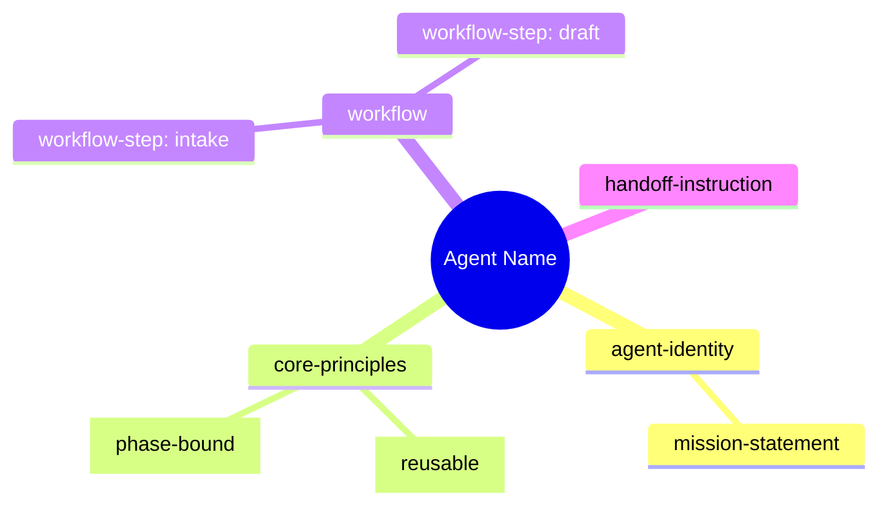
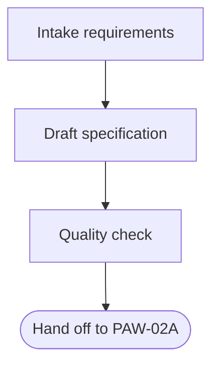
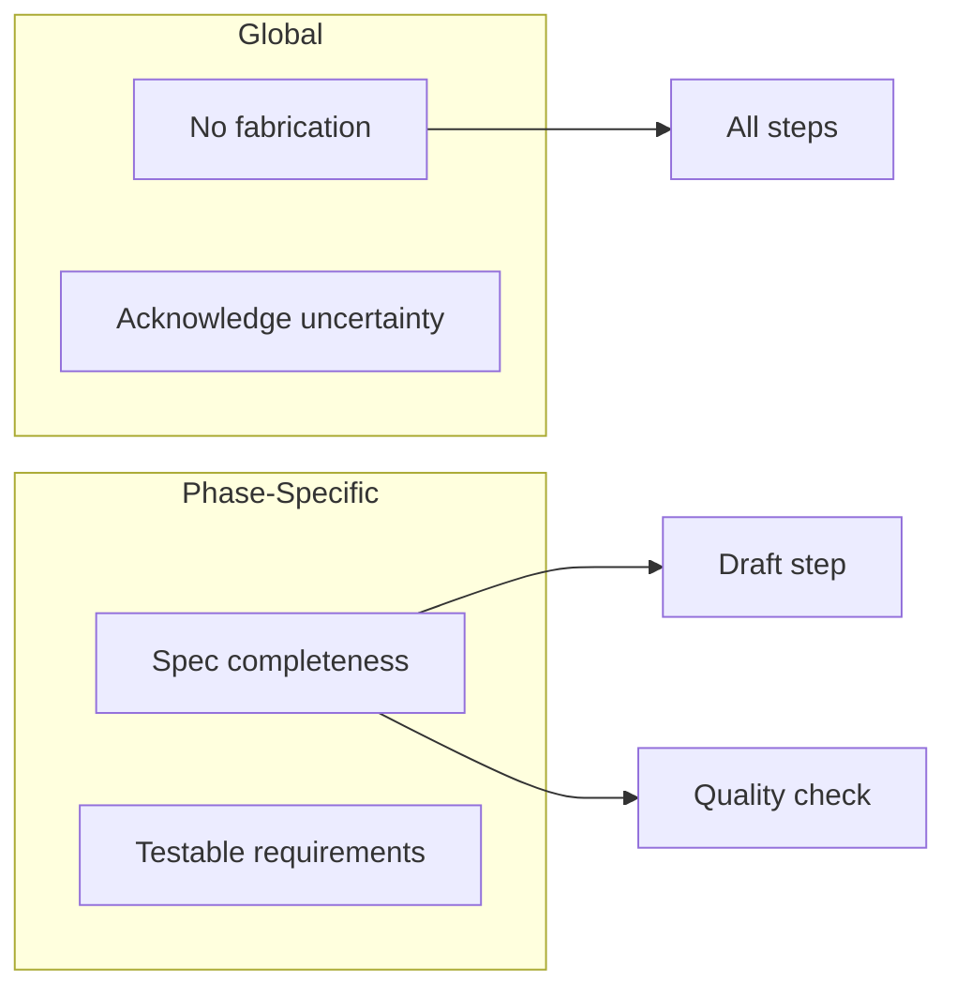

# Agent Prompt Annotation Skill

## Purpose

Annotations create a **comprehension and authoring layer** for agent prompts. They are NOT for runtime composition—they enable:
- **Structural vocabulary**: Named categories for prompt sections
- **Explicit purpose**: Each section declares what it IS
- **Gap detection**: Verify expected structure exists
- **Cross-project comparison**: Compare agents structurally, not just textually
- **Skill extraction**: Identify reusable content vs workflow-bound content

## Core Taxonomy

### Primary Tags

| Tag | Purpose | Example Content |
|-----|---------|-----------------|
| `<agent-identity>` | Who this agent is, one-sentence mission | "You are PAW-01A Specification Agent..." |
| `<core-principles>` | Container for guardrails, decision frameworks | Behavioral constraints section |
| `<guardrail>` | Rule that ALWAYS applies, constrains behavior | "Never include implementation details" |
| `<decision-framework>` | Logic for making choices | "When to skip research vs request it" |
| `<workflow>` | Container for sequenced steps | Main procedure section |
| `<workflow-step>` | One action in a sequence | "Step 3: Draft user stories" |
| `<artifact-format>` | Template/structure for outputs | Specification template, PR format |
| `<quality-gate>` | Criteria for "done" or "good enough" | Acceptance criteria checklist |
| `<handoff-instruction>` | What happens when agent completes | "Hand off to PAW-02A..." |
| `<communication-pattern>` | How to interact with user/other agents | "Use incremental writing pattern" |
| `<example>` | Concrete illustration of a concept | Sample output, good/bad comparison |
| `<classification-logic>` | Decision tree or categorization rules | "If X then Y, else Z" |
| `<context-requirement>` | What the agent needs to function | "Requires research artifact" |

### Nesting Hierarchy

```
<agent-identity>
  <mission-statement>
  
<core-principles>
  <guardrail>
    <example>
  <decision-framework>
    <classification-logic>

<workflow>
  <workflow-step>
    <classification-logic>
    <example>
  <artifact-format>

<quality-gate>

<handoff-instruction>
  <artifact-format>
```

## Scope Classification

**Critical addition**: Mark content as workflow-bound or reusable using the `scope` attribute.

### Two-Axis Model

|  | **Phase-Specific** | **Phase-Agnostic** |
|---|---|---|
| **Workflow-Controlling** | Phase transitions, handoffs, stage gates | Mode selection, error recovery |
| **Capability/Skill** | Phase artifacts (Spec.md format) | General skills (review, summarize) |

### Scope Attribute Values

| Value | Meaning | Example |
|-------|---------|---------|
| `scope="reusable"` | Can be extracted and used in any agent | Deep review pattern, quality checks |
| `scope="phase-bound"` | Tied to this workflow phase | Spec template, handoff to PAW-02A |
| `scope="workflow"` | Controls workflow orchestration | Phase transition logic |
| (omitted) | Default, not yet classified | Most content initially |

### Usage

```markdown
> `<communication-pattern scope="reusable">`

**Deep Review Pattern**: When reviewing complex content, break into passes...

> `</communication-pattern>`
```

```markdown
> `<handoff-instruction scope="phase-bound">`

Hand off to PAW-02A Code Researcher with the specification artifact.

> `</handoff-instruction>`
```

```markdown
> `<guardrail scope="reusable">`

Never fabricate information. If uncertain, say so explicitly.

> `</guardrail>`
```

## Annotation Process

### Step 1: Read and Understand

Before annotating, understand the agent's:
- Mission (what does it do?)
- Key constraints (what must it never do?)
- Main workflow (what steps does it follow?)
- Outputs (what does it produce?)
- Handoffs (where does work go next?)

### Step 2: Apply Tags

Use plain `> ` prefix for all tags (nesting script adds depth markers):

```markdown
> `<guardrail>`

Content here...

> `</guardrail>`
```

### Step 3: Add Scope Attributes

For each annotation, ask:
- **Could this be used in a different workflow phase?** → `scope="reusable"`
- **Is this specific to this phase's outputs or transitions?** → `scope="phase-bound"`
- **Does this control workflow orchestration?** → `scope="workflow"`

If unsure, leave scope unspecified. Classification can be refined later.

### Step 4: Run Nesting Script

```bash
python fix_xml_nesting.py <file.md>
```

### Step 5: Generate Visualizations

Run the visualization script to generate structural views:

```bash
# Print all visualizations to stdout
python generate_viz.py <file.md>

# Write to output directory
python generate_viz.py <file.md> --output viz/

# Generate specific visualization only
python generate_viz.py <file.md> --mindmap   # Mermaid mindmap
python generate_viz.py <file.md> --markmap   # Interactive markmap
python generate_viz.py <file.md> --flow
python generate_viz.py <file.md> --summary
```

**Viewing Markmap output** (interactive with collapsible nodes):
- **VS Code**: Install `markmap.markmap-vscode` extension, open `.mm.md` file
- **CLI**: `npx markmap-cli <file>.mm.md -o <file>.html`
- **Web**: Paste content at https://markmap.js.org/repl

### Step 6: Refine Visualizations (Agent Responsibility)

The script generates **skeletons**. You must refine:

1. **Flow diagram**: Add decision diamonds, label conditional edges
2. **Constraint map**: Generate manually (requires reasoning about guardrail scope)

## Visualization Types

### Mindmap (Script-Generated)

Shows annotation hierarchy as topic decomposition:



**Use for**: "What topics does this agent cover?"

### Flow Skeleton (Script-Generated, Agent-Refined)

Shows workflow steps and handoffs:



**Agent must add**:
- Decision diamonds for branching logic
- Edge labels for conditions
- Parallel paths if applicable

**Use for**: "How do topics sequence into action?"

### Constraint Map (Agent-Generated)

Shows which guardrails apply to which workflow elements:



**Cannot be scripted** — requires understanding which constraints affect which areas.

**Use for**: "What rules constrain this action?"

### Structure Summary (Script-Generated)

YAML output with counts and gap detection:

```yaml
counts:
  guardrails: 5
  workflow_steps: 4
  handoffs: 2
  
scope_breakdown:
  reusable: 3
  phase_bound: 4
  unspecified: 2

potential_gaps:
  - NOTE: No quality gates found
```

**Use for**: Quick structural overview, comparing agents.

## Reading Order for Comprehension

1. **Summary first**: Get counts, spot gaps
2. **Mindmap second**: Understand topic coverage
3. **Flow third**: See how work sequences
4. **Constraint map fourth**: Understand behavioral limits

## Classification Guidance

### What Makes Content Reusable?

- **Communication patterns**: How to write incrementally, how to ask clarifying questions
- **Universal guardrails**: No fabrication, acknowledge uncertainty, stay in scope
- **Quality patterns**: Deep review techniques, self-check procedures
- **General decision frameworks**: When to ask vs proceed, how to handle ambiguity

### What Makes Content Phase-Bound?

- **Artifact templates**: Spec.md format, implementation plan structure, PR template
- **Handoff instructions**: "Hand off to PAW-02A", "Create research prompt for PAW-01B"
- **Phase-specific workflows**: "First check if research exists", "Validate against spec"
- **Role-specific identity**: "You are the Specification Agent"

### What Controls Workflow?

- **Transition logic**: "If research needed, hand off to..."
- **Mode selection**: "In minimal mode, skip X"
- **Stage gates**: "Do not proceed until Y is complete"
- **Workflow orchestration**: "This phase follows Research, precedes Implementation"

## Example: Annotated Section

```markdown
> `<core-principles>`

## Core Principles

>- `<guardrail scope="reusable">`

**User value focus**: Describe WHAT & WHY, never implementation details 
(no tech stack, file paths, library names, code snippets).

>- `</guardrail>`

>- `<guardrail scope="phase-bound">`

**Spec completeness**: Every requirement must be testable. Include 
acceptance criteria for each user story.

>- `</guardrail>`

>- `<decision-framework scope="reusable">`

### When to Ask Clarifying Questions

- Ambiguous requirements → Ask
- Missing context that blocks progress → Ask  
- Stylistic preferences → Make reasonable choice, note it

>- `</decision-framework>`

> `</core-principles>`
```

## Anti-Patterns

### ❌ Over-Annotation
Don't tag every sentence. Tag meaningful sections:
- Bad: 3 tags for a 2-line section
- Good: 1 tag encompassing a coherent concept

### ❌ Forced Classification
Don't force content into a tag that doesn't fit:
- Bad: Labeling prose as `<guardrail>` because it mentions "should"
- Good: Using `<guidance>` or leaving untagged if ambiguous

### ❌ Premature Scope Assignment
Don't guess at scope if you're unsure:
- Bad: `scope="reusable"` on everything that seems general
- Good: Leave scope unspecified, refine after comparing across agents

### ❌ Annotation Without Understanding
Don't annotate mechanically:
- Bad: Tagging based on keywords alone
- Good: Understanding what the section DOES before choosing a tag

## Outputs From Annotations

The visualization script (`generate_viz.py`) produces these outputs automatically:

1. **Mindmap (Mermaid)** (`-mindmap.mmd`): Topic hierarchy from annotation nesting
2. **Markmap by Section** (`-by-section.mm.md`): Interactive mindmap organized by document sections—preserves document structure
3. **Markmap by Tag** (`-by-tag.mm.md`): Interactive mindmap organized by tag type—shows fragmentation with ⚠️ warnings when same tag types appear in multiple sections
4. **Flow Skeleton** (`-flow.mmd`): Workflow steps + handoffs (refine with decisions)
5. **Structure Summary** (`-summary.yaml`): Counts, scope breakdown, fragmentation analysis, section overview, gap warnings

**Markmap** is recommended for navigation—click nodes to collapse/expand branches, zoom and pan.

### Fragmentation Detection

The summary includes a **Fragmentation Analysis** section that identifies when annotations of the same type (e.g., `<guardrail>`) are scattered across multiple document sections. This helps detect:
- **Redundant content**: Similar rules stated in different places
- **Consolidation opportunities**: Related content that could be grouped together
- **Structural issues**: When document organization doesn't align with annotation taxonomy

Example fragmentation warning:
```yaml
fragmented_tags:
  guardrail: # appears in 5 sections
    - "Core Principles & Guardrails" (10x)
    - "Guardrails (Enforced)" (10x)
    - "Error / Edge Handling" (1x)
    - "High-Level Responsibilities" (1x)
    - "Hand-off Checklist" (1x)
```

Agent-generated outputs:

6. **Refined Flow**: Add decision points and conditional edges to skeleton
7. **Constraint Map**: Which guardrails affect which workflow areas (requires reasoning)

## Quick Reference

### Tag Selection Flowchart

```
Is it about WHO the agent is?
  → <agent-identity>

Is it a rule that ALWAYS applies?
  → <guardrail>

Is it logic for making a CHOICE?
  → <decision-framework> or <classification-logic>

Is it a STEP in a sequence?
  → <workflow-step>

Is it a TEMPLATE for output?
  → <artifact-format>

Is it about COMMUNICATION style?
  → <communication-pattern>

Is it a CHECKLIST for completion?
  → <quality-gate>

Is it about WHAT HAPPENS NEXT?
  → <handoff-instruction>

Is it a CONCRETE EXAMPLE?
  → <example>
```

### Scope Selection Flowchart

```
Could ANY agent use this?
  YES → scope="reusable"
  
Is this about THIS PHASE's specific outputs/transitions?
  YES → scope="phase-bound"
  
Does this control WORKFLOW orchestration?
  YES → scope="workflow"
  
Uncertain?
  → Leave scope unspecified
```
