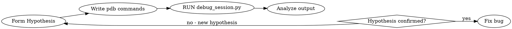

# Python Automated Debugging

## Overview

**Run the debugger. Don't just plan to run it.**

This skill uses `debug_session.py` to run non-interactive pdb sessions. You specify commands upfront, execute, analyze output, then iterate. Works on macOS/Linux only.

## When to Use

- Test has failed 2+ times despite your fixes
- Code looks correct but behaves wrong
- You need to see runtime state, not just read code
- Print statements haven't revealed the issue

## The Cycle



**You MUST actually execute the tool.** Planning what you would run is not debugging.

## Tool Usage

Location: `debug_session.py` in this skill's directory.

```bash
# Basic usage
python debug_session.py <script.py> "cmd1" "cmd2" ... "q"

# Debug a module
python debug_session.py -m <module> "cmd1" "cmd2" "q"

# Save output
python debug_session.py <script.py> "cmd1" "cmd2" "q" --output debug.log
```

**Always end with `q`** to quit cleanly and avoid hanging.

## Example Sessions

**Investigate a caching bug:**
```bash
python debug_session.py test_file.py \
    "b process_item" \
    "c" \
    "p multiplier" \
    "p self.cache" \
    "c" \
    "p multiplier" \
    "p self.cache" \
    "q"
```
Hypothesis: cache isn't updating. Commands compare state across two calls.

**Trace unexpected None return:**
```bash
python debug_session.py buggy.py \
    "b compute_result" \
    "c" \
    "a" \
    "n" \
    "n" \
    "p intermediate" \
    "p result" \
    "w" \
    "q"
```
Hypothesis: intermediate calculation fails. Commands trace through function.

**Debug exception origin:**
```bash
python debug_session.py crash.py \
    "c" \
    "w" \
    "pp locals()" \
    "l" \
    "q"
```
Let it crash, then inspect stack and locals at crash point.

## Iteration Is Expected

Your first debug run rarely gives complete answers. Common pattern:

1. **Run 1**: Set breakpoint, print obvious variables → discover which variable is wrong
2. **Run 2**: Trace where that variable gets set → discover it's cached
3. **Run 3**: Inspect cache behavior across calls → find the bug

Each run narrows the search space. **Don't repeat the same debug session** - each iteration should test a new hypothesis or investigate what you learned from the previous run.

## Common Mistakes

| Mistake | Fix |
|---------|-----|
| Planning commands but not running them | Execute debug_session.py immediately |
| Repeating the same debug session | Each run should test a different hypothesis |
| One massive debug session | Multiple focused sessions, each testing one hypothesis |
| Forgetting `q` at the end | Always end with `q` to avoid hanging |
| Debugging without a hypothesis | State what you expect to find BEFORE running |

## Red Flags - You're Not Actually Debugging

- "I would run..." → Run it now
- "The commands I'd use are..." → Execute them
- "Based on reading the code..." → You need runtime data, not code reading
- Repeating the same session hoping for different results → New hypothesis needed
