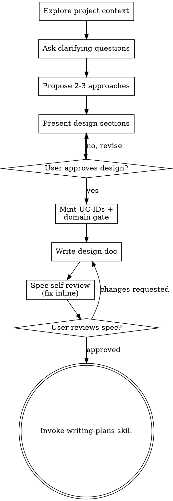

# Brainstorming Ideas Into Designs

Help turn ideas into fully formed designs and specs through natural collaborative dialogue.

Start by understanding the current project context, then ask questions one at a time to refine the idea. Once you understand what you're building, present the design and get user approval.

<HARD-GATE>
Do NOT invoke any implementation skill, write any code, scaffold any project, or take any implementation action until you have presented a design and the user has approved it. This applies to EVERY project regardless of perceived simplicity.
</HARD-GATE>

## Posture: less autonomous, more human decision-gates

`refine` owns the **functional and business-strategy** decisions — what the product does, who it
serves, what it deliberately does not do, how it is positioned. These are the choices that are
expensive to undo once code is built on top of them. This skill is deliberately dialed **toward the
human**: surface every weighty functional or business-strategy fork as an explicit decision-gate and
get approval, rather than deciding it yourself and moving on. When in doubt whether a choice is
weighty enough to gate, gate it — an extra button costs seconds; an unexamined product assumption
costs the epic.

**Every decision-gate goes through the `asking-questions` skill.** Load
`../asking-questions/SKILL.md` and follow it: write the decision as chat prose (question + why it
matters + each option's pro/con + your recommendation) FIRST, then fire the capture. Honor the
injected `question_style` config — under `mobile-two-turn` the prose and the buttons are separate
turns. Do not fire bare buttons with the reasoning hidden.

### What counts as a functional / business decision-gate (surface each one)

Gate — do not silently decide — at each of these forks when it arises:

- **Scope boundary** — what is in v1 vs deliberately deferred/cut. (The single most common place an
  unexamined assumption balloons the epic.)
- **Target user / primary use case** — who this is for and which use case leads, when more than one
  is plausible.
- **Business-strategy / positioning** — pricing posture, build-vs-buy, free-vs-paid surface,
  open-vs-proprietary, anything that commits product direction.
- **Approach selection** — which of the 2-3 proposed approaches to build (Checklist item 4).
- **Data-model / identity commitments with product-visible consequences** — naming that users or
  downstream epics will thread references through, irreversible schema shape.
- **Any trade-off you notice yourself resolving "to keep moving."** That instinct is the signal to
  gate instead.

Batch related forks into one `asking-questions` call (up to 4) rather than deciding them; never
collapse a real trade-off into an assumption just because the design "reads fine."

## Anti-Pattern: "This Is Too Simple To Need A Design"

Every project goes through this process. A todo list, a single-function utility, a config change — all of them. "Simple" projects are where unexamined assumptions cause the most wasted work. The design can be short (a few sentences for truly simple projects), but you MUST present it and get approval.

## Checklist

You MUST create a task for each of these items and complete them in order:

1. **Explore project context** — check files, docs, recent commits
2. **Offer the visual companion just-in-time** — NOT upfront. The first time a question would genuinely be clearer shown than described, offer it then (its own message); on approval its browser tab opens for you. If no visual question ever arises, never offer it. See the Visual Companion section below.
3. **Ask clarifying questions** — one at a time, understand purpose/constraints/success criteria
4. **Scope-boundary gate** — before proposing approaches, surface the in-v1-vs-deferred boundary as an explicit `asking-questions` decision-gate and get approval. Do not assume scope.
5. **Propose 2-3 approaches** — with trade-offs and your recommendation
6. **Approach-selection gate** — present the approaches through `asking-questions` and get the user to pick; do not self-select the approach and proceed.
7. **Present design** — in sections scaled to their complexity, get user approval after each section. At every functional / business-strategy fork inside a section (see the gate list above), stop and run an `asking-questions` decision-gate before writing that section's decision into the design.
8. **Mint use-case IDs + domain-gate** — for each approved *functional* user story, mint an opaque `UC-NNNN` id and gate its domain. See **Use-Case Minting & Domain Gate** below.
9. **Write design doc** — save to `<data_root>/projects/<name>/design/specs/YYYY-MM-DD-<topic>-design.md` (including the `### UC-NNNN` blocks from step 8) and commit
10. **Spec self-review** — quick inline check for placeholders, contradictions, ambiguity, scope (see below)
11. **User reviews written spec** — ask user to review the spec file before proceeding
12. **Transition to implementation** — invoke writing-plans skill to create implementation plan

## Process Flow



**The terminal state is invoking writing-plans.** Do NOT invoke frontend-design, mcp-builder, or any other implementation skill. The ONLY skill you invoke after brainstorming is writing-plans.

## The Process

**Understanding the idea:**

- Check out the current project state first (files, docs, recent commits)
- Before asking detailed questions, assess scope: if the request describes multiple independent subsystems (e.g., "build a platform with chat, file storage, billing, and analytics"), flag this immediately. Don't spend questions refining details of a project that needs to be decomposed first.
- If the project is too large for a single spec, help the user decompose into sub-projects: what are the independent pieces, how do they relate, what order should they be built? Then brainstorm the first sub-project through the normal design flow. Each sub-project gets its own spec → plan → implementation cycle.
- For appropriately-scoped projects, ask questions one at a time to refine the idea
- Prefer multiple choice questions when possible, but open-ended is fine too
- Only one question per message - if a topic needs more exploration, break it into multiple questions
- Focus on understanding: purpose, constraints, success criteria

**Exploring approaches:**

- Propose 2-3 different approaches with trade-offs
- Present options conversationally with your recommendation and reasoning
- Lead with your recommended option and explain why
- **Then gate the selection.** After presenting, run the approach-selection decision-gate via
  `asking-questions` and let the user pick. The recommendation is yours to make; the choice is
  theirs to confirm — do not treat your recommendation as the decision.

**Presenting the design:**

- Once you believe you understand what you're building, present the design
- Scale each section to its complexity: a few sentences if straightforward, up to 200-300 words if nuanced
- Ask after each section whether it looks right so far
- Cover: architecture, components, data flow, error handling, testing
- Be ready to go back and clarify if something doesn't make sense

**Design for isolation and clarity:**

- Break the system into smaller units that each have one clear purpose, communicate through well-defined interfaces, and can be understood and tested independently
- For each unit, you should be able to answer: what does it do, how do you use it, and what does it depend on?
- Can someone understand what a unit does without reading its internals? Can you change the internals without breaking consumers? If not, the boundaries need work.
- Smaller, well-bounded units are also easier for you to work with - you reason better about code you can hold in context at once, and your edits are more reliable when files are focused. When a file grows large, that's often a signal that it's doing too much.

**Working in existing codebases:**

- Explore the current structure before proposing changes. Follow existing patterns.
- Where existing code has problems that affect the work (e.g., a file that's grown too large, unclear boundaries, tangled responsibilities), include targeted improvements as part of the design - the way a good developer improves code they're working in.
- Don't propose unrelated refactoring. Stay focused on what serves the current goal.

## After the Design

**Documentation:**

- Write the validated design (spec) to `<data_root>/projects/<name>/design/specs/YYYY-MM-DD-<topic>-design.md`
  - (User preferences for spec location override this default)
- Use elements-of-style:writing-clearly-and-concisely skill if available
- Commit the design document to git

**Spec Self-Review:**
After writing the spec document, look at it with fresh eyes:

1. **Placeholder scan:** Any "TBD", "TODO", incomplete sections, or vague requirements? Fix them.
2. **Internal consistency:** Do any sections contradict each other? Does the architecture match the feature descriptions?
3. **Scope check:** Is this focused enough for a single implementation plan, or does it need decomposition?
4. **Ambiguity check:** Could any requirement be interpreted two different ways? If so, pick one and make it explicit.

Fix any issues inline. No need to re-review — just fix and move on.

**User Review Gate:**
After the spec review loop passes, ask the user to review the written spec before proceeding:

> "Spec written and committed to `<path>`. Please review it and let me know if you want to make any changes before we start writing out the implementation plan."

Wait for the user's response. If they request changes, make them and re-run the spec review loop. Only proceed once the user approves.

**Implementation:**

- Invoke the writing-plans skill to create a detailed implementation plan
- Do NOT invoke any other skill. writing-plans is the next step.

## Use-Case Minting & Domain Gate (Phase 4 traceability)

`refine` is where a use case is **born** — it mints the opaque `UC-NNNN` id (Hop 1 of the
`epic → use-case → flow-page → code` spine). Solution and everything downstream only *thread* an id
that already exists; they never mint. One id per approved **functional** user story.

**When to mint:** after a functional user story is approved during design (Checklist item 8). A
*functional* story is a "as a <user> I can <do X>" capability the software will expose — not an
engineering task, refactor, or infra chore. If a section produced no new functional story, mint
nothing for it.

### Minting mechanic

The allocator lives in the `_shared` package (already editable-installed) and is collision-free (a
flock over `.counter` + append to `registry.jsonl`). `<project_root>` is
`<data_root>/projects/<name>` — ids live under its `design/use-cases/` subdir, which
`allocate()` joins itself, so the call below correctly passes the project root and not the
bucket.

```
python -c "from agentflow.use_case_id import allocate; from pathlib import Path; \
print(allocate(Path('<data_root>/projects/<name>'), <count>, \
epic_slug='<epic-slug>', titles=['<story title>', ...], date='<YYYY-MM-DD>'))"
```

- `count` = number of functional stories minted in this pass; `titles` must be one-per-id, same order.
- Returns the fresh ids (e.g. `["UC-0148", "UC-0149"]`). Digits are opaque — they carry **no** domain
  meaning; re-parenting a domain later never touches an id.
- The registry is an append-only birth certificate (`{id, minted, epic, title, origin}`) — it stores
  **no** domain or status. Those are mutable and live in the docs (single source of truth).

### The `### UC-NNNN` block (written into the refine design doc)

For each minted id, add a block to the design doc (Checklist item 9). This is Hop 1 of the spine — a
plain `grep UC-0148` must land here:

```markdown
### UC-0148 — <short title>

- **Functional story:** As a <user>, I can <capability>, so that <value>.
- **Domain:** auth/login          <!-- the human-gated path from the domain gate below -->
- **Status:** backlog
```

`Status: backlog` is the birth state; downstream owners (solution/plan pre-ship, autodoc post-ship)
advance it. Do not set anything past `backlog` here.

### Domain gate (human-gated, emergent tree)

Domains are an **emergent, human-owned** nested tree at
`<data_root>/projects/<name>/design/use-cases/domains.md` (a plain nested-bullet markdown file). A UC's
`Domain:` is a path into that tree (e.g. `auth/login`). Never invent or attach a domain silently —
gate it:

1. **Load the whole tree FIRST.** Read the entire `domains.md`. If it does not exist yet, treat the
   tree as empty (this is the first UC for the project) and create it when a node is confirmed.
2. **Propose a parent.** Based on the functional story, pick the best-fit existing node as the
   proposed parent (or "new top-level domain" when nothing fits).
3. **Gate the human via `asking-questions`.** Load `../asking-questions/SKILL.md` and follow it.
   Render, in the prose: the **full current tree**, your **proposed parent**, that parent's
   **existing siblings/children** (so the human sees the neighborhood), and an explicit **"new
   domain"** escape option. Honor the injected `question_style` (two-turn under `mobile-two-turn`).
   Batch multiple UCs' domain decisions into one gate (up to 4) when several minted at once.
4. **On confirm:** write the confirmed path into the block's `Domain:` field, and if the human chose
   a node that does not yet exist, **append the new node** to `domains.md` under its parent.

Because ids are opaque, re-parenting later = edit the `Domain:` string + move the bullet in
`domains.md`; **zero** references churn. This project-scoped domain tree is distinct from the
epic-level `domain:` sidecar that `epic_survey` reads.

## Key Principles

- **One question at a time** - Don't overwhelm with multiple questions
- **Multiple choice preferred** - Easier to answer than open-ended when possible
- **YAGNI ruthlessly** - Remove unnecessary features from all designs
- **Explore alternatives** - Always propose 2-3 approaches before settling
- **Gate the weighty forks** - Every functional / business-strategy decision goes through an `asking-questions` gate for approval; when unsure whether to gate, gate
- **Incremental validation** - Present design, get approval before moving on
- **Be flexible** - Go back and clarify when something doesn't make sense

## Visual Companion

A browser-based companion for showing mockups, diagrams, and visual options during brainstorming. Available as a tool — not a mode. Accepting the companion means it's available for questions that benefit from visual treatment; it does NOT mean every question goes through the browser.

**Offering the companion (just-in-time):** Do NOT offer it upfront. Wait until a question would genuinely be clearer shown than told — a real mockup / layout / diagram question, not merely a UI *topic*. The first time that happens, offer it then, as its own message:
> "This next part might be easier if I show you — I can put together mockups, diagrams, and comparisons in a browser tab as we go. It's still new and can be token-intensive. Want me to? I'll open it for you."

**This offer MUST be its own message.** Only the offer — no clarifying question, summary, or other content. Wait for the user's response. If they accept, start the server with `--open` so their browser opens to the first screen automatically. If they decline, continue text-only and don't offer again unless they raise it.

**Per-question decision:** Even after the user accepts, decide FOR EACH QUESTION whether to use the browser or the terminal. The test: **would the user understand this better by seeing it than reading it?**

- **Use the browser** for content that IS visual — mockups, wireframes, layout comparisons, architecture diagrams, side-by-side visual designs
- **Use the terminal** for content that is text — requirements questions, conceptual choices, tradeoff lists, A/B/C/D text options, scope decisions

A question about a UI topic is not automatically a visual question. "What does personality mean in this context?" is a conceptual question — use the terminal. "Which wizard layout works better?" is a visual question — use the browser.

If they agree to the companion, read the detailed guide before proceeding:
`../_vendored/brainstorming/visual-companion.md` (relative to this skill; its `scripts/` live beside it)
