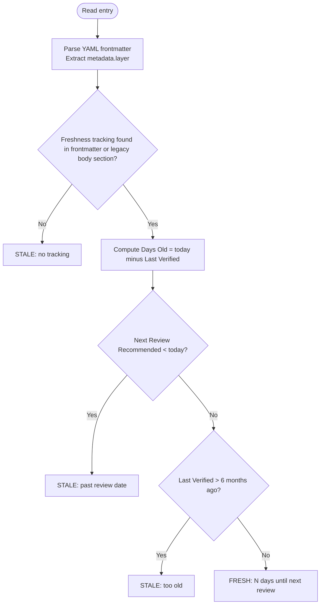

<scope_args>$ARGUMENTS</scope_args>

# Refresh Research

Orchestrate parallel research-curator agents to bulk-refresh research entries in `./research/`. Detects staleness, skips fresh entries, updates only what qualifies. Safe to run repeatedly.

## Arguments

`<scope_args/>` controls scope:

- `--all` — Refresh every entry regardless of staleness
- `--stale` (default) — Refresh entries past their review date
- `--category <name>` — Refresh all entries in one category (e.g., `--category agent-frameworks`)
- `--layer <0|1|2>` — Refresh entries whose frontmatter carries a matching `metadata.layer` (0=process, 1=language, 2=stack). The current entry template stores no layer field, so this matches only entries that carry one. See [plugins/development-harness/docs/sdlc-layers/](../../../plugins/development-harness/docs/sdlc-layers/).
- `--dry-run` — Report what would be refreshed; do not spawn agents

## Workflow

### Step 1: Inventory and Staleness Detection

Glob `./research/**/*.md` (exclude README.md). For each entry, parse:

1. **YAML frontmatter** — extract `metadata.layer` value (string `"0"`, `"1"`, or `"2"`; `null` if absent).
2. **Freshness tracking** — extract Last Verified and Next Review dates from the frontmatter `freshness_tracking` mapping (`last_verified`, `next_review`); when absent, from a body `Freshness Tracking` section (legacy entries).



Build inventory table:
`| File | Category | Layer | Last Verified | Next Review | Days Old | Stale? |`

The `Days Old` column holds an integer: today's date minus the Last Verified date in days.
If Last Verified is absent or unparseable, render as `—`.

The `Layer` column holds the `metadata.layer` value or `—` if absent.

### Step 2: Apply Scope Filter

Apply filters sequentially. Filters combine with AND logic — each filter narrows the set from the previous step.

1. **Base set**: Start with all inventoried entries.
2. **Staleness filter** (default unless `--all`):
   - `--all` — keep all entries (no staleness filter)
   - `--stale` (default) — keep only entries marked STALE in Step 1
3. **Category filter** (optional): `--category <name>` — keep only entries whose category directory matches `<name>`.
4. **Layer filter** (optional): `--layer <0|1|2>` — keep only entries where `metadata.layer` equals the requested value. Entries without `layer` metadata (`—` in inventory) are excluded.
5. **Dry-run check**: `--dry-run` — display the filtered target list and stop without spawning agents.

If zero entries remain after all filters: report "No entries match the applied filters." and stop. When `--layer` was specified and zero entries match, additionally report: "No entries found for layer {N}. Only entries carrying `metadata.layer` in their YAML frontmatter can be targeted by `--layer`."

When the `--stale` filter excludes entries because they are FRESH, list each excluded entry
before continuing to Step 3:

```text
Skipped (fresh):
  ./research/{category}/{name}.md — N days until next review (last: YYYY-MM-DD, vX.Y.Z)
  ./research/{category}/{name}.md — N days until next review (last: YYYY-MM-DD, vX.Y.Z)
```

This listing appears regardless of whether `--dry-run` is active. Under `--all` (no staleness
filter), no entries are excluded by staleness, so this block does not appear.

### Step 3: RT-ICA Pre-Flight

```text
RT-ICA: Research Refresh
Goal: Refresh {N} research entries with current data from primary sources
Conditions:
1. mcp__Ref and mcp__exa available in session  (primary data gathering)
2. gh CLI authenticated                         (GitHub repo metadata)
3. Outbound network access                      (fetch fresh data)
4. ./research/ writable                         (update entry files)
5. Entry files parseable markdown               (determine what changed)
Decision: {APPROVED | BLOCKED}
```

If BLOCKED: report missing tools/access, suggest workarounds, stop.

### Step 4: Baseline, Then Spawn Curators in Waves

Activate `/research-curator` before spawning any curator and capture its Mode Routing baseline (the status snapshot of `./research/` and a hash per target) while no write has happened yet. Then route the refresh through its Rerun Mode: split the targets into sequential waves of 5, spawn one `@research-curator` per entry with `--rerun ./research/{category}/{name}.md` in parallel within a wave, and wait for each wave before the next. Apply the curator's [Failure Recovery](../research-curator/references/batch-mode.md#failure-recovery) to every failed, timed-out, or unchanged agent result before it enters Step 5.

After each wave, log results:

```text
Wave {N} complete: {M}/{total} succeeded
  updated -- ./research/agent-frameworks/agno.md (v0.3->v0.5)
  failed  -- ./research/developer-tools/orbstack.md -- error: [reason]
```

Outcome categories: **Updated** (content changed) and **Failed** (agent could not complete, or left the target unchanged, which the curator treats as a failed refresh).

### Step 5: Validate, Review, README, Commit

After all waves complete, follow the curator's Rerun Mode from the Validation Gate onward over the updated entries, then its Post-Actions. Entry Review, cross-referencing, README rows and the commit rules are the curator's and are not restated here. No Overlap Scan runs on refresh.

### Step 6: Summary Report

```markdown
# Research Refresh Report

**Date**: {YYYY-MM-DD}
**Scope**: {--all | --stale | --category X | --layer N}
**Total scanned**: {N} | **Targeted**: {M} | **Skipped (fresh)**: {K} ({min}–{max} days until next review)

## Results

| Outcome | Count | Notes |
|---------|-------|-------|
| Updated | {N} | |
| Failed | {N} | |
| Skipped (fresh) | {K} | {min}–{max} days until next review |

When K = 0, omit the Skipped (fresh) row. When K = 1, Notes column: `{N} days until next review`.
When K = 0 in the header: `**Skipped (fresh)**: 0`. When K = 1: `**Skipped (fresh)**: 1 ({N} days until next review)`.

## Updates

| Entry | Category | Change Summary |
|-------|----------|----------------|
| {name} | {category} | {version bump, snapshot change} |

## Failures

| Entry | Error |
|-------|-------|
| {name} | {reason} |

## Curator Output

Append the curator's [Rerun Mode Output](../research-curator/SKILL.md#rerun-mode-output) verbatim: Entry Review verdicts, with-issues counts, and Cross-References Added.

## Next Actions

- Due for review in 30 days: {list}
- Categories with no recent updates: {list}
- Failed entries to retry: {list}
```

## Error Handling

- **No entries match filter** — report "All entries are fresh. Nothing to refresh." and stop
- **No entries match `--layer` filter** — report "No entries found for layer {N}. Only entries carrying `metadata.layer` in their YAML frontmatter can be targeted by `--layer`." and stop
- **Agent failures, timeouts, unchanged targets, shared-cause outages** — follow the curator's [Failure Recovery](../research-curator/references/batch-mode.md#failure-recovery); include remaining failures in the summary Failures table

## Related

- `/research-curator` — single-entry and batch research operations; this skill wraps it with staleness detection and RT-ICA
- `@research-curator` agent — `.claude/agents/research-curator.md` — executes individual entry reruns
