# Root Cause Analysis

Systematic problem solving using Fishbone (Ishikawa) diagrams and 5 Whys technique. Identifies true root causes and recommends effective corrective actions.

## What is Root Cause Analysis?

**Root Cause Analysis (RCA)** is a structured approach to identify the fundamental cause(s) of problems, rather than addressing symptoms. Effective RCA prevents problem recurrence.

| Approach | Focus | Best For |
|----------|-------|----------|
| **Fishbone (Ishikawa)** | Brainstorming all potential causes by category | Complex problems with multiple potential causes |
| **5 Whys** | Drilling down through cause chains | Problems with linear cause-effect relationships |
| **Combined** | Fishbone to identify, 5 Whys to drill down | Comprehensive root cause identification |

## Framework 1: Fishbone (Ishikawa) Diagram

### What is a Fishbone Diagram?

A **Fishbone diagram** (also called Ishikawa or cause-and-effect diagram) organizes potential causes into categories, resembling a fish skeleton with the problem as the "head."

```text
        ┌─────────────────────────────────────────────────────────┐
        │                                                         │
  Man ──┼──┐                                         ┌──┼── Method
        │  │                                         │  │
        │  └─────────────────────┐   ┌───────────────┘  │
        │                        │   │                  │
        │                        ▼   ▼                  │
        │                    ┌─────────┐                │
        │                    │ PROBLEM │                │
        │                    └─────────┘                │
        │                        ▲   ▲                  │
        │  ┌─────────────────────┘   └───────────────┐  │
        │  │                                         │  │
Machine ┼──┘                                         └──┼── Material
        │                                               │
        │                                               │
Measurement ────────────────────────────────────────────── Mother Nature
        │                                               │
        └───────────────────────────────────────────────┘
```

### The 6M Categories

| Category | Also Called | Example Causes |
|----------|-------------|----------------|
| **Man** | People, Personnel | Training, skills, fatigue, communication |
| **Machine** | Equipment, Technology | Hardware, software, tools, maintenance |
| **Method** | Process, Procedure | Workflow, documentation, standards |
| **Material** | Inputs, Data | Raw materials, components, information quality |
| **Measurement** | Metrics, Inspection | Calibration, accuracy, data collection |
| **Mother Nature** | Environment | Temperature, humidity, regulations, market |

### Alternative Category Sets

| Domain | Categories |
|--------|------------|
| **Manufacturing (6M)** | Man, Machine, Method, Material, Measurement, Mother Nature |
| **Service (8P)** | Product, Price, Place, Promotion, People, Process, Physical Evidence, Productivity |
| **Software (5S)** | Systems, Skills, Suppliers, Surroundings, Safety |
| **Custom** | Define categories relevant to your domain |

### Fishbone Workflow

#### Step 1: Define the Problem

```markdown
## Problem Statement

**Problem:** [Clear, specific, measurable description]
**Impact:** [Quantified impact - cost, time, quality, safety]
**When Discovered:** [Date/time]
**Where:** [Location, system, process]
**Frequency:** [One-time / Recurring / Intermittent]
```

**Good problem statements:**

- ✅ "Customer orders delayed by 3+ days increased 40% in Q4"
- ✅ "Production line 3 defect rate rose from 2% to 8% in November"
- ❌ "Things are slow" (too vague)
- ❌ "The system is broken" (not measurable)

#### Step 2: Assemble the Team

Include people with direct knowledge:

| Role | Contribution |
|------|--------------|
| **Process Owner** | Overall accountability |
| **Front-line Workers** | Direct observation and experience |
| **Subject Matter Experts** | Technical knowledge |
| **Customer Representative** | Impact perspective |
| **Facilitator** | Guide the process |

#### Step 3: Brainstorm Causes by Category

For each category, ask: "What in this category could cause the problem?"

```markdown
## Cause Brainstorming

### Man (People)
| Potential Cause | Evidence | Likelihood |
|-----------------|----------|------------|
| Insufficient training | New hires 60% of errors | High |
| Fatigue (overtime hours) | Errors peak after 8 hours | Medium |
| Communication gaps | Handoff errors documented | High |

### Machine (Equipment)
| Potential Cause | Evidence | Likelihood |
|-----------------|----------|------------|
| Aging equipment | Machine 7 has 40% of failures | High |
| Software bugs | Version 2.1 introduced defects | Medium |

### Method (Process)
| Potential Cause | Evidence | Likelihood |
|-----------------|----------|------------|
| Unclear procedures | 3 different approaches observed | High |
| Missing quality check | No verification step documented | High |

### Material (Inputs)
| Potential Cause | Evidence | Likelihood |
|-----------------|----------|------------|
| Supplier quality issues | Incoming defect rate up 15% | Medium |
| Specification ambiguity | Multiple interpretations possible | Low |

### Measurement (Metrics)
| Potential Cause | Evidence | Likelihood |
|-----------------|----------|------------|
| Inaccurate sensors | Calibration overdue | Medium |
| Wrong metrics tracked | Leading indicators missing | Low |

### Mother Nature (Environment)
| Potential Cause | Evidence | Likelihood |
|-----------------|----------|------------|
| Seasonal demand spike | Q4 always highest volume | High |
| Regulatory changes | New requirements in October | Low |
```

#### Step 4: Identify Most Likely Root Causes

Prioritize based on:

| Criterion | Question |
|-----------|----------|
| **Evidence** | Is there data supporting this cause? |
| **Frequency** | Does this cause relate to problem frequency? |
| **Correlation** | Does the cause timing match problem timing? |
| **Control** | Can we test or eliminate this cause? |

#### Step 5: Validate Root Causes

For each high-likelihood cause:

```markdown
## Root Cause Validation

| Cause | Validation Method | Result | Confirmed? |
|-------|-------------------|--------|------------|
| Insufficient training | Compare error rates by tenure | New hires 3x error rate | ✅ Yes |
| Aging equipment | Analyze failures by machine | Machine 7: 40% of all failures | ✅ Yes |
| Unclear procedures | Review documentation | 3 conflicting SOPs found | ✅ Yes |
```

### Fishbone Output Format

```markdown
## Fishbone Analysis: [Problem]

**Date:** [ISO date]
**Facilitator:** rca-analyst
**Team:** [Participants]

### Problem Statement
[Clear, specific, measurable problem]

### Impact
[Quantified business impact]

### Cause Analysis

#### Man (People)
- [Cause 1] - Evidence: [X] - Status: Confirmed/Suspected
- [Cause 2] - Evidence: [X] - Status: Confirmed/Suspected

#### Machine (Equipment)
- [Cause 1] - Evidence: [X] - Status: Confirmed/Suspected

#### Method (Process)
- [Cause 1] - Evidence: [X] - Status: Confirmed/Suspected

#### Material (Inputs)
- [Cause 1] - Evidence: [X] - Status: Confirmed/Suspected

#### Measurement (Metrics)
- [Cause 1] - Evidence: [X] - Status: Confirmed/Suspected

#### Mother Nature (Environment)
- [Cause 1] - Evidence: [X] - Status: Confirmed/Suspected

### Confirmed Root Causes
| # | Root Cause | Category | Evidence | Contribution |
|---|------------|----------|----------|--------------|
| 1 | [Description] | [6M] | [Data] | [% of problem] |

### Recommended Actions
| # | Action | Addresses | Owner | Due Date |
|---|--------|-----------|-------|----------|
| 1 | [Corrective action] | Root Cause #1 | [Name] | [Date] |
```

### Fishbone Mermaid Diagram

```mermaid
flowchart LR
    subgraph Man["👤 Man"]
        M1[Training gaps]
        M2[Communication issues]
    end

    subgraph Machine["⚙️ Machine"]
        MA1[Aging equipment]
        MA2[Software bugs]
    end

    subgraph Method["📋 Method"]
        ME1[Unclear procedures]
        ME2[Missing QC step]
    end

    subgraph Material["📦 Material"]
        MT1[Supplier quality]
        MT2[Specification issues]
    end

    subgraph Measurement["📊 Measurement"]
        MS1[Sensor accuracy]
        MS2[Wrong metrics]
    end

    subgraph Environment["🌍 Environment"]
        E1[Seasonal demand]
        E2[Regulatory changes]
    end

    M1 & M2 --> Problem
    MA1 & MA2 --> Problem
    ME1 & ME2 --> Problem
    MT1 & MT2 --> Problem
    MS1 & MS2 --> Problem
    E1 & E2 --> Problem

    Problem[❌ PROBLEM:<br/>Customer delays<br/>increased 40%]

    style Problem fill:#f99,stroke:#900
```



## Framework 2: 5 Whys

### What is 5 Whys?

**5 Whys** is an iterative interrogative technique that drills down from symptoms to root causes by repeatedly asking "Why?" (typically 5 times, but may be fewer or more).

**Key Principle:** Each answer becomes the subject of the next "Why?"

### 5 Whys Workflow

#### Step 1: State the Problem

```markdown
## 5 Whys Analysis

**Problem:** [Specific problem statement]
**Date:** [ISO date]
**Analyst:** 5whys-analyst
```

#### Step 2: Ask Why Iteratively

```markdown
### Why Chain

**Problem:** The website crashed during the product launch.

**Why 1:** Why did the website crash?
→ The server ran out of memory.

**Why 2:** Why did the server run out of memory?
→ The application had a memory leak.

**Why 3:** Why did the application have a memory leak?
→ The new feature wasn't properly tested under load.

**Why 4:** Why wasn't the new feature tested under load?
→ We don't have load testing in our CI/CD pipeline.

**Why 5:** Why don't we have load testing in CI/CD?
→ It was never prioritized when the pipeline was set up.

**Root Cause:** Load testing was not included in CI/CD pipeline during initial setup.
```

#### Step 3: Validate the Root Cause

| Validation Check | Question | Pass? |
|------------------|----------|-------|
| **Specific** | Is the root cause specific and actionable? | ☐ |
| **Systemic** | Does addressing this prevent recurrence? | ☐ |
| **Controllable** | Can we actually fix this? | ☐ |
| **Chain Valid** | Does each why-answer logically lead to the next? | ☐ |

### 5 Whys Best Practices

| Do | Don't |
|----|-------|
| ✅ Focus on process/system causes | ❌ Blame individuals |
| ✅ Base answers on facts and evidence | ❌ Speculate without data |
| ✅ Keep asking until actionable root found | ❌ Stop at symptoms |
| ✅ Document the chain for future reference | ❌ Accept "human error" as root cause |
| ✅ Consider multiple parallel chains | ❌ Assume single root cause |

### Multiple 5 Why Chains

Complex problems often have multiple contributing causes. Run parallel 5 Whys chains:

```markdown
## Multiple Why Chains

**Problem:** Customer complaints increased 50%

### Chain A: Response Time
Why 1: Response time increased → Support queue grew
Why 2: Queue grew → Fewer agents available
Why 3: Fewer agents → High turnover
Why 4: High turnover → Poor working conditions
Why 5: Poor conditions → No ergonomic equipment
**Root Cause A:** Lack of investment in workplace ergonomics

### Chain B: First-Contact Resolution
Why 1: FCR dropped → Agents lack knowledge
Why 2: Lack knowledge → Training inadequate
Why 3: Training inadequate → Product changes not communicated
Why 4: Not communicated → No process for training updates
**Root Cause B:** Missing process for training on product changes

### Chain C: (Additional chains as needed)
```

### 5 Whys Output Format

```markdown
## 5 Whys Analysis: [Problem]

**Date:** [ISO date]
**Analyst:** 5whys-analyst
**Problem:** [Statement]

### Why Chain

| Level | Question | Answer | Evidence |
|-------|----------|--------|----------|
| Why 1 | Why [problem]? | [Answer] | [Data] |
| Why 2 | Why [answer 1]? | [Answer] | [Data] |
| Why 3 | Why [answer 2]? | [Answer] | [Data] |
| Why 4 | Why [answer 3]? | [Answer] | [Data] |
| Why 5 | Why [answer 4]? | [Answer] | [Data] |

### Root Cause
[Final root cause statement]

### Validation
- [ ] Specific and actionable
- [ ] Systemic (prevents recurrence)
- [ ] Within our control
- [ ] Each step logically connected

### Corrective Action
| Action | Owner | Due | Status |
|--------|-------|-----|--------|
| [Action to address root cause] | [Name] | [Date] | Open |
```

### 5 Whys Mermaid Diagram

```mermaid
flowchart TD
    P[❌ Problem:<br/>Website crashed<br/>during launch]
    W1[Why 1: Server ran<br/>out of memory]
    W2[Why 2: Application<br/>had memory leak]
    W3[Why 3: New feature<br/>not load tested]
    W4[Why 4: No load testing<br/>in CI/CD pipeline]
    W5[Why 5: Load testing<br/>not prioritized initially]
    RC[🎯 Root Cause:<br/>Missing load testing<br/>in CI/CD setup]

    P --> W1
    W1 --> W2
    W2 --> W3
    W3 --> W4
    W4 --> W5
    W5 --> RC

    style P fill:#f99,stroke:#900
    style RC fill:#9f9,stroke:#090
```



## Combined Approach

For comprehensive analysis, combine both techniques:

1. **Fishbone** to brainstorm all potential causes across categories
2. **5 Whys** to drill down on each high-likelihood cause
3. **Validate** multiple root causes found
4. **Prioritize** corrective actions

```markdown
## Combined RCA: [Problem]

### Phase 1: Fishbone Brainstorming
[Identify all potential causes by category]

### Phase 2: 5 Whys Drill-Down
For each high-likelihood cause from fishbone:

#### Cause A: [From fishbone]
[5 Whys chain]
Root Cause A: [Result]

#### Cause B: [From fishbone]
[5 Whys chain]
Root Cause B: [Result]

### Phase 3: Root Cause Summary
| # | Root Cause | Source | Validated? | Priority |
|---|------------|--------|------------|----------|
| 1 | [RC-A] | Fishbone + 5 Whys | Yes | High |
| 2 | [RC-B] | Fishbone + 5 Whys | Yes | Medium |

### Phase 4: Corrective Action Plan
[CAPA based on validated root causes]
```

## Corrective Action Planning (CAPA)

### Action Types

| Type | Purpose | Example |
|------|---------|---------|
| **Immediate/Containment** | Stop the bleeding | Disable faulty feature |
| **Corrective** | Fix the specific occurrence | Patch the bug |
| **Preventive** | Prevent recurrence | Add automated testing |
| **Systemic** | Address organizational factors | Update training program |

### CAPA Template

```markdown
## Corrective Action Plan

**Problem:** [Reference to RCA]
**Root Causes:** [List confirmed root causes]

### Actions

| # | Action | Type | Root Cause | Owner | Due | Status |
|---|--------|------|------------|-------|-----|--------|
| 1 | [Description] | Corrective | RC-1 | [Name] | [Date] | Open |
| 2 | [Description] | Preventive | RC-1 | [Name] | [Date] | Open |
| 3 | [Description] | Systemic | RC-2 | [Name] | [Date] | Open |

### Verification
| Action | Verification Method | Criteria | Result |
|--------|---------------------|----------|--------|
| 1 | [How to verify] | [Success criteria] | Pending |

### Follow-up
- **Review Date:** [Date]
- **Responsible:** [Name]
- **Metrics to Monitor:** [KPIs]
```

## Structured Data (YAML)

```yaml
root_cause_analysis:
  version: "1.0"
  date: "2025-01-15"
  analyst: "rca-analyst"

  problem:
    statement: "Customer order delays increased 40% in Q4"
    impact: "$500K in refunds, 15% churn increase"
    discovered: "2025-01-10"
    frequency: recurring

  fishbone:
    categories:
      man:
        - cause: "Insufficient training"
          evidence: "New hires 3x error rate"
          likelihood: high
          confirmed: true
      machine:
        - cause: "Aging equipment on Line 3"
          evidence: "40% of failures from Machine 7"
          likelihood: high
          confirmed: true
      method:
        - cause: "Unclear procedures"
          evidence: "3 conflicting SOPs"
          likelihood: high
          confirmed: true
      material: []
      measurement: []
      environment:
        - cause: "Q4 demand spike"
          evidence: "Volume up 60%"
          likelihood: high
          confirmed: true

  five_whys:
    - chain_name: "Training Gap"
      problem: "High error rate in new hires"
      whys:
        - question: "Why high error rate?"
          answer: "Insufficient training"
        - question: "Why insufficient training?"
          answer: "Training program not updated"
        - question: "Why not updated?"
          answer: "No owner assigned"
        - question: "Why no owner?"
          answer: "Process not established"
      root_cause: "No process for maintaining training program"

  root_causes:
    - id: "RC-1"
      description: "No process for training program maintenance"
      source: "Fishbone + 5 Whys"
      validated: true
      contribution: 40

  capa:
    - action: "Assign training program owner"
      type: corrective
      root_cause: "RC-1"
      owner: "HR Director"
      due_date: "2025-02-01"
      status: open
```

## When to Use RCA

| Scenario | Use RCA? | Approach |
|----------|----------|----------|
| Major incident | Yes | Full Fishbone + 5 Whys |
| Recurring defect | Yes | Focused 5 Whys |
| Customer complaint pattern | Yes | Combined approach |
| Minor one-time issue | Maybe | Quick 5 Whys |
| Proactive improvement | Partial | Fishbone for ideation |

## Integration

### Upstream

- **Incident reports** - Trigger for RCA
- **Quality metrics** - Identify problems
- **stakeholder-analysis** - Identify team members

### Downstream

- **Process improvement** - Implement corrective actions
- **Training programs** - Address people-related causes
- **value-stream-mapping** - Eliminate systemic waste

## Related Skills

- `decision-analysis` - Evaluate corrective action options
- `risk-analysis` - Assess risk of root causes
- `value-stream-mapping` - Process improvement
- `stakeholder-analysis` - Identify RCA participants

## Version History

- **v1.0.0** (2025-12-26): Initial release
