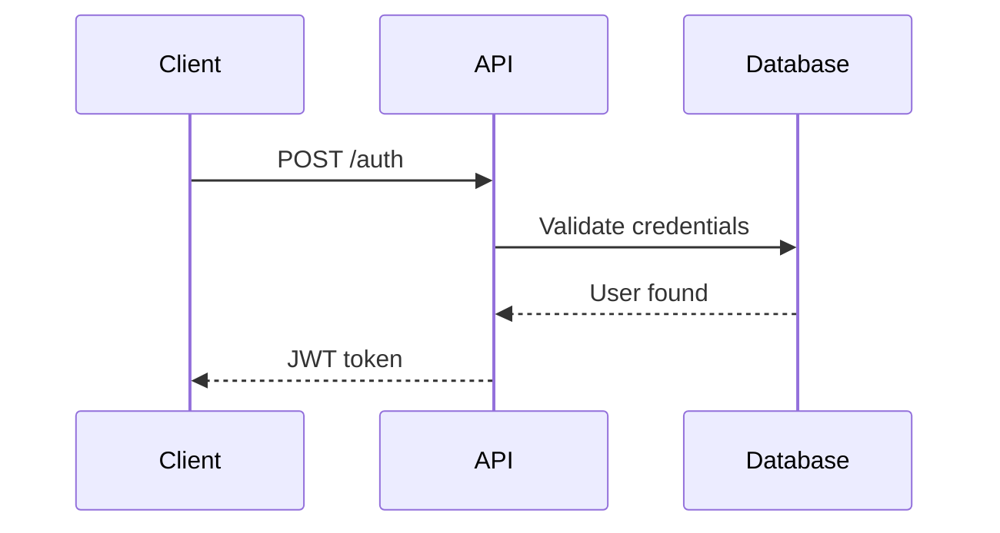

# Sequence Diagram Patterns

> **STUB: This skill is not yet implemented**
>
> This placeholder preserves the documented plugin structure.
> See parent plugin README for planned capabilities.

## Planned Capabilities

- Authentication/authorization flows
- API request/response sequences
- Microservice communication patterns
- Error handling and retry sequences
- Async message queue patterns
- Database transaction flows

## Example Pattern

## Implementation Status

- [ ] Core implementation
- [ ] References documentation
- [ ] Output templates
- [ ] Integration tests
