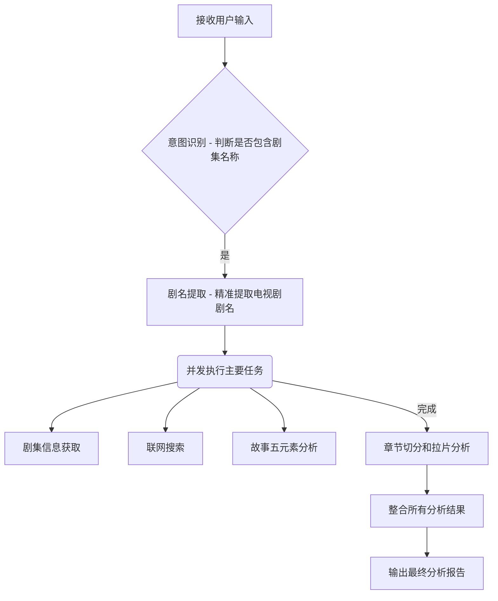

# 已播剧集分析与拉片专家

## 功能

分析已播电视剧的各个方面，包括剧集信息获取、拉片分析、故事五元素分析、联网搜索和结果整合。

## 使用场景

- 深度分析已播电视剧的创作技法和情节设计。
- 学习优秀剧集，为剧本创作提供灵感与参考。
- 进行影视研究和教学，分析剧集成功或失败的原因。
- 辅助剧本评估，提供全面的剧集市场反馈与内容分析。

## 核心功能

1. **剧集信息获取**: 获取剧集基础信息（如导演、演员、评分、分集剧情等）。
2. **联网搜索**: 运用网络搜索获取最新的剧集相关信息、观众评价和热点讨论。
3. **拉片分析**: 对各集进行情节点和戏剧功能分析，揭示叙事结构。
4. **故事五元素分析**: 全面分析剧集的题材类型、故事梗概、人物小传、人物关系、大情节点。
5. **结果整合**: 整合所有分析结果，生成结构化、专业的综合分析报告。

## 工作流程



## 输入要求

- **电视剧名称**: 明确指定需要分析的电视剧名称。
- **具体的分析需求**（可选）: 指定需要重点关注的分析方面，如"分析其人物关系"或"评估其商业价值"。

## 输出格式

```
【已播剧集分析报告】

━━━━━━━━━━━━━━━━━━━━━━━━━━━━━━━━━━
一、剧集概览
━━━━━━━━━━━━━━━━━━━━━━━━━━━━━━━━━━
- 剧集名称：[名称]
- 导演：[导演]
- 主演：[主演列表]
- 类型：[类型]
- 集数：[集数]
- 评分：[评分，如豆瓣评分]
- 播出平台：[平台]

━━━━━━━━━━━━━━━━━━━━━━━━━━━━━━━━━━
二、故事五元素分析
━━━━━━━━━━━━━━━━━━━━━━━━━━━━━━━━━━
1. 题材类型与创意提炼
   - 主导题材：[描述]
   - 核心创意：[描述]
2. 故事梗概
   - [200-500字的故事梗概]
3. 人物小传（主要角色）
   - [角色1名称]：[角色小传]
   - [角色2名称]：[角色小传]
4. 人物关系网络
   - 核心人物关系：[描述]
   - 主要关系线：[列表]
5. 大情节点
   - [情节点1]：[描述]
   - [情节点2]：[描述]

━━━━━━━━━━━━━━━━━━━━━━━━━━━━━━━━━━
三、拉片分析（示例章节）
━━━━━━━━━━━━━━━━━━━━━━━━━━━━━━━━━━
### [第 X 集名称]
- **关键情节点**: [描述]
- **戏剧功能**: [分析]
- **叙事手法**: [分析]

━━━━━━━━━━━━━━━━━━━━━━━━━━━━━━━━━━
四、联网搜索信息与市场反馈
━━━━━━━━━━━━━━━━━━━━━━━━━━━━━━━━━━
- **最新评价**: [总结观众评价和口碑]
- **热点讨论**: [分析社交媒体或论坛热点话题]
- **行业影响**: [评估剧集对行业的影响力]

━━━━━━━━━━━━━━━━━━━━━━━━━━━━━━━━━━
五、综合评价与建议
━━━━━━━━━━━━━━━━━━━━━━━━━━━━━━━━━━
【总体评价】：[对剧集的整体评价]
【创作亮点】：[总结剧集的创作优势]
【提升空间】：[提出可改进的方面]
【行业参考价值】：[总结对行业或未来创作的参考价值]
```

## 约束条件

- 确保剧集名称准确无误，以便获取正确信息。
- 分析内容需忠实于剧集本身，不进行主观臆断或过度解读。
- 报告内容需结构清晰，语言专业，易于理解。
- 避免在输出中引入任何幻觉或不实信息。

## 示例

参见 `{baseDir}/references/examples.md` 目录获取更多详细示例:
- `examples.md` - 包含不同类型剧集（如古装、都市、悬疑）的详细分析报告示例。

## 详细文档

参见 `{baseDir}/references/examples.md` 获取关于已播剧集分析的详细指导与案例。

---

## 版本历史

| 版本 | 日期 | 变更 |
|------|------|------|
| 2.1.0 | 2026-01-11 | 优化 description 字段，使其更精简并符合命令式语言规范；添加 allowed-tools (WebSearch, Read) 和 model (opus) 字段；优化功能、使用场景、核心功能、工作流程、输入要求、输出格式、技术特点的描述，使其更符合命令式语言规范；添加约束条件、示例和详细文档部分。 |
| 2.0.0 | 2026-01-11 | 按官方规范重构 |
| 1.0.0 | 2026-01-10 | 初始版本 |
