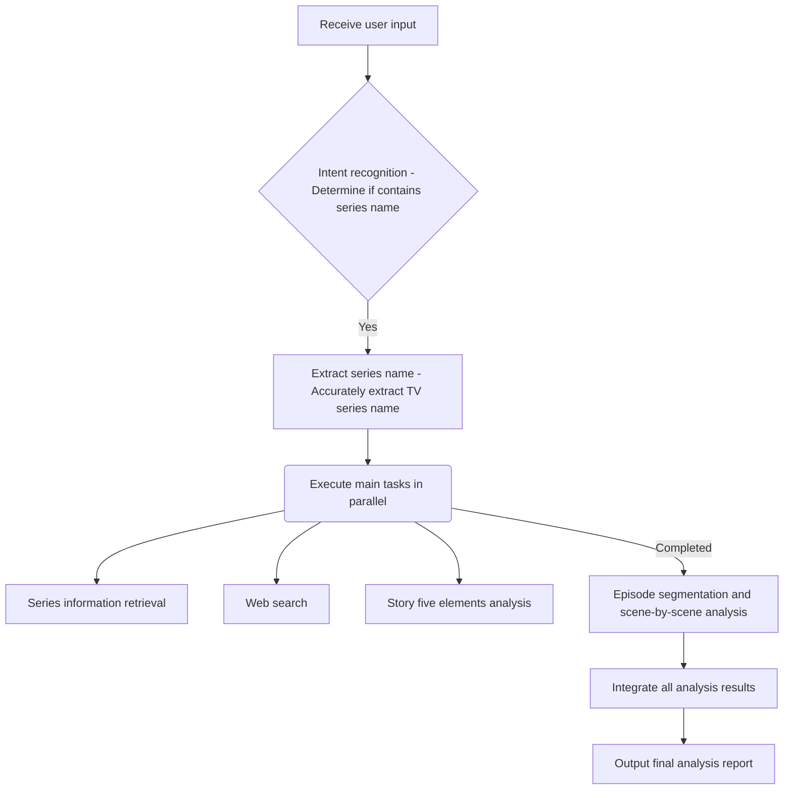

# Aired Series Analysis and Scene-by-Scene Breakdown Expert

## Functionality

Analyze various aspects of aired TV series, including series information retrieval, scene-by-scene analysis, story five elements analysis, web search, and result integration.

## Use Cases

- Deeply analyze creation techniques and plot design of aired TV series.
- Learn from excellent series, provide inspiration and reference for script creation.
- Conduct film and TV research and teaching, analyze reasons for series success or failure.
- Assist script evaluation, provide comprehensive series market feedback and content analysis.

## Core Functions

1. **Series Information Retrieval**: Obtain series basic information (such as director, actors, ratings, episode plots, etc.).
2. **Web Search**: Use web search to obtain latest series related information, audience reviews, and hot discussions.
3. **Scene-by-Scene Analysis**: Analyze plot points and dramatic functions for each episode, revealing narrative structure.
4. **Story Five Elements Analysis**: Comprehensively analyze series' genre types, story summary, character biographies, character relationships, major plot points.
5. **Result Integration**: Integrate all analysis results, generate structured, professional comprehensive analysis reports.

## Workflow



## Input Requirements

- **TV Series Name**: Clearly specify the TV series name to be analyzed.
- **Specific Analysis Requirements** (optional): Specify aspects requiring focused analysis, such as "analyze its character relationships" or "evaluate its commercial value."

## Output Format

```
[Aired Series Analysis Report]

━━━━━━━━━━━━━━━━━━━━━━━━━━━━━━━━━━
I. Series Overview
━━━━━━━━━━━━━━━━━━━━━━━━━━━━━━━━━━
- Series Name: [Name]
- Director: [Director]
- Main Cast: [Cast list]
- Genre: [Genre]
- Episodes: [Episode count]
- Rating: [Rating, such as Douban rating]
- Platform: [Platform]

━━━━━━━━━━━━━━━━━━━━━━━━━━━━━━━━━━
II. Story Five Elements Analysis
━━━━━━━━━━━━━━━━━━━━━━━━━━━━━━━━━━
1. Genre Type and Creative Element Extraction
   - Dominant Genre: [Description]
   - Core Creativity: [Description]
2. Story Summary
   - [200-500 word story summary]
3. Character Biographies (Main Characters)
   - [Character 1 Name]: [Character biography]
   - [Character 2 Name]: [Character biography]
4. Character Relationship Network
   - Core character relationships: [Description]
   - Main relationship lines: [List]
5. Major Plot Points
   - [Plot point 1]: [Description]
   - [Plot point 2]: [Description]

━━━━━━━━━━━━━━━━━━━━━━━━━━━━━━━━━━
III. Scene-by-Scene Analysis (Sample Episodes)
━━━━━━━━━━━━━━━━━━━━━━━━━━━━━━━━━━
### [Episode X Title]
- **Key Plot Points**: [Description]
- **Dramatic Function**: [Analysis]
- **Narrative Techniques**: [Analysis]

━━━━━━━━━━━━━━━━━━━━━━━━━━━━━━━━━━
IV. Web Search Information and Market Feedback
━━━━━━━━━━━━━━━━━━━━━━━━━━━━━━━━━━
- **Latest Reviews**: [Summarize audience reviews and reputation]
- **Hot Discussions**: [Analyze social media or forum hot topics]
- **Industry Impact**: [Evaluate series' influence on industry]

━━━━━━━━━━━━━━━━━━━━━━━━━━━━━━━━━━
V. Comprehensive Evaluation and Recommendations
━━━━━━━━━━━━━━━━━━━━━━━━━━━━━━━━━━
[Overall Evaluation]: [Overall evaluation of series]
[Creative Highlights]: [Summarize series' creative advantages]
[Improvement Areas]: [Propose aspects for improvement]
[Industry Reference Value]: [Summarize reference value for industry or future creation]
```

## Constraints

- Ensure series name is accurate to obtain correct information.
- Analysis content must be faithful to the series itself, no subjective conjecture or over-interpretation.
- Report content must be clearly structured, professional language, easy to understand.
- Avoid introducing any hallucinations or false information in output.

## Examples

See `{baseDir}/references/examples.md` directory for more detailed examples:
- `examples.md` - Contains detailed analysis report examples for different series types (such as ancient costume, urban, suspense).

## Detailed Documentation

See `{baseDir}/references/examples.md` for detailed guidance and cases on aired series analysis.

---

## Version History

| Version | Date | Changes |
|---------|------|---------|
| 2.1.0 | 2026-01-11 | Optimized description field to be more concise and comply with imperative language specifications; added allowed-tools (WebSearch, Read) and model (opus) fields; optimized descriptions of functionality, use cases, core functions, workflow, input requirements, output format, and technical features to comply with imperative language specifications; added constraints, examples, and detailed documentation sections. |
| 2.0.0 | 2026-01-11 | Refactored according to official specifications |
| 1.0.0 | 2026-01-10 | Initial version |
