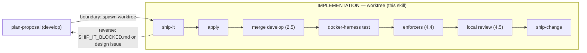

# ship-it

Orchestrates the **implementation phase** of an OpenSpec change **inside its git
worktree**. Twin of `plan-proposal` (which runs the planning phase on `develop`).
Composes existing skills — `openspec-apply-change`, the docker harness, and
`ship-change` — and adds the wiring they lack. Runnable **headless**.



Pure decision logic lives in this skill's own `scripts/` directory and is
unit-tested (`.pi/skills/ship-it` is a vitest project):
`scripts/manifest.ts` (`parseManifest`, `deferDecision`, `filesystemRealityCheck`),
`scripts/no-weakening.ts` (`assertNoWeakening`),
`scripts/review-gate.ts` (`reviewRoundDecision`, `parseReviewReply`,
`resolveReviewer`, `classifyFindings`, `REVIEW_TIMEOUT_MS`),
`scripts/fix-ledger.ts` (`validateFixLedger`), `scripts/review-state.ts`
(`deriveReviewState`), and `scripts/review-prompt.ts` (`buildReviewPrompt` + the
step-4.5 CLI).

## Preconditions

- Running **inside the change's worktree** (`.worktrees/os-<change>`, branch
  `os/<change>`). Resolve the change name from the worktree dir basename.
- `docker` available (the e2e harness); `openspec` CLI resolves from the parent
  repo root when inside a worktree (per `AGENTS.md`).
- Announce: *"Shipping change: `<change>` (worktree implementation phase)."*

## Procedure

### 1. Orient with `openspec status`, but gate on filesystem reality (idempotent)

**Entry gate — a previous hand-back.** If
`openspec/changes/<change>/SHIP_IT_BLOCKED.md` already exists, a previous
invocation handed the change to a human. A run is **interactive** exactly when
the `ask_user` tool is available; otherwise it is headless.

- **Headless** → exit non-zero naming `SHIP_IT_BLOCKED.md`. No fix loop, no
  review round, no `ship-change` step.
- **Interactive** → show its cause and `ask_user` **resume / abort**. On
  *abort*, stop without changes. On *resume*, create this invocation's run dir
  (step 4.5), copy `SHIP_IT_BLOCKED.md` into it (evidence kept), then remove
  the file from the change dir.

Removing the file, or answering *resume*, is the human decision that starts a
new review budget — re-invoking `ship-it` alone never does.

Read `openspec status --change <change> --json` for orientation only. **Do not
trust the `tasks.md` checkbox** as proof an automated scenario is done — a
hand-checked or prior-partial `- [x]` can lie.

Parse `test-plan.md` (`parseManifest`). For each `automated` row, resolve its
folded test file and run `filesystemRealityCheck`: a scenario is satisfied only
when its **test file exists AND passes in the harness** (step 3). Any automated
row whose test file is absent → NOT done → author it (step 2) regardless of the
checkbox. This makes re-invocation genuinely idempotent: fresh run and re-run
reach the same all-green end state.

### 2. Run apply if non-manual work remains — inject the exemplar

**kb-first, even as an executor.** You know which files the tasks name, so your
reflex is `grep`/`cat`/Read on them directly. The docs-first gate still applies:
before you `grep`/`rg` for a symbol, Read a file to learn its purpose, or chase
an import, run `kb_search` / `kb agents <path>` / `kb_neighbors` FIRST. Knowing
the file does not exempt you — kb the symbol/file, then edit.

If non-`manual-only` tasks remain (real code + the test files the fold tasked),
run `openspec-apply-change` for the change. `apply` writes code and marks tasks.

`apply` has no "copy from exemplar" capability of its own. For each folded test
task, **resolve the harness-exemplar pointer** (the nearest existing spec of that
category named in the task) and inject its path into the task context you hand
`apply` — or author the spec yourself in the fix loop (step 4). Bare
"author X.spec.ts" with no exemplar is forbidden.

### 2.5. Integrate `develop` — merge before the harness (primary integration point)

The harness (step 3) is the **strongest gate** on the ship-it path, so integration
must sit **upstream** of it: the harness must validate the merged tree `T1`, not
the pre-merge tree `T0`. Merge `origin/develop` — the **remote ref**, never local
`develop` (checked out in the parent repo → worktree branch-collision pitfall):

```bash
git fetch origin develop
git merge --no-edit origin/develop
```

Idempotent: up-to-date → "Already up to date", no merge commit, safe to always
run. **Merge, not rebase** — step 9 squash-merges anyway, so rebase's linear
history is moot while its force-push is a documented `ship-change` footgun.

**Conflict → abort + STOP.** On an unresolved conflict, `git merge --abort`,
report, and do **not** enter the harness — never run the gate on a half-merged
tree. Resolve trivial conflicts with `ship-change`'s existing recipes (`AGENTS.md`
union-keep; `pnpm-lock.yaml` → `git checkout --theirs` +
`pnpm install --lockfile-only`), then re-run the merge. A conflict you cannot
resolve mechanically → escape hatch (step 5).

### 3. Harness lifecycle — delegate the port, always tear down

Obtain the harness and its port from `docker/test-up.sh` (allocator on first run,
reuser on re-up — do NOT add port code). Read the derived port from
`.pi-test-harness.json` (`dashboardPort`) — **never hardcode `:18000`**.

Wrap the whole run so teardown ALWAYS happens (red test, abort, or a partial
`test-up.sh` start):

```bash
cleanup() { docker/test-down.sh || true; }
trap cleanup EXIT
docker/test-up.sh -d --build            # allocates + records .pi-test-harness.json
port=$(jq -r '.dashboardPort' .pi-test-harness.json)   # jq is present in the harness env
# run the relevant suite against $port:
PW_E2E_USE_RUNNING=1 npm run test:e2e   # L3; or the L1/L2 suite for other levels
```

`test-down.sh` is safe against a partially-created compose project (`compose down
-v` + best-effort `rm`). Isolation is no longer silent, though: a second
worktree's harness saturates the daemon (two 4 GiB limits on an 8 GB VM), so
`test-up.sh` refuses when `(n+1) × MEM_LIMIT >= MemTotal` — `n` = other running
`pi-dash-test-*` projects, `MEM_LIMIT` default `4g` — naming them and the
arithmetic, and warns (once) when the limits fit but a peer is up, because a red
run is then not attributable. Free the peer with its own `test-down.sh`, or set
`PI_HARNESS_ALLOW_OVERSUBSCRIBE=1`. The harness emits no committed whole-run
timeout (#450): bound a local run with `--global-timeout`, never a config edit.

### 4. Red-test fix loop — OWNED by ship-it (apply cannot fix a checked task)

`apply` marks `- [ ]` → `- [x]` and never revisits a checked task, so re-invoking
`apply` on a red-but-checked test no-ops. **On a red test, `ship-it` drives the
fix itself** — edit the code or the test, re-run the harness. Never re-invoke
`apply` on an already-checked task.

Bound the loop by **progress-making cycles**, not a fixed count:

- A cycle that changes the worktree and moves the harness result counts.
- A cycle that produces **no change** to the worktree → **STOP immediately** and
  escalate (step 5). Do not spin.
- This bound is independent of doubt-review's 3-cycle bound (different semantics).

**No-weakening guardrail (mechanical, enforced every cycle):** before accepting a
change to a test file, run `assertNoWeakening` on its diff
(`git diff -- <test-file>`). If it reports `ok:false` (added `.only`/`skip`,
deleted assertion, or a strong→permissive matcher swap), **REJECT** the change —
you may not reach green by degrading the test. Fix the code instead.

### 4.4. Deterministic enforcers — cheap, offline, before any model call

Run the enforcers from the worktree root. Each is already the sole owner of its
rule; this step only *invokes* them:

```bash
node scripts/check-conventions.mjs --base origin/develop
node scripts/dox-byte-gate.mjs
node scripts/i18n-lint.mjs --strict     # --strict, else it exits 0 regardless
node scripts/i18n-parity.mjs
node scripts/knip-config.mjs            # knip.json still roots every manifest entry
node scripts/knip-ratchet.mjs           # per-class dead-code ratchet (~8s)
node scripts/knip-ratchet.mjs --check-baseline-diff origin/develop   # ceiling not raised
```

The knip pair is the **preventive** half of the dead-code oracle: the nightly
job runs after merge and can only report. Order matters — `knip-config.mjs`
first, because an unrooted graph reports live files as dead, and a ratchet over
that number gates noise (measured: unrooted 723 findings / 90 unused files vs
rooted 437 / 10). Fix a ratchet failure by deleting the dead code; raising a
baseline is rejected by the third command — which must stay wired, or "never
raise the ceiling" is aspirational: the plain ratchet passes happily against a
raised number. It also rejects a DELETED class, the cheaper bypass.

They are placed here, after the harness and before the review, because they are
deterministic, offline and near-instant: a mechanically-failing tree must never
spend a model call. A non-zero exit routes to the step-4 fix loop; **step 4.5
does not run**.

`--base` is mandatory for gating: without it the touched set is undefined and
the Discipline-Skills and Mermaid rules report without gating. The touched set
unions the committed diff with the working tree, so fixes still uncommitted in
the fix loop are inspected.

These do NOT move into `quality:changed`. That script is the dev-loop oracle and
has no automated caller; the ship gate is here.

### 4.5. Local review checkpoint — the semantic half

Runs on **every** invocation. There is no triviality escape: no diff-size, path,
or changed-file-count condition skips it. A run is **interactive** exactly when
the `ask_user` tool is available in the session; otherwise it is headless.

`CLI` below is `npx tsx .pi/skills/ship-it/scripts/review-prompt.ts`. Records
live in this invocation's run dir, created once with
`RUN=$(CLI --new-run --change <change>)` →
`$(git rev-parse --git-dir)/ship-it/<change>/<run-id>/` (per worktree, never
committed, `<run-id>` = invocation start timestamp):
`review-r<N>.md` (well-formed reply of round N), `review-r<N>.attempt-<k>.md`
(malformed attempt), `fix-ledger-r<N>.json` (answers `review-r<N>.md`),
`ledger-failures.log` (written by the CLI), `approvals.log` (one line per human
"one more round" answer — written only right after an `ask_user` answer).

1. **Resolve the reviewer** with `resolveReviewer` from `scripts/review-gate.ts`.
   `@review` is REQUIRED. Unconfigured → hard fail naming `update_roles` / the
   dashboard Roles panel. There is deliberately **no fallback to the session
   default model**: that model is the author, so falling back turns the gate into
   self-review. Interactive runs may offer the bootstrap prompt; a headless run
   fails.
2. **Derive state, then decide.** Run `CLI --state "$RUN"` → `round`,
   `approvedExtraRounds`, `malformedRetries`, `ledgerFailures`. Feed exactly
   those values (plus `interactive` and the last round's blocking ids) to
   `reviewRoundDecision`. Never supply a counter from memory; never relabel a
   round as round 1 of a new budget.
3. **Commit the worktree before each round** (squash-merge collapses these), so
   every reviewed tree has a sha. Check `git status --short`, then stage the
   change's own paths explicitly and commit exactly that list with
   `git commit -- <paths>` (a bare `git commit` takes everything in the index),
   so files already staged before this step stay out; unrelated local edits
   (e.g. a worktree-local `.pi/settings.json`) stay unstaged and never enter
   the change. Record the commit as the round's sha.
4. **Generate the prompt — never hand-write it.** Round 1:
   `CLI --change <change> --round 1`. Round N ≥ 2 (a verification round):
   `CLI --change <change> --round N --prior "$RUN/review-r<N-1>.md" --ledger "$RUN/fix-ledger-r<N-1>.json" --since <round N-1 sha>`.
   Pass its stdout to the reviewer **verbatim** — no added framing, summary, or
   claim about the fixes; keep its header line. The generated prompt carries the
   `review-code` rubric, the diff range `git diff origin/develop...HEAD`
   (three-dot, so the step-2.5 merge is not attributed to this change), every
   intent artifact present (`proposal.md`, `tasks.md`, `design.md`, delta specs,
   `test-plan.md`), and the defect-class sweep. Known limitation: a verification
   round carries each prior `B` finding up to its first *unindented* paragraph
   (indented continuations are kept) — the price of keeping the prior reply
   bounded (#E24); the prompt asks the reviewer to indent continuations.
5. **Spawn it as an isolated subagent** — an `Agent` call with `model: "@review"`
   and `subagent_type: "CodeReviewer"` (the definition in
   `.pi/agents/CodeReviewer.md` disables context inheritance; no other agent
   type may be used here). Never an in-context self-review, never the
   CodeRabbit CLI (that is `ship-change`'s remote gate, later and different).
6. **Bound the call** by `REVIEW_TIMEOUT_MS` (300s). A timeout is neither a pass
   nor a blocking finding — it is a checkpoint failure.
7. **Parse the reply** with `parseReviewReply`. Well-formed → save it as
   `$RUN/review-r<N>.md`. Malformed (empty, no or duplicate
   `BLOCKING_COUNT`/`VERDICT` line, or self-contradictory) → save it as
   `$RUN/review-r<N>.attempt-<k>.md`; it is never a pass and never a round.
   **Retry once**: re-invoke the same round; a second malformed reply halts like
   a timeout. A missing sweep table is noted in the round record and the step
   report, not a failure.
8. **Route findings**: only `issue(blocking)` (`B<n>` ids) re-enters the fix
   loop. Everything else is reported and shipped.
9. **Fix protocol, per `B` id** (the `review-code` fix protocol): reproducing
   test first (or a ≥20-char reason no automated test can observe it) →
   smallest fix → sibling sweep of the same pattern across the change → re-read
   the fix hunk against the finding's defect class. After each review fix,
   **re-run the harness (step 3) and the step-4.4 enforcers** before anything
   else; a failure re-enters the fix loop first.
10. **Write and validate the ledger** before a verification round:
    `$RUN/fix-ledger-r<N>.json`, one entry per `B` id — `{ id, test: {path} |
    {untestable}, siblings: {searched, sites}, fixedIn }`, no status field, no
    verdict language. Then
    `CLI --validate-ledger --prior "$RUN/review-r<N>.md" --ledger "$RUN/fix-ledger-r<N>.json"`.
    Non-zero → complete the listed entries (each failure is recorded; the third
    for a round routes as unsatisfiable). An entry the fix loop cannot complete
    → unsatisfiable. No verification round while validation fails.
11. **Bound the loop** with `reviewRoundDecision`. The base cap is two rounds —
    review, fix, re-review. This is a hard numeric cap, NOT step 4's
    no-progress rule, because a reviewer can emit a fresh finding every round
    and each fix changes the worktree, so a no-progress bound would never fire.
    - `review` → next round (step 3).
    - `proceed` → step 6.
    - `ask` (interactive, cap reached) → one `ask_user` select naming the
      remaining `B` ids: **one more verification round** / **hand back to
      planning**. *One more* → append one line to `$RUN/approvals.log` and record
      the answer in the round file, then run exactly one verification round.
      *Hand back* → escape hatch. If the `ask_user` call fails, treat the run as
      headless and take the escape hatch.
    - `escape` → the boundary-reverse (step-5) escape hatch.
12. `assertNoWeakening` still governs every test edit a review fix makes. A
    finding that can only be satisfied by weakening a test is **unsatisfiable** →
    escape hatch (step 5), naming both the finding and the guardrail. The
    guardrail is never relaxed to reach green.

Every `escape` decision carries a `reason`; write it into `SHIP_IT_BLOCKED.md`
together with the run dir path.

### 5. Boundary-reverse escape hatch

The worktree boundary is **not one-way**. Trigger the reverse path when ANY of:

- `apply` reports a design issue (NL prose — implementation reveals the design is
  wrong), OR
- the step-4 fix bound is exhausted (a no-progress cycle), OR
- the step-4.5 review checkpoint decides `escape` (including a human choosing
  *hand back* at the cap).

Then, **do NOT headlessly rewrite `proposal.md`/`design.md`**:

1. Leave the worktree intact (no revert).
2. Write `openspec/changes/<change>/SHIP_IT_BLOCKED.md` naming the failing
   scenario / design gap and what was tried.
3. Exit non-zero.
4. Surface via the dashboard so a human re-enters `plan-proposal` /
   `doubt-driven-review` on `develop`.

### 6. Drive ship-change INLINE, with manifest-aware defer + teardown ordering

Once every automated scenario is green (harness-verified), ship. Execute
`ship-change`'s procedure **inline** (not as a black-box subagent) so you keep
step-level control for the teardown ordering below.

**Defer rule (`deferDecision`, manifest-aware):**
- `test-plan.md` exists → a leftover `- [ ]` is deferrable only if it maps to a
  `manual-only` manifest row (inline `(test-plan: manual-only)` or a
  `(test-plan #<id>)` reference resolved against the manifest). Any other leftover
  = real work = **STOP** (return to step 2, or the escape hatch).
- `test-plan.md` absent (legacy change) → `ship-change`'s current keyword defer
  applies unchanged.

**Archive+sync gate before the destructive steps (load-bearing):** do **not** let
`ship-change` merge the PR, delete the branch, or remove the worktree while the
proposal is not archived and specs are not synced. `ship-change` step 8.5 is that
hard gate — driving `ship-change` inline, hold at step 8.5 until the change is
archived (source dir moved to `openspec/changes/archive/`, move committed) and
specs synced. Failed/skipped archive → STOP (return to step 2 or the escape hatch),
never proceed to steps 9/10.

**Teardown-before-removal ordering (load-bearing):** the harness MUST be torn down
(`test-down.sh`, already wired via the step-3 trap) **before** `ship-change` step
10 removes the worktree. A leaked container makes the worktree "busy" and stalls
removal. Run the harness teardown, then let `ship-change` archive → commit → PR →
CI → CodeRabbit → (archive+sync gate) → squash-merge → remove worktree.

## Guardrails

- **Idempotent on filesystem reality** — checkbox `- [x]` is never proof; the
  test file must exist and pass in the harness.
- **ship-it owns the fix loop** — never re-invoke `apply` on a checked task.
- **Never weaken a test to reach green** — `assertNoWeakening` rejects it.
- **Enforcers (4.4) before the reviewer (4.5)** — never spend a model call on a
  mechanically-failing tree.
- **The review is unconditional** — no triviality escape, and `@review` is
  required; never fall back to the session default model (that is self-review).
- **Two review rounds, hard cap** — review, fix, re-review. Not a no-progress
  bound: a model always makes "progress". Only a human approval at the cap
  (interactive `ask_user`, recorded in `approvals.log`) adds a round — exactly
  **+1 round per human approval**. The orchestrator **never renews its own
  budget**: no self-reset, no "fresh two-round budget", no relabelled round.
  Headless runs and hand-backs take the boundary-reverse (step-5) escape hatch.
- **The reviewer prompt is generated** — `review-prompt.ts` output, passed
  verbatim to `subagent_type: "CodeReviewer"`; never hand-written, never
  carrying the author's conclusions.
- **A `SHIP_IT_BLOCKED.md` at entry stops the run** — headless exits non-zero;
  interactive asks resume/abort.
- **Merge `develop` before the harness (step 2.5)** — the strong gate validates
  the integrated tree `T1`; merge `origin/develop` (remote ref), never rebase.
  Conflict → abort + STOP, never enter the harness on a half-merged tree.
- **Never merge / delete branch / remove worktree while the proposal is not archived and synced** — hold at `ship-change` step 8.5 (archive+sync gate) until it passes; failed archive → STOP.
- **Always tear the harness down** (trap/finally), **before** worktree removal.
- **Never hardcode `:18000`** — read `dashboardPort` from `.pi-test-harness.json`.
- **Never headlessly rewrite planning artifacts** — use the escape hatch.
- **Drive ship-change inline** — do not spawn it as a subagent (you need its step
  boundaries for teardown ordering).

## Composed skills

`openspec-apply-change` · `docker/test-up.sh` + `lib-ports.sh` + `test-down.sh` ·
`review-code` (its rubric is what the step-4.5 reviewer applies) ·
`ship-change` (driven inline, manifest-aware defer). Handoff back to
`plan-proposal` via `SHIP_IT_BLOCKED.md`.
