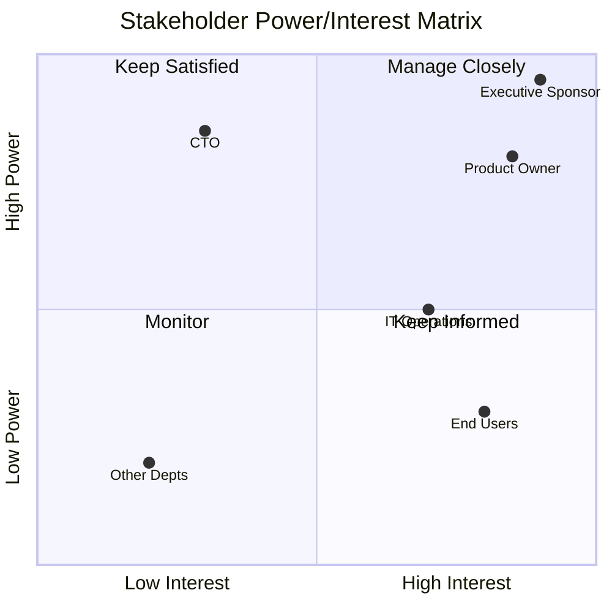

# Stakeholder Analysis

Identify, analyze, and plan engagement strategies for project and initiative stakeholders. Based on BABOK v3 Elicitation & Collaboration knowledge area.

## What is Stakeholder Analysis?

Stakeholder analysis systematically identifies all parties affected by or able to affect an initiative, assesses their interests and influence, and develops engagement strategies.

## Core Deliverables

| Deliverable | Purpose | When to Create |
|-------------|---------|----------------|
| **Stakeholder Register** | Comprehensive list of all stakeholders | Project initiation |
| **Power/Interest Matrix** | Prioritize engagement approach | Analysis phase |
| **RACI Matrix** | Clarify roles and responsibilities | Planning phase |
| **Communication Plan** | Structured engagement strategy | Planning phase |

## Workflow

### Phase 1: Stakeholder Identification

#### Step 1: Brainstorm Categories

Systematically identify stakeholders by category:

| Category | Examples | Questions to Ask |
|----------|----------|------------------|
| **Sponsors** | Executive sponsor, budget owner | Who funds this? Who can cancel it? |
| **Users** | End users, power users, administrators | Who uses the solution daily? |
| **Operators** | IT ops, support teams, maintenance | Who keeps it running? |
| **Regulators** | Compliance, legal, audit | Who ensures we follow rules? |
| **Affected Parties** | Other departments, displaced roles | Who is impacted by changes? |
| **Subject Matter Experts** | Domain experts, technical leads | Who has critical knowledge? |
| **Decision Makers** | Steering committee, architects | Who approves decisions? |
| **Influencers** | Opinion leaders, union reps | Who shapes perceptions? |

#### Step 2: Create Stakeholder Register

```markdown
## Stakeholder Register

| ID | Name/Role | Category | Organization | Contact | Notes |
|----|-----------|----------|--------------|---------|-------|
| S01 | Jane Smith | Sponsor | Executive | jane@... | Budget authority |
| S02 | IT Operations | Operator | IT | ... | 24/7 support team |
| S03 | Customer Service Reps | User | Customer Care | ... | 50+ daily users |
| S04 | Compliance Officer | Regulator | Legal | ... | GDPR requirements |
```

### Phase 2: Stakeholder Analysis

#### Step 1: Assess Each Stakeholder

For each stakeholder, evaluate:

| Dimension | Question | Scale |
|-----------|----------|-------|
| **Power** | Can they stop or significantly impact the initiative? | Low/Medium/High |
| **Interest** | How much do they care about the outcome? | Low/Medium/High |
| **Attitude** | Are they supportive, neutral, or resistant? | Supporter/Neutral/Resistor |
| **Influence** | Can they sway other stakeholders? | Low/Medium/High |

#### Step 2: Create Power/Interest Matrix

```text
                    HIGH INTEREST
                         │
    ┌────────────────────┼────────────────────┐
    │   KEEP SATISFIED   │   MANAGE CLOSELY   │
    │                    │                    │
    │   • Regular updates│   • Active partner │
    │   • Address issues │   • Key decisions  │
    │   • Prevent blocks │   • Regular 1:1s   │
HIGH├────────────────────┼────────────────────┤
POWER                    │                    │
    │   MONITOR          │   KEEP INFORMED    │
    │                    │                    │
    │   • Minimal effort │   • Regular comms  │
    │   • Watch for      │   • Address needs  │
    │     changes        │   • Build support  │
    └────────────────────┼────────────────────┘
                    LOW INTEREST
```

#### Step 3: Plot Stakeholders

```markdown
## Power/Interest Analysis

### Manage Closely (High Power, High Interest)
| Stakeholder | Power | Interest | Strategy |
|-------------|-------|----------|----------|
| Executive Sponsor | High | High | Weekly 1:1, all major decisions |
| Product Owner | High | High | Daily stand-ups, backlog collaboration |

### Keep Satisfied (High Power, Low Interest)
| Stakeholder | Power | Interest | Strategy |
|-------------|-------|----------|----------|
| CTO | High | Low | Monthly summary, escalation path |
| Legal | High | Low | Involve on compliance matters only |

### Keep Informed (Low Power, High Interest)
| Stakeholder | Power | Interest | Strategy |
|-------------|-------|----------|----------|
| End Users | Low | High | User group updates, beta programs |
| Help Desk | Low | High | Training, knowledge base updates |

### Monitor (Low Power, Low Interest)
| Stakeholder | Power | Interest | Strategy |
|-------------|-------|----------|----------|
| Other Departments | Low | Low | General announcements only |
```

### Phase 3: Responsibility Assignment (RACI)

Create RACI matrix for key decisions and deliverables:

| Legend | Meaning | Rule |
|--------|---------|------|
| **R** - Responsible | Does the work | Can have multiple |
| **A** - Accountable | Final authority | Must be exactly one |
| **C** - Consulted | Provides input | Before decision |
| **I** - Informed | Notified of outcome | After decision |

```markdown
## RACI Matrix

| Decision/Deliverable | Sponsor | PO | Dev Lead | Users | Ops |
|---------------------|---------|-----|----------|-------|-----|
| Solution Requirements | I | A | R | C | C |
| Technical Architecture | I | C | A | - | C |
| User Acceptance | A | R | C | R | I |
| Go-Live Decision | A | R | C | I | R |
| Production Support | I | I | C | - | A |
```

### Phase 4: Communication Planning

#### Step 1: Define Communication Needs

For each stakeholder group:

| Question | Purpose |
|----------|---------|
| What do they need to know? | Content |
| When do they need it? | Timing |
| How should we communicate? | Channel |
| Who should communicate? | Sender |
| What response do we expect? | Feedback mechanism |

#### Step 2: Create Communication Plan

```markdown
## Communication Plan

| Stakeholder | Message | Frequency | Channel | Owner | Feedback |
|-------------|---------|-----------|---------|-------|----------|
| Executive Sponsor | Status, risks, decisions | Weekly | 1:1 meeting | PM | Discussion |
| Product Owner | Progress, blockers | Daily | Stand-up | Team Lead | Same day |
| End Users | Training, updates | Bi-weekly | Newsletter | Change Lead | Survey |
| IT Operations | Release plans | Sprint end | Email + meeting | Tech Lead | Sign-off |
| All Stakeholders | Major milestones | As needed | Email blast | PM | None |
```

### Phase 5: Engagement Strategy

For challenging stakeholders (resistors, skeptics), develop targeted strategies:

#### Resistance Analysis

```markdown
## Resistance Analysis

| Stakeholder | Current Attitude | Desired Attitude | Resistance Reason | Strategy |
|-------------|-----------------|------------------|-------------------|----------|
| Dept Manager | Resistor | Supporter | Fears job impact | Show how role evolves, not disappears |
| IT Architect | Skeptic | Neutral | Technical concerns | Deep-dive sessions, address concerns |
| Union Rep | Neutral | Supporter | Needs assurance | Early engagement, transparency |
```

## Output Formats

### Narrative Summary

```markdown
## Stakeholder Analysis Summary

**Initiative:** [Name]
**Analyst:** [Name]
**Date:** [ISO date]

### Key Stakeholders

**Primary Sponsors:**
- [Name] - [Role] - [Key interest/concern]

**Critical Partners (Manage Closely):**
- [List with brief description]

### Risk Areas

1. **[Stakeholder]** - [Risk] - Mitigation: [Strategy]

### Recommendations

1. [Specific engagement recommendation]
2. [...]
```

### Structured Data (YAML)

```yaml
stakeholder_analysis:
  version: "1.0"
  initiative: "Customer Portal Redesign"
  date: "{ISO-8601-date}"
  analyst: "stakeholder-facilitator"

  stakeholders:
    - id: S01
      name: "Jane Smith"
      role: "VP Customer Experience"
      category: sponsor
      organization: "Customer Care"
      power: high
      interest: high
      attitude: supporter
      influence: high
      strategy: manage_closely
      communication:
        frequency: weekly
        channel: meeting
        owner: "Project Manager"
      concerns:
        - "Timeline for Q2 launch"
        - "Budget constraints"

    - id: S02
      name: "IT Operations Team"
      role: "Platform Support"
      category: operator
      organization: "IT"
      power: medium
      interest: high
      attitude: neutral
      influence: medium
      strategy: keep_informed
      communication:
        frequency: bi-weekly
        channel: email
        owner: "Tech Lead"
      concerns:
        - "Support load increase"
        - "Training requirements"

  raci:
    - deliverable: "Requirements Sign-off"
      responsible: ["Product Owner"]
      accountable: "VP Customer Experience"
      consulted: ["IT Architect", "Users"]
      informed: ["IT Operations"]

  communication_plan:
    - audience: "Executive Sponsor"
      content: "Status, risks, decisions needed"
      frequency: weekly
      channel: "1:1 Meeting"
      owner: "Project Manager"
```

### Mermaid Diagrams

**Power/Interest Quadrant:**



## Multi-Persona Workshop Mode

For comprehensive stakeholder analysis, run a multi-persona workshop (similar to event storming):

**Personas to Invoke:**

| Persona | Perspective | Contribution |
|---------|-------------|--------------|
| `executive-sponsor-persona` | Strategic | Budget, timeline, success criteria |
| `end-user-persona` | Operational | Daily usage, pain points, adoption |
| `operations-persona` | Support | Maintenance, reliability, training |
| `compliance-persona` | Regulatory | Rules, audit, risk |
| `devils-advocate` | Critical | Risks, overlooked stakeholders, conflicts |

**Orchestration:**

1. Launch all personas in parallel
2. Each persona identifies stakeholders from their perspective
3. Synthesize findings with provenance tracking
4. Resolve conflicts and gaps

## When to Use

| Scenario | Use Stakeholder Analysis? |
|----------|--------------------------|
| New project initiation | Yes - identify all affected parties |
| Change management | Yes - plan adoption strategy |
| Requirements gathering | Yes - ensure right people involved |
| Conflict resolution | Yes - understand interests |
| Routine operations | No - not needed for BAU |

## Common Mistakes

| Mistake | Impact | Prevention |
|---------|--------|------------|
| Missing hidden stakeholders | Late surprises, resistance | Use systematic categories |
| Ignoring resistors | Project failure | Develop engagement strategy |
| Static analysis | Outdated understanding | Revisit quarterly |
| Over-communicating to all | Information overload | Tailor by quadrant |

## References

- Load `references/power-interest-matrix.md` for matrix variations
- Load `references/raci-matrix.md` for RACI guidance
- See BABOK v3 Chapter 3 (Elicitation & Collaboration)

## Related Skills

- `capability-mapping` - Identify capability owners as stakeholders
- `journey-mapping` - Understand user stakeholder needs
- `risk-analysis` - Assess stakeholder-related risks
- `prioritization` - Prioritize stakeholder engagement
- `decision-analysis` - Stakeholder decision matrices
- `process-modeling` - Identify domain stakeholders through process analysis

## Version History

- **v1.0.0** (2025-12-26): Initial release
