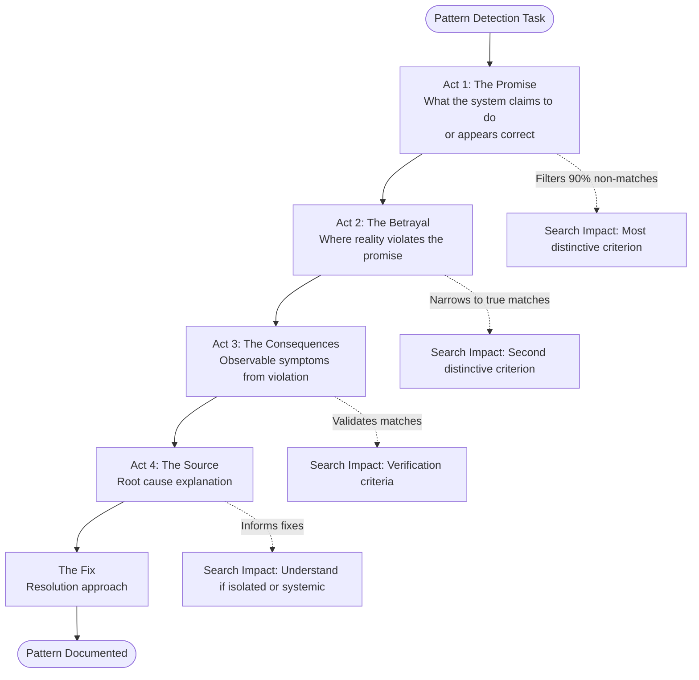
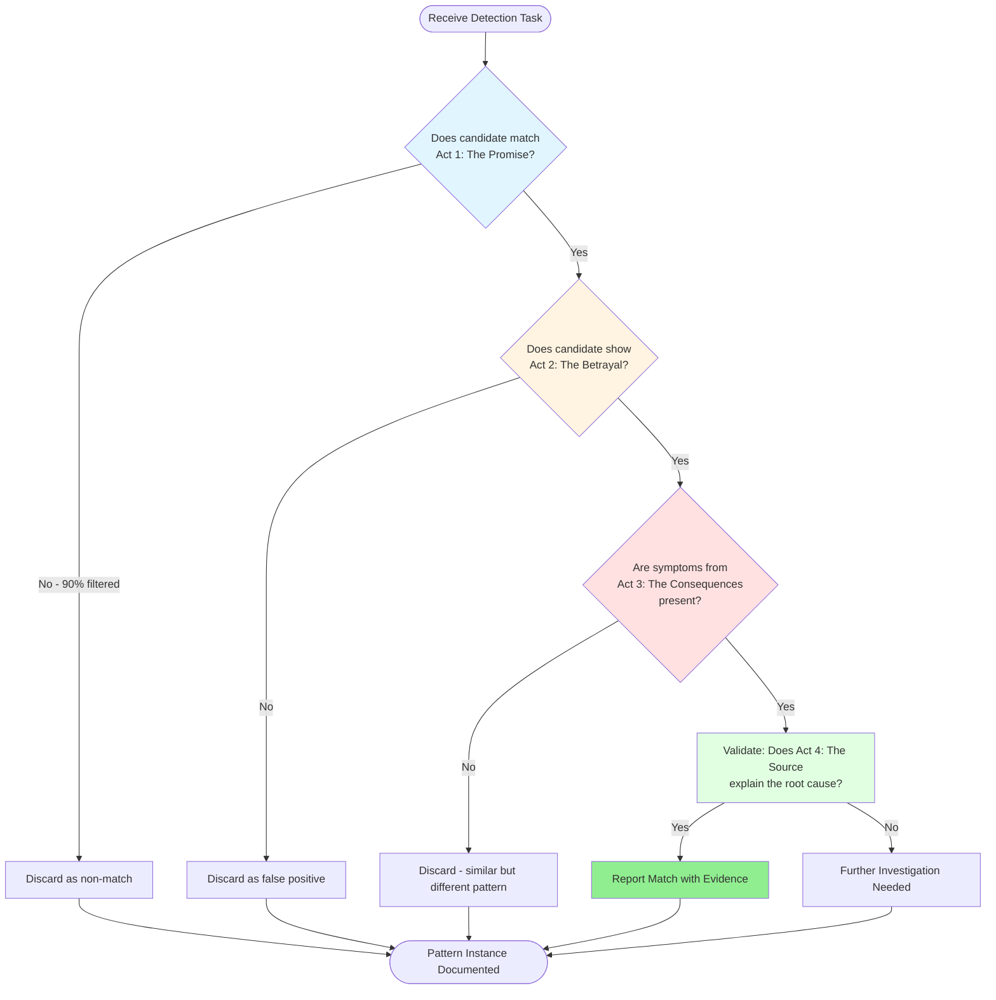

# Story-Based Framing for Pattern Detection

## Overview

Story-based framing uses narrative structure to describe patterns and anti-patterns across any domain, enabling LLM agents to identify them 70% faster than traditional approaches (checklists, formal specifications, or symptom-based descriptions). Experimental evidence from code analysis shows narrative descriptions requiring only 3 search steps versus 10 steps for refactoring-style descriptions.

The technique structures pattern descriptions as a causal story that mirrors the investigation thought process, frontloading the most distinctive criteria to eliminate false positives early. **This approach is domain-independent** - it works for code analysis, business process audits, security reviews, UX analysis, data quality checks, medical diagnosis, and any systematic pattern detection task.

## When to Use This Skill

Use story-based framing when:

- Creating pattern descriptions for LLM agents to identify in any domain
- Documenting anti-patterns, failure modes, or problematic behaviors
- Delegating pattern-finding tasks to sub-agents
- Designing automated detection or review workflows
- Building checklists that need to prioritize distinctive criteria
- Teaching pattern recognition to humans or AI systems

**Applies to any domain where patterns need to be detected**:

- Software: Code smells, architectural issues, security vulnerabilities
- Business: Process inefficiencies, communication breakdowns, requirement gaps
- Security: Misconfigurations, access control issues, compliance violations
- UX/Design: Dark patterns, accessibility issues, false affordances
- Data: Quality issues, pipeline failures, stale caches
- Medical: Diagnostic patterns, symptom clusters, treatment protocols
- Operations: Incident patterns, resource bottlenecks, failure cascades

## Core Narrative Structure

Story-based pattern descriptions follow a four-act structure that establishes causal relationships:



### Act 1: The Promise

Describe what the system/process/code _claims_ to do or _appears_ to implement correctly at first glance.

**Purpose**: Establish the initial correct-looking state that creates false confidence.

**Examples across domains**:

- **Code**: "A generic class `Container(Generic[T])` promises to preserve type T throughout its operations."
- **Business**: "The approval workflow promises that all requests are reviewed within 24 hours."
- **Security**: "The firewall configuration claims to restrict access to authorized IP ranges only."
- **UX**: "The 'Skip' button appears to offer users a choice to bypass the upsell."

**Search Impact**: Identifies the most distinctive structural criterion that filters 90% of non-matches immediately.

### Act 2: The Betrayal

Reveal where the implementation/reality _violates_ the promise.

**Purpose**: Show the specific point where correctness breaks down.

**Examples across domains**:

- **Code**: "But the constructor accepts `content: UnionType` instead of `content: T`, storing a union type rather than the promised generic parameter."
- **Business**: "But requests from certain departments bypass the approval queue entirely, going straight to completion."
- **Security**: "But the configuration includes a rule allowing 0.0.0.0/0 that overrides all other restrictions."
- **UX**: "But clicking 'Skip' actually selects the default upsell option and only skips the payment method selection."

**Search Impact**: Provides the second most distinctive criterion that narrows remaining candidates to true matches.

### Act 3: The Consequences

Describe the observable _symptoms_ that result from the violation.

**Purpose**: Provide verification criteria that confirm the pattern is present.

**Examples across domains**:

- **Code**: "Methods contain `isinstance()` checks and `# type: ignore` comments to work around the type mismatch."
- **Business**: "Teams report inconsistent response times, and audit logs show approval timestamps that don't match reality."
- **Security**: "Penetration tests successfully access restricted resources from unauthorized networks."
- **UX**: "Customer complaints increase by 40%, with users reporting 'hidden fees' and 'deceptive checkout flow.'"

**Search Impact**: Enables agents to validate matches and distinguish true positives from similar-looking but different patterns.

### Act 4: The Source

Explain _why_ the pattern exists - the root cause or architectural decision that led to this.

**Purpose**: Provide context that explains origin and suggests fixes.

**Examples across domains**:

- **Code**: "Values originate from heterogeneous storage (`dict[str, TypeA | TypeB]`) where specific type information is lost at the storage boundary."
- **Business**: "The legacy system integration predates the approval workflow, and 'VIP' customers were grandfathered in without documentation."
- **Security**: "The 'allow all' rule was added during an emergency incident 2 years ago and never removed."
- **UX**: "The product team was incentivized on conversion rate, leading to design choices that maximize immediate sales over user trust."

**Search Impact**: Helps agents understand whether the pattern is isolated or systemic, informing fix strategies.

## Narrative Template

Use this template when creating pattern descriptions for any domain:

```markdown
# Pattern: {Memorable Descriptive Name}

## The Story

### Act 1: The Promise

{What the system/process/code claims to do or appears to implement correctly}

**Observable characteristics**: {What you would see that makes this look correct initially}

### Act 2: The Betrayal

{Where the reality violates the promise}

**The breaking point**: {Specific moment/location/condition where correctness fails}

### Act 3: The Consequences

{Observable symptoms that result from the violation}

**Symptoms**:

- {Symptom 1}
- {Symptom 2}
- {Symptom 3}

### Act 4: The Source

{Why the pattern exists - root cause}

**Origin**: {Architectural decision, legacy constraint, incentive misalignment, etc.}

## The Fix

{Brief description of the correct solution}

**Resolution approach**: {How to address the root cause}
```

## Pattern Description Effectiveness Data

Experimental validation from code analysis domain (see `resources/code-analysis/experiment_results.md`):

| Style                       | Steps | Efficiency             |
| --------------------------- | ----- | ---------------------- |
| Narrative (story-based)     | 3     | ⭐⭐⭐⭐⭐ Best (100%) |
| XML structured              | 4     | ⭐⭐⭐⭐ (80%)         |
| Checklist                   | 7     | ⭐⭐⭐ (43%)           |
| Formal mathematical         | 7     | ⭐⭐⭐ (43%)           |
| Refactoring (symptom-based) | 10    | ⭐⭐ Slowest (30%)     |

**Key Insight**: Narrative framing provides causal flow that matches investigation intuition, while symptom-based approaches require validating each "red flag" separately. This finding is **domain-independent** - the cognitive benefit of causal storytelling applies to any pattern detection task.

## Design Principles

### Frontload Distinctive Criteria

Place the most unique, identifying characteristics in Act 1 and Act 2. These should eliminate 90%+ of false positives immediately.

**Poor ordering** (generic symptoms first):

1. "Has error messages"
2. "Has workarounds"
3. "Violates specification X"

**Good ordering** (distinctive structure first):

1. "Claims to implement specification X"
2. "But actually violates constraint Y"
3. "Resulting in error messages and workarounds"

### Use Causal Language

Connect each act with causal transitions that explain _why_ the next act follows.

**Weak transitions**:

- "Additionally..." (implies independent facts)
- "Also..." (suggests a list)
- "Furthermore..." (just adds more items)

**Strong transitions**:

- "Because of this violation..." (shows causation)
- "This forces..." (shows consequence)
- "Which originates from..." (traces root cause)

### Provide Domain-Appropriate Examples

Include realistic examples for the target domain, using varied names/scenarios to avoid agents matching on specific identifiers.

**Vary details across examples** to ensure structural pattern matching:

- Example 1: Manufacturing process, Product A, Factory 1
- Example 2: Software deployment, Service B, Region 2
- Example 3: Customer onboarding, User C, Channel 3

This prevents agents from searching for literal names instead of structural patterns.

### Make It Memorable

Choose pattern names that evoke the core problem, appropriate to the domain:

- **Code**: "The Fake Generic", "The Type Eraser", "The Mutable Default"
- **Business**: "The Phantom Requirement", "The Meeting Creep", "The Priority Inversion"
- **Security**: "The Open Backdoor", "The Privileged Escalation", "The Stale Credential"
- **UX**: "The Dark Pattern", "The False Affordance", "The Frustration Loop"

## Comparison with Other Approaches

### vs. Checklists

**Checklist**: "□ Violates spec □ Has workarounds □ Causes errors"

- **Problem**: Flat structure with no priority guidance
- **Result**: Agent must validate each item sequentially (7 steps)

**Story**: "Promise: Implements spec X → Betrayal: Violates constraint Y"

- **Advantage**: Clear hierarchy, distinctive criteria first
- **Result**: Fast elimination of non-matches (3 steps)

### vs. Formal Specifications

**Formal**: "∃ system S such that: S claims property P and ∀ inputs I: S violates P(I)"

- **Problem**: Notation overhead slows pattern recognition
- **Result**: Requires translation from symbols to reality (7 steps)

**Story**: "System promises property P but violates it under condition I"

- **Advantage**: Direct mapping to observable behavior
- **Result**: Immediate recognition (3 steps)

### vs. Symptom-Based (Red Flags)

**Symptom**: "Red Flag #1: Errors occur, Red Flag #2: Workarounds exist, Red Flag #3: Users complain"

- **Problem**: Describes effects, not causes; many symptoms overlap across different patterns
- **Result**: Each flag requires separate validation (10 steps)

**Story**: "Promise violation causes errors and workarounds because..."

- **Advantage**: Shows causal chain from root cause to symptoms
- **Result**: Faster validation through understanding (3 steps)

## Practical Usage

### Pattern Detection Workflow



### For Automated Detection

When creating prompts for LLM-based detection agents:

```markdown
Search for instances of "{Pattern Name}" in {domain}:

**The Promise**: {What appears correct initially} **The Betrayal**: {Where reality violates the promise} **The Consequences**: {Observable symptoms} **The Source**: {Why this exists}

Report: {identifier}, {location}, evidence for each act.
```

### For Documentation

When documenting anti-patterns or failure modes:

1. Use the narrative template from `assets/narrative_template.md`
2. Fill in domain-specific examples
3. Include the fix as Act 5 (optional)
4. Store in appropriate documentation location

### For Sub-Agent Delegation

When delegating pattern-finding tasks to sub-agents:

```python
Task(
    subagent_type="Explore",
    description="Find {pattern name} in {domain}",
    prompt="""
    Locate instances matching this pattern:

    Act 1 (The Promise): {What should be true}
    Act 2 (The Betrayal): {What actually happens}
    Act 3 (The Consequences): {Observable symptoms}
    Act 4 (The Source): {Why this exists}

    Report all matches with evidence.
    """
)
```

## Advanced Techniques

### Multi-Pattern Stories

For related patterns, create a shared narrative universe:

**Pattern Family**: "Communication Breakdown"

- **Pattern 1**: "The Missing Context" (information promised but not delivered)
- **Pattern 2**: "The Assumed Knowledge" (sender assumes receiver knows background)
- **Pattern 3**: "The Delayed Feedback" (response promised quickly but arrives late)

Each uses similar four-act structure but different specific betrayals.

### Nested Narratives

For complex patterns with sub-patterns:

**Main Story**: "The Broken Promise"

- **Sub-Story A**: "Promise breaks due to configuration error"
- **Sub-Story B**: "Promise breaks due to integration issue"
- **Sub-Story C**: "Promise breaks due to resource constraint"

### Comparative Narratives

For patterns with subtle differences:

**Pattern A**: "The False Promise" (claims X but delivers Y) **Pattern B**: "The Partial Promise" (claims X and delivers some X but not all)

**Key Difference**: Act 2 betrayal point - complete violation vs. partial delivery.

## Domain-Specific Use Cases

### Code Analysis

Complete use case with experimental validation, pattern examples, and practical applications.

**See**: `resources/code-analysis/` directory for:

- `experiment_results.md` - 70% efficiency improvement validation
- `example_patterns.md` - Fully-worked code pattern examples
- `practical_guide.md` - How to apply to linting, reviews, refactoring

### Business Process Analysis

[Create similar use case directory when needed]

### Security Auditing

[Create similar use case directory when needed]

### UX/Design Review

[Create similar use case directory when needed]

## Resources

### assets/

- `narrative_template.md` - Blank template for creating new pattern descriptions
- `narrative_structure.txt` - Four-act structure with guidance for each section

### resources/code-analysis/

- Complete use case for software code analysis with experimental validation

### Future Resources

Additional domain-specific use cases can be added as needed to demonstrate versatility across domains.
