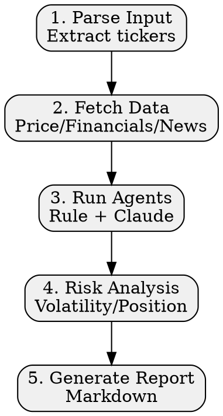

# Super Hedge Fund Skill

Multi-agent stock analysis system combining rule-based analytics with Claude-powered investor personas.

**⚠️ Educational purposes only - NOT investment advice**

## Workflow



## Agents Quick Reference

| Agent | Type | Focus |
|-------|------|-------|
| Fundamental | Rule | ROE, margins, debt, growth |
| Technical | Rule | EMA, RSI, MACD, momentum |
| Valuation | Rule | DCF, Owner Earnings |
| Sentiment | Rule+Claude | News, insider trades |
| Buffett | Claude | Moat, ROE, intrinsic value |
| Wood | Claude | Disruptive tech, growth |
| Burry | Claude | Deep value, contrarian |
| Lynch | Claude | PEG, understandable biz |

## Execution

**Step 1: Parse Input**
```
Extract: ticker symbols, date range, capital
Mode: full (default) or brief
```

**Step 2: Fetch Data**
```
Use WebSearch for:
- Current price & 52-week range
- Financial metrics (ROE, P/E, margins, debt)
- Recent news headlines
```

**Step 3: Run Agents**
```
Rule-based (deterministic):
- Fundamental analysis → signal + confidence
- Technical analysis → signal + confidence
- Valuation analysis → signal + confidence

Claude-powered (interpretive):
- For each investor persona, analyze with their philosophy
- Return: {signal, confidence, reasoning}
```

**Step 4: Risk Analysis**
```
Calculate: annual volatility from price data
Determine: risk level → position limit
  - Low (<15%): 25% max
  - Medium (15-30%): 20% max
  - High (30-50%): 15% max
  - Very High (>50%): 10% max
```

**Step 5: Aggregate & Output**
```
Count signals: bullish / bearish / neutral
Determine consensus by majority
Generate Markdown report
```

## Signal Icons

| Signal | Icon |
|--------|------|
| Bullish | 🟢 |
| Bearish | 🔴 |
| Neutral | 🟡 |

## Common Mistakes

| Mistake | Fix |
|---------|-----|
| Giving real investment advice | Always add disclaimer |
| Missing data errors | Use fallback estimates |
| Single-agent reliance | Must aggregate 8+ signals |
| Overconfident signals | Show confidence %, acknowledge uncertainty |

## References

- `references/investor-agents.md` - Investor persona prompts and frameworks
- `references/analysis-methods.md` - Detailed scoring and calculation methods
- `assets/report-template.md` - Markdown report template

## Scripts

- `scripts/analysts.py` - Rule-based analyst implementations
- `scripts/investor_prompts.py` - Claude investor persona prompts
- `scripts/report_generator.py` - Markdown report generation
- `scripts/data_fetcher.py` - Data fetching utilities
