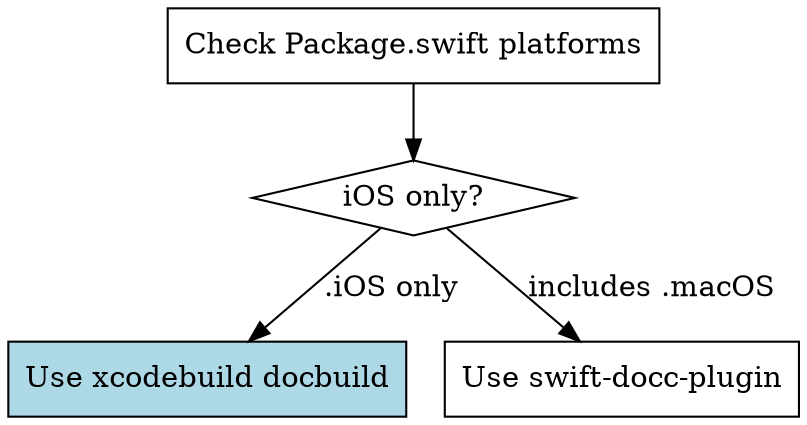

# Swift DocC to GitHub Pages

Automate Swift package documentation publishing to GitHub Pages via GitHub Actions.

## Which Build Method?



**Why?** `swift package generate-documentation` builds for macOS. iOS-only packages fail with "no such module 'UIKit'".

## Quick Reference

| Item             | Value                                                            |
| ---------------- | ---------------------------------------------------------------- |
| **Target name**  | From `Package.swift`: `.target(name: "MyLib")`                   |
| **URL format**   | `https://USER.github.io/REPO/documentation/targetnamelowercase/` |
| **Enable Pages** | Settings → Pages → Source → "GitHub Actions"                     |

## Workflow

Create `.github/workflows/docc.yml`. Replace `TARGET_NAME`, `TARGET_NAME_LOWERCASE`, `REPO_NAME`.

**iOS-only** (no Package.swift changes needed):

```yaml
name: Documentation

on:
  push:
    branches: [main]
  workflow_dispatch:

permissions:
  contents: read
  pages: write
  id-token: write

concurrency:
  group: pages
  cancel-in-progress: true

jobs:
  build:
    runs-on: macos-latest
    steps:
      - uses: actions/checkout@v6

      - name: Setup Xcode
        uses: maxim-lobanov/setup-xcode@v1
        with:
          xcode-version: latest-stable

      - name: Build Documentation
        run: |
          xcodebuild docbuild \
            -scheme TARGET_NAME \
            -destination "generic/platform=iOS Simulator" \
            -derivedDataPath .derivedData

          $(xcrun --find docc) process-archive transform-for-static-hosting \
            .derivedData/Build/Products/Debug-iphonesimulator/TARGET_NAME.doccarchive \
            --hosting-base-path REPO_NAME \
            --output-path ./docs

      - name: Add redirect
        run: |
          cat > ./docs/index.html << 'EOF'
          <!DOCTYPE html><html><head>
            <meta http-equiv="refresh" content="0; url=documentation/TARGET_NAME_LOWERCASE/">
          </head></html>
          EOF

      - uses: actions/upload-pages-artifact@v4
        with:
          path: ./docs

  deploy:
    needs: build
    runs-on: ubuntu-latest
    environment:
      name: github-pages
      url: ${{ steps.deployment.outputs.page_url }}
    steps:
      - uses: actions/deploy-pages@v4
        id: deployment
```

**Cross-platform:** Add dependency to `Package.swift`, replace Build Documentation step:

```swift
dependencies: [
    .package(url: "https://github.com/swiftlang/swift-docc-plugin", from: "1.1.0")
],
```

```yaml
- name: Build Documentation
  run: |
    swift package --allow-writing-to-directory ./docs \
      generate-documentation --target TARGET_NAME \
      --disable-indexing \
      --transform-for-static-hosting \
      --hosting-base-path REPO_NAME \
      --output-path ./docs
```

## Local Testing

```bash
# iOS-only
xcodebuild docbuild -scheme TARGET_NAME \
  -destination "generic/platform=iOS Simulator" -derivedDataPath .derivedData
$(xcrun --find docc) process-archive transform-for-static-hosting \
  .derivedData/Build/Products/Debug-iphonesimulator/TARGET_NAME.doccarchive \
  --hosting-base-path REPO_NAME --output-path ./docs

# Cross-platform
swift package --allow-writing-to-directory ./docs \
  generate-documentation --target TARGET_NAME \
  --transform-for-static-hosting --hosting-base-path REPO_NAME --output-path ./docs
```

## Common Mistakes

| Error                    | Fix                                         |
| ------------------------ | ------------------------------------------- |
| "no such module 'UIKit'" | iOS-only package: use `xcodebuild docbuild` |
| 404 at root URL          | Add redirect index.html step                |
| Empty documentation      | Ensure types are `public`                   |
| Wrong URL case           | Target in URL is always lowercase           |
| Pages not deploying      | Enable GitHub Actions as Pages source       |

## Optional

**Custom docs:** Add `Sources/TARGET_NAME/Documentation.docc/` with landing page and articles.

**Swift Package Index:** Add `.spi.yml` for automatic hosting:

```yaml
version: 1
builder:
  configs:
    - documentation_targets: [TARGET_NAME]
```
