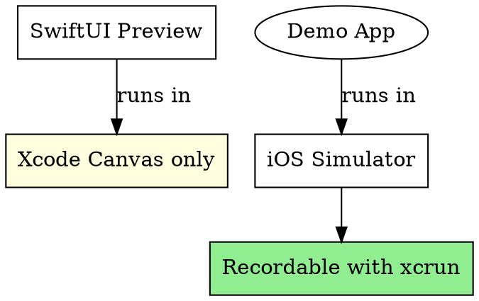

# Swift Package Demo Recording

## Overview

Record and optimize demo GIFs for Swift package READMEs. Swift packages need a **separate demo app** since SwiftUI previews only run in Xcode Canvas, not the iOS Simulator.

## When to Use

- Adding demo GIFs to a Swift package README
- Recording iOS Simulator for documentation
- User asks to "record a demo" or "add GIFs to README"

## Critical Understanding



**SwiftUI #Preview macros CANNOT be recorded.** You must create a demo app.

## Quick Reference

| Step            | Command/Action                                                 |
| --------------- | -------------------------------------------------------------- |
| Create demo dir | `mkdir -p demo`                                                |
| Boot simulator  | `xcrun simctl boot "iPhone SE (3rd generation)"`               |
| Open simulator  | `open -a Simulator`                                            |
| Record video    | `xcrun simctl io booted recordVideo --codec=h264 demo/raw.mov` |
| Stop recording  | `Ctrl+C`                                                       |
| Convert to GIF  | See FFmpeg command below                                       |
| Optimize GIF    | `gifsicle -O3 --lossy=80 demo/out.gif -o demo/out.gif`         |

## Demo App Setup

Create `demo/DemoApp/` with Xcode project that imports your package locally:

1. In Xcode: File → New → Project → iOS App
2. Save in `demo/DemoApp/`
3. File → Add Package Dependencies → Add Local → select package root
4. Import and use your library in the app

**Critical:** Use local package reference, not remote URL, to test current development code.

## Recording Commands

```bash
# Boot simulator (smaller = smaller GIF)
xcrun simctl boot "iPhone SE (3rd generation)"
open -a Simulator

# Run demo app in Xcode (Cmd+R), then record
xcrun simctl io booted recordVideo --codec=h264 demo/raw.mov
# Ctrl+C to stop
```

## GIF Conversion

**REQUIRED:** Before converting .mov files to GIF, you MUST ask the user using AskUserQuestion:

```
Question: "How should the GIF be sized?"
Options:
- Full size (keep entire screen including status bar)
- Cropped (remove status bar and bottom navigation)
```

Do NOT assume cropping. Do NOT convert without asking first.

### Full Size (default)

```bash
ffmpeg -i demo/raw.mov -filter_complex \
  "[0:v] fps=12,scale=300:-1:flags=lanczos,split [a][b]; \
   [a] palettegen=max_colors=128:stats_mode=diff [p]; \
   [b][p] paletteuse=dither=floyd_steinberg:diff_mode=rectangle" \
  -y demo/output.gif

gifsicle -O3 --lossy=80 demo/output.gif -o demo/output.gif
```

### Cropped (removes status bar and bottom nav)

```bash
ffmpeg -i demo/raw.mov -filter_complex \
  "[0:v] crop=in_w:in_h*0.55:0:in_h*0.12,fps=12,scale=300:-1:flags=lanczos,split [a][b]; \
   [a] palettegen=max_colors=128:stats_mode=diff [p]; \
   [b][p] paletteuse=dither=floyd_steinberg:diff_mode=rectangle" \
  -y demo/output.gif

gifsicle -O3 --lossy=80 demo/output.gif -o demo/output.gif
```

**Crop parameters:** `crop=in_w:in_h*0.55:0:in_h*0.12` keeps 55% height starting at 12% from top.

## README Integration

```markdown
<p align="center">
  &nbsp;&nbsp;
</p>
```

**Side-by-side:** Use `&nbsp;&nbsp;` between images, width 240-280px each.

## .gitignore

```gitignore
# Demo - ignore everything except GIFs
demo/*
!demo/*.gif
```

## Common Mistakes

| Mistake                                | Fix                                                        |
| -------------------------------------- | ---------------------------------------------------------- |
| Converting without asking about sizing | Always ask user: full size or cropped?                     |
| Trying to record SwiftUI previews      | Create demo app, run in simulator                          |
| "No devices booted" error              | Run `xcrun simctl boot "iPhone SE (3rd generation)"` first |
| Demo app uses remote package           | Use Add Local package reference                            |
| API mismatch after package changes     | Xcode → File → Packages → Reset Package Caches             |
| GIFs too large (>1MB)                  | Reduce fps (12), scale (300px), use gifsicle               |
| Recording before app runs              | Run app in Xcode (Cmd+R) first, THEN start recording       |

## Target Sizes

| Type         | Width     | FPS   | Target Size |
| ------------ | --------- | ----- | ----------- |
| Hero demo    | 280-300px | 12    | < 200KB     |
| Feature demo | 240px     | 10-12 | < 150KB     |
