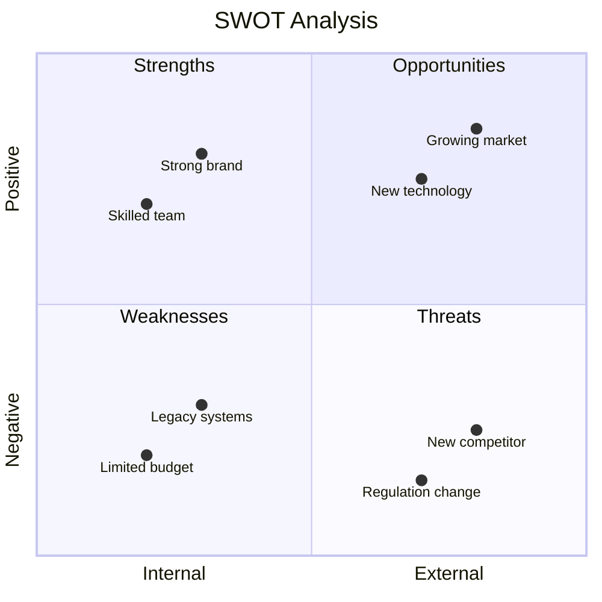
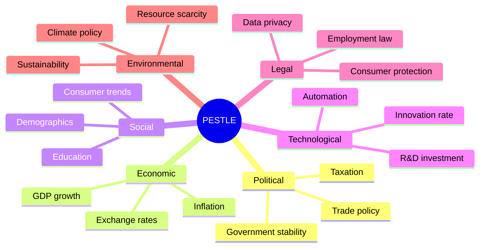
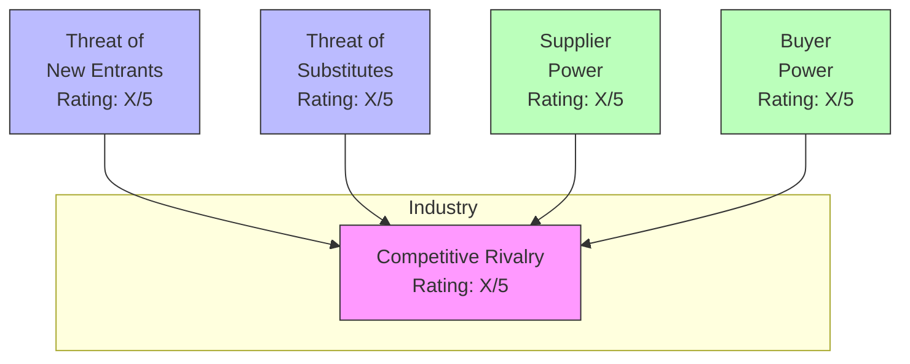

# Strategic Environmental Analysis

Perform strategic environmental analysis using SWOT, PESTLE, and Porter's Five Forces frameworks. Creates structured assessments for competitive positioning and strategic planning.

## What is Strategic Environmental Analysis?

Strategic environmental analysis examines internal and external factors that impact an organization's ability to achieve its objectives. Three complementary frameworks provide different perspectives:

| Framework | Focus | Perspective | Best For |
|-----------|-------|-------------|----------|
| **SWOT** | Internal + External | Organization-centric | Quick strategic assessment |
| **PESTLE** | External macro-environment | Environment-centric | Market entry, regulatory planning |
| **Porter's Five Forces** | Industry dynamics | Competition-centric | Industry attractiveness, positioning |

## Framework 1: SWOT Analysis

### What is SWOT?

SWOT analyzes four dimensions affecting strategic success:

| Dimension | Type | Question | Focus |
|-----------|------|----------|-------|
| **S**trengths | Internal | What do we do well? | Leverage |
| **W**eaknesses | Internal | What do we do poorly? | Improve or mitigate |
| **O**pportunities | External | What trends favor us? | Pursue |
| **T**hreats | External | What could harm us? | Defend against |

### SWOT Workflow

#### Step 1: Define Scope

```markdown
## SWOT Scope Definition

**Subject:** [Organization / Product / Initiative]
**Purpose:** [Strategic decision to inform]
**Time Horizon:** [Current state / 1-year / 3-year]
**Analyst:** swot-analyst
**Date:** [ISO date]
```

#### Step 2: Identify Strengths

Internal capabilities that provide competitive advantage:

| Category | Example Questions |
|----------|-------------------|
| **Resources** | Unique assets? Strong financials? Key partnerships? |
| **Capabilities** | Core competencies? Skilled workforce? Technology? |
| **Market Position** | Brand recognition? Customer loyalty? Market share? |
| **Culture** | Innovation culture? Agility? Employee engagement? |

#### Step 3: Identify Weaknesses

Internal limitations that hinder performance:

| Category | Example Questions |
|----------|-------------------|
| **Resources** | Funding gaps? Aging infrastructure? Missing skills? |
| **Capabilities** | Inefficient processes? Technical debt? Skill gaps? |
| **Market Position** | Weak brand? High churn? Limited reach? |
| **Culture** | Resistance to change? Silos? Leadership gaps? |

#### Step 4: Identify Opportunities

External conditions that could benefit the organization:

| Category | Example Questions |
|----------|-------------------|
| **Market** | Growing segments? Unmet needs? Geographic expansion? |
| **Technology** | Emerging tech? Automation potential? Digital channels? |
| **Regulatory** | Favorable regulation? Deregulation? Incentives? |
| **Competitive** | Competitor weaknesses? Market consolidation? |

#### Step 5: Identify Threats

External conditions that could harm the organization:

| Category | Example Questions |
|----------|-------------------|
| **Market** | Declining demand? Commoditization? Price pressure? |
| **Technology** | Disruption? Obsolescence? Cyber risks? |
| **Regulatory** | New compliance? Trade barriers? Legal risks? |
| **Competitive** | New entrants? Substitutes? Aggressive competitors? |

#### Step 6: Strategic Implications

Cross-reference quadrants to identify strategic options:

| Combination | Strategy Type | Approach |
|-------------|---------------|----------|
| **S-O** | Offensive | Use strengths to capture opportunities |
| **W-O** | Developmental | Address weaknesses to pursue opportunities |
| **S-T** | Defensive | Use strengths to counter threats |
| **W-T** | Survival | Minimize weaknesses and avoid threats |

### SWOT Output Format

```markdown
## SWOT Analysis: [Subject]

**Date:** [ISO date]
**Analyst:** swot-analyst
**Purpose:** [Strategic context]

### Strengths
| # | Strength | Impact | Evidence |
|---|----------|--------|----------|
| S1 | [Description] | High/Med/Low | [Supporting data] |

### Weaknesses
| # | Weakness | Impact | Evidence |
|---|----------|--------|----------|
| W1 | [Description] | High/Med/Low | [Supporting data] |

### Opportunities
| # | Opportunity | Impact | Timing |
|---|-------------|--------|--------|
| O1 | [Description] | High/Med/Low | Near/Mid/Long term |

### Threats
| # | Threat | Impact | Likelihood |
|---|--------|--------|------------|
| T1 | [Description] | High/Med/Low | High/Med/Low |

### Strategic Implications
| Strategy | S/W | O/T | Recommendation |
|----------|-----|-----|----------------|
| S-O: Offensive | S1, S2 | O1 | [Action] |
| W-O: Developmental | W1 | O2 | [Action] |
| S-T: Defensive | S3 | T1 | [Action] |
| W-T: Survival | W2 | T2 | [Action] |
```

### SWOT Mermaid Diagram



## Framework 2: PESTLE Analysis

### What is PESTLE?

PESTLE examines six macro-environmental factors:

| Factor | Focus | Example Considerations |
|--------|-------|------------------------|
| **P**olitical | Government, policy | Elections, trade policy, stability, taxation |
| **E**conomic | Economy, markets | GDP, inflation, interest rates, unemployment |
| **S**ocial | Society, demographics | Population, culture, lifestyle, attitudes |
| **T**echnological | Technology, innovation | R&D, automation, digital transformation |
| **L**egal | Laws, regulations | Employment law, consumer protection, IP |
| **E**nvironmental | Ecology, sustainability | Climate, resources, sustainability mandates |

### PESTLE Workflow

#### Step 1: Define Context

```markdown
## PESTLE Context

**Subject:** [Organization / Market / Initiative]
**Geography:** [Region / Country / Global]
**Time Horizon:** [Current / 1-3 years / 3-5 years]
**Purpose:** [Market entry / Strategy / Risk assessment]
```

#### Step 2: Analyze Each Factor

For each PESTLE factor:

1. **Identify relevant trends** in that category
2. **Assess impact** on your organization (positive/negative)
3. **Rate importance** (High/Medium/Low)
4. **Determine timing** (immediate/near-term/long-term)
5. **Identify strategic implications**

#### Step 3: Rate and Prioritize

| Impact Rating | Description |
|---------------|-------------|
| **High** | Fundamental to strategy, requires response |
| **Medium** | Moderate effect, should monitor |
| **Low** | Minimal impact, awareness only |

### PESTLE Output Format

```markdown
## PESTLE Analysis: [Subject]

**Date:** [ISO date]
**Geography:** [Scope]
**Analyst:** pestle-analyst

### Political Factors
| Factor | Trend | Impact | Importance | Timing | Implication |
|--------|-------|--------|------------|--------|-------------|
| [Factor] | [↑/↓/→] | +/- | H/M/L | Now/Near/Long | [Action] |

### Economic Factors
| Factor | Trend | Impact | Importance | Timing | Implication |
|--------|-------|--------|------------|--------|-------------|

### Social Factors
| Factor | Trend | Impact | Importance | Timing | Implication |
|--------|-------|--------|------------|--------|-------------|

### Technological Factors
| Factor | Trend | Impact | Importance | Timing | Implication |
|--------|-------|--------|------------|--------|-------------|

### Legal Factors
| Factor | Trend | Impact | Importance | Timing | Implication |
|--------|-------|--------|------------|--------|-------------|

### Environmental Factors
| Factor | Trend | Impact | Importance | Timing | Implication |
|--------|-------|--------|------------|--------|-------------|

### Summary: Key Factors
| Priority | Factor | Category | Strategic Response |
|----------|--------|----------|-------------------|
| 1 | [Most impactful] | [P/E/S/T/L/E] | [Action] |
| 2 | [...] | [...] | [...] |
```

### PESTLE Mermaid Diagram



## Framework 3: Porter's Five Forces

### What are the Five Forces?

Porter's Five Forces analyze industry structure and profitability:

| Force | Question | High = |
|-------|----------|--------|
| **Competitive Rivalry** | How intense is competition? | Lower profits |
| **Threat of New Entrants** | How easy to enter market? | More competition |
| **Threat of Substitutes** | Are alternatives available? | Price pressure |
| **Bargaining Power of Suppliers** | Can suppliers dictate terms? | Higher costs |
| **Bargaining Power of Buyers** | Can buyers dictate terms? | Lower prices |

### Five Forces Workflow

#### Step 1: Define Industry

```markdown
## Five Forces Context

**Industry:** [Specific industry definition]
**Scope:** [Geographic / Segment focus]
**Purpose:** [Entry decision / Positioning / Strategy]
**Date:** [ISO date]
```

#### Step 2: Analyze Each Force

**Competitive Rivalry:**

| Factor | Assessment |
|--------|------------|
| Number of competitors | Few / Many |
| Industry growth | High / Low |
| Product differentiation | High / Low |
| Exit barriers | High / Low |
| Fixed costs | High / Low |

**Threat of New Entrants:**

| Barrier | Height |
|---------|--------|
| Capital requirements | High / Low |
| Economies of scale | Strong / Weak |
| Brand loyalty | Strong / Weak |
| Regulatory barriers | High / Low |
| Access to distribution | Easy / Hard |

**Threat of Substitutes:**

| Factor | Assessment |
|--------|------------|
| Substitute availability | Many / Few |
| Switching costs | High / Low |
| Price-performance ratio | Better / Worse |
| Buyer propensity to switch | High / Low |

**Bargaining Power of Suppliers:**

| Factor | Assessment |
|--------|------------|
| Supplier concentration | High / Low |
| Differentiation of inputs | High / Low |
| Switching costs | High / Low |
| Forward integration threat | High / Low |

**Bargaining Power of Buyers:**

| Factor | Assessment |
|--------|------------|
| Buyer concentration | High / Low |
| Volume of purchases | Large / Small |
| Product differentiation | High / Low |
| Switching costs | High / Low |
| Price sensitivity | High / Low |

#### Step 3: Rate Forces

| Rating | Industry Attractiveness |
|--------|------------------------|
| 1 (Very Strong Force) | Very Unattractive |
| 2 (Strong Force) | Unattractive |
| 3 (Moderate Force) | Neutral |
| 4 (Weak Force) | Attractive |
| 5 (Very Weak Force) | Very Attractive |

### Five Forces Output Format

```markdown
## Porter's Five Forces: [Industry]

**Date:** [ISO date]
**Scope:** [Geography / Segment]
**Analyst:** five-forces-analyst

### Force Analysis

| Force | Rating (1-5) | Key Drivers | Strategic Implication |
|-------|--------------|-------------|----------------------|
| Competitive Rivalry | [1-5] | [Top factors] | [Response] |
| New Entrants | [1-5] | [Barriers] | [Response] |
| Substitutes | [1-5] | [Threats] | [Response] |
| Supplier Power | [1-5] | [Factors] | [Response] |
| Buyer Power | [1-5] | [Factors] | [Response] |

### Industry Attractiveness

**Overall Score:** [Sum/5 = Average]
**Assessment:** [Very Attractive / Attractive / Neutral / Unattractive / Very Unattractive]

### Strategic Recommendations

1. **[Priority 1]:** [Action to address strongest force]
2. **[Priority 2]:** [Action to build competitive advantage]
3. **[Priority 3]:** [Action to improve positioning]
```

### Five Forces Mermaid Diagram



## Combined Analysis

### When to Use Each Framework

| Scenario | SWOT | PESTLE | Five Forces |
|----------|------|--------|-------------|
| Quick strategic assessment | ✅ Primary | Supporting | - |
| Market entry decision | Supporting | ✅ Primary | ✅ Primary |
| Competitive positioning | ✅ Primary | Supporting | ✅ Primary |
| Regulatory planning | Supporting | ✅ Primary | - |
| Investment decision | ✅ Primary | ✅ Primary | ✅ Primary |
| Annual strategic review | ✅ Primary | ✅ Primary | Supporting |

### Integrated Analysis Workflow

For comprehensive strategic analysis:

1. **Start with PESTLE** - Understand macro-environment
2. **Apply Five Forces** - Analyze industry dynamics
3. **Conduct SWOT** - Position organization within context
4. **Synthesize** - Create unified strategic recommendations

### Structured Data (YAML)

```yaml
strategic_analysis:
  version: "1.0"
  date: "2025-01-15"
  analyst: "strategic-analyst"
  subject: "Acme Corp Market Expansion"

  swot:
    strengths:
      - id: S1
        description: "Strong brand recognition"
        impact: high
        evidence: "Top 3 in brand awareness surveys"
    weaknesses:
      - id: W1
        description: "Limited digital presence"
        impact: medium
        evidence: "20% of sales from online"
    opportunities:
      - id: O1
        description: "Growing Asian market"
        impact: high
        timing: near_term
    threats:
      - id: T1
        description: "New market entrant"
        impact: high
        likelihood: high

  pestle:
    political:
      - factor: "Trade agreements"
        trend: positive
        impact: positive
        importance: high
    economic:
      - factor: "Interest rates"
        trend: increasing
        impact: negative
        importance: medium
    # ... other factors

  five_forces:
    competitive_rivalry:
      rating: 3
      key_drivers: ["Many competitors", "Low differentiation"]
    threat_new_entrants:
      rating: 4
      key_drivers: ["High capital requirements"]
    threat_substitutes:
      rating: 2
      key_drivers: ["Digital alternatives emerging"]
    supplier_power:
      rating: 4
      key_drivers: ["Many suppliers available"]
    buyer_power:
      rating: 2
      key_drivers: ["Large buyer concentration"]
    overall_attractiveness: 3.0

  synthesis:
    key_insight: "Market attractive but digital disruption imminent"
    priority_actions:
      - "Accelerate digital transformation (address W1, T1)"
      - "Expand Asian operations (leverage S1, capture O1)"
      - "Build strategic supplier partnerships (counter S-T)"
```

## When to Use Strategic Analysis

| Scenario | Recommended Approach |
|----------|---------------------|
| Annual planning | SWOT + PESTLE |
| New market entry | PESTLE + Five Forces |
| Competitive response | SWOT + Five Forces |
| M&A due diligence | All three frameworks |
| Product launch | SWOT (focused) |
| Risk assessment | PESTLE (focused) |

## Integration

### Upstream

- **stakeholder-analysis** - Identify who provides input
- **capability-mapping** - Link strengths to capabilities
- **Domain research** - Gather market data

### Downstream

- **Requirements** - Strategic requirements
- **Business cases** - Investment justification
- **Roadmaps** - Strategic initiatives

## Related Skills

- `capability-mapping` - Internal capability assessment
- `stakeholder-analysis` - Stakeholder perspectives
- `value-stream-mapping` - Operational efficiency
- `benchmarking` - Competitive comparison
- `risk-analysis` - Risk identification and mitigation

## Version History

- **v1.0.0** (2025-12-26): Initial release
