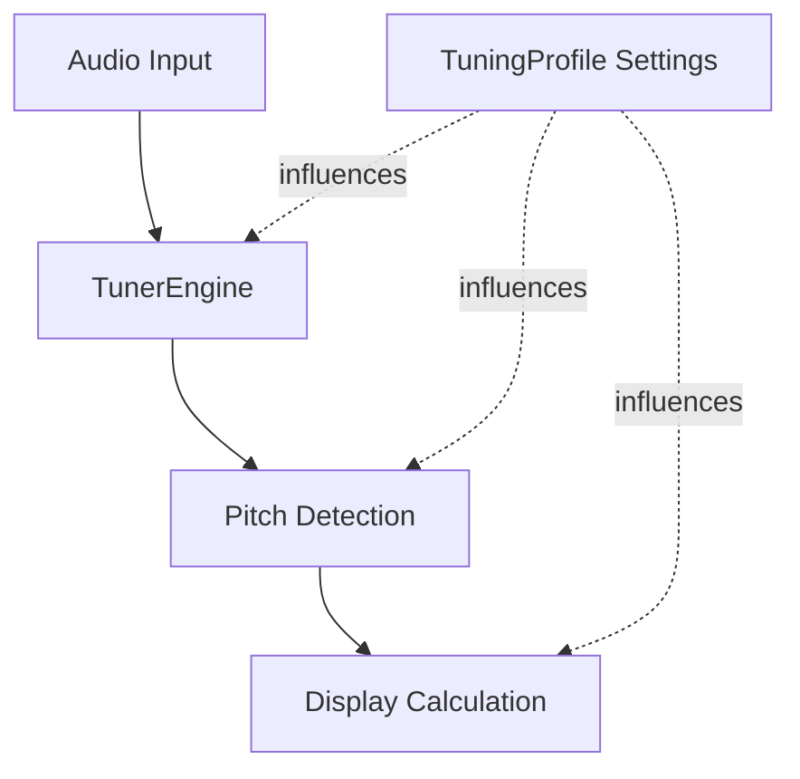

# Technical Architecture Documentation Generator

Write comprehensive technical architecture documents for the saxjaxTunerIntelligent project, focusing on audio processing pipeline and settings integration.

## Document Structure

### Part 1: Core Audio Architecture & Data Flow

1. **Technology Stack & High-Level Design**
   - Core technologies: Swift, SwiftUI, AudioKit
   - High-level audio flow: Microphone → AudioKit Engine → Pitch Tap → Detection → ViewModel → View
   - **Include Mermaid.js flow diagram**

2. **TunerEngine.swift Deep Dive**
   - **Role & Responsibility**: Central audio operations manager
   - **AudioKit Integration**: How it uses AudioEngine, InputDevice, Mixer nodes
   - **Input and Pitch Tap**: 
     - How audio is captured from microphone
     - Explain tap concept (`installTap`) for real-time, non-destructive analysis
   - **Pitch Detection Algorithm**:
     - Which algorithm is used (YIN, DYWA, HPS, etc.)
     - Reference `PitchDetectorType.swift` for abstraction
   - **Output Data Flow**:
     - Data structure (PitchResult, DetectedNote)
     - How results pass to TunerViewModel (delegate, Combine, callback)

### Part 2: Settings Integration & Functional Impact

**Include high-level Mermaid diagram** showing how settings influence main data flow

For each setting, provide:
1. **Setting Name**
2. **User Interface (UI)**: Where configured (SettingsView, QuickAccessBar)
3. **Data Model & State**: Where stored (TuningProfile, TunerViewModel)
4. **Core Logic Integration**: How TunerEngine uses this value
5. **Functional Impact & Purpose**: Effect on algorithm/UI, why musicians use it, practical example

### Settings to Analyze
- Transposition
- A4 Frequency / Kammertone
- Tuning Tolerance
- Sound Playback (reference tone)

## Mermaid Diagram Examples

### Audio Flow

### Settings Integration

## Writing Guidelines
- Be exceptionally specific and clear
- Reference actual file names and component names
- Include code locations where relevant
- Explain data flow with precision
- Use visual diagrams to clarify complex flows
- Target audience: Senior engineer new to the project
