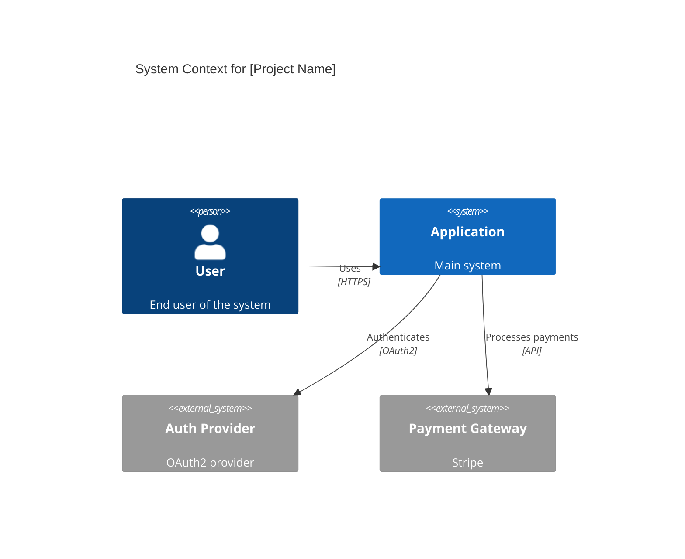
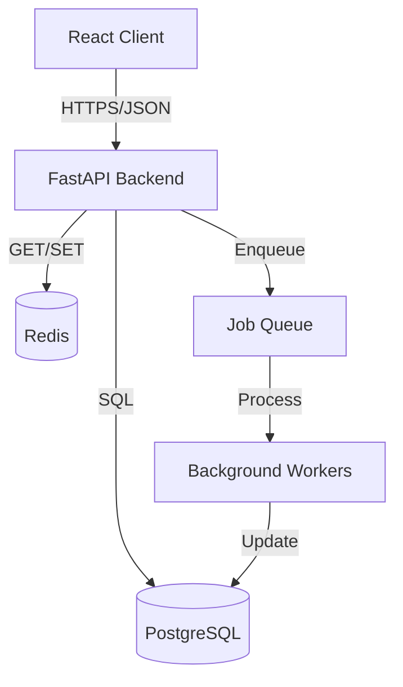
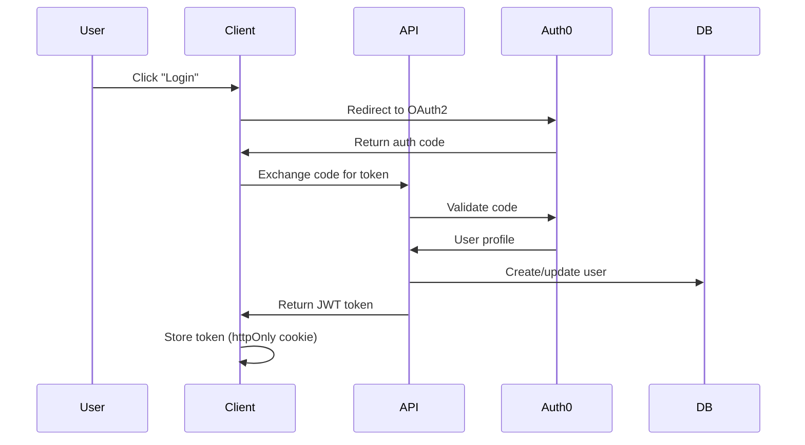
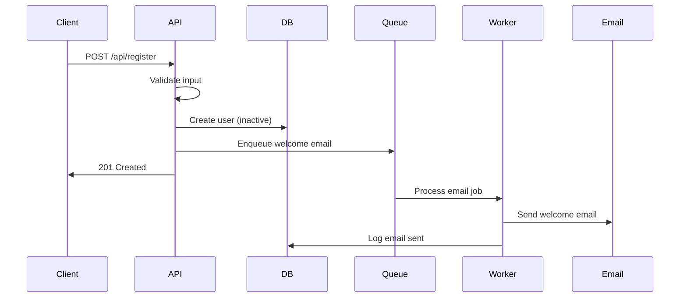
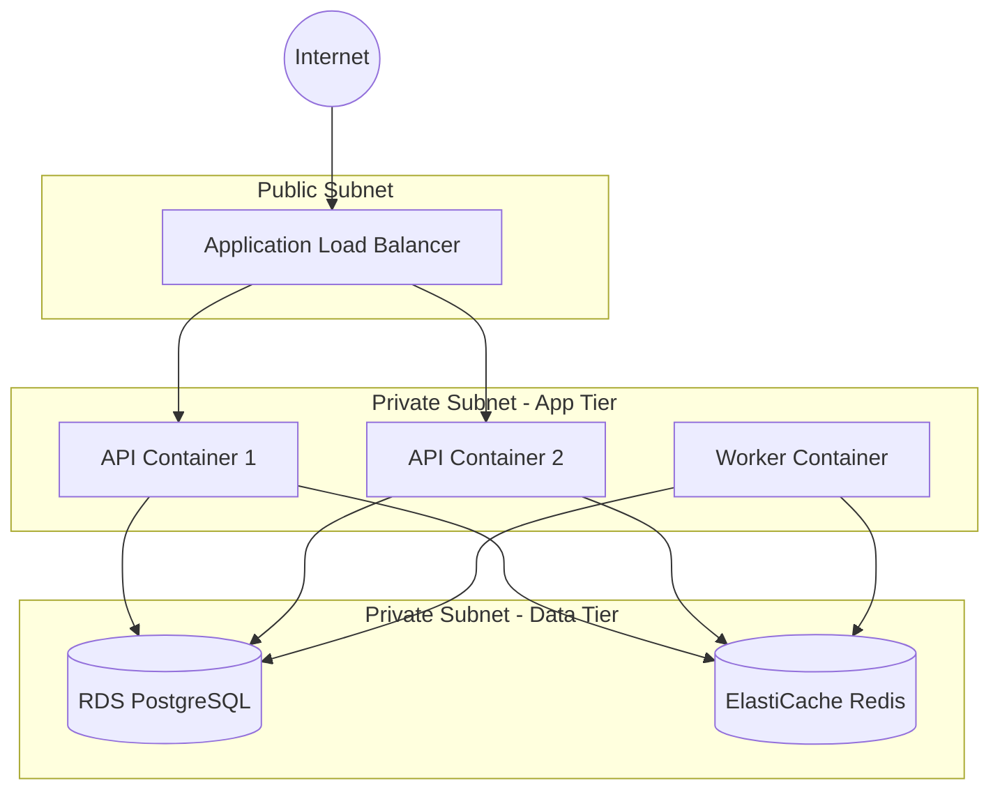

# Tech Stack Architect

## Purpose
Generate comprehensive technology stack selection and system architecture design from project requirements. Creates two foundational documents that guide implementation.

## When to Use
- Starting a new project after PROJECT-OVERVIEW.md is created
- Re-architecting existing systems
- Technology evaluation and selection
- Architecture documentation needed
- User mentions "tech stack", "architecture", "system design"

## Behavior

### Phase 1: Technology Stack Selection

1. **Read PROJECT-OVERVIEW.md** for:
   - Project goals and constraints
   - Scale requirements (users, data, traffic)
   - Team skills and preferences
   - Budget and timeline
   - Compliance requirements

2. **Analyze requirements** across 4 categories:
   - Frontend (framework, state management, UI library)
   - Backend (language, framework, API style)
   - Database (RDBMS, NoSQL, caching, search)
   - DevOps (hosting, CI/CD, monitoring, security)

3. **Generate TECH-STACK.md** with:
   - **Category tables**: Technology | Rationale | Alternatives Considered
   - **Integration notes**: How technologies work together
   - **Trade-offs**: What you gain/lose with this stack
   - **Migration path**: How to evolve the stack
   - **Team considerations**: Learning curve, hiring, support

### Phase 2: System Architecture Design

1. **Design components**:
   - Client-side architecture
   - API layer and services
   - Data storage and caching
   - Background jobs and queues
   - External integrations

2. **Define data flow**:
   - Request/response paths
   - Authentication flow
   - Data persistence patterns
   - Event-driven flows (if applicable)

3. **Generate ARCHITECTURE.md** with:
   - **System Overview**: High-level component diagram (C4 Context)
   - **Component Details**: Responsibilities, interfaces, dependencies
   - **Data Flow Diagrams**: Key user journeys with sequence diagrams
   - **Scalability Strategy**: Horizontal scaling, caching, load balancing
   - **Security Architecture**: Auth, encryption, OWASP considerations
   - **Mermaid Diagrams**: C4, sequence, data flow, deployment

## Output Style
- Use `table-based` for technology comparisons
- Use `markdown-focused` with mermaid diagrams for architecture
- Keep rationales concise (1-2 sentences per choice)
- Include visual diagrams for clarity

## Output Files

### 1. project-management/TECH-STACK.md
```markdown
# Technology Stack

## Summary
[2-3 sentence overview of the stack philosophy]

## Frontend Stack

| Technology | Choice | Rationale | Alternatives Considered |
|------------|--------|-----------|------------------------|
| Framework | React 18 | ... | Vue, Svelte, Angular |
| State | Zustand | ... | Redux, Jotai, Context |
| UI Library | Tailwind + shadcn/ui | ... | MUI, Chakra, custom |
| Build | Vite | ... | Webpack, Turbopack |

## Backend Stack

| Technology | Choice | Rationale | Alternatives Considered |
|------------|--------|-----------|------------------------|
| Language | Python 3.11 | ... | Node.js, Go, Rust |
| Framework | FastAPI | ... | Django, Flask, Express |
| API Style | REST + OpenAPI | ... | GraphQL, gRPC, tRPC |

## Database & Storage

| Technology | Choice | Rationale | Alternatives Considered |
|------------|--------|-----------|------------------------|
| Primary DB | PostgreSQL 15 | ... | MySQL, MongoDB, SQLite |
| Caching | Redis | ... | Memcached, Valkey |
| Search | ElasticSearch | ... | Algolia, Meilisearch |
| Object Storage | S3 | ... | MinIO, CloudFlare R2 |

## DevOps & Infrastructure

| Technology | Choice | Rationale | Alternatives Considered |
|------------|--------|-----------|------------------------|
| Hosting | AWS ECS Fargate | ... | k8s, VM, serverless |
| CI/CD | GitHub Actions | ... | GitLab CI, CircleCI |
| Monitoring | DataDog | ... | Grafana, New Relic |
| Secrets | AWS Secrets Manager | ... | Vault, Doppler |

## Integration Notes
- [How frontend talks to backend]
- [Database connection pooling strategy]
- [Caching layer integration]
- [CI/CD pipeline flow]

## Trade-offs
**Gains**: [What this stack provides]
**Costs**: [Complexity, vendor lock-in, learning curve]

## Migration Path
- Phase 1: [Initial minimal stack]
- Phase 2: [Add caching, search]
- Phase 3: [Scale horizontally]

## Team Considerations
- **Learning Curve**: [Estimate for team]
- **Hiring**: [Availability of talent]
- **Support**: [Community, docs, enterprise support]
```

### 2. project-management/ARCHITECTURE.md
```markdown
# System Architecture

## Overview
[2-3 sentence description of the system]

## C4 Context Diagram


## Component Architecture


### Component Details

**Client (React)**
- **Responsibilities**: UI rendering, state management, client-side validation
- **Key Libraries**: React Router, Zustand, React Query
- **Interfaces**: REST API via fetch/axios

**API (FastAPI)**
- **Responsibilities**: Business logic, validation, auth, rate limiting
- **Key Modules**: auth, users, payments, notifications
- **Interfaces**: REST endpoints (OpenAPI), WebSocket (notifications)

**Database (PostgreSQL)**
- **Responsibilities**: Persistent data storage, relational integrity
- **Schema**: Users, sessions, transactions, audit logs
- **Patterns**: Repository pattern, connection pooling

**Cache (Redis)**
- **Responsibilities**: Session storage, rate limiting, job queue
- **TTL Strategy**: Sessions (24h), API cache (5m), rate limits (1h)

**Background Workers**
- **Responsibilities**: Email sending, report generation, cleanup jobs
- **Queue**: Redis-backed Celery/ARQ
- **Monitoring**: Dead letter queue, retry logic

## Authentication Flow


## Data Flow: User Registration


## Scalability Strategy

### Horizontal Scaling
- **API**: Stateless containers (2-10 instances behind ALB)
- **Database**: Read replicas for reporting queries
- **Cache**: Redis Cluster (3+ nodes)
- **Workers**: Auto-scale based on queue depth

### Caching Strategy
- **API Responses**: Cache GET endpoints (5m TTL)
- **Database Queries**: Query result cache in Redis
- **Static Assets**: CDN (CloudFront) with edge caching

### Load Balancing
- **Application**: AWS ALB with health checks
- **Database**: pgpool for read/write splitting
- **Geographic**: Multi-region deployment (future)

## Security Architecture

### Authentication & Authorization
- **Strategy**: OAuth2 + JWT tokens (15m access, 7d refresh)
- **Storage**: httpOnly cookies for web, secure storage for mobile
- **Rotation**: Automatic token refresh

### Data Protection
- **At Rest**: PostgreSQL encryption (AWS RDS)
- **In Transit**: TLS 1.3 for all connections
- **Secrets**: AWS Secrets Manager, rotated monthly

### OWASP Top 10 Mitigations
- **Injection**: Parameterized queries (SQLAlchemy ORM)
- **Auth**: JWT validation, session management
- **XSS**: Content Security Policy, input sanitization
- **CSRF**: SameSite cookies, CSRF tokens
- **Rate Limiting**: Redis-backed (100 req/min per IP)

### Network Security
- **VPC**: Private subnets for DB/workers
- **Security Groups**: Least privilege access
- **WAF**: CloudFront WAF rules

## Deployment Architecture


## Monitoring & Observability

**Metrics**:
- API latency (p50, p95, p99)
- Error rates by endpoint
- Database connection pool usage
- Cache hit/miss ratios

**Logging**:
- Structured JSON logs (ECS logs to CloudWatch)
- Request ID tracing across services
- Error tracking (Sentry)

**Alerting**:
- API error rate >1%
- Database connections >80%
- Job queue depth >1000

## Future Considerations

**Phase 2 Enhancements**:
- GraphQL API option
- WebSocket real-time updates
- ElasticSearch for full-text search

**Phase 3 Scale**:
- Multi-region deployment
- Event-driven microservices
- CQRS for read-heavy workloads
```

## Guardrails
- Keep technology choices pragmatic (avoid hype-driven development)
- Consider team skills when selecting stack
- Prefer managed services over self-hosted for DevOps
- Include alternatives to show deliberate choice
- Use mermaid for all diagrams (portable, version-controllable)
- Keep each document under 400 lines
- Link to official docs for each technology

## Integration
- Run after PROJECT-OVERVIEW.md is created
- Feed into `/lazy plan` for user story creation
- Reference during `/lazy code` for implementation consistency
- Update during `/lazy review` if architecture evolves

## Example Prompt
> Design the tech stack and architecture for this project

## Validation Checklist
- [ ] TECH-STACK.md has all 4 categories (Frontend, Backend, Database, DevOps)
- [ ] Each technology has rationale and alternatives
- [ ] ARCHITECTURE.md has system overview + 3+ mermaid diagrams
- [ ] Authentication and data flow are documented
- [ ] Scalability and security sections are complete
- [ ] Trade-offs and migration path are clear
