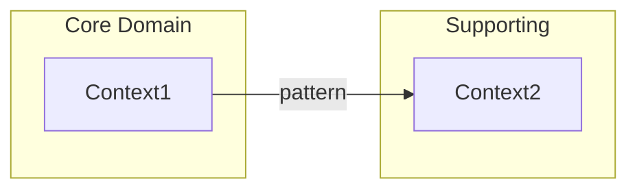

# Context Mapping Skill

Map relationships between bounded contexts using Domain-Driven Design context mapping patterns. Produces Context Mapper DSL (CML) output and integration strategy recommendations.

## When to Use This Skill

**Keywords:** context mapping, bounded contexts, upstream, downstream, ACL, anti-corruption layer, shared kernel, customer supplier, open host service, published language, conformist, partnership, CML, integration patterns, domain relationships

**Use this skill when:**

- After event storming when bounded contexts have been identified
- Defining integration strategies between domains
- Documenting domain relationships and dependencies
- Generating context map diagrams (Mermaid/PlantUML)
- Creating Context Mapper DSL (CML) output
- Planning team boundaries based on context relationships
- Identifying where anti-corruption layers are needed

## Context Mapping Patterns

Eight strategic DDD patterns for defining context relationships:

### Symmetric Patterns (Equal Relationship)

| Pattern | Abbrev | Description | Use When |
| ------- | ------ | ----------- | -------- |
| **Shared Kernel** | SK | Shared code/model between contexts | Two contexts need identical domain logic |
| **Partnership** | P | Equal collaboration, mutual dependency | Teams co-evolve, no clear upstream/downstream |

### Asymmetric Patterns (Upstream/Downstream)

| Pattern | Abbrev | Description | Use When |
| ------- | ------ | ----------- | -------- |
| **Customer/Supplier** | C/S | Upstream supplies, downstream consumes | Clear provider/consumer relationship |
| **Conformist** | CF | Downstream adopts upstream model | Downstream team has no leverage to negotiate |
| **Anti-Corruption Layer** | ACL | Downstream translates upstream model | Upstream model doesn't fit downstream needs |
| **Open Host Service** | OHS | Upstream provides formal API | Multiple consumers need standardized access |
| **Published Language** | PL | Standardized API format (OpenAPI, etc.) | Cross-team communication requires contract |

### No Integration

| Pattern | Abbrev | Description | Use When |
| ------- | ------ | ----------- | -------- |
| **Separate Ways** | SW | No integration, independent evolution | Contexts have no meaningful relationship |

**For detailed pattern descriptions with examples:** See [references/pattern-catalog.md](references/pattern-catalog.md)

## Pattern Selection Guide

### Decision Flow

```text
Do the contexts share code or data model?
├── Yes → Shared Kernel [SK]
└── No → Is there a clear data/service flow?
    ├── No → Do teams collaborate equally?
    │   ├── Yes → Partnership [P]
    │   └── No → Separate Ways [SW]
    └── Yes → Identify Upstream (provider) and Downstream (consumer)
        └── Can downstream influence upstream's model?
            ├── No → Does upstream model fit downstream needs?
            │   ├── Yes → Conformist [CF]
            │   └── No → Anti-Corruption Layer [ACL]
            └── Yes → Customer/Supplier [C/S]
                └── Does upstream serve multiple consumers?
                    ├── Yes → Add Open Host Service [OHS]
                    │   └── Needs contract? → Add Published Language [PL]
                    └── No → Basic C/S is sufficient
```

**For detailed selection criteria:** See [references/pattern-selection.md](references/pattern-selection.md)

## Context Mapper DSL (CML)

### Basic Syntax

```cml
ContextMap <MapName> {
    contains <Context1>
    contains <Context2>

    // Asymmetric: Downstream [D] <- Upstream [U]
    <DownstreamContext> [D,<patterns>]<-[U,<patterns>] <UpstreamContext>

    // Symmetric: Both sides equal
    <Context1> [<patterns>]<->[<patterns>] <Context2>
}
```

### Notation Reference

| Symbol | Meaning |
| ------ | ------- |
| `[D]` | Downstream context |
| `[U]` | Upstream context |
| `<-` | Asymmetric relationship (upstream to downstream) |
| `<->` | Symmetric relationship |
| `[D,C]` | Downstream + Customer |
| `[U,S]` | Upstream + Supplier |
| `[D,ACL]` | Downstream with Anti-Corruption Layer |
| `[U,OHS,PL]` | Upstream with Open Host Service + Published Language |
| `[SK]` | Shared Kernel (symmetric) |
| `[P]` | Partnership (symmetric) |
| `[CF]` | Conformist |

**For complete CML syntax:** See [references/cml-syntax.md](references/cml-syntax.md)

## Multi-Mode Execution

### Mode Selection

| Mode | Description | Use When |
| ---- | ----------- | -------- |
| `full` | Systematically analyze all bounded contexts | Comprehensive mapping, larger domains |
| `quick` | Identify obvious relationships only | Quick overview, small domains |
| `guided` | Interactive, confirm each relationship | Learning, validation, uncertain relationships |

### Full Mode Protocol

1. **Inventory** - List all bounded contexts with aggregates
2. **Dependency Scan** - Identify data flow and service calls
3. **Pattern Assignment** - Apply selection criteria systematically
4. **CML Generation** - Produce complete context map
5. **Diagram Generation** - Create visual representation
6. **Review Output** - Mark uncertain relationships for human review

### Quick Mode Protocol

1. **Context List** - Enumerate known bounded contexts
2. **Obvious Relationships** - Map clear upstream/downstream pairs
3. **Basic CML** - Generate minimal context map
4. **Skip Ambiguous** - Flag uncertain relationships for later

### Guided Mode Protocol

1. **Present Context Pair** - Show two contexts to user
2. **Ask Relationship** - "Do these contexts interact?"
3. **Determine Direction** - "Which provides data/services?"
4. **Select Pattern** - Present pattern options with explanations
5. **Confirm** - Verify user agrees with classification
6. **Repeat** - Continue for all context pairs

## Output Artifacts

### 1. Context Mapper DSL (CML) File

```cml
/* Context Map: <DomainName>
 * Generated: <date>
 * Source: Event storming session
 */

ContextMap <DomainName>Map {
    contains <Context1>
    contains <Context2>
    // ... relationships
}
```

### 2. Mermaid Diagram



### 3. Integration Strategy Report

```markdown
## Integration Strategies

### <Context1> -> <Context2>
- **Pattern:** Customer/Supplier
- **Direction:** Context1 (upstream) supplies Context2 (downstream)
- **Rationale:** <why this pattern>
- **Implementation:** <technical approach>
- **Team Impact:** <organizational considerations>
```

### 4. Team Topology Suggestions

Based on context relationships, suggest team boundaries following Team Topologies patterns (Stream-aligned, Platform, Enabling, Complicated Subsystem).

**For team topology guidance:** See [references/team-topologies.md](references/team-topologies.md)

## Integration with Event Storming

### Input from Event Storming

Context mapping consumes:

- **Bounded Contexts** - Named domain boundaries with primary aggregates
- **Domain Events** - Events that cross context boundaries
- **Commands** - Operations that trigger cross-context communication
- **Actors** - Users/systems that interact with multiple contexts

### Workflow Integration

```text
Domain Storytelling
    ↓ (understand business flow)
Event Storming
    ↓ (discover bounded contexts)
Context Mapping ← YOU ARE HERE
    ↓ (define relationships)
Modular Architecture
    ↓ (implement structure)
Fitness Functions
    (enforce boundaries)
```

### Cross-Context Event Identification

When mapping contexts, identify:

1. **Events crossing boundaries** - Indicate integration needs
2. **Shared aggregates** - Potential Shared Kernel candidates
3. **Translation requirements** - ACL candidates
4. **API contracts** - OHS/PL candidates

## Integration Strategies

For each pattern, there's a recommended technical implementation:

| Pattern | Implementation Strategy |
| ------- | ---------------------- |
| Shared Kernel | Shared NuGet package, common project reference |
| Customer/Supplier | Internal API, MediatR notifications |
| Anti-Corruption Layer | Adapter pattern, translation service |
| Open Host Service | REST API, gRPC service |
| Published Language | OpenAPI spec, Protobuf definitions |
| Partnership | Shared event bus, bilateral contracts |
| Conformist | Direct model adoption, no translation |
| Separate Ways | No integration code needed |

**For detailed implementation guidance:** See [references/integration-strategies.md](references/integration-strategies.md)

## Example Output

### E-Commerce Domain Context Map

```cml
/* Context Map: E-Commerce Platform
 * Generated: 2025-01-15
 * Bounded Contexts from event storming session
 */

ContextMap ECommercePlatform {
    contains OrderContext
    contains InventoryContext
    contains PaymentContext
    contains ShippingContext
    contains CustomerContext

    /* Order consumes inventory availability
     * Inventory owns stock truth, Order queries it
     */
    OrderContext [D,C]<-[U,S] InventoryContext

    /* Payment isolates external gateway
     * Gateway has foreign model, needs translation
     */
    PaymentContext [D,ACL]<-[U,OHS,PL] ExternalPaymentGateway

    /* Order and Shipping co-evolve
     * Both teams collaborate on fulfillment flow
     */
    OrderContext [P]<->[P] ShippingContext

    /* Customer data shared
     * CustomerInfo value object used by multiple contexts
     */
    OrderContext [SK]<->[SK] CustomerContext
    ShippingContext [SK]<->[SK] CustomerContext
}
```

## Honest Limitations

### What This Skill Does Well

- Systematic pattern identification from bounded contexts
- CML syntax generation for Context Mapper tooling
- Integration strategy recommendations based on patterns
- Team topology alignment suggestions
- Mermaid/PlantUML diagram generation

### What Requires Human Input

- **Team dynamics** - Actual organizational politics and relationships
- **Business priorities** - Which integrations matter most
- **Legacy constraints** - Existing systems that limit options
- **Change appetite** - Organizational readiness for restructuring
- **Trade-off decisions** - When multiple patterns could work

All outputs clearly distinguish recommendations from requirements and flag uncertain classifications for human review.

## Related Skills

- **event-storming** - Discover bounded contexts (prerequisite)
- **domain-storytelling** - Understand business flow (optional prerequisite)
- **modular-architecture** - Implement module structure (next step)
- **adr-management** - Document integration decisions
- **architecture-documentation** - Generate architecture diagrams

## References

- [Pattern Catalog](references/pattern-catalog.md) - All 8 patterns with examples
- [CML Syntax](references/cml-syntax.md) - Context Mapper DSL reference
- [Pattern Selection](references/pattern-selection.md) - Decision guide
- [Integration Strategies](references/integration-strategies.md) - Technical implementation
- [Team Topologies](references/team-topologies.md) - Organizational alignment

## Version History

- v1.0.0 (2025-12-22): Initial release - Context mapping patterns, CML output, multi-mode execution

---

**Last Updated:** 2025-12-22
**Model:** claude-opus-4-5-20251101
