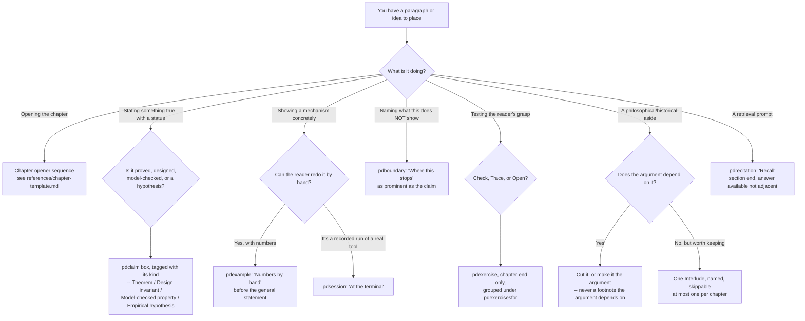

# Textbook Craft

Turn a chapter of formal, honest research prose into a chapter a reader can
actually learn from — using the habits the best math and CS textbooks share,
verified against the seed research and this project's own reading-flow
measurements, not invented from taste.

## When to Use

✅ Use for: drafting or reviewing a chapter opener (epigraph, scene, claim
box); deciding whether something is a worked example, a claim, a boundary, or
an exercise, and where it belongs on the page; placing or auditing an exercise
ladder; checking a chapter's claims are labeled with an honest epistemic kind;
running `scripts/chapter_lint.py` against a `.tex` chapter and acting on its
findings; deciding whether a philosophical/historical aside earns an
Interlude or should be cut.

❌ NOT for: writing a standalone result write-up, execution report, or paper
section (`harbor-exposition` — the seven-moves-plus-two-rails style for one
self-contained argument, not a multi-page chapter with its own exercises and
handoff); drawing or QA-ing a figure (`harbor-chartwork`); LaTeX build/compile
mechanics or the three-edition pipeline (`latex-whitepaper-engineering`,
`HANDOFF-TEXTBOOK.md`); deciding a chapter's spine or which propositions it
covers (an author/editorial decision this skill does not make).

## Relationship to `harbor-exposition`

Both skills share the same honesty discipline and the same instinct
(motivate before formalizing, box the claim, name the boundary as
prominently as the claim). They differ in unit and stakes:

| | `harbor-exposition` | `textbook-craft` |
|---|---|---|
| Unit | One result: statement + numbers + boundary | One chapter: many results, an opener, exercises, a handoff |
| Reader entry | Cold, once | Returning across chapters (spiral, interleaved review) |
| Apparatus | Two rails, two figures | Page grammar, exercise ladder, chapter-close sequence |
| Owns | The seven-moves template, `check_style.py` | The chapter template, `chapter_lint.py` |

A chapter written under this skill still uses `harbor-exposition`'s move
order *inside* a single result (scene → one-breath claim → analogy → box →
numbers → application → boundary); this skill wraps that unit in an opener,
places it among a chapter's other results, and closes the chapter with
exercises and a handoff neither skill's other half owns alone.

## Core Process: which page element does this paragraph need?

## The chapter template (page-by-page)

Full sequence, sourced from the seed memo's §7.1, in
`references/chapter-template.md`. In brief: **page 1** is number+title, one
or two epigraphs (Chicago ¶1.37), a failure scene with a number in it, the
question in one italic sentence, and the claim boxed with its kind. **Page 2**
is three objections in their best form, the route with an express lane, and
the first worked example — hand-checkable, before any definition. Nothing
else appears on these two pages: no abstract, no keyword list, no
reading-time estimate, no learning-objective bullets, no result table.

Every theorem gets a **Proof idea** in plain English before the proof
(Sipser, Lamport). A proof over ~10 lines is hierarchically structured with a
final Q.E.D. restating the goal. A chapter closes, in order: Review of the
Key Ideas → chapter-end Exercises, grouped by section → History and
references → the handoff (what this chapter deliberately did not solve).

## The exercise ladder

Three kinds only — **Check** (short, closed), **Trace** (walk a mechanism by
hand), **Open** (a design/proof obligation, no closed form) — rated 1–3
stars for how much apparatus they need, not raw difficulty. Placed at chapter
end, grouped by the section they test, with a margin pointer where the
cluster used to interrupt the body. Fade the ladder: a fully worked example,
then a Check with the last step removed, then a Trace, then an Open that
supplies the whole plan. Full detail, Pólya's four phases, and
Mason–Burton–Stacey's four processes mapped onto the chapter opener:
`references/exercise-design.md`.

**Solution-key rules** (project-internal, non-negotiable): where an exercise
rests on a false premise, the solution repairs the premise, not the requested
conclusion. An Open exercise gets a defensible obligation, never a fabricated
closed form.

## Worked-example discipline

At least one per section, always before that section's general statement,
with numbers a reader can redo on paper — never a schematic calculation with
letters standing in for numbers that were never chosen. The `pdexample`
head ("Numbers by hand") is a promise: if a passage cannot honestly claim the
reader could redo it, it is not a worked example. Fade across a section's
sequence (`references/exercise-design.md` §Fading); name *why* each step is
taken, not only what it is (the self-explanation effect,
`references/learning-science.md`).

## Page grammar: what may be boxed, what may not

From `whitepaper/figures/pd-pedagogy.tex`, the actual macro vocabulary — use
these names, not new ones:

| Content kind | Environment/macro | How it renders | May it use a tinted fill? |
|---|---|---|---|
| A claim with a status | `pdclaim{KIND}{...}` | hairline, small-caps run-in head, hairline | No |
| A boundary | `pdboundary` | plain ink bar at the left, no fill | No |
| A worked example | `pdexample` | two hairlines, italic run-in head, margin glyph | No |
| A recorded run | `pdsession[title]` | full-width monospace, bold input / regular output | No |
| A retrieval prompt | `pdrecitation` | margin list ("Recall") or compact numbered list | No |
| An exercise | `pdexercise[kind=,rating=]{label}` | numbered hanging paragraph, margin solution pointer | No |
| A chapter-end grouping | `pdexercisesfor{...}{...}`, `pdexercisepointer(one)` | small-caps head; margin pointer at point of use | No |
| A key idea / pitfall / scene / see-also / pull-quote | `\keyidea`, `\pitfall`, `\scene`, `\xrefbox`, `\pullquote` | run-in or margin head, plain prose | **No — the legacy tikz/fill versions are retired** |

**A page never paints a background.** Content kind is signalled by
typography and the margin, never by a tinted rectangle — this is not a
preference, it is Wave 12's own measured fix (`READING-FLOW-AUDIT.md` F2: "five
content kinds signalled by five tinted rectangles; nothing readable at a
glance," now "page grammar by typography and margin; no fills"). A chapter
that still defines `\keyidea`/`\pitfall`/`\exercises{...}` etc. as
`tikzpicture` nodes with `fill=...` is either (a) dead — `figures/pd-pedagogy.tex`'s
own `\AtBeginDocument` block re-`\long\def`'s that *exact macro name*, so the
chapter's own preamble definition never runs at render time no matter
whether the chapter imports the file — or (b) actually rendering tinted
boxes today, because pd-pedagogy.tex does not redefine that name (the old
`\exercises{...}` box, for instance, is not in its neutralized set, so it
renders regardless of any `\input`). Check which with `scripts/chapter_lint.py`'s
`no_tinted_box_macros` floor, which parses `pd-pedagogy.tex` itself rather
than trusting the chapter's own `\input` line — a chapter still needs that
`\input` for the rest of the page grammar (claim boxes, worked examples,
exercises), which is `imports_pd_pedagogy_twin`'s separate floor.

Color is for navigation, status, and semantic contrast only: two box colors,
one accent for headings, a series color for part openers. Never a rainbow of
content-kind fills.

## Pacing rules

- **Time to first checkable fact: the first spread.** A reader with fifteen
  minutes (archetype A8, `READING-FLOW-AUDIT.md`) should hit a checkable
  claim or worked number by page 2.
- **Kinds per page target: ≤3 on 95% of body pages.** A page that is only
  prose is one kind; a page with a claim box, a figure, and prose is three.
  More than that on one page is a density defect even when every element is
  individually well-formed.
- **No run of more than four consecutive body pages with nothing to look
  at** (no figure, table, worked example, or session) outside an Exercises
  section, which is expected to be prose-only. This was the sharpest
  reading-flow defect measured across the Book's chapters (F5); a chapter's
  own worked-example floor (`chapter_lint.py`) is a proxy check for it at the
  source level.
- **Back-references per page: ≤2.** A reader following the argument should
  not have to chase more than two cross-references per page to keep reading.

## The honesty ledger

Every important claim carries its kind, stated where the claim is made, not
only in a manifest:

1. **Theorem** — follows from a formal model whose assumptions are explicit.
2. **Design invariant** — intended to hold; backed by implementation and
   tests.
3. **Model-checked property** — proved only for a bounded or abstract
   program model.
4. **Empirical hypothesis** — needs measurement, calibration, or an
   experiment.

Do not call a type check or a uniqueness constraint a theorem about the
world. Do not undersell a property that can be proved once the boundary is
clean. A boundary section ("Where this stops") is as prominent as the claim
it bounds, never a trailing clause. For every open item in a chapter's
handoff, say whether it is proved elsewhere, promised later with a pointer,
out of scope with a reference, or unknown — "Confess immediately" (Halmos,
p. 137). A scope cut (dropping a section, narrowing a theorem) gets a
sentence stating it as a decision, in the claim's own voice — never a silent
omission (Axler's move, `references/canon.md`).

When a stated theorem or figure turns out to be wrong or overscoped, follow
the memo-solution-key's two rules exactly (`references/exercise-design.md`
§Solution-key rules): repair the premise, don't manufacture the requested
conclusion; give open problems a defensible obligation, never a fictional
closed form. Distinguish a **local** correction (a lemma was wrong; the claim
survives, re-scoped) from a **global** one (the claim itself was false as
printed) — Lakatos's distinction, and say which kind a correction is.

## Anti-Patterns

### Repeated Reader Maps
**Novice**: Every chapter re-explains how to read the book (the personas
table, the "if you're a systems engineer, read §X" map) at full length.
**Expert**: One reader's map belongs in the front matter. A chapter's own
route paragraph (page 2, item 7) states *that chapter's* order and express
lane in one paragraph — it does not re-derive the whole book's audience
taxonomy. The reviewers already estimated the Book "could lose roughly forty
percent without losing a single core idea" by cutting exactly this kind of
repetition.
**Detection**: A persona table or "who should read this" block appears
identically, or near-identically, in more than one chapter.

### Estimator Catalogs
**Novice**: List every possible way to compute or bound a quantity, as a
survey, because completeness feels rigorous.
**Expert**: Meadows's leverage-points lesson (`references/canon.md`): a
catalog is a parameter-level addition papering over a structural question —
*which* estimator does this chapter's argument actually need? Cut the survey;
keep the one the chapter uses, with a pointer to related-work for the rest.
**Detection**: A section lists three or more alternative techniques for the
same problem without using more than one of them in the chapter's own proof
or mechanism.

### Ornamental Theorem Labels
**Novice**: Call something a "Theorem" because it sounds authoritative, or
label a design decision as a theorem to make it feel settled.
**Expert**: The honesty ledger's four kinds are not interchangeable dress —
`pdclaim{Theorem}` on a claim that is actually a design invariant or an
empirical hypothesis is a category error the reader cannot detect without
independently re-deriving the claim's actual status.
**Detection**: `scripts/chapter_lint.py`'s `claims_carry_epistemic_kind`
floor — every theorem/lemma/definition/property environment should carry a
kind tag nearby; an untagged claim is this anti-pattern's leading indicator
even before checking whether the *chosen* kind is correct.

### Philosopher Detours
**Novice**: Weave a Hobbes/Locke/Parfit/Sen aside directly into the
argument's own prose, as if the chapter's claim depended on the philosophical
frame.
**Expert**: At most one such frame per chapter, explicitly labeled an
**Interlude**, clearly bounded, and skippable without losing the chapter's
argument — the *Gödel, Escher, Bach* dialogue slot, not the argument's
premise (`references/chapter-template.md` §Interludes). More than one, or one
woven unlabeled into the body, is exactly what the reviewers flagged as
recurring detours worth cutting.
**Detection**: partial, and the floor says so. `scripts/chapter_lint.py`'s
`at_most_one_labelled_interlude` floor counts sections and subsections
*titled* "Interlude": two or more is a measured violation and fails; one or
none is reported `REVIEW`, never `PASS`, because an aside woven unlabelled
into ordinary prose leaves no mechanical trace. That is not a gap waiting for
a cleverer regex — a keyword list of philosopher names would be a guess
wearing a measurement's clothes, and this repository has spent enough effort
unwinding that kind of false precision. `whitepaper/legible-swarm.tex` is the
standing example: Hobbes as its spine, Scott as its governing warning, both
unlabelled, and the floor counts zero. Only a human read settles it.

### Boxes for Everything
**Novice**: Reach for a tinted box (or a bulleted callout, or a pull-quote
frame) whenever a paragraph feels important, because a box "signals value."
**Expert**: A page that boxes everything communicates nothing — page grammar
assigns exactly one typographic treatment per content kind
(`SKILL.md` §Page grammar table), and "ordinary argument remains ordinary
prose." This was Wave 12's own measured finding (F2): five tinted rectangles
made nothing readable at a glance; the fix was typography and margin, not
more boxes.
**Detection**: `scripts/chapter_lint.py`'s `no_tinted_box_macros` floor.

### Definitions First (shared with `harbor-exposition`)
**Novice**: "Define all terms and notation up front, then use them."
**Expert**: A worked example, hand-checkable, comes before the general
definition — Halmos's rule 7, Gowers's "examples first," Pierce's "motivated
by programming examples," and Hersh's front/back distinction (the reader
should see the back — the guess, the instance — before the polished front).
Rudin's terse definition-theorem-proof style, admired for its precision, is
this anti-pattern executed at the highest level of polish; it is the
counter-example this skill is built against, not the model
(`references/canon.md` §Rudin).
**Detection**: `scripts/chapter_lint.py`'s `worked_example_per_section`
floor: a section with zero `pdexample`/`example` environments before its
first `theorem`/`definition`.

## NOT-for boundaries

- **Not a house style for standalone results.** A single mechanized theorem,
  a PR description, or an execution report is `harbor-exposition`'s job.
- **Not a figure-drawing skill.** Once this skill says a chapter needs a
  regime diagram or a relation map, `harbor-chartwork` draws it.
- **Not a build/compile skill.** Tectonic invocations, the three-edition
  pipeline, and metadata sync are `latex-whitepaper-engineering`'s and
  `HANDOFF-TEXTBOOK.md`'s ground.
- **Not an editorial-authority skill.** Which propositions the Book covers,
  in what order, and which threads get cut to interludes are the author's
  open decisions (`HANDOFF-TEXTBOOK.md` §6) — this skill fixes the *form* a
  chapter takes once those decisions are made, not the decisions themselves.
- **Not a prose-quality linter.** `scripts/chapter_lint.py` checks
  mechanically verifiable structure (counts, placement, tagging); it has no
  opinion on whether a sentence reads well.

## Scripts

Run `python3 scripts/chapter_lint.py [CHAPTER.tex ...] --apparatus
whitepaper/chapter-apparatus.json --strict` for chapter structure and claim
labels. Run `python3 scripts/readers_eye.py [CHAPTER.tex ...] --selftest`
for the countable reader-followability checks. Read
`references/checker-contracts.md` for exact floors, status semantics,
exit codes, fixture limitations, and CI debt policy. Read
`references/chapter-lint-apparatus.md` before editing section-role metadata.

## References

- `references/checker-contracts.md` — Read for lint rules, exit codes,
  advisory checks, and known baseline debt.

- `references/chapter-lint-apparatus.md` — Read for apparatus sidecar schema,
  exclusions, exit codes, and the measured CI baseline.

- `references/chapter-template.md` — Read when drafting or reviewing a
  chapter opener, its proof discipline, or its closing sequence.
- `references/exercise-design.md` — Read when placing, rating, or grading an
  exercise, or writing its solution.
- `references/learning-science.md` — Read when justifying a craft rule, or
  deciding whether a proposed change is supported by the cited literature.
- `references/canon.md` — Read when you need the specific move a named book
  makes and why it is worth stealing (or, for Rudin, why it is not).
- `references/sources.md` — Read when citing this skill's own provenance, or
  checking a claim's tier before repeating it in a review comment.
- `references/readers-eye.md` — Read before reviewing a chapter for prose a
  reader cannot follow, before changing a threshold in `readers_eye.py`, and
  whenever running the Layer-2 judge pass.
- `references/readers-eye-lexicon.json` — the word lists `scripts/readers_eye.py`
  matches against (metaphor domains, abstraction vocabulary, register
  markers). Read or edit when a rule is firing on prose it should not, or
  missing prose it should catch: the fix usually belongs in this data file
  rather than in the script, on the same separation
  `skills/make_copy_and_media_human` uses, where the tells live in
  `references/catalog.json` and the script measures only densities and ratios.
