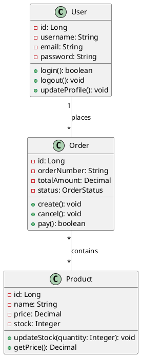
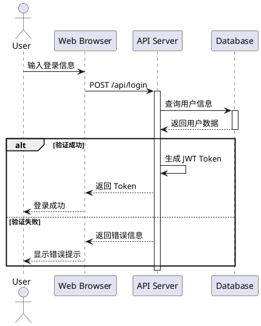
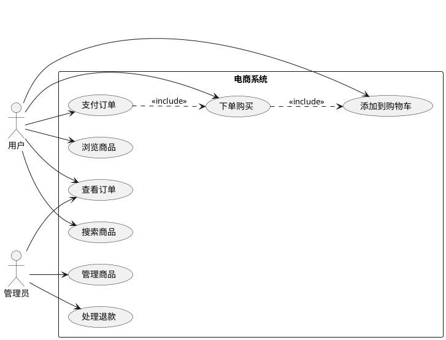
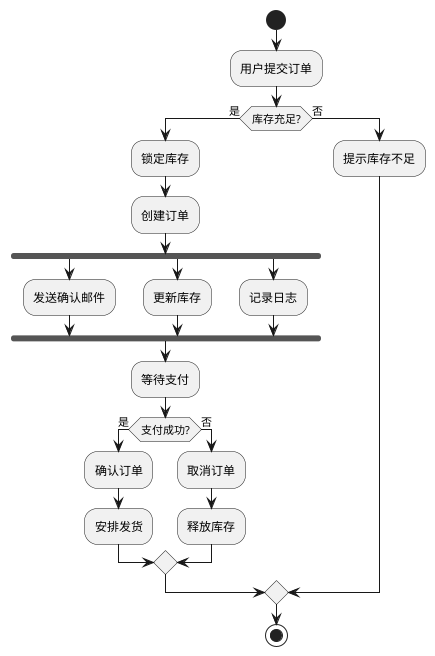
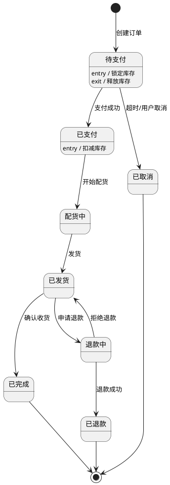
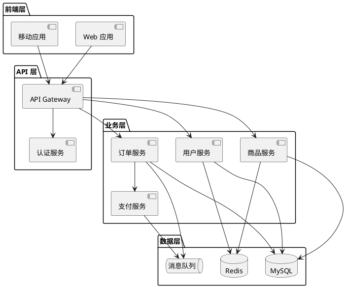
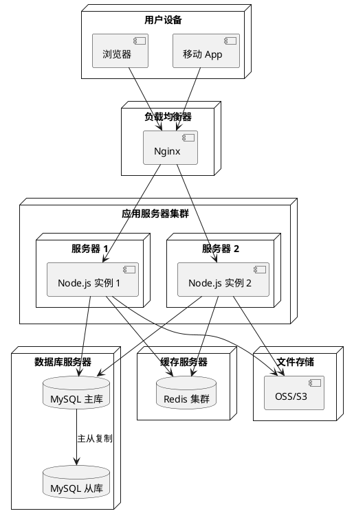
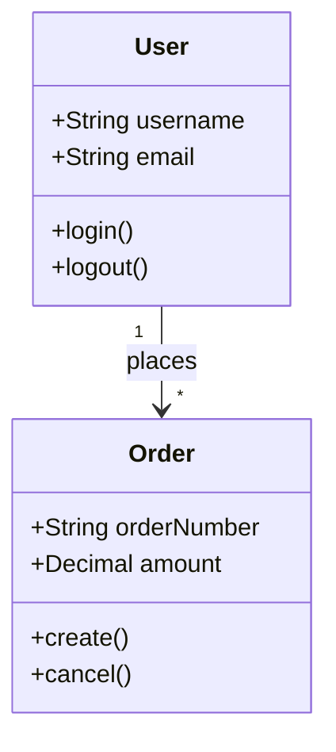
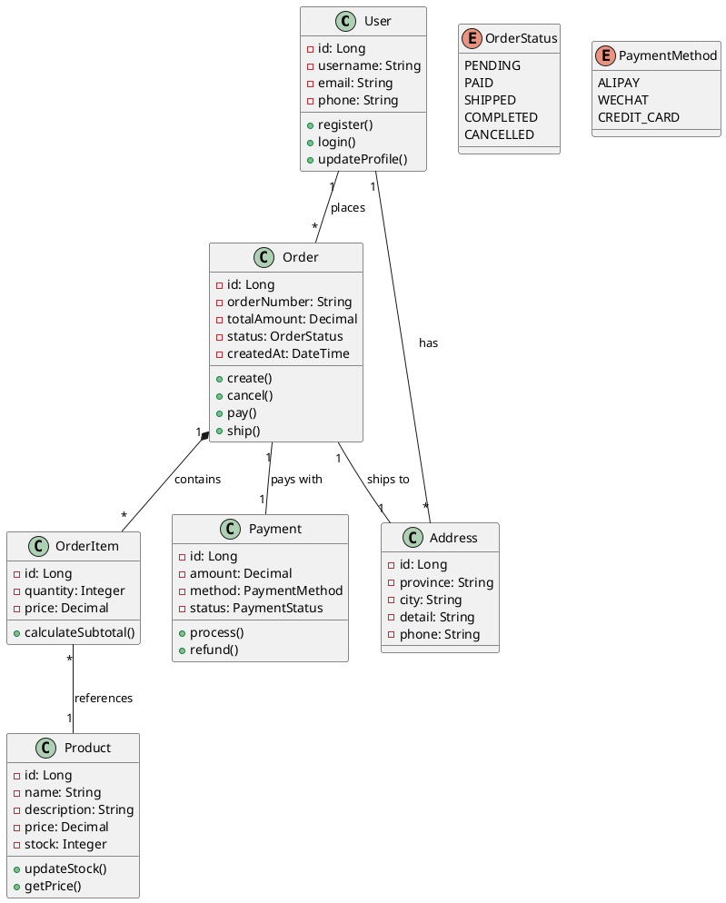

# UML 图表设计

## 功能说明
此技能专门用于 UML(统一建模语言)图表的设计和绘制,包括:
- 系统架构设计
- 类图和对象图
- 时序图和协作图
- 用例图和活动图
- 状态图和部署图
- 组件图和包图

## 使用场景
- "设计一个电商系统的类图"
- "绘制用户登录的时序图"
- "创建系统架构图"
- "设计数据库 ER 图"
- "绘制业务流程图"
- "创建用例图展示系统功能"

## UML 图表类型

### 1. 类图(Class Diagram)
用于展示系统中的类、属性、方法及其关系。



**关系类型**:
- **关联(Association)**:实线,表示类之间的关系
- **聚合(Aggregation)**:空心菱形,表示整体-部分关系
- **组合(Composition)**:实心菱形,表示强整体-部分关系
- **继承(Inheritance)**:空心三角箭头,表示is-a关系
- **实现(Realization)**:虚线空心三角箭头,表示接口实现
- **依赖(Dependency)**:虚线箭头,表示使用关系

### 2. 时序图(Sequence Diagram)
展示对象之间的交互顺序和消息传递。



**元素说明**:
- **Actor**:参与者(用户或外部系统)
- **Participant**:对象或组件
- **Message**:消息传递(同步/异步)
- **Activation**:对象激活期间
- **Alt/Opt/Loop**:条件、可选、循环

### 3. 用例图(Use Case Diagram)
展示系统功能和参与者之间的关系。



**关系类型**:
- **关联**:参与者与用例之间的关系
- **包含(include)**:必须执行的用例
- **扩展(extend)**:可选执行的用例
- **泛化**:用例之间的继承关系

### 4. 活动图(Activity Diagram)
展示业务流程或算法的执行流程。



**元素说明**:
- **开始/结束**:流程的起点和终点
- **活动**:执行的操作
- **决策**:条件判断
- **分支/合并**:并行执行
- **泳道**:责任划分

### 5. 状态图(State Diagram)
展示对象在生命周期中的状态变化。



### 6. 组件图(Component Diagram)
展示系统的组件结构和依赖关系。



### 7. 部署图(Deployment Diagram)
展示系统的物理部署架构。



## 绘图工具

### PlantUML
最流行的文本驱动 UML 工具。

**安装**:
```bash
# 使用 npm
npm install -g node-plantuml

# 使用 Java
# 下载 plantuml.jar
java -jar plantuml.jar diagram.puml
```

**在线工具**:
- PlantUML Online Server
- PlantText
- PlantUML QEditor

### Mermaid
Markdown 友好的图表工具。



### 其他工具
- **Draw.io/diagrams.net**:在线图表工具
- **Lucidchart**:专业图表软件
- **Visual Paradigm**:企业级建模工具
- **StarUML**:开源 UML 工具

## 设计最佳实践

### 1. 类图设计
```markdown
✓ 遵循单一职责原则
✓ 使用清晰的命名
✓ 标注关键属性和方法
✓ 显示重要的关系
✓ 使用包组织大型系统

✗ 避免过度设计
✗ 不要包含所有细节
✗ 避免循环依赖
```

### 2. 时序图设计
```markdown
✓ 从左到右排列参与者
✓ 按时间顺序排列消息
✓ 使用清晰的消息名称
✓ 标注重要的条件和循环
✓ 保持图表简洁

✗ 避免过多的参与者
✗ 不要遗漏返回消息
✗ 避免交叉的消息线
```

### 3. 用例图设计
```markdown
✓ 使用用户视角描述功能
✓ 保持用例粒度适中
✓ 明确参与者角色
✓ 标注关键的关系
✓ 按功能模块组织

✗ 避免技术术语
✗ 不要过于细化
✗ 避免遗漏重要用例
```

## 实际应用场景

### 电商系统设计


### 微服务架构图
```plantuml
@startuml
!define RECTANGLE class

package "客户端" {
  [Web 前端]
  [移动 App]
}

package "API 网关层" {
  [API Gateway]
  [认证中心]
}

package "微服务层" {
  RECTANGLE "用户服务" {
    [用户管理]
    [权限管理]
  }

  RECTANGLE "商品服务" {
    [商品管理]
    [库存管理]
  }

  RECTANGLE "订单服务" {
    [订单管理]
    [订单状态]
  }

  RECTANGLE "支付服务" {
    [支付处理]
    [退款处理]
  }
}

package "基础设施层" {
  database "MySQL 集群"
  database "Redis 集群"
  queue "Kafka"
  [配置中心]
  [服务注册]
}

[Web 前端] --> [API Gateway]
[移动 App] --> [API Gateway]

[API Gateway] --> [认证中心]
[API Gateway] --> [用户管理]
[API Gateway] --> [商品管理]
[API Gateway] --> [订单管理]

[订单管理] --> [支付处理]
[订单管理] --> [库存管理]

[用户管理] --> [MySQL 集群]
[商品管理] --> [MySQL 集群]
[订单管理] --> [MySQL 集群]

[用户管理] --> [Redis 集群]
[商品管理] --> [Redis 集群]

[订单管理] --> [Kafka]
[支付处理] --> [Kafka]

[用户管理] --> [配置中心]
[商品管理] --> [配置中心]
[订单管理] --> [配置中心]

[用户管理] --> [服务注册]
[商品管理] --> [服务注册]
[订单管理] --> [服务注册]
@enduml
```

## 文档集成

### Markdown 中嵌入
```markdown
# 系统设计文档

## 类图

\`\`\`plantuml
@startuml
class User {
  +login()
}
@enduml
\`\`\`

## 时序图

\`\`\`mermaid
sequenceDiagram
    User->>API: 请求
    API->>DB: 查询
    DB-->>API: 返回
    API-->>User: 响应
\`\`\`
```

### 代码注释中使用
```java
/**
 * 用户服务类
 *
 * @startuml
 * class UserService {
 *   +register(user: User): boolean
 *   +login(username: String, password: String): Token
 * }
 * @enduml
 */
public class UserService {
    // 实现代码
}
```

## 注意事项
- 选择合适的图表类型
- 保持图表简洁清晰
- 使用一致的命名规范
- 及时更新文档
- 考虑图表的可读性
- 避免过度设计
- 使用版本控制管理图表文件
- 与团队保持沟通
