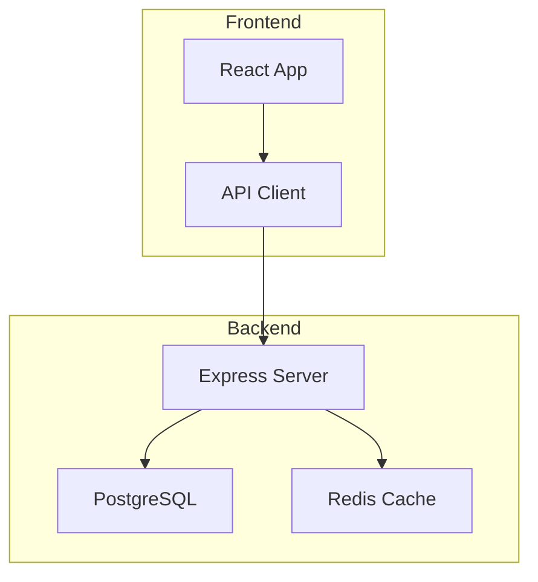

# Update Documentation

## CRITICAL: Oracle-First Protocol

**BEFORE making ANY changes to documentation, you MUST consult the Oracle to understand what exists and what must be preserved.**

Documentation often contains hard-won knowledge, historical context, and decisions that aren't obvious from code alone. Blindly updating docs risks losing this irreplaceable information.

### Mandatory Pre-Update Oracle Consultation

For EACH significant document (especially CLAUDE.md, architecture docs, decision records):

```
Task(
  subagent_type: "general-purpose",
  model: "opus",
  prompt: """
  You are The Oracle - analyze this documentation before it gets updated.

  DOCUMENT PATH: [path]
  DOCUMENT CONTENT:
  [full content]

  ANALYSIS REQUIRED:

  1. **Critical Knowledge Inventory**
     - What unique insights/decisions does this document contain?
     - What historical context would be lost if overwritten?
     - What hard-won lessons or gotchas are documented?
     - What non-obvious information exists that code doesn't reveal?

  2. **Preservation Requirements**
     - List specific sections/paragraphs that MUST be preserved
     - Identify any warnings, caveats, or "don't do X" guidance
     - Note any project-specific conventions explained here
     - Flag any links to external resources or related docs

  3. **Safe to Update**
     - What sections are purely factual and safe to update from code?
     - What sections are demonstrably outdated based on codebase?
     - What can be verified objectively vs. requires human judgment?

  4. **Update Recommendations**
     - Specific guidance for updating this document safely
     - Sections to leave untouched without human approval
     - Suggested merge strategy (preserve + add vs. replace)

  Be thorough. Assume any knowledge lost here is lost forever.
  """
)
```

### When Oracle Consultation is MANDATORY

- **ALWAYS** for: CLAUDE.md files, architecture docs, decision records, onboarding guides
- **ALWAYS** for: Any doc >200 lines or last modified >30 days ago
- **ALWAYS** for: Docs with sections titled "Why", "History", "Decisions", "Gotchas", "Warnings"
- **RECOMMENDED** for: All other significant documentation

### When You Can Skip Oracle (rare)

- Trivial typo fixes
- Adding new sections (not modifying existing)
- Updating version numbers or dates
- Fixing broken links to known-good targets

## Instructions

Systematically review and update all project documentation to ensure accuracy, completeness, and alignment with current codebase state.

### Phase 0: Oracle Pre-Analysis (NEW - MANDATORY)

**Before touching ANY documentation:**

1. **Identify high-value documents** - CLAUDE.md, architecture docs, decision records
2. **Run Oracle analysis** on each high-value document
3. **Create preservation checklist** from Oracle findings
4. **Add preservation requirements to TodoWrite** - these are non-negotiable

**Example TodoWrite entries from Oracle:**
```
- [ ] PRESERVE: Authentication decision rationale in CLAUDE.md (lines 45-67)
- [ ] PRESERVE: Database migration warnings in architecture.md
- [ ] PRESERVE: "Why we don't use X" section in conventions.md
- [ ] SAFE TO UPDATE: API endpoint list (verify against code)
```

### Phase 1: Discovery & Analysis

1. **Find all documentation files**:
   - `.plans/**/*.md` - Plan documents
   - `**/CLAUDE.md` - Claude-specific guidelines
   - `docs/**/*` - General documentation
   - `.tasks/**/*` - Task tracking files
   - Any other doc files the user specifies

2. **Git analysis** (if applicable):
   - Check when docs were last modified
   - Identify code changes since last doc update
   - Use `git log` to understand what changed

3. **Create comprehensive todo list** - One item per document to review
   - **Include Oracle preservation requirements** from Phase 0

### Phase 2: Systematic Document Review

For EACH document in the todo list:

#### Step 1: Read & Understand
- Fully read the document
- Understand its purpose and scope
- Note any references to code, features, or architecture
- **Check Oracle preservation list for this document**

#### Step 2: Validate Against Codebase
Audit the codebase to check if documentation is:
- **Misleading**: Claims something that isn't true
- **Outdated**: References old code, deprecated patterns, or removed features
- **Wrong**: Contains factual errors about implementation
- **Missing**: Lacks important information about current state
- **Redundant**: Duplicates information found elsewhere

**CRITICAL**: Cross-reference with Oracle preservation list. If something seems outdated but Oracle flagged it as "preserve", DO NOT modify without explicit confirmation.

#### Step 3: Check Compliance
Verify document follows guidelines in `CLAUDE.md`:
- Naming conventions
- Architecture patterns
- Code style requirements
- File organization rules

#### Step 4: Special Handling for Plan Documents

Plans in `.plans/` require careful status tracking:

**Investigation**:
- Thoroughly audit codebase to determine implementation status
- Check each item in the plan against actual code
- NEVER assume - verify everything with code inspection

**Status Categorization**:
- **Todo** (rename to `*.todo.md`): Plan not yet implemented or partially implemented
- **Done** (rename to `*.done.md`): Plan completely implemented and verified
- **Obsolete** (rename to `*.obsolete.md`): Plan no longer relevant or superseded

**Progress Marking**:
- Mark implemented items with `✅` prefix
- Keep unimplemented items without checkmark
- Be conservative - only mark as done with 100% confirmation

**CRITICAL**: NEVER mark a plan as done until you have 100% confirmation through code audit that EVERY item is implemented.

#### Step 5: Update Document (WITH PRESERVATION PROTOCOL)

**Before ANY edit, verify:**
- [ ] Oracle preservation requirements are honored
- [ ] No "Why", "History", or "Decision" sections are being removed
- [ ] Warnings and gotchas are being kept
- [ ] You're ADDING to existing knowledge, not replacing it

**Safe update patterns:**
- Fix factual errors (wrong file paths, outdated API signatures)
- Add new information alongside existing
- Update status markers and dates
- Fix broken links

**Dangerous patterns (require confirmation):**
- Deleting any paragraph >2 sentences
- Rewriting explanatory sections
- Removing "deprecated" or "don't use" warnings
- Changing architectural guidance

#### Step 6: Validate Changes
- Ensure changes are accurate
- **Verify Oracle preservation requirements were followed**
- Verify no information was lost
- Check that references/links still work

#### Step 7: Document Changes
Add to running change log:
- File: [path]
- Changes made: [description]
- Reason: [why it was updated]
- **Preserved sections: [what was kept per Oracle guidance]**

#### Step 8: Mark Complete
Update todo list to mark this document as completed

### Phase 3: Cross-Document Analysis

After reviewing all individual documents:

1. **Consistency check**:
   - Ensure all docs use consistent terminology
   - Verify no conflicting information between docs
   - Check that cross-references are valid

2. **Coverage analysis**:
   - Identify features/code that lack documentation
   - Find orphaned docs (no corresponding code)
   - Note gaps in documentation coverage

3. **Link validation**:
   - Verify internal references point to existing files
   - Check that example code paths are correct
   - Validate any external links

### Phase 4: Summary & Recommendations

1. **Generate update summary**:
```markdown
# Documentation Update Summary - [Date]

## Oracle Consultation
- Documents analyzed: X
- Critical sections preserved: Y
- Preservation requirements followed: ✅/❌

## Files Updated: X
## Changes Made:

### Plans Status
- ✅ Done: [list]
- 📋 Todo: [list]
- ⚠️ Obsolete: [list]

### Updates by Document
- **[file path]**
  - Fixed: [what was wrong]
  - Added: [what was missing]
  - Removed: [what was redundant]
  - **Preserved**: [what was kept per Oracle]

### Coverage Gaps
- [Undocumented features]
- [Orphaned documentation]

### Recommendations
1. [Suggested improvements]
2. [New docs needed]
```

2. **Save summary** to `.docs-updates/update-[timestamp].md`

### Phase 5: Validation

1. **Build check** - Ensure any doc-related code samples build correctly
2. **Link check** - Verify all internal references work
3. **Completeness check** - Confirm all todos were addressed
4. **Preservation check** - Verify Oracle requirements were honored

## Critical Principles

- **ORACLE FIRST** - Always consult Oracle before modifying significant docs
- **PRESERVE OVER REPLACE** - Add new info, don't delete old wisdom
- **100% VERIFICATION REQUIRED** - Never mark plans as done without complete code audit
- **NEVER SKIP DOCUMENTS** - Review every file in the todo list
- **BE CONSERVATIVE** - When in doubt about plan status, keep as todo
- **THOROUGH INVESTIGATION** - Actually read the code to verify claims
- **PRESERVE INTENT** - Keep the original purpose while updating facts
- **TRACK CHANGES** - Document what was changed and why
- **COMPLIANCE FIRST** - ALWAYS follow CLAUDE.md guidelines
- **NO ASSUMPTIONS** - Verify everything against actual code

## The Documentation Preservation Hierarchy

**NEVER delete without explicit approval:**
1. Architectural decisions and their rationale
2. "Why we did X" explanations
3. Warnings, gotchas, and "don't do this" guidance
4. Historical context and migration notes
5. Non-obvious conventions and their reasons

**Safe to update freely:**
1. Code examples (verify against actual code)
2. File paths and line numbers
3. Version numbers and dates
4. Status markers and checkboxes
5. Broken links (to known-good targets)

## Plan Status Decision Tree

```
Is EVERY item in the plan implemented?
├─ YES (verified in code) → Mark items with ✅
│  └─ Are ALL items marked ✅?
│     ├─ YES → Rename to .done.md
│     └─ NO → Rename to .todo.md (still has work)
│
├─ NO (some items not implemented) → Rename to .todo.md
│  └─ Mark implemented items with ✅
│
└─ Plan is superseded or irrelevant → Rename to .obsolete.md
```

## Mermaid Diagrams in Documentation

**When updating documentation, add or update Mermaid diagrams to visualize complex concepts.**

### When to Add Diagrams

| Document Type | Diagram Use |
|---------------|-------------|
| Architecture docs | Component relationships, data flow |
| API documentation | Request/response sequences |
| Process guides | Workflow flowcharts |
| Decision records | Before/after state diagrams |

### Diagram Maintenance

When updating docs:
1. **Check existing diagrams** - Are they still accurate?
2. **Update outdated diagrams** - Reflect current architecture
3. **Add missing diagrams** - Where text alone is insufficient
4. **Remove obsolete diagrams** - If they show removed features

### Example: Architecture Update

````markdown
## Current Architecture


````

**Note:** Diagrams in documentation should be verified against actual code, just like text.

---

## Supporting Tools Integration

- Use **Task (Oracle)** to analyze docs before modification
- Use **Grep** to search for TODOs or implementation evidence
- Use **Glob** to find related files
- Use **Bash** for git operations
- Use **Read** to examine code thoroughly
- Use **Edit** to update documentation
- Use **TodoWrite** to track review progress AND preservation requirements
