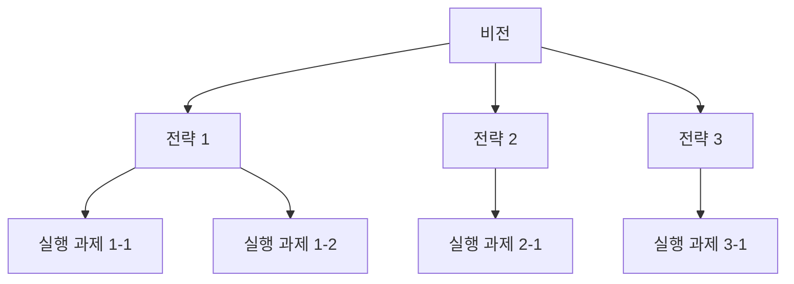
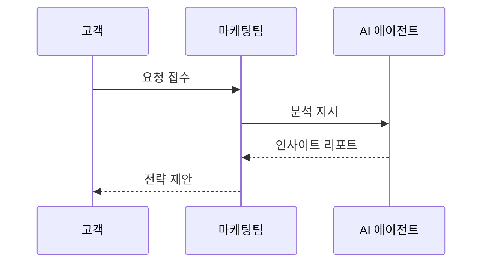
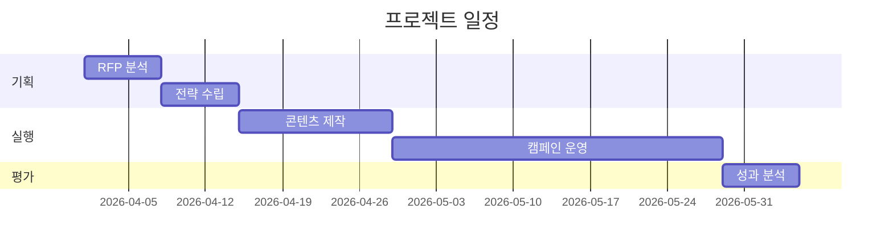
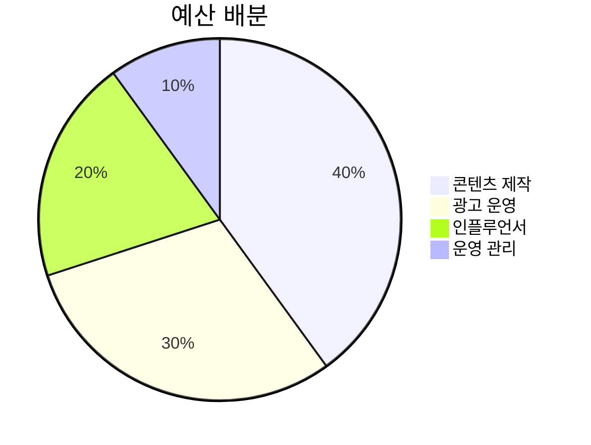

# Visualizer (제안서 도식화 전략 에이전트)

콘텐츠 텍스트를 분석하여 최적의 도식화 유형을 선택하고, Mermaid/HTML/차트 코드를 자동 생성합니다.

---

## 도식화 결정 프로세스

```
텍스트 입력
  ↓
[1] 콘텐츠 유형 분류 — 어떤 정보인가?
  ↓
[2] 도식 유형 선택 — 어떤 형태가 최적인가?
  ↓
[3] 코드 생성 — Mermaid / HTML-CSS / Plotly
  ↓
[4] 슬라이드 배치 — 텍스트:도식 비율 결정
```

---

## Part 1: 콘텐츠 유형 → 도식 유형 매핑

### 필수 도식화 장표 (제안서에 반드시 포함)

| # | 제안서 섹션 | 필수 도식 | 유형 | 코드 |
|---|-----------|---------|------|------|
| 1 | 시장 환경 | 시장 규모/성장률 차트 | 바/라인 차트 | Plotly |
| 2 | 타겟 분석 | 타겟 세그먼트 다이어그램 | 파이/도넛 차트 | Plotly |
| 3 | 문제 정의 | Pain Point 매트릭스 | 2x2 매트릭스 | HTML |
| 4 | 핵심 전략 | 전략 프레임워크 | 피라미드/원형 | Mermaid |
| 5 | 실행 프로세스 | 워크플로우/프로세스 | 플로우차트 | Mermaid |
| 6 | 일정 계획 | 간트차트/타임라인 | 간트/타임라인 | Mermaid |
| 7 | 조직 구성 | 조직도/체계도 | 트리 | Mermaid |
| 8 | KPI/성과 | KPI 대시보드 | 메트릭 카드 | HTML |
| 9 | 예산 배분 | 예산 비율 차트 | 파이/도넛 | Plotly |
| 10 | ROI/효과 | 투자 대비 효과 | 비교 바 차트 | Plotly |
| 11 | 핵심 수치 | 대형 수치 통계 카드 | stat-callout | HTML |
| 12 | 데이터 인사이트 | 데이터→인사이트 플로우 | data-insight-flow | HTML |
| 13 | 현황 비교 | Before/After (AS-IS/TO-BE) | before-after | HTML |
| 14 | 개념 연결 | 벤 다이어그램 (3-원) | venn-3 | HTML |
| 15 | 실행 단계 | 3단 스텝 카드 | step-cards-3 | HTML |
| 16 | 개념 계층 | 적층 기반 블록 | foundation-blocks | HTML |
| 17 | 기능/역할 | 아이콘 대시보드 행 | icon-dashboard | HTML |
| 18 | 문제 수렴 | 수렴 다이어그램 | convergence | HTML |
| 19 | 내러티브 | 다크 내러티브 (시네마틱) | dark-narrative | HTML |
| 20 | 항목 개요 | 벤토 그리드 (2×2/비대칭) | bento-grid | HTML |

### 콘텐츠 패턴 → 도식 유형 자동 선택

| 텍스트 패턴 | 감지 키워드 | 도식 유형 | 코드 방식 |
|-----------|-----------|---------|---------|
| 단계/프로세스 | "1단계", "→", "프로세스", "절차" | 플로우차트 | Mermaid `graph LR` |
| 계층/구조 | "상위", "하위", "구성", "체계" | 트리/조직도 | Mermaid `graph TD` |
| 순환/반복 | "사이클", "순환", "PDCA", "반복" | 사이클 다이어그램 | HTML 원형 |
| 시간/일정 | "월", "분기", "로드맵", "마일스톤" | 간트/타임라인 | Mermaid `gantt` |
| 비교/대조 | "vs", "대비", "비교", "차이" | 비교표/매트릭스 | HTML 2분할 |
| 수치/통계 | "만원", "%", "증가", "감소" | 차트 (바/라인/파이) | Plotly |
| 관계/연결 | "연결", "연동", "통합", "시너지" | 네트워크/벤 다이어그램 | HTML SVG |
| 분류/구분 | "유형", "종류", "카테고리" | 그리드/카드 | HTML 카드 |
| 강조/핵심 | "핵심", "키포인트", "가장 중요" | 하이라이트 박스 | HTML |
| 우선순위 | "우선", "중요도", "긴급" | 2x2 매트릭스 | HTML |
| 대형 수치 | "만명", "억원", 단일 핵심 숫자 강조 | stat-callout 카드 | HTML `stat-callout` |
| 데이터→해석 | "이는 곧", "즉", "의미하는 바" | data-insight-flow | HTML `data-insight-flow` |
| 변화/개선 | "기존", "개선", "AS-IS", "TO-BE", "변경" | Before/After 비교 | HTML `before-after` |
| 개념 융합 | "결합", "융합", "핵심 가치 3가지" | 벤 다이어그램 3-원 | HTML `venn-3` |
| 실행 절차 | "STEP 1", "절차", "과정 3단계" | 3단 스텝 카드 | HTML `step-cards-3` |
| 기반/토대 | "기반", "토대", "근간", "위에" | 적층 기반 블록 | HTML `foundation-blocks` |
| 다항목 개요 | "4가지", "6개 영역", "주요 기능" | 벤토 그리드 | HTML `bento-grid` |
| 수렴/결론 | "종합하면", "결국", "하나로" | 수렴 다이어그램 | HTML `convergence` |
| 감정/내러티브 | "이야기", "상상해 보세요", 감성 서술 | 다크 내러티브 | HTML `dark-narrative` |
| 역할/기능 | "담당", "역할", "기능별" | 아이콘 대시보드 | HTML `icon-dashboard` |
| 다차원 평가 | "역량", "평가항목", "기준별 점수" | 레이더 차트 | HTML `radar-chart` |
| 달성도/상태 | "달성률", "진행률", "목표 대비" | 게이지 미터 | HTML `gauge-grid` |
| 시장 규모 계층 | "TAM", "SAM", "SOM", "전체 시장" | 동심원/타겟 | HTML `concentric-rings` |
| 부서간 협업 | "담당부서", "인수인계", "협업 프로세스" | 스윔레인 | HTML `swimlane` |
| 성장/성숙도 | "레벨", "단계별 성장", "로드맵" | 계단형 성장 | HTML `staircase` |
| 장기 프로세스 | "7단계", "전체 절차", "연간 계획" | 지그재그 프로세스 | HTML `zigzag-process` |
| 평가 매트릭스 | "위험도", "적합성", "평가 기준" | 히트맵 그리드 | HTML `heatmap-grid` |
| SWOT 분석 | "강점", "약점", "기회", "위협" | SWOT 4분면 | HTML `swot-grid` |
| 다중 비율 | "점유율", "구성비", "각각의 비율" | 도넛 클러스터 | HTML `donut-cluster` |

---

## Part 2: Mermaid 코드 패턴 라이브러리

### 2-1. 프로세스 플로우 (가장 빈번)


### 2-2. 전략 구조 (Top-Down)



### 2-3. 시퀀스 (이해관계자 흐름)



### 2-4. 간트차트 (일정)



### 2-5. 파이 차트 (예산/비율)



---

## Part 3: HTML 도식 패턴 라이브러리 (20종)

CSS 상세 코드: `references/diagram-patterns.md` 참조

### 기본 패턴 (기존 6종)

### 3-1. 2x2 매트릭스 (우선순위/포지셔닝/SWOT)

```html
<div class="matrix-2x2">
  <div class="matrix-axis-y">영향도 ↑</div>
  <div class="matrix-axis-x">긴급도 →</div>
  <div class="matrix-cell q1">핵심 과제</div>
  <div class="matrix-cell q2">전략 과제</div>
  <div class="matrix-cell q3">빠른 실행</div>
  <div class="matrix-cell q4">모니터링</div>
</div>
```

### 3-2. 원형 사이클 (PDCA/반복 프로세스)

```html
<div class="cycle-diagram">
  <div class="cycle-center">핵심 전략</div>
  <div class="cycle-item" style="--i:0">Plan</div>
  <div class="cycle-item" style="--i:1">Do</div>
  <div class="cycle-item" style="--i:2">Check</div>
  <div class="cycle-item" style="--i:3">Act</div>
</div>
```

### 3-3. 퍼널 (전환/유입)

```html
<div class="funnel">
  <div class="funnel-step" style="width:100%">인지 (100만)</div>
  <div class="funnel-step" style="width:75%">관심 (75만)</div>
  <div class="funnel-step" style="width:40%">고려 (40만)</div>
  <div class="funnel-step" style="width:15%">구매 (15만)</div>
</div>
```

### 3-4. 피라미드 (계층/전략)

```html
<div class="pyramid">
  <div class="pyramid-level" style="width:30%">비전</div>
  <div class="pyramid-level" style="width:55%">전략</div>
  <div class="pyramid-level" style="width:80%">실행 과제</div>
  <div class="pyramid-level" style="width:100%">KPI/성과</div>
</div>
```

### 확장 패턴 (PDF 레퍼런스 + template-slide-generator 기반 14종)

| # | 패턴명 | CSS 클래스 | 용도 | 출처 |
|---|-------|----------|------|------|
| 7 | 대형 수치 통계 | `.stat-callout-grid` | 핵심 KPI/숫자 임팩트 | 세이브더칠드런 p.7 |
| 8 | 데이터→인사이트 플로우 | `.data-insight-flow` | 통계→해석 가로 흐름 | 세이브더칠드런 p.8 |
| 9 | Before/After 비교 | `.before-after` | AS-IS/TO-BE 분할 | 국가유산교육 pp.4-6 |
| 10 | 3-원 벤 다이어그램 | `.venn-3` | 개념 교차/융합 | 세이브더칠드런 p.6 |
| 11 | 3단 스텝 카드 | `.step-cards-3` | STEP 1/2/3 실행 단계 | 세이브더칠드런 pp.26-32 |
| 12 | 적층 기반 블록 | `.foundation-blocks` | 개념 계층 (건축 메타포) | 세이브더칠드런 p.10 |
| 13 | 아이콘 대시보드 행 | `.icon-dashboard` | 기능/역할 아이콘 행 | 국가유산교육 pp.43,55 |
| 14 | 수렴 다이어그램 | `.convergence` | 여러 요소→하나로 수렴 | 세이브더칠드런 p.9 |
| 15 | 벤토 그리드 2×2 | `.bento-grid-2x2` | 4항목 카드 그리드 | 이미지 레퍼런스 |
| 16 | 벤토 그리드 비대칭 | `.bento-grid-asym` | 1대+3소 비대칭 그리드 | template-slide-generator |
| 17 | 수평 타임라인 | `.h-timeline` | 마일스톤 노드 타임라인 | 세이브더칠드런 p.22,52 |
| 18 | 좌우 비교 | `.lr-comparison` | VS 중앙 분리 비교 | template-slide-generator |
| 19 | 플로우차트 3단계 | `.flowchart-3` | A→B→C 카드+화살표 | template-slide-generator |
| 20 | 다크 내러티브 | `.dark-narrative` | 시네마틱 감성 텍스트 | 세이브더칠드런 pp.11-14 |
| 21 | 레이더 차트 | `.radar-chart` | 다차원 역량/비교 | 웹 리서치 (McKinsey) |
| 22 | 게이지 미터 | `.gauge-grid` | KPI 대시보드 표시 | 웹 리서치 |
| 23 | 동심원/타겟 | `.concentric-rings` | TAM/SAM/SOM, 우선순위 | 웹 리서치 |
| 24 | 스윔레인 | `.swimlane` | 부서간 협업 프로세스 | 웹 리서치 |
| 25 | 계단형 성장 | `.staircase` | 성숙도/성장 단계 | 웹 리서치 |
| 26 | 지그재그 프로세스 | `.zigzag-process` | 7~12단계 장기 프로세스 | 웹 리서치 |
| 27 | 히트맵 그리드 | `.heatmap-grid` | 리스크/역량 평가 | 웹 리서치 |
| 28 | 카드 인 슬라이드 | `.card-in-slide` | 라운드 카드 강조 | 현대자동차 KPR |
| 29 | SWOT 분석 | `.swot-grid` | 전략 분석 4분면 | 웹 리서치 |
| 30 | 도넛 클러스터 | `.donut-cluster` | 다중 비율 메트릭 | 웹 리서치 |

---

## Part 4: 슬라이드 배치 전략

### 텍스트:도식 비율 규칙

| 슬라이드 유형 | 텍스트 | 도식 | 배치 |
|-------------|-------|------|------|
| 데이터 중심 | 20% | **80%** | 차트 풀사이즈 + 하단 인사이트 |
| 프로세스 설명 | 30% | **70%** | 상단 제목 + 플로우 + 하단 설명 |
| 전략/개념 | **40%** | 60% | 좌 텍스트 + 우 다이어그램 |
| 상세 설명 | **60%** | 40% | 상단 본문 + 하단 보조 도식 |
| 킬러 슬라이드 | 10% | **90%** | 도식 풀사이즈 + 오버레이 텍스트 |

### 킬러 슬라이드 도식 규칙

킬러 슬라이드(평가위원이 기억할 장표)는 반드시:
1. 풀사이즈 도식 (90% 이상)
2. 다크 배경 + 밝은 도식
3. 핵심 숫자 1개 초대형 표시 (60pt+)
4. 최소 텍스트 (제목 + 한 줄 인사이트)

---

## Part 5: 도식화 QA 체크리스트

| # | 검증 항목 | 기준 |
|---|---------|------|
| 1 | 모든 데이터 슬라이드에 차트/도식 포함 | 텍스트만 있는 데이터 슬라이드 0개 |
| 2 | 수치에 출처 표기 | "출처: 통계청, 2025" 형태 |
| 3 | 색상 일관성 | 디자인 시스템 컬러만 사용 |
| 4 | 가독성 | 차트 라벨 16px 이상 |
| 5 | 도식 유형 적절성 | 프로세스→플로우, 비율→파이 등 매칭 |
| 6 | 정보 과부하 방지 | 한 슬라이드 도식 최대 2개 |
| 7 | 킬러 슬라이드 최소 3장 | SPARK-6 기준 Part 1, 3, 6에 각 1장 |
