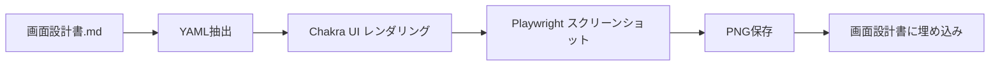

# Wireframe Generator

YAML定義から設計レビュー用ワイヤーフレーム画像を自動生成するスキル。

## 概要

| 項目 | 内容 |
|------|------|
| 入力 | YAML定義（画面設計書内の ```yaml wireframe``` ブロック） |
| 出力 | PNG画像（スクリーンショット） |
| UIフレームワーク | Chakra UI |
| スクリーンショット | Playwright |
| スキーマ | [wireframe.schema.json](./wireframe.schema.json) |

## 使用タイミング

- `/detailed-design-workflow` の Phase 1.5（モックアップ生成）
- 画面設計書作成時のワイヤーフレーム生成

## 実行方法

```bash
cd <skill-dir>/wireframe-generator/scripts
bun install
bun run generate.ts <markdown-file> [output-dir]
```

> **Note**: `<skill-dir>` は `.opencode/skill` または `.claude/skills` のいずれか（シンボリックリンクで同一）

---

## JSON Schema

AIがYAMLを生成する際は、以下のスキーマに従ってください。

**スキーマファイル**: `wireframe.schema.json`（このスキルディレクトリ内）

### 対応UIパターン（type）

#### 基本タイプ

| type | 用途 | 必須プロパティ |
|------|------|---------------|
| `form` | 入力フォーム | `screen`, `type`, `fields` |
| `table` | 一覧表示 | `screen`, `type`, `columns` |
| `detail` | 詳細表示 | `screen`, `type`, `sections` |
| `dashboard` | ダッシュボード | `screen`, `type` |
| `crud` | CRUD画面 | `screen`, `type`, `table`, `form` |

#### レイアウト・ナビゲーション

| type | 用途 | 必須プロパティ |
|------|------|---------------|
| `layout` | ヘッダー/サイドバー付きレイアウト | `screen`, `type`, `content` |
| `tabs` | タブ付き画面 | `screen`, `type`, `tabs` |

#### コンテンツ表示

| type | 用途 | 必須プロパティ |
|------|------|---------------|
| `card-grid` | カードグリッド一覧 | `screen`, `type`, `cards` |
| `timeline` | アクティビティ履歴 | `screen`, `type`, `items` |
| `gallery` | 画像ギャラリー | `screen`, `type`, `items` |

#### ウィザード・状態表示

| type | 用途 | 必須プロパティ |
|------|------|---------------|
| `wizard` | ステップフォーム | `screen`, `type`, `steps` |
| `empty-state` | 空状態/エラー画面 | `screen`, `type`, `title` |
| `alert` | 通知/警告 | `screen`, `type`, `alerts` |

#### モーダル・ダイアログ

| type | 用途 | 必須プロパティ |
|------|------|---------------|
| `modal` | モーダルダイアログ | `screen`, `type`, `title`, `content` |
| `drawer` | スライドパネル | `screen`, `type`, `content` |
| `confirm` | 確認ダイアログ | `screen`, `type`, `title`, `message` |

#### ビジネス・マーケティング

| type | 用途 | 必須プロパティ |
|------|------|---------------|
| `pricing` | 料金プラン | `screen`, `type`, `plans` |
| `faq` | FAQ | `screen`, `type`, `items` |
| `hero` | ランディングページヒーロー | `screen`, `type`, `title` |
| `stats` | 統計カード | `screen`, `type`, `stats` |

#### コラボレーション

| type | 用途 | 必須プロパティ |
|------|------|---------------|
| `kanban` | カンバンボード | `screen`, `type`, `columns` |
| `calendar` | カレンダー | `screen`, `type` |
| `chat` | チャット画面 | `screen`, `type`, `messages` |

#### プロフィール・設定

| type | 用途 | 必須プロパティ |
|------|------|---------------|
| `profile` | ユーザープロフィール | `screen`, `type`, `user` |
| `settings` | 設定画面 | `screen`, `type`, `sections` |
| `auth` | ログイン/登録/2FA等 | `screen`, `type`, `variant`, `fields` |

---

## YAML記法リファレンス

### type: form

入力フォーム画面（ログイン、登録、設定など）

```yaml
screen: ログインフォーム
type: form
fields:
  - name: email           # 必須: フィールド識別子
    label: メールアドレス  # 必須: 表示ラベル
    type: email           # 必須: text|email|password|number|textarea|select|checkbox|radio|date|file|pin
    required: true        # 任意: 必須フラグ
    placeholder: example@email.com  # 任意
  - name: password
    label: パスワード
    type: password
    required: true
  - name: role
    label: 権限
    type: select
    options:              # select/radioの場合は必須
      - value: admin
        label: 管理者
      - value: user
        label: 一般ユーザー
  - name: remember
    label: ログイン状態を保持
    type: checkbox
  - name: pin
    label: 認証コード
    type: pin             # PIN/OTP入力
    pinLength: 6          # 任意: 桁数（デフォルト: 6）
    required: true
buttons:                  # 任意
  - label: ログイン
    variant: primary      # primary|secondary|danger|ghost
  - label: キャンセル
    variant: secondary
```

### type: table

一覧表示画面（ユーザー一覧、注文一覧など）

```yaml
screen: ユーザー一覧
type: table
columns:
  - name: id              # 必須: データキー
    label: ID             # 必須: ヘッダーラベル
    width: 80             # 任意: カラム幅(px)
  - name: name
    label: 名前
  - name: status
    label: ステータス
    type: badge           # 任意: text|badge|date|currency|number
  - name: createdAt
    label: 登録日
    type: date
actions:                  # 任意: search|pagination|create-button|row-edit|row-delete|bulk-select|export
  - search
  - pagination
  - create-button
  - row-edit
  - row-delete
data:                     # 任意: サンプルデータ（省略時はダミー表示）
  - id: 1
    name: 山田太郎
    status: active
    createdAt: 2025-01-01
```

### type: detail

詳細表示画面（ユーザー詳細、商品詳細など）

```yaml
screen: ユーザー詳細
type: detail
sections:
  - title: 基本情報       # 必須: セクションタイトル
    fields:
      - label: 名前       # 必須
        value: 山田太郎   # 必須
      - label: ステータス
        value: アクティブ
        type: badge       # 任意: text|badge|date|link
  - title: 登録情報
    fields:
      - label: 登録日
        value: 2025-01-01
        type: date
actions:                  # 任意
  - label: 編集
    variant: primary
  - label: 削除
    variant: danger
```

### type: dashboard

ダッシュボード画面（統計、KPI表示）

```yaml
screen: 管理ダッシュボード
type: dashboard
stats:                    # 任意: 統計カード
  - label: 総ユーザー数   # 必須
    value: "1,234"        # 必須
    icon: users           # 任意: users|currency|activity|chart|inbox|settings
    trend: "+12%"         # 任意: トレンド表示
  - label: 今月の売上
    value: "¥1,234,567"
    icon: currency
    trend: "+5%"
widgets:                  # 任意: ウィジェット
  - type: chart           # 必須: chart|table|list
    title: 月別売上推移   # 必須
    chartType: line       # chart時: line|bar|pie
  - type: table
    title: 最近の注文
    columns:              # table時
      - label: 注文ID
      - label: 顧客名
      - label: 金額
```

### type: crud

CRUD画面（一覧 + 作成/編集モーダル）

```yaml
screen: 商品管理
type: crud
table:                    # 必須: 一覧テーブル定義
  columns:
    - name: name
      label: 商品名
    - name: price
      label: 価格
      type: currency
  actions:
    - search
    - pagination
    - create-button
    - row-edit
    - row-delete
form:                     # 必須: モーダルフォーム定義
  title: 商品登録
  fields:
    - name: name
      label: 商品名
      type: text
      required: true
    - name: price
      label: 価格
      type: number
      required: true
```

### type: confirm

確認ダイアログ（削除確認、操作確認など）

```yaml
screen: 削除確認ダイアログ
type: confirm
title: 削除の確認            # 必須: ダイアログタイトル
message: この操作は取り消せません。本当に削除しますか？  # 必須: 確認メッセージ
variant: danger              # 任意: info|warning|danger|success（デフォルト: info）
icon: warning                # 任意: アイコン（省略時はvariantに応じた自動選択）
confirmLabel: 削除する       # 任意: 確認ボタンラベル（デフォルト: 確認）
cancelLabel: キャンセル      # 任意: キャンセルボタンラベル（デフォルト: キャンセル）
confirmVariant: danger       # 任意: 確認ボタンのvariant（デフォルト: variantに応じて自動選択）
```

### type: modal

モーダルダイアログ（編集フォーム、詳細表示など）

```yaml
screen: ユーザー編集モーダル
type: modal
title: ユーザー情報を編集    # 必須: モーダルタイトル
size: md                     # 任意: xs|sm|md|lg|xl|full（デフォルト: md）
closable: true               # 任意: 閉じるボタン表示（デフォルト: true）
content:                     # 必須: コンテンツ定義
  type: form                 # form|table|detail|dashboard|card-grid|timeline|empty-state|custom
  config:                    # 重要: typeに応じた設定をconfigの中に記述
    fields:
      - name: name
        label: 名前
        type: text
        required: true
      - name: email
        label: メールアドレス
        type: email
        required: true
footer:                      # 任意: フッターボタン
  align: right               # 任意: left|center|right（デフォルト: right）
  actions:
    - label: キャンセル
      variant: secondary
    - label: 保存
      variant: primary
```

### type: drawer

スライドパネル（設定、フィルター、サイドメニューなど）

```yaml
screen: 設定ドロワー
type: drawer
title: 表示設定              # 任意: ドロワータイトル
placement: right             # 任意: left|right|top|bottom（デフォルト: right）
size: md                     # 任意: xs|sm|md|lg|xl|full（デフォルト: md）
closable: true               # 任意: 閉じるボタン表示（デフォルト: true）
content:                     # 必須: コンテンツ定義
  type: form                 # form|table|detail|dashboard|card-grid|timeline|empty-state|custom
  config:                    # 重要: typeに応じた設定をconfigの中に記述
    fields:
      - name: theme
        label: テーマ
        type: select
        options:
          - value: light
            label: ライト
          - value: dark
            label: ダーク
      - name: notifications
        label: 通知を有効にする
        type: checkbox
footer:                      # 任意: フッターボタン
  actions:
    - label: 適用
      variant: primary
```

> **注意**: `modal`と`drawer`の`content`内では、`type`で指定したコンポーネントの設定を**必ず`config`の中に**記述してください。直接`fields`などを書くとエラーになります。

---

## 画面設計書での記述例

画面設計書.md 内に以下のように記述：

````markdown
## 3.1 SC-001: ログイン画面

### ワイヤーフレーム定義

```yaml wireframe
screen: ログイン画面
type: form
fields:
  - name: email
    label: メールアドレス
    type: email
    required: true
  - name: password
    label: パスワード
    type: password
    required: true
buttons:
  - label: ログイン
    variant: primary
```

### 生成されたワイヤーフレーム


````

---

## 生成フロー



## ディレクトリ構成

```
wireframe-generator/
├── SKILL.md                    # このファイル
├── wireframe.schema.json       # JSON Schema定義
└── scripts/
    ├── package.json
    ├── tsconfig.json
    ├── types.ts                # TypeScript型定義
    ├── generate.ts             # CLIエントリポイント
    ├── extract.ts              # YAML抽出
    ├── screenshot.ts           # Playwright撮影
    ├── vite.config.ts
    ├── index.html
    ├── sample.md               # サンプル
    └── src/
        ├── main.tsx
        ├── App.tsx
        └── components/
            ├── FormRenderer.tsx
            ├── TableRenderer.tsx
            ├── DetailRenderer.tsx
            ├── DashboardRenderer.tsx
            └── CrudRenderer.tsx
```

## 制限事項

- デザイン性は考慮しない（設計レビュー用ワイヤーフレーム目的）
- カスタムCSSは非対応
- 複雑なインタラクションは非対応（静的表示のみ）
