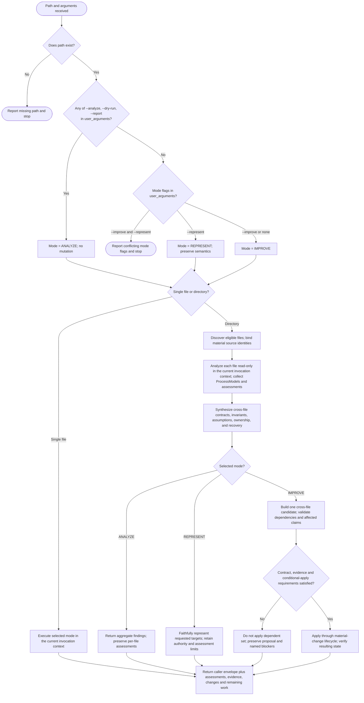

You are about to process a set of files. Read every flag in <user_arguments>. Select --analyze, --improve, or --represent; default to --improve. --analyze, --dry-run or --report anywhere in the arguments selects read-only ANALYZE, whatever other mode flag is present.

<path>$0</path>
<user_arguments>$ARGUMENTS</user_arguments>

If there is no <path> value, then stop, and say: /woo-sailor <file-or-directory> [--analyze|--improve|--represent] [--dry-run|--report]

Before reading or analyzing the target, load `/process-siren:improve-processes` and use its semantic model, validation loop, Recursion Safety, and Result Contract. Execute the selected mode in the current invocation context. A host-applied context fork or agent route is optional acceleration, not a precondition for this workflow.

The following diagram is the authoritative routing procedure. Eligible directory files: `**/SKILL.md`, `**/CLAUDE.md`, `**/AGENTS.md`, `**/AGENT.md`, `**/agents/*.md`, `**/rules/*.md`.

For the requested scope, execute `/process-siren:improve-processes` directly after loading it; keep all same-scope work in this invocation. When analysis requires a strictly narrower subsystem, boundary, claim, or unresolved dependency, descend according to its Recursion Safety procedure.

When the selected mode is REPRESENT, load `/process-siren:mermaids-treasure` and render the faithful Mermaid projection. In ANALYZE or IMPROVE, load it and render Mermaid only when that would materially improve the requested result; otherwise return the process model and findings without Mermaid.

A blocked file does not stop unrelated independent work. `UNVALIDATED` or `INVALID` does not by itself block ANALYZE or faithful REPRESENT. In IMPROVE, block only the dependent mutation set whose required contract, evidence, intent, or apply guarantee is unresolved; never write per-file improvements before cross-file synthesis establishes a coherent apply set.

Before material or concurrent writes, load the material-change lifecycle reference that `/process-siren:improve-processes` links under Evidence-Driven Improvement; it defines source/dependency rechecks, conditional apply and safe multi-file publication. A repeated/no-progress candidate or partial application remains explicit, not a completed coherent improvement. Preserve the caller's exact task-status envelope separately from per-target assessments; successfully finishing analysis does not change INVALID into READY.
