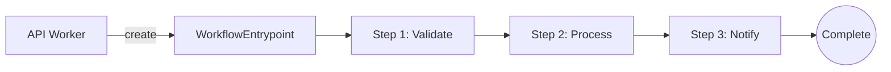
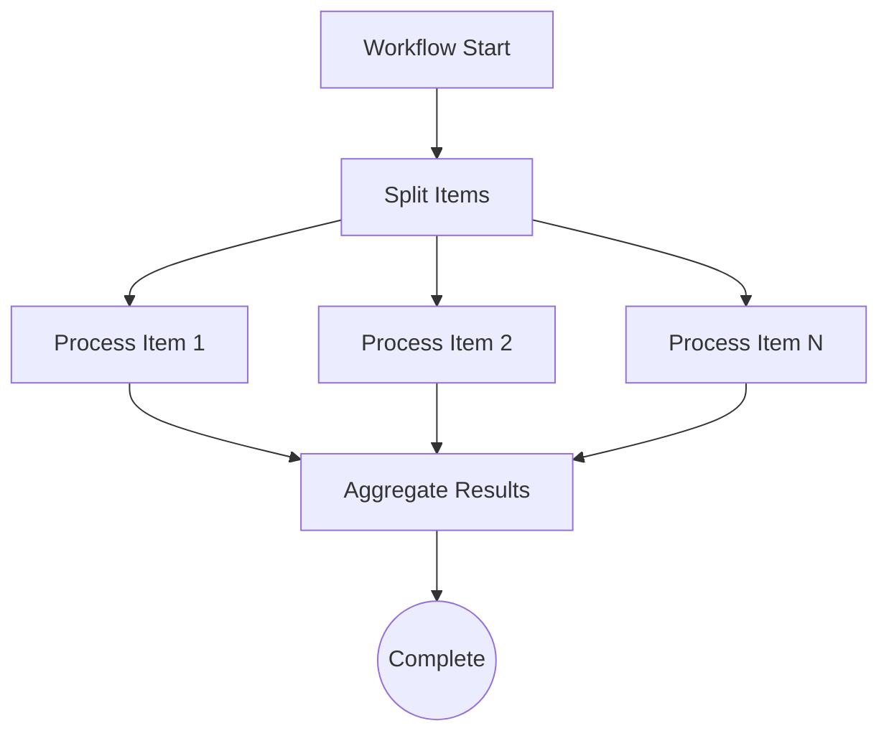
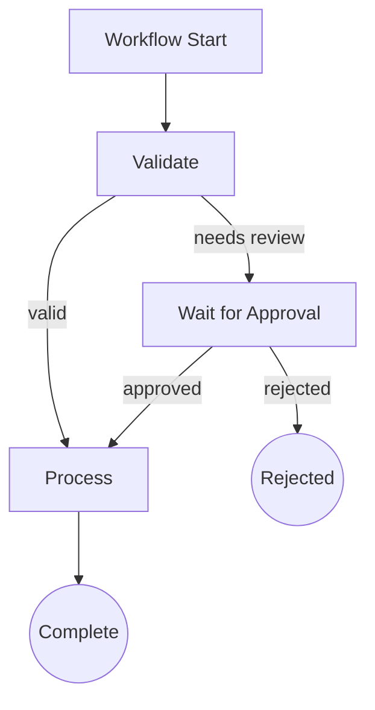
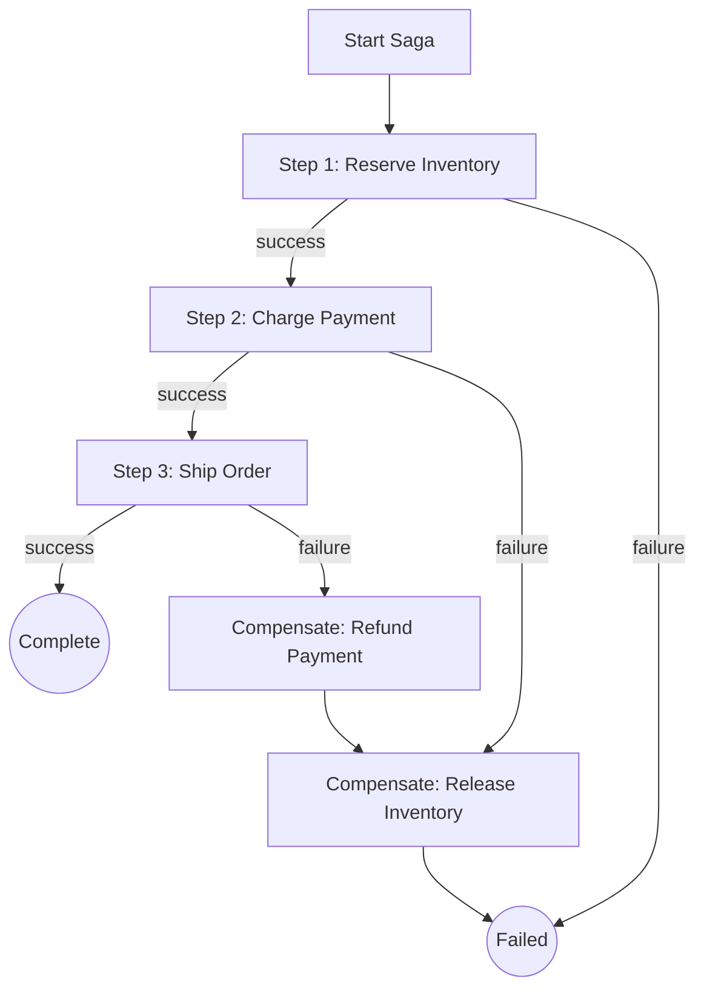

# Workflow Architect Skill

Design Cloudflare Workflows for multi-step, long-running, and fault-tolerant processes. Workflows provide durable execution with automatic retry, state persistence, and step-based billing - making them ideal for processes that exceed Worker's 30-second limit.

## When to Use Workflows

### Decision Tree: Queues vs Workflows vs Containers

```
What background processing is needed?
│
├─ Single operation with retry?
│   │
│   ├─ YES: Is it a simple task (<30s)?
│   │   │
│   │   ├─ YES: Use Queues
│   │   │       ✅ Email sending
│   │   │       ✅ Webhook delivery
│   │   │       ✅ Simple notifications
│   │   │
│   │   └─ NO: How many distinct steps?
│   │       │
│   │       ├─ 1-2 steps: Use Queues with DLQ
│   │       └─ 3+ steps: Use Workflows
│   │
│   └─ NO: Use direct Worker call
│
├─ Multi-step with state?
│   │
│   ├─ YES: Use Workflows
│   │       ✅ Order processing pipelines
│   │       ✅ Document processing chains
│   │       ✅ Approval workflows
│   │       ✅ Data migration jobs
│   │
│   └─ NO: See single operation above
│
├─ Long-running (>30s)?
│   │
│   ├─ Needs OS/native deps?
│   │   │
│   │   ├─ YES: Use Containers
│   │   │       ✅ Video encoding
│   │   │       ✅ Heavy ML inference
│   │   │       ✅ Puppeteer/headless browser
│   │   │
│   │   └─ NO: Can it be split into steps?
│   │       │
│   │       ├─ YES: Use Workflows
│   │       └─ NO: Use Containers
│   │
│   └─ NO: See above
│
└─ Real-time coordination?
    │
    ├─ YES: Use Durable Objects
    │       ✅ Chat rooms
    │       ✅ Collaborative editing
    │       ✅ Rate limiting
    │
    └─ NO: See above
```

### Comparison Table

| Aspect | Queues | Workflows | Containers |
|--------|--------|-----------|------------|
| **Max Duration** | 30s per message | 1024 steps | Hours+ |
| **State Persistence** | None (stateless) | Automatic (1GB) | Manual |
| **Retry Logic** | Automatic (configurable) | Per-step, automatic | Manual |
| **Step Isolation** | N/A | Each step is durable | N/A |
| **Pricing** | $0.40/M messages | Per-step + duration | Per-second |
| **Best For** | Fire-and-forget | Multi-step pipelines | Heavy compute |
| **Concurrency** | max_concurrency | Parallel steps | Container count |

---

## WorkflowEntrypoint Boilerplate

### Basic Workflow Structure

```typescript
// src/workflows/order-processor.ts
import {
  WorkflowEntrypoint,
  WorkflowEvent,
  WorkflowStep,
} from 'cloudflare:workers';

interface OrderPayload {
  orderId: string;
  userId: string;
  items: Array<{ productId: string; quantity: number }>;
}

interface Env {
  DB: D1Database;
  PAYMENTS: Fetcher;  // Service binding to payment worker
  EMAIL_QUEUE: Queue;
}

export class OrderProcessorWorkflow extends WorkflowEntrypoint<Env, OrderPayload> {
  async run(event: WorkflowEvent<OrderPayload>, step: WorkflowStep) {
    const { orderId, userId, items } = event.payload;

    // Step 1: Validate inventory
    const inventoryCheck = await step.do('validate-inventory', async () => {
      const checks = await Promise.all(
        items.map(async (item) => {
          const product = await this.env.DB
            .prepare('SELECT stock FROM products WHERE id = ?')
            .bind(item.productId)
            .first<{ stock: number }>();
          return {
            productId: item.productId,
            available: (product?.stock ?? 0) >= item.quantity,
          };
        })
      );
      return checks;
    });

    // Early exit if inventory insufficient
    if (inventoryCheck.some(c => !c.available)) {
      return { status: 'failed', reason: 'insufficient_inventory' };
    }

    // Step 2: Process payment
    const paymentResult = await step.do('process-payment', async () => {
      const response = await this.env.PAYMENTS.fetch('https://internal/charge', {
        method: 'POST',
        body: JSON.stringify({ orderId, userId, items }),
      });
      return response.json();
    });

    if (!paymentResult.success) {
      return { status: 'failed', reason: 'payment_failed' };
    }

    // Step 3: Update inventory (atomic)
    await step.do('update-inventory', async () => {
      const statements = items.map((item) =>
        this.env.DB
          .prepare('UPDATE products SET stock = stock - ? WHERE id = ?')
          .bind(item.quantity, item.productId)
      );
      await this.env.DB.batch(statements);
    });

    // Step 4: Send confirmation (non-blocking via queue)
    await step.do('queue-confirmation', async () => {
      await this.env.EMAIL_QUEUE.send({
        type: 'order_confirmation',
        orderId,
        userId,
      });
    });

    return { status: 'completed', orderId };
  }
}
```

### Wrangler Configuration

```jsonc
{
  "name": "order-service",
  "main": "src/index.ts",
  "compatibility_date": "2025-01-01",

  // Workflow definition
  "workflows": [
    {
      "name": "order-processor",
      "binding": "ORDER_WORKFLOW",
      "class_name": "OrderProcessorWorkflow"
    }
  ],

  // Bindings used by workflow
  "d1_databases": [
    { "binding": "DB", "database_name": "orders-db", "database_id": "..." }
  ],
  "services": [
    { "binding": "PAYMENTS", "service": "payment-worker" }
  ],
  "queues": {
    "producers": [
      { "binding": "EMAIL_QUEUE", "queue": "emails" }
    ]
  }
}
```

---

## Step Patterns

### Sequential Steps

Most common pattern - each step depends on the previous.

```typescript
async run(event: WorkflowEvent<Payload>, step: WorkflowStep) {
  // Steps execute in order
  const step1Result = await step.do('step-1', async () => {
    return await this.fetchData();
  });

  const step2Result = await step.do('step-2', async () => {
    return await this.processData(step1Result);
  });

  const step3Result = await step.do('step-3', async () => {
    return await this.saveResults(step2Result);
  });

  return step3Result;
}
```

### Parallel Steps

Use `Promise.all` for independent operations.

```typescript
async run(event: WorkflowEvent<Payload>, step: WorkflowStep) {
  // Fan-out: Run independent steps in parallel
  const [users, products, inventory] = await Promise.all([
    step.do('fetch-users', () => this.fetchUsers()),
    step.do('fetch-products', () => this.fetchProducts()),
    step.do('fetch-inventory', () => this.fetchInventory()),
  ]);

  // Fan-in: Combine results
  const report = await step.do('generate-report', async () => {
    return this.combineData(users, products, inventory);
  });

  return report;
}
```

### Conditional Branching

Branch based on step results.

```typescript
async run(event: WorkflowEvent<Payload>, step: WorkflowStep) {
  const validation = await step.do('validate', async () => {
    return await this.validate(event.payload);
  });

  if (validation.needsReview) {
    // Human review path
    const reviewResult = await step.do('wait-for-review', async () => {
      // This step could use sleep to wait for external approval
      return await this.checkApprovalStatus(event.payload.id);
    });

    if (!reviewResult.approved) {
      return { status: 'rejected' };
    }
  }

  // Proceed with processing
  return await step.do('process', () => this.process(event.payload));
}
```

### Sleep / Delayed Execution

Use `step.sleep()` for timed delays.

```typescript
async run(event: WorkflowEvent<Payload>, step: WorkflowStep) {
  // Send initial notification
  await step.do('send-initial', () => this.sendNotification('started'));

  // Wait 24 hours
  await step.sleep('wait-24h', '24 hours');

  // Send reminder
  await step.do('send-reminder', () => this.sendNotification('reminder'));

  // Wait another 48 hours
  await step.sleep('wait-48h', '48 hours');

  // Final action
  return await step.do('final-action', () => this.escalate());
}
```

### Fan-Out / Fan-In Pattern

Process items in parallel batches.

```typescript
async run(event: WorkflowEvent<{ items: string[] }>, step: WorkflowStep) {
  const { items } = event.payload;

  // Fan-out: Process all items in parallel
  const results = await Promise.all(
    items.map((item, index) =>
      step.do(`process-item-${index}`, async () => {
        return await this.processItem(item);
      })
    )
  );

  // Fan-in: Aggregate results
  const summary = await step.do('aggregate', async () => {
    const successes = results.filter(r => r.success).length;
    const failures = results.filter(r => !r.success).length;
    return { total: items.length, successes, failures };
  });

  return summary;
}
```

---

## Retry Configuration

### Per-Step Retry

```typescript
// Step with custom retry configuration
const result = await step.do('flaky-api-call', {
  retries: {
    limit: 5,
    delay: '10 seconds',
    backoff: 'exponential',
  },
}, async () => {
  return await this.callExternalApi();
});
```

### NonRetryableError

Use for permanent failures that shouldn't retry.

```typescript
import { NonRetryableError } from 'cloudflare:workers';

async run(event: WorkflowEvent<Payload>, step: WorkflowStep) {
  const validation = await step.do('validate', async () => {
    const result = await this.validate(event.payload);

    if (!result.valid) {
      // Don't retry - this is a permanent failure
      throw new NonRetryableError('Invalid payload: ' + result.reason);
    }

    return result;
  });
}
```

---

## Anti-Patterns

### Don't: Single Monolithic Step

```typescript
// BAD: One huge step - no retry granularity
await step.do('do-everything', async () => {
  await this.validateInput();
  await this.processPayment();  // If this fails...
  await this.updateDatabase();   // ...all progress is lost
  await this.sendNotification();
});

// GOOD: Separate steps - each can retry independently
await step.do('validate', () => this.validateInput());
await step.do('payment', () => this.processPayment());
await step.do('database', () => this.updateDatabase());
await step.do('notify', () => this.sendNotification());
```

### Don't: Step Without Idempotency

```typescript
// BAD: Not idempotent - retry causes duplicate charge
await step.do('charge', async () => {
  return await this.chargeCustomer(amount);  // Duplicate charge on retry!
});

// GOOD: Idempotent with idempotency key
await step.do('charge', async () => {
  return await this.chargeCustomer({
    amount,
    idempotencyKey: `order-${orderId}-charge`,  // Stripe-style
  });
});
```

### Don't: Long Step Without Timeout

```typescript
// BAD: Step could hang forever
await step.do('external-call', async () => {
  return await fetch('https://slow-api.example.com/process');
});

// GOOD: Set timeout
await step.do('external-call', async () => {
  const controller = new AbortController();
  const timeoutId = setTimeout(() => controller.abort(), 30000);

  try {
    return await fetch('https://slow-api.example.com/process', {
      signal: controller.signal,
    });
  } finally {
    clearTimeout(timeoutId);
  }
});
```

### Don't: Infinite Retry

```typescript
// BAD: Will retry forever on permanent failure
await step.do('call-api', async () => {
  const response = await fetch('https://api.example.com');
  if (!response.ok) {
    throw new Error('API failed');  // Retries forever
  }
});

// GOOD: Use NonRetryableError for permanent failures
await step.do('call-api', async () => {
  const response = await fetch('https://api.example.com');
  if (response.status === 400) {
    throw new NonRetryableError('Invalid request - will not retry');
  }
  if (!response.ok) {
    throw new Error('Temporary failure - will retry');
  }
});
```

---

## Mermaid Diagram Templates

### Sequential Pipeline



### Parallel Fan-Out



### Conditional Branching



### Saga Pattern with Compensation



---

## Starting a Workflow

### From Worker HTTP Handler

```typescript
// src/index.ts
import { Hono } from 'hono';

interface Env {
  ORDER_WORKFLOW: Workflow;
}

const app = new Hono<{ Bindings: Env }>();

app.post('/api/orders', async (c) => {
  const orderData = await c.req.json();

  // Create workflow instance
  const instance = await c.env.ORDER_WORKFLOW.create({
    id: `order-${orderData.orderId}`,  // Unique instance ID
    params: orderData,
  });

  return c.json({
    workflowId: instance.id,
    status: 'started',
  });
});

app.get('/api/orders/:id/status', async (c) => {
  const orderId = c.req.param('id');

  try {
    const instance = await c.env.ORDER_WORKFLOW.get(`order-${orderId}`);
    const status = await instance.status();

    return c.json({
      workflowId: instance.id,
      status: status.status,
      output: status.output,
    });
  } catch (e) {
    return c.json({ error: 'Workflow not found' }, 404);
  }
});

export default app;
```

### From Queue Consumer

```typescript
export default {
  async queue(batch: MessageBatch<OrderEvent>, env: Env) {
    for (const msg of batch.messages) {
      if (msg.body.type === 'ORDER_CREATED') {
        await env.ORDER_WORKFLOW.create({
          id: `order-${msg.body.orderId}`,
          params: msg.body,
        });
      }
      msg.ack();
    }
  },
};
```

---

## Workflow Limits

| Resource | Limit |
|----------|-------|
| Max steps per execution | 1024 |
| Max state size | 1GB |
| Max step duration | 15 minutes |
| Max workflow duration | 1 year |
| Max concurrent workflows | 10,000 per account |

---

## Related Skills

- **architect**: Overall architecture decisions, Queues vs Workflows
- **implement**: Queue consumer patterns with idempotency
- **loop-breaker**: Preventing infinite workflow loops
- **patterns/circuit-breaker**: External API resilience in steps

---

*Added in v1.5.0 - Cloudflare Workflows Architecture*
