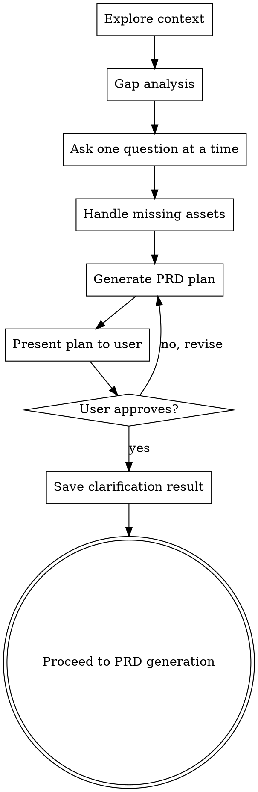

# Clarify Requirements

## Overview

在 PRD 生成前，确保所有感知数据已收集，且用户批准了内容方案。参考 superpowers brainstorming 的"逐步确认 → 方案审阅 → 用户批准"流程设计。

## HARD GATE

在以下条件全部满足前，**禁止调用 prd-gen 或任何 design 层 skill**：

1. 信息差距分析完成
2. 每个缺失项已逐一向用户确认（一次一个问题）
3. PRD 内容方案已呈现给用户
4. 用户已明确批准方案

## Anti-Pattern: "信息够了，直接生成吧"

**禁止**。即使你认为信息已经足够，也必须呈现方案并获得用户批准。"简单"需求更容易因为遗漏关键信息而导致 PRD 返工。

## Evidence Discipline (证据纪律)

1. **缺失信息标记【待确认】**：任何无法从输入或上下文获得的信息，标记为【待确认】，不得脑补填默认值。
2. **证据追溯【未验证】**：用户需求/市场断言必须追问证据来源；无证据的标记为【未验证】并注明所需验证方式。
3. **完整度检查门**：正式输出交付物前，先输出信息完整度清单（已确认 ✅ / 待确认 ⚠️ / 未验证 ❓），经用户确认后才生成正文。
4. **可追溯**：正式输出中的关键结论必须能追溯到以下来源之一：已确认的用户输入、引用的证据（含 URL）、或用户的显式决策；无法追溯的结论视为脑补，删除或改标【待确认】。

## 对话规则

访谈式澄清遵守以下三条规则：

1. **不复读**：默认不逐条复述用户的回答，确认后直接推进下一个问题；仅在回答含糊、前后矛盾、或影响后续方案时，才复述关键信息向用户确认。
2. **宽泛回答收敛**：用户回答太宽泛时，给出 2-4 个具体选项帮用户收敛，不替用户做决定。
   - 例：用户说"就是体验不好" → "具体是哪类体验问题？" → A. 操作步骤太多 B. 页面加载慢 C. 找不到想要的功能 D. 界面信息太乱
   - 例：用户说"想优化一下后台" → "'优化'主要指什么？" → A. 减少重复录入 B. 报表更直观 C. 审批流程更短 D. 移动端可用
3. **每阶段具体问法**：围绕背景触发 / 用户场景 / 问题证据 / 目标指标四个维度提问，避免空泛的"还有什么要补充的吗"：
   - **背景触发**："是什么触发了你现在提这个需求？" / "这个问题存在多久了？"
   - **用户场景**："谁在什么场景下会遇到这个问题？现在是怎么解决的？"
   - **问题证据**："有什么证据表明这个问题存在？"（数据、用户反馈、工单记录均可；无证据按证据纪律标【未验证】）
   - **目标指标**："做成什么样算解决了？哪个指标会变化、基线是多少？"

## Process Flow



## Step-by-Step Process

### Step 1: Explore Context

检查 `docs/product/` 目录中已有的感知数据：

- `docs/product/.ompm/market-analysis.json` — 市场情报
- `docs/product/.ompm/competitive-analysis.json` — 竞品分析
- `docs/product/.ompm/user-research.json` — 用户研究
- `docs/product/positioning.md` — 产品定位
- `docs/product/.ompm/prioritization.json` — 优先级排序

记录已有数据，避免重复收集。

### Step 1.5: 问题体检（快速检查）

PM 场景下大多数需求是成立的，此步只做快速检查，不构成 HARD GATE。发现以下三类陷阱时，先处理再进入场景确认：

a) **无定义核心词**：需求中出现"优化""提升体验""高级感"等不可衡量的核心词时，请用户给出可衡量/可操作的定义（如"优化"→"结算步骤从 5 步减到 3 步"）；给不出就先与用户一起定义清楚再继续。
b) **隐含假设**：需求中包含"用户需要 X"一类未经验证的断言时，追问证据来源（数据、用户反馈、工单记录等）；无证据的按证据纪律标记【未验证】并注明所需验证方式，不阻塞流程。
c) **逻辑错误**：把相关当因果（如"发了内容没流量，所以发得不够"——频率与流量是相关不是因果；"某产品成功因为做了 X"——幸存者偏差）。检测到就向用户指出并确认："把 A 和 B 的相关性当成了因果，这个问题还成立吗？"

### Step 2: Scenario Detection

**阶段进度显式化**：本 skill 全程每次向用户提问，都必须以 `当前阶段：N/M 阶段名` 开头，让用户随时掌握进度。阶段划分：

| 阶段 | 阶段名 | 对应步骤 |
|:-----|:-------|:---------|
| 1/4 | 场景确认 | Step 2 |
| 2/4 | 逐项确认 | Step 4（提问前缀进一步细化为 `当前阶段：2/4 逐项确认 · 第 x/y 项`，x 为当前项序号、y 为缺失项总数） |
| 3/4 | 方案审阅 | Step 6 |
| 4/4 | 结果落库 | Step 7 |

Step 1 / Step 1.5 / Step 3 / Step 5 为内部分析步骤，不向用户提问，无需前缀。

向用户提问确定需求场景（**宿主有结构化提问工具时使用**，如 Claude Code 的 `AskUserQuestion`；否则以编号选项列表提问并等待回复）：

**Q: 请选择需求场景**（以 `当前阶段：1/4 场景确认` 开头）

| Option | Description |
|:-------|-------------|
| **迭代更新** | 基于现有功能进行迭代优化 |
| **新功能** | 在现有产品上添加新模块 |
| **0-1 新产品** | 从零开始规划全新产品 |

### Step 3: Gap Analysis

根据场景类型，对比用户已提供的信息与 `context-requirements`：

| 场景 | 必需字段 | 检查项 |
|:-----|:---------|:-------|
| **迭代更新** | current_feature_desc, ui_state, iteration_goal | 是否提供了当前功能描述？是否有 UI 截图/HTML/链接？是否明确了迭代目标？ |
| **新功能** | product_architecture, design_specs, entry_point | 是否描述了产品整体架构？是否有设计规范？是否说明了入口位置？ |
| **0-1 新产品** | background, constraints, reference_products | 是否说明了产品背景与目标用户？是否有资源约束？是否提供了参考产品？ |

**逐条列出缺失项**，准备下一步逐一确认。

### Step 4: Ask One Question At A Time

此步骤对应 `当前阶段：2/4 逐项确认`：每条提问以 `当前阶段：2/4 逐项确认 · 第 x/y 项` 开头（x 为当前项序号，y 为缺失项总数）。

**核心规则：每条缺失信息单独提问，绝不一次性抛出多个问题。**

对每个缺失项，逐一结构化提问，优先使用多选格式：

**示例问题模板**：

| 缺失项 | 提问方式 |
|:-------|:---------|
| 缺少 UI 截图 | "当前功能的界面状态，你如何提供？" → A. 已有截图 B. 有 HTML 文件 C. 有在线链接 D. 暂无，先跳过 |
| 缺少竞品列表 | "需要分析哪些竞品？" → multi-select + "其他"选项 |
| 缺少目标用户 | "目标用户是？" → A. 已定义用户画像 B. 我口述你来整理 C. 需要先做用户研究 |
| 缺少参考产品 | "有参考产品吗？" → A. 有，我来说 B. 你帮我搜索行业标杆 C. 不需要参考 |

**处理用户说"稍后提供"的情况**：
- 记录哪些项是 pending 状态
- 在 PRD 方案中将这些项标记为 `[待补充]`
- 不阻塞流程，但明确标注缺失

**信息状态跟踪（证据纪律）**：澄清过程中产出的每一条信息都必须带状态标签：

| 状态 | 含义 | 标记 |
|:-----|:-----|:-----|
| 已确认 | 用户明确提供并确认的信息 | ✅ |
| 待确认 | 无法从输入或上下文获得、用户稍后补充的信息 | ⚠️【待确认】 |
| 未验证 | 用户提供的断言但无证据来源（如市场数据、用户反馈结论） | ❓【未验证】，并注明所需验证方式 |

- 用户确认的回答 → 标记为已确认 ✅
- 用户说"稍后提供" → 标记为【待确认】⚠️，**不得脑补填默认值**
- 用户给出断言但无证据 → 追问证据来源；仍无证据的标记为【未验证】❓，注明所需验证方式（如"需竞品实测"、"需用户访谈"）

### Step 5: Generate PRD Plan

基于已收集的信息，生成 PRD 内容方案。**本方案即证据纪律中"完整度检查门"的实例**：`已收集信息` / `待补充项` 两节就是信息完整度清单，逐项携带状态（已确认 ✅ / 待确认 ⚠️ / 未验证 ❓），必须经用户确认后才生成 PRD 正文。

```markdown
## PRD 内容方案

### 场景确认
- **场景类型**: 迭代更新 / 新功能 / 0-1 新产品
- **核心需求**: [一句话概括]

### 已收集信息（信息完整度清单）
- [列出用户已提供的所有信息，逐项标注状态：已确认 ✅ / 待确认 ⚠️ / 未验证 ❓（未验证项注明所需验证方式）]

### 待补充项
- [列出 pending 项，标注 [待补充]，即【待确认】项]

### 预计生成的 PRD 章节
| 章节 | 内容概要 | 依赖 | 可生成性 |
|:-----|:---------|:-----|:---------|
| 第0章 行业对标 | 将研究 X 个标杆产品 | 需用户提供参考产品 | ⚠️ 信息不足暂缓——缺参考产品列表 |
| 第1章 项目概述 | 基于用户描述展开 | 已完成 | ✅ 可生成 |
| 第2章 业务分析 | 目标用户 X，痛点 Y | [待补充] 用户画像 | ⚠️ 信息不足暂缓——缺用户画像 |
| 第3章 功能需求 | [列出从用户需求中识别的关键功能] | 已完成 | ✅ 可生成 |
| 第4章 非功能性需求 | 行业标准要求 | 自动生成 | ✅ 可生成 |
| 第5章 用户体验流程 | 基于功能推导 | 需 UI 截图补充 | ⚠️ 信息不足暂缓——缺 UI 截图 |
| 第6章 项目风险 | 基于功能复杂度 | 自动生成 | ✅ 可生成 |
| 第7章 合规建议 | 基于数据类型 | 自动生成 | ✅ 可生成 |
| 第8章 原型设计 | [待确认是否生成] | - | ✅ 可生成 |
| 第9章 成功指标 | 基于目标推导 | 自动生成 | ✅ 可生成 |

### 关键决策点
- [列出需要用户在 PRD 生成前确认的关键决策]
```

**可生成性列（按交付物就绪度分别生成）**：逐章节判断 ✅ 可生成 / ⚠️ 信息不足暂缓（注明缺什么信息）；暂缓章节不阻塞其他章节，用户可在 Step 6 选择"只生成信息充足的章节"。

### Step 6: User Approval

此步骤对应 `当前阶段：3/4 方案审阅`：提问以 `当前阶段：3/4 方案审阅` 开头，让用户审阅方案：

**Q: 请审阅 PRD 内容方案**

| Option | Description |
|:-------|:------------|
| **确认，按此方案生成 PRD** | 进入 PRD 生成流程 |
| **只生成信息充足的章节** | 按 Step 5 可生成性列仅生成 ✅ 章节，⚠️ 章节暂缓并保留 [待补充] 标记 |
| **需要调整方案** | 回到 Step 5 修改方案 |
| **我有更多信息要补充** | 回到 Step 4 补充信息，重新生成方案 |
| **先回到感知阶段** | 调用 market-research / competitive-analysis 等 skill 补充感知数据 |

### Step 7: Save Clarification Result

将澄清结果保存到 `docs/product/.ompm/clarification-result.json`：

```json
{
  "scenario": "iteration|new_feature|new_product",
  "collected_info": {
    "field1": "value1",
    "field2": "value2"
  },
  "pending_items": [
    {"field": "ui_state", "reason": "用户稍后提供截图"}
  ],
  "prd_plan": {
    "chapters_planned": ["第0章", "第1章", "..."],
    "key_decisions": ["决策1", "决策2"],
    "user_approved": true,
    "approved_at": "ISO 8601"
  }
}
```

**与证据纪律的映射（JSON 字段名保持契约稳定，不得更改）**：

- `collected_info` 对应状态为**已确认 ✅** 的信息
- `pending_items` 对应 **【待确认】⚠️** 项——用户说"稍后提供"的缺失信息在此落库
- **【未验证】❓** 项：将断言内容放入 `collected_info`，并在 `pending_items` 中追加对应验证任务（`reason` 注明所需验证方式）

## Quality Standards

- 每个必需字段已确认或标记为 pending
- 至少一次结构化提问用于场景确认
- PRD 内容方案包含 9 章概要 + 关键决策点
- 用户已明确批准方案
- 澄清结果已保存到 `docs/product/.ompm/clarification-result.json`

## Context Integration

**Reads:**
- `docs/product/.ompm/market-analysis.json` — 市场情报
- `docs/product/.ompm/competitive-analysis.json` — 竞品分析
- `docs/product/.ompm/user-research.json` — 用户研究
- `docs/product/positioning.md` — 产品定位

**Writes:**
- `docs/product/.ompm/clarification-result.json` — 需求澄清结果

**Output To:**
- `prd-gen` — 需求澄清作为 PRD 生成输入
- `competitive-analysis` — 如需补充竞品分析
- `market-research` — 如需补充市场情报或用户研究

## Example Usage

```
User: "小鹅通有个打卡功能要加 AI 评价，需求是这样的..."
→ 检测到信息不完整（缺少 UI 截图、AI 助理现状、关联应用配置）
→ 逐步询问缺失项
→ 生成 PRD 内容方案
→ 用户确认后进入 PRD 生成

User: "帮我梳理一下这个需求还缺什么信息"
→ 直接调用 clarify-requirements
→ 系统性地识别和确认缺失信息
```

## 下一步

本 skill 完成后，如果用户没有明确下一步，引导用户使用 ompm skill 做意图路由——它会读取本轮产出和当前状态，判断最有价值的下一步。不要替用户预设固定长链；output-to 声明的是数据流向，不是强制路径。
