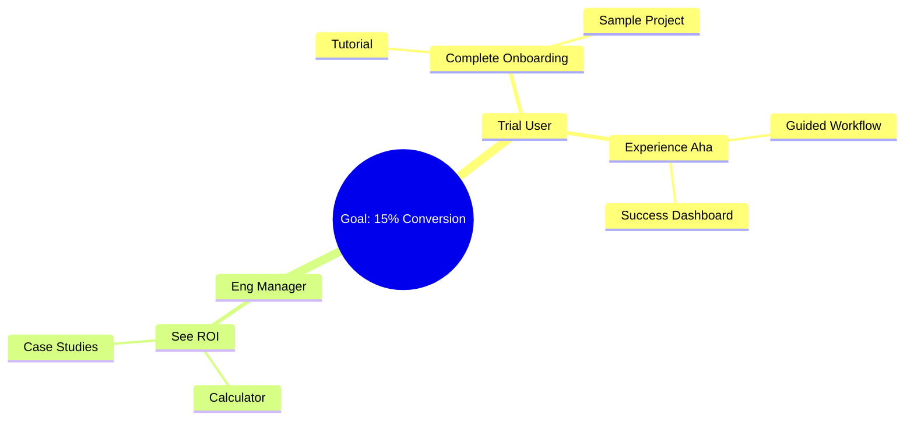

# Impact Mapping

## When to Use This Skill

Use this skill when:

- **Impact Mapping tasks** - Working on create impact maps using gojko adzic's methodology. structure strategic planning from goals to actors to impacts to deliverables for clear product roadmaps
- **Planning or design** - Need guidance on Impact Mapping approaches
- **Best practices** - Want to follow established patterns and standards

## Overview

Impact Mapping is a strategic planning technique invented by Gojko Adzic that helps teams align their work with business objectives. It creates a clear connection between business goals and product deliverables by mapping out the behavioral changes (impacts) needed from specific actors.

## The Four Questions

Impact Mapping answers four key questions:

| Level | Question | Focus |
|-------|----------|-------|
| **Goal** | Why? | What is the business objective? |
| **Actors** | Who? | Whose behavior needs to change? |
| **Impacts** | How? | How should their behavior change? |
| **Deliverables** | What? | What can we do to cause the change? |

## Map Structure

```text
           ┌──────────────────────────────────────────────────────────────┐
           │                         GOAL                                 │
           │                         (Why?)                               │
           └─────────────────────────────┬────────────────────────────────┘
                                         │
         ┌───────────────────────────────┼───────────────────────────────┐
         │                               │                               │
   ┌─────┴─────┐                   ┌─────┴─────┐                   ┌─────┴─────┐
   │   ACTOR   │                   │   ACTOR   │                   │   ACTOR   │
   │   (Who?)  │                   │   (Who?)  │                   │   (Who?)  │
   └─────┬─────┘                   └─────┬─────┘                   └─────┬─────┘
         │                               │                               │
   ┌─────┼─────┐                   ┌─────┼─────┐                   ┌─────┼─────┐
   │     │     │                   │     │     │                   │     │     │
Impact Impact Impact            Impact Impact Impact            Impact Impact Impact
(How?) (How?) (How?)            (How?) (How?) (How?)            (How?) (How?) (How?)
   │     │     │                   │     │     │                   │     │     │
   D     D     D                   D     D     D                   D     D     D
(What?) (What?) (What?)         (What?) (What?) (What?)         (What?) (What?) (What?)
```

## Layer 1: Goals (Why?)

The business objective we're trying to achieve.

### SMART Goals

| Criterion | Description | Example |
|-----------|-------------|---------|
| **S**pecific | Clear and well-defined | "Reduce customer churn" |
| **M**easurable | Quantifiable metric | "...by 20%" |
| **A**chievable | Realistic target | "...from 8% to 6.4%" |
| **R**elevant | Aligned with strategy | "...to improve ARR growth" |
| **T**ime-bound | Has deadline | "...by end of Q2" |

### Goal Examples

✅ **Good Goals**:

- "Increase new user activation from 30% to 50% by Q2"
- "Reduce average support ticket resolution time from 4 hours to 1 hour"
- "Grow monthly recurring revenue by $100K in 6 months"

❌ **Bad Goals**:

- "Build the best product" (not measurable)
- "Launch feature X" (output, not outcome)
- "Improve customer satisfaction" (not specific enough)

## Layer 2: Actors (Who?)

People or systems whose behavior we need to influence.

### Actor Categories

| Type | Description | Examples |
|------|-------------|----------|
| **Primary** | Direct users who benefit | End users, customers |
| **Secondary** | Enable or influence primary | Administrators, managers |
| **Off-stage** | Indirect stakeholders | Executives, regulators |
| **Negative** | Those who could hinder | Competitors, detractors |

### Actor Discovery Questions

- Who can help us achieve the goal?
- Who can hinder us?
- Who are the end users?
- Who influences the end users?
- Who pays for the product?
- Who maintains the product?

### Actor Prioritization

| Actor | Influence | Effort to Change | Priority |
|-------|-----------|------------------|----------|
| Power Users | High | Low | P1 |
| New Users | High | Medium | P1 |
| Administrators | Medium | Low | P2 |
| Competitors | High | Very High | Watch |

## Layer 3: Impacts (How?)

Behavioral changes we want to see in actors.

### Impact Types

| Type | Description | Example |
|------|-------------|---------|
| **Create** | New behavior | "Start recommending to colleagues" |
| **Increase** | More of something | "Use the product more frequently" |
| **Decrease** | Less of something | "Spend less time on manual tasks" |
| **Stop** | Eliminate behavior | "Stop using competitor" |
| **Prevent** | Avoid behavior | "Don't abandon during onboarding" |

### Impact Statement Template

```text
[Actor] should [direction] [behavior] so that [goal connection].
```

**Examples**:

- "New users should **start** completing onboarding within first session so that activation rate increases"
- "Power users should **increase** inviting team members so that virality improves"
- "Support staff should **decrease** time spent on repetitive questions so that they can handle more tickets"

### Common Mistakes

❌ **Deliverables disguised as impacts**:

- "Users should use the new dashboard" (that's a deliverable)
- Better: "Users should make data-driven decisions faster"

❌ **Too vague**:

- "Users should be happier"
- Better: "Users should recommend the product to others"

## Layer 4: Deliverables (What?)

Features, content, or changes that could cause the desired impacts.

### Deliverable Brainstorming

For each impact, generate multiple options:

- What feature could cause this impact?
- What content could cause this impact?
- What design change could help?
- What integration could help?
- What removal could help?

### Deliverable Sizing

| Size | Description | Duration |
|------|-------------|----------|
| XS | Trivial change | < 1 day |
| S | Small feature | 1-3 days |
| M | Medium feature | 1-2 weeks |
| L | Large feature | 2-4 weeks |
| XL | Major initiative | > 1 month |

### Prioritization Matrix

Consider both impact and effort:

```text
         High Impact
              │
   ┌──────────┼──────────┐
   │  Quick   │   Major  │
   │  Wins    │ Projects │
   │  (Do!)   │ (Plan)   │
   ├──────────┼──────────┤
   │  Fill    │  Money   │
Low │  Ins    │  Pits    │ High
Effort│       │ (Avoid)  │ Effort
   └──────────┼──────────┘
              │
         Low Impact
```

## Creating an Impact Map

### Step 1: Define the Goal

1. Identify business objective
2. Make it SMART
3. Validate with stakeholders
4. Confirm measurement capability

### Step 2: Identify Actors

1. List all possible actors
2. Categorize by type
3. Prioritize by influence/effort
4. Select top 3-5 to focus on

### Step 3: Discover Impacts

For each priority actor:

1. What behaviors would help the goal?
2. What behaviors would hurt the goal?
3. How might we change behaviors?
4. Document as impact statements

### Step 4: Generate Deliverables

For each impact:

1. Brainstorm 5+ possible deliverables
2. Include wild ideas
3. Don't evaluate yet
4. Consider dependencies

### Step 5: Prioritize and Plan

1. Score deliverables by impact/effort
2. Identify quick wins
3. Group into releases/iterations
4. Define success metrics per deliverable

## Impact Map Workshop

### Agenda (2-3 hours)

| Time | Activity |
|------|----------|
| 10 min | Introduction and goal alignment |
| 15 min | Goal refinement (SMART criteria) |
| 20 min | Actor identification and prioritization |
| 30 min | Impact discovery (per actor) |
| 45 min | Deliverable brainstorming |
| 20 min | Prioritization and roadmap |
| 10 min | Next steps and commitments |

### Materials Needed

- Whiteboard or digital canvas
- Sticky notes (4 colors for layers)
- Voting dots
- Timer
- Facilitator guide

## Example Impact Map

**Goal**: Increase developer trial-to-paid conversion from 5% to 15% by Q2

```text
Goal: 15% trial conversion by Q2
├── Actor: Trial User
│   ├── Impact: Complete onboarding in first session
│   │   ├── Interactive tutorial
│   │   ├── Pre-configured sample project
│   │   └── Progress celebration notifications
│   ├── Impact: Experience "aha moment" within 24 hours
│   │   ├── Guided first workflow
│   │   ├── Comparison with manual approach
│   │   └── Success metrics dashboard
│   └── Impact: Invite team members during trial
│       ├── Team invitation wizard
│       ├── Collaborative features highlight
│       └── Multi-seat trial offer
├── Actor: Engineering Manager
│   ├── Impact: See ROI justification
│   │   ├── Time savings calculator
│   │   ├── Executive summary report
│   │   └── Case study library
│   └── Impact: Approve purchase request
│       ├── Security documentation
│       ├── Procurement-friendly pricing
│       └── Enterprise features demo
└── Actor: Competitor User
    └── Impact: Switch due to superior experience
        ├── Migration assistant
        ├── Feature comparison page
        └── Competitor user testimonials
```

## AI-Assisted Impact Mapping

### Map Generation

Given a business goal:

1. Suggest relevant actors (5-7)
2. Generate impacts per actor (3-5 each)
3. Brainstorm deliverables per impact (3-5 each)
4. Estimate relative sizing

### Stakeholder Interview Analysis

From stakeholder conversations:

1. Extract stated goals
2. Identify mentioned actors
3. Surface implied impacts
4. Note suggested solutions

### Mermaid Visualization

Generate map as Mermaid mindmap:



## Integration Points

**Inputs from**:

- Business strategy → Goals
- `design-thinking` skill: User needs → Actors + Impacts
- Stakeholder interviews → Actor priorities

**Outputs to**:

- Product roadmap → Prioritized deliverables
- `opportunity-mapping` skill: Impacts → Opportunities
- `lean-startup` skill: Deliverables → MVP hypotheses

## References

For additional Impact Mapping resources, see:
