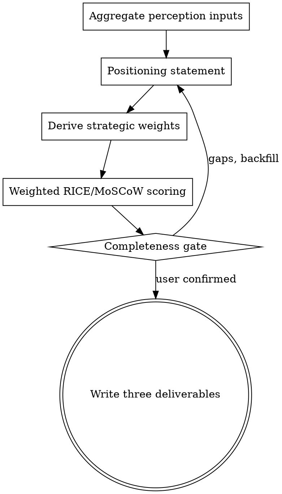

# Product Strategy

Define where to win, decide what to build, plan when to build it — 一条主线，一次成稿。

## Overview

策略三件套不是三个并列模块，而是一条数据流主线：

```
定位声明 → 战略权重 → 优先级排序 → 排期映射 → 路线图
```

1. **定位声明**：明确"为谁、以什么差异化取胜"，并从中推导出**战略权重**（差异化主轴决定评分倾向）。
2. **优先级排序**：用战略权重校准 RICE/MoSCoW，产出带 rank 与类别的排序结果。
3. **路线图**：把排序结果按类别与容量约束映射为 Now/Next/Later 与季度里程碑，每个里程碑回溯到定位的价值主张。

上游改动沿主线传导：定位变 → 权重变 → 排序变 → 排期变，三份交付物始终一致。

### 分段触发模式

三件套支持**分段独立请求**，不必每次都跑完整链路：

| 请求 | 行为 |
|:-----|:-----|
| 只要定位（"我们如何定位 X"） | 产 `positioning.md`，推导战略权重留存备用 |
| 只要排序（"给这个排优先级"/"用 RICE 排一下"） | **若已有 `positioning.md`，复用其战略权重校准**；否则先补定位主轴再排序 |
| 只要路线图（"创建路线图"/"下季度路线图"） | **若已有 `prioritization.json`，按其 rank 映射**；否则先补排序再排期 |

完整链路（定位→排序→路线图）仍是默认推荐——一次成稿保证三份交付物一致；但轻量场景允许只产出被请求的那一份，已有的上游产物作为权重/排序来源自动复用。

## When to Use

Activate this skill when:
- 用户需要产品定位、差异化策略或价值主张（"我们如何定位 X"、"我们有什么不同"）
- 用户需要对待办事项排序、决定先构建什么（"给这个排优先级"、"如何对这些排名"）
- 用户需要产品路线图、里程碑或发布规划（"创建路线图"、"下季度路线图"）
- 制定季度/年度产品战略，或向干系人沟通产品方向

## How It Works

1. **汇总感知输入** — 读取市场、竞品、用户研究、需求澄清与反馈综合结果
2. **定位声明** — 定义 ICP、价值主张、差异化主轴，推导战略权重
3. **优先级排序** — 按权重校准的 RICE/MoSCoW 对候选事项打分排名
4. **路线图排期** — 按 rank、类别与容量约束把事项排入时间线

## Process Flow



## Step-by-Step Process

### Step 1: 汇总感知输入

检查 `docs/product/` 中已有的感知数据：

- `docs/product/.ompm/market-analysis.json` — 市场趋势与规模
- `docs/product/.ompm/competitive-analysis.json` — 竞争格局
- `docs/product/.ompm/user-research.json` — 用户需求与画像
- `docs/product/.ompm/clarification-result.json` — 需求澄清结果
- `docs/product/.ompm/feedback-synthesis.json` — 用户反馈综合

记录已有数据与缺口；缺口进入证据纪律的【待确认】清单。

### Step 2: 定位声明（含战略权重推导）

基于感知输入完成定位，写入 `docs/product/positioning.md`。核心决策是**差异化主轴**——三角定位中只选一个主攻点：

```
      Cheaper
        /\
       /  \
      /    \
Better /      \ Faster
```

差异化主轴直接推导**战略权重**，作为 Step 3 的排序校准参数：

| 差异化主轴 | RICE 校准 | MoSCoW 校准 |
|:-----------|:----------|:------------|
| **Better**（体验取胜） | Impact 加权：直接强化差异化的事项 Impact 上调一档 | 支撑差异化的 Attractive/Performance 项 → Must/Should |
| **Faster**（速度取胜） | Reach × Confidence 加权：快速触达、低不确定性优先 | 缩短 time-to-value 的事项 → Must |
| **Cheaper**（成本取胜） | Effort 折扣加重：同等分值下低投入者优先 | 能降低用户获取与使用成本的事项 → Must/Should |

同时给出 MoSCoW 边界规则：**直接支撑定位声明**的事项是 Must Have 候选；**与定位无关或冲突**的事项是 Won't Have 候选。

### Step 3: 优先级排序（应用权重）

收集候选事项（功能、计划、backlog 项），结果写入 `docs/product/.ompm/prioritization.json`。排序分两步：**先按情境选择方法，再应用 Step 2 的战略权重校准**——方法选择发生在权重应用之前。

**方法选择（按上下文）**

| 当前情境 | 适用方法 |
|:---------|:---------|
| 数据充分、有规模估算（用户数与投入可量化） | **RICE** |
| 干系人沟通/对齐导向（要对"做什么、不做什么"达成共识） | **MoSCoW** |
| 用户分层明显、要区分基本/期望/兴奋型需求 | **Kano** |
| 快速取舍、维度少（只需粗略分先后） | **value-cost 矩阵** |

**硬规则**：选定方法后，必须用一句话说明为什么这个方法适合当前情境（团队规模 / 数据可得性 / 决策场景），并把方法与理由记入输出——`prioritization.json` 的 `framework` 与 `framework_rationale` 字段，或报告开头。

选定方法后用其结构打分，并应用 Step 2 推导的战略权重校准。最常用的两个方法结构如下；Kano（Basic / Performance / Excitement 分类）与 value-cost 矩阵（价值-成本四象限）结构简单，随用随画即可。

**RICE**

```
RICE = (Reach × Impact × Confidence) / Effort

- Reach: 影响多少用户（0-100+）
- Impact: 单用户影响（0.25 微小 / 0.5 小 / 1 中 / 2 大 / 3 巨大）
- Confidence: 估计置信度（0-100%）
- Effort: 人月
```

**MoSCoW（类别映射）**

| 类别 | 定义 | 占比 |
|:-----|:-----|:-----|
| **Must Have** | 成功必需 | 20-30% |
| **Should Have** | 重要但非关键 | 30-40% |
| **Could Have** | 有余力则做 | 20-30% |
| **Won't Have** | 明确排除 | 10-20% |

每个事项给出 rank、category 与 rationale。**rationale 必须回溯到定位**：说明该事项如何支撑差异化主轴，而不是只解释分数。

### Step 4: 路线图排期

把排序结果映射为时间线，写入 `docs/product/roadmap.md`。映射规则：

| 排序结果 | 路线图位置 |
|:---------|:-----------|
| Must Have，按 rank 升序 | Now / 近季度里程碑（尊重依赖关系） |
| Should Have | Next / 后续季度 |
| Could Have | Later / 容量缓冲 |
| Won't Have | 不进入路线图，在 Assumptions 中注明排除原因 |

排期约束取自 `prioritization.json` 的 `constraints`（capacity、timeframe）：按 Effort 累加填充各季度，预留 15-20% buffer。Strategic Themes 从定位声明推导，每个里程碑标注来源 rank 与其交付的价值主张。

## Evidence Discipline (证据纪律)

1. **缺失信息标记【待确认】**：任何无法从输入或上下文获得的信息，标记为【待确认】，不得脑补填默认值。
2. **证据追溯【未验证】**：用户需求/市场断言必须追问证据来源；无证据的标记为【未验证】并注明所需验证方式。
3. **完整度检查门**：正式输出交付物前，先输出信息完整度清单（已确认 ✅ / 待确认 ⚠️ / 未验证 ❓），经用户确认后才生成正文。
4. **可追溯**：正式输出中的关键结论必须能追溯到以下来源之一：已确认的用户输入、引用的证据（含 URL）、或用户的显式决策；无法追溯的结论视为脑补，删除或改标【待确认】。

## Output Structure

完整链路产出三份交付物（**契约路径固定，下游按旧路径引用**）；分段模式只产被请求的那一份，已有上游产物自动复用：

1. `docs/product/positioning.md` — 定位声明与战略权重
2. `docs/product/.ompm/prioritization.json` — 机器可读的排序结果
3. `docs/product/roadmap.md` — 路线图与里程碑

### Positioning Document Format (`docs/product/positioning.md`)

```markdown
# Product Positioning: [Product Name]

## Positioning Statement
For [target customer]
Who [statement of need/opportunity],
[Product Name] is a [product category]
That [key benefit/differentiator].
Unlike [primary competitive alternative],
We [statement of primary differentiation].

## Target Market
### Ideal Customer Profile (ICP)
- **Company Size**: [X-Y employees]
- **Industry**: [Specific industries]
- **Role**: [Decision maker title]
- **Geography**: [Target regions]

### Customer Segments
| Segment | Description | Priority |
|:--------|:-------------|:---------|

## Value Proposition
### Primary Value
[Core value delivered - the "why us" in one sentence]

### Value Ladder
| Level | Value | Proof |
|:------|:------|:------|
| Functional | [What it does] | [Feature/capability] |
| Economic | [ROI/benefit] | [Metric/outcome] |
| Emotional | [How it feels] | [User sentiment] |

## Differentiation Strategy
### 差异化主轴
[ ] Better  [ ] Faster  [ ] Cheaper  ← 只选一个主攻点

### Competitive Advantages
| Advantage | Description | Sustainability |
|:----------|:-------------|:---------------|

### Differentiation vs Competitors
| Competitor | Their Positioning | Our Differentiation |
|:-----------|:------------------|:--------------------|

## 战略权重（→ 优先级排序输入）
| 参数 | 取值 | 依据 |
|:-----|:-----|:-----|
| 差异化主轴 | [Better / Faster / Cheaper] | [定位声明推导] |
| RICE 校准 | [Impact 加权 / Reach×Confidence 加权 / Effort 折扣加重] | [主轴映射] |
| Must Have 边界 | [直接支撑定位的事项类型] | [定位声明] |
| Won't Have 边界 | [与定位冲突的事项类型] | [定位声明] |

## Proof Points
- Social proof: [Customer logos/testimonials]
- Technical proof: [Performance metrics]
- Business proof: [Growth metrics]
```

### Prioritization Format (`docs/product/.ompm/prioritization.json`)

```json
{
  "prioritization": {
    "framework": "RICE",
    "framework_rationale": "数据可得性高：Reach 与 Effort 有历史数据支撑，RICE 可量化排序",
    "timestamp": "2026-07-28T...",
    "constraints": {
      "capacity": 50,
      "timeframe": "Q2 2026"
    },
    "items": [
      {
        "id": "FEAT-001",
        "name": "User onboarding flow",
        "rice_score": 85,
        "reach": 1000,
        "impact": 2,
        "confidence": 0.85,
        "effort": 2,
        "rank": 1,
        "category": "Must Have",
        "rationale": "High reach, high impact, 直接支撑 Faster 主轴"
      }
    ],
    "summary": {
      "total_items": 15,
      "must_have": 3,
      "should_have": 5,
      "could_have": 4,
      "wont_have": 3
    }
  }
}
```

### Roadmap Document Format (`docs/product/roadmap.md`)

```markdown
# Product Roadmap: [Timeframe]

## Strategic Themes（从定位声明推导）
| Theme | 支撑的价值主张 | Priority |
|:------|:---------------|:---------|

## Now/Next/Later

### Now（当前季度）— Must Have 按 rank
- [ ] [Feature A]（rank 1, RICE 85）
- [ ] [Feature B]（rank 2, RICE 72）

### Next（下一季度）— Should Have
- [Feature C]（rank 4）

### Later（未来）— Could Have
- [Feature D]（rank 8）

## Milestones

### Q1 2026 - [Theme]
**Goal**: [本里程碑交付的价值主张]

| Deliverable | Target | Success Criteria | 来源 rank | Risk |
|:------------|:-------|:------------------|:----------|:-----|

**Dependencies**: [...]
**Capacity**: [计划点数 / 总容量]，buffer 15-20%

## Dependencies & Risks
| Item | Type | Impact | Mitigation |
|:-----|:-----|:-------|:-----------|

## Resource Allocation
| Team | Q1 | Q2 | Q3 | Q4 |
|:-----|:---|:---|:---|:---|

## Assumptions
1. [关键假设，含 Won't Have 项的排除原因]
```

## Quality Standards

- 定位声明具体、可信、可辩护（不是 "for everyone"），差异化主轴唯一
- 战略权重已从定位显式推导，并在排序中实际应用（不是摆设）
- 每个事项的 rationale 回溯到定位；ranking 有清晰、可对干系人解释的理由
- 路线图每个里程碑标注来源 rank 与交付的价值主张
- 排期符合容量约束并预留 buffer；Won't Have 项未进入路线图
- 三份交付物已通过完整度检查门，【待确认】/【未验证】项已标注

## Context Integration

**Reads:**
- `docs/product/.ompm/market-analysis.json` — 市场趋势与规模
- `docs/product/.ompm/competitive-analysis.json` — 竞争格局
- `docs/product/.ompm/user-research.json` — 用户需求与画像
- `docs/product/.ompm/clarification-result.json` — 需求澄清结果
- `docs/product/.ompm/feedback-synthesis.json` — 用户反馈综合

**Writes:**
- `docs/product/positioning.md` — 定位声明与战略权重
- `docs/product/.ompm/prioritization.json` — 优先级排序结果
- `docs/product/roadmap.md` — 产品路线图

**Output To:**
- `prd-gen` — 定位与优先级作为 PRD 范围输入
- `retrospective` — 路线图与优先级作为复盘基线

## Example Usage

```
User: "Define our positioning for the project management tool and plan Q2"
→ 汇总感知输入 → 定位声明（Better 主轴）→ 权重校准 RICE 排序 → Q2 路线图

User: "我们应该先构建什么？用 RICE 排一下"
→ 若已有 positioning.md 则复用其战略权重；否则先补定位再排序

User: "What's our product plan for this year?"
→ 沿主线一次产出定位、排序与年度路线图
```

## Best Practices

1. **先定位再排序** — 没有战略权重的 RICE 只是算术，不是策略
2. **主轴唯一** — Better/Faster/Cheaper 只选一个主攻点，贪多则定位失效
3. **rationale 比分数重要** — 每条排名理由都要能讲给干系人听
4. **主题式路线图** — 按战略主题而非功能清单组织，为变化留余地
5. **预留 buffer** — 排期不做 100% 利用率，给意外机会留空间

## 下一步

本 skill 完成后，如果用户没有明确下一步，引导用户使用 ompm skill 做意图路由——它会读取本轮产出和当前状态，判断最有价值的下一步。不要替用户预设固定长链；output-to 声明的是数据流向，不是强制路径。
