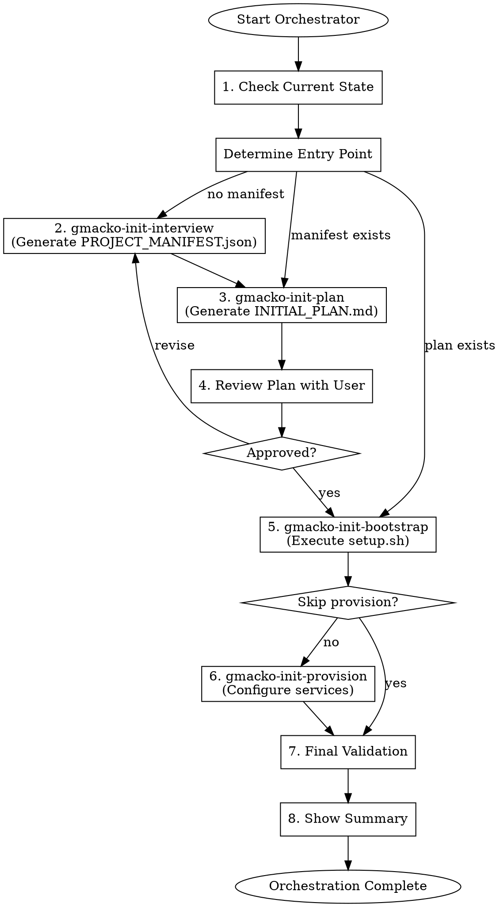

# Gmacko Init Orchestrator

One-button initialization: interview -> plan -> bootstrap -> provision -> validate.

## Overview

This orchestrator coordinates the complete project initialization workflow by calling the appropriate skills in sequence. It provides a streamlined experience while maintaining the flexibility to skip or customize individual steps.

## Workflow



## Execution Steps

### Step 1: Check Current State

Determine where to start based on existing artifacts:

```bash
# Check what exists
HAS_MANIFEST=$([ -f "PROJECT_MANIFEST.json" ] && echo "true" || echo "false")
HAS_PLAN=$([ -f "INITIAL_PLAN.md" ] && echo "true" || echo "false")
HAS_BOOTSTRAP=$([ -f "docs/ai/handoffs/init-bootstrap.md" ] && echo "true" || echo "false")
```

Report state:
```
PROJECT STATE
=============
PROJECT_MANIFEST.json: [exists/missing]
INITIAL_PLAN.md: [exists/missing]
Bootstrap completed: [yes/no]
```

Ask user:
> Based on the current state, I recommend starting from [step].
> Would you like to:
> a) Start fresh (run full workflow)
> b) Continue from [recommended step]
> c) Skip to a specific step

### Step 2: Run Interview (if needed)

If `PROJECT_MANIFEST.json` doesn't exist:

> Starting project interview...

Invoke the `gmacko-init-interview` skill:
- Complete all interview sections
- Generate `PROJECT_MANIFEST.json`
- Wait for manifest to be written

### Step 3: Run Plan Generation (if needed)

If `INITIAL_PLAN.md` doesn't exist or manifest was just created:

> Generating implementation plan...

Invoke the `gmacko-init-plan` skill:
- Read `PROJECT_MANIFEST.json`
- Generate `INITIAL_PLAN.md`
- Create `docs/ai/handoffs/init-plan.md`

### Step 4: Review Plan with User

Present plan summary and ask for approval:

> I've generated your implementation plan. Here's the summary:
>
> **[Project Name]**: [Description]
>
> MVP Features:
> - [Feature 1]
> - [Feature 2]
> - [Feature 3]
>
> Platforms: [Web/Mobile/Both]
> Integrations: [List enabled]
> Deployment: [Vercel/k8s] with [environments]
>
> Please review `INITIAL_PLAN.md` for full details.
>
> Ready to proceed with setup? (yes/revise/abort)

### Step 5: Run Bootstrap (if approved)

If user approves:

> Executing project setup...

Invoke the `gmacko-init-bootstrap` skill:
- Run preflight checks
- Execute `scripts/setup.sh`
- Validate results

### Step 6: Run Provision (optional)

After bootstrap completes:

> Would you like to configure external services now?
> This will set up: [list enabled integrations]
>
> a) Yes, configure all services
> b) Yes, but let me choose which ones
> c) Skip for now (I'll do it manually)

If user chooses to provision, invoke the `gmacko-init-provision` skill (to be created) or guide through `scripts/provision.sh`.

### Step 7: Final Validation

Run comprehensive validation:

```bash
# Full validation suite
pnpm typecheck
pnpm lint
pnpm build

# Check all handoffs exist
[ -f "docs/ai/handoffs/init-plan.md" ]
[ -f "docs/ai/handoffs/init-bootstrap.md" ]
```

### Step 8: Show Summary

Present final summary:

```
INITIALIZATION COMPLETE
=======================

Project: [name] ([display name])
Repository: gmacko/[name]

Artifacts Created:
- PROJECT_MANIFEST.json (source of truth)
- INITIAL_PLAN.md (implementation roadmap)
- docs/ai/handoffs/init-plan.md
- docs/ai/handoffs/init-bootstrap.md

Services Configured:
- [x] Neon Database
- [x] Clerk Authentication
- [ ] Stripe Payments (skipped)
- [x] PostHog Analytics
- [x] Sentry Monitoring

Validation:
- Type check: PASSED
- Lint: PASSED
- Build: PASSED

NEXT STEPS
----------
1. Review INITIAL_PLAN.md with your team
2. Create GitHub repository:
   gh repo create gmacko/[name] --private --source=. --push
3. Set up Vercel project:
   vercel link
4. Start development:
   pnpm dev

Happy building!
```

## Customization Options

Users can customize the orchestration:

### Skip Interview (use existing manifest)
```
/gmacko-init-orchestrator --skip-interview
```

### Skip Provision (manual setup later)
```
/gmacko-init-orchestrator --skip-provision
```

### Dry Run (preview without changes)
```
/gmacko-init-orchestrator --dry-run
```

## Error Recovery

If any step fails:

1. **Interview fails**: Restart interview with saved progress (if partial manifest exists)
2. **Plan fails**: Check manifest validity, regenerate
3. **Bootstrap fails**: Check error, fix issue, retry bootstrap only
4. **Provision fails**: Can be retried independently; other steps are complete

## Red Flags

| Rationalization | Correction |
|-----------------|------------|
| "I'll skip the plan review" | ALWAYS get user approval before bootstrap |
| "Bootstrap failed but I'll continue" | STOP: Fix bootstrap before provision |
| "I'll run all steps without checking state" | ALWAYS check existing artifacts first |
| "User seems impatient, I'll rush" | Maintain quality; each step matters |

## Dependencies

This orchestrator invokes:
1. `gmacko-init-interview` (Tier B)
2. `gmacko-init-plan` (Tier B)
3. `gmacko-init-bootstrap` (Tier B)
4. `gmacko-init-provision` (Tier B, optional)

## Handoff Document

After completion, ensure all handoffs are present:
- `docs/ai/handoffs/init-plan.md`
- `docs/ai/handoffs/init-bootstrap.md`
- `docs/ai/handoffs/init-provision.md` (if provisioned)

Create summary handoff at `docs/ai/handoffs/init-complete.md`:

```markdown
# Initialization Complete

## Timestamp
[ISO timestamp]

## Steps Completed
- [x] Interview (PROJECT_MANIFEST.json)
- [x] Plan (INITIAL_PLAN.md)
- [x] Bootstrap (setup.sh executed)
- [x/skipped] Provision (services configured)

## Validation
- Type check: PASSED
- Lint: PASSED
- Build: PASSED

## Ready for Development
The project is ready for feature implementation.
Start with Milestone 1 from INITIAL_PLAN.md.
```
