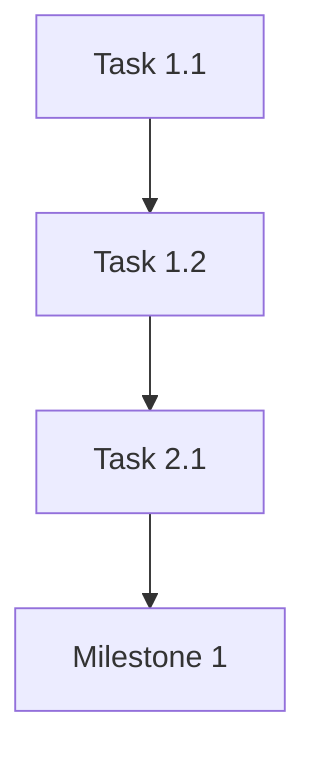

# Plan-Down - Method-Driven Four-Path Intelligent Planning Generator

## Overview

This skill provides a comprehensive method clarity-driven planning workflow that intelligently adapts to both user interaction preference (Interactive/Automatic) and implementation method clarity (Clear/Unclear).

**Core Innovation:** Uses zen-mcp chat as decision module to assess whether user provides a "clear implementation method" before planning.

**Four Execution Paths:**
1. **Interactive + Clear**: Direct planning with user approval
2. **Interactive + Unclear**: Multi-round dialogue to clarify method, then plan
3. **Automatic + Clear**: Fully automated planning
4. **Automatic + Unclear**: AI chain (clink → chat → consensus) to enrich method, then plan

The final output is a complete `plan.md` file ready for implementation.

**Technical Architecture:**
- **zen-mcp chat**: Method clarity judgment + interactive clarification + deep thinking (via clink)
- **zen-mcp planner**: Interactive, sequential planning tool with revision and branching capabilities
- **zen-mcp consensus**: Multi-model method validation (only for Automatic + Unclear path)
- **Main Claude Model**: Context gathering, workflow orchestration, plan.md generation
- **User**: Provides ideas/requirements (interactive mode) or none (automatic mode)

**New Four-Path Workflow:**
```
User Request → Phase 0 (chat: Method Clear?) → [Conditional Phase 1] → Phase 2 (planner) → Phase 3 (plan.md)
                        ↓                              ↓
                   Clear / Unclear           Clear: Skip to Phase 2
                                            Unclear: Phase 1 (Clarify/Enrich)
                                                    ↓
                                            Interactive: Dialogue with user
                                            Automatic: clink → chat → consensus
```

**Division of Responsibilities:**

**Phase 0 (Method Clarity Assessment - ALWAYS):**
- **chat tool**: Judge if user provides clear implementation method
- **Main Claude**: Gather context from CLAUDE.md/PROJECTWIKI.md

**Phase 1 (Method Clarification/Enrichment - CONDITIONAL):**
- **Path A (Interactive + Unclear)**: chat multi-round dialogue with user to clarify
- **Path B (Automatic + Unclear)**: clink → gemini CLI → chat → consensus → synthesis
- **Main Claude**: Orchestrate clarification/enrichment process

**Phase 2 (Task Decomposition - ALL PATHS CONVERGE):**
- **planner tool**: Task breakdown, milestone definition, dependency mapping, structured planning
- **Main Claude**: Invoke planner with clear/enriched method

**Phase 3 (Final Plan Generation - ALL PATHS):**
- **Main Claude**: Generate and save plan.md directly from planner output (no intermediate review)

## When to Use This Skill

Trigger this skill when the user requests:
- "Help me create a plan"
- "Generate plan.md"
- "Use planner for task planning"
- "Help me with task decomposition"
- "Create an implementation plan"
- "Plan the project"
- Any request for systematic planning and task breakdown

**Use Cases:**
- Feature development planning
- Project implementation roadmaps
- Refactoring strategies
- Migration plans
- Research initiatives
- Complex task breakdowns

## Operation Mode (automation_mode - READ FROM SSOT)

automation_mode definition and constraints: See CLAUDE.md「📚 共享概念速查」

**This skill's role**: Skill Layer (read-only), read from context `[AUTOMATION_MODE: true/false]`
- `false` → Interactive: User confirms plan outline before saving
- `true` → Automated: Auto-approve decisions (plan outline, consensus), log to auto_log.md

## Workflow: Intelligent Planning Process with Method Clarity Assessment

### Overview: Decision Flow Based on Method Clarity

```mermaid
flowchart TD
    Start[User Request] --> Read[Read automation_mode from context]
    Read --> Judge{Use chat to judge:<br/>Method Clear?}

    Judge -->|Clear| Clear[Method Clear]
    Judge -->|Unclear| Unclear[Method Unclear]

    Clear --> CheckMode1{automation_mode?}
    Unclear --> CheckMode2{automation_mode?}

    CheckMode1 -->|false| Path1[Interactive + Clear:<br/>planner → plan.md]
    CheckMode1 -->|true| Path2[Automatic + Clear:<br/>planner → plan.md]

    CheckMode2 -->|false| Path3[Interactive + Unclear:<br/>chat dialogue → planner → plan.md]
    CheckMode2 -->|true| Path4[Automatic + Unclear:<br/>clink → chat → consensus → planner → plan.md]

    Path1 --> End[Final plan.md]
    Path2 --> End
    Path3 --> End
    Path4 --> End
```



### Phase 0: Method Clarity Assessment (CRITICAL - First Step)

**Main Claude's Action:**

1. **automation_mode check**: `[AUTOMATION_MODE: false]` → Interactive / `true` → Automated

2. **Gather Initial Context:**

   **a) Read Global Standards (CRITICAL):**
   - **Global CLAUDE.md**: `/home/vc/.claude/CLAUDE.md` - Global rules (G1-G11), phase requirements (P1-P4), model development workflow

   **b) Read Project-Specific Standards (if exist):**
   - **Project CLAUDE.md**: `./CLAUDE.md` - Project-specific rules and processes

   **c) Read Project Documentation:**
   - PROJECTWIKI.md - Project knowledge base
   - README.md - Project overview
   - plan.md (if exists) - Existing plan
   - docs/adr/*.md - Architecture Decision Records

   **Standards Priority (when conflicts):**
   1. Global CLAUDE.md (highest priority)
   2. Project CLAUDE.md
   5. PROJECTWIKI.md

3. **Invoke zen-mcp chat to assess method clarity:**

   ```
   Tool: mcp__zen__chat
   Parameters:
   - prompt: "Analyze the following user request and determine if it contains a 'clear implementation method':

     User Request: [user's original input]

     Collected Project Context:
     - Project Type: [from PROJECTWIKI/README]
     - Technology Stack: [from context]
     - Existing Standards: [from CLAUDE.md]

     Judgment Criteria:
     - 'Method Clear' = User explicitly stated what to do, how to do it, and what key steps are involved
     - 'Method Unclear' = User only provided goals/ideas but lacks specific implementation path

     Please output: 'Method Clear' or 'Method Unclear', and briefly explain the reasoning."

   - working_directory: "."
   - model: "gemini-2.5-pro" (or user-specified model)
   ```

**Output:**
- "Method Clear" → Proceed to Phase 2 (Direct Planning)
- "Method Unclear" → Proceed to Phase 1 (Method Clarification/Enrichment)

---

### Phase 1: Method Clarification / Enrichment (Conditional - Only if Method Unclear)

**This phase is SKIPPED if Phase 0 determined "Method Clear"**

**Decision Tree Based on automation_mode:**

#### Path A: Interactive Mode (automation_mode = false) + Method Unclear

**Main Claude's Action:**

```
Use mcp__zen__chat for multi-round dialogue with user to clarify implementation method:

Tool: mcp__zen__chat
Parameters:
- prompt: "You mentioned wanting to [user's goal]. Let me help you clarify the specific implementation method:

  Current Understanding:
  - Goal: [user's goal]
  - Known Context: [project context]

  Questions to Clarify:
  1. What specific features/steps should be implemented?
  2. What are the priorities?
  3. Are there any technical preferences or constraints?
  4. What are the expected milestones and timeline?

  Please provide more details, and I will help you organize them into a clear implementation plan."

- working_directory: "."
- model: "gemini-2.5-pro"
- continuation_id: [maintain conversation context]
```

**Iteration:**
- Continue chat dialogue until user provides clear implementation method
- Main Claude synthesizes user responses into structured requirements
- Once clear → Proceed to Phase 2 (planner)

**Output:** Clarified implementation method ready for planning

---

#### Path B: Automatic Mode (automation_mode = true) + Method Unclear

**Main Claude's Action - Full Auto-Enrichment Chain:**

**Step 1: Launch chat via clink for deep thinking**

```
Tool: mcp__zen__clink
Parameters:
- cli_name: "gemini"  # Using gemini CLI for deep analysis
- prompt: "Based on the following vague idea, perform deep thinking and form a clear implementation method:

  User Idea: [user's original input]

  Project Context:
  - Technology Stack: [from context]
  - Existing Architecture: [from PROJECTWIKI]
  - Standard Requirements: [from CLAUDE.md]

  Please think through:
  1. What is the core goal of this idea?
  2. What are the feasible implementation paths?
  3. What are the pros and cons of each path?
  4. Considering the project's current state, what is the best practice method?
  5. What should the key steps and milestones be?

  Output: Structured implementation method (including goals, paths, steps, milestones)"

- role: "default"
- files: [relevant project files]
```

**What Happens:**
- clink launches gemini CLI in WSL
- Gemini performs deep thinking about the vague idea
- Returns structured implementation approaches

**Step 2: Multi-model consensus evaluation**

**IMPORTANT: Follow G10 - CLI must be launched first**

```
Tool: mcp__zen__consensus
Parameters:
- step: "Review the following implementation method derived from Gemini's deep thinking:

  [Plan from Step 1]

  Review Points:
  1. Feasibility and completeness of the plan
  2. Alignment with project technology stack and architecture
  3. Compliance with CLAUDE.md standards
  4. Reasonableness of step decomposition
  5. Clarity of milestone settings
  6. Optimization suggestions

  Please provide multi-perspective review feedback."

- step_number: 1
- total_steps: 2
- next_step_required: true
- findings: "Gemini CLI completed deep thinking, generated preliminary plan"
- models: [
    {model: "codex", stance: "against", stance_prompt: "Critically review plan feasibility"},
    {model: "gpt-5-pro", stance: "neutral", stance_prompt: "Objectively assess plan reasonableness"},
  ]
- use_assistant_model: true
- continuation_id: [from clink session if applicable]
```

**What Happens:**
- consensus orchestrates multi-model review (uses established CLI session for codex)
- Multiple AI perspectives evaluate and enrich the method
- Consensus synthesis produces optimized implementation approach

**Step 3: Synthesize final clear method**

Main Claude integrates:
- Original user idea
- Gemini's deep thinking
- Multi-model consensus feedback

**Output:** Enriched, validated implementation method ready for planning

**Decision Logging (Automatic Mode):**
```
[Automated Decision Record]
Decision: Method Unclear → Full auto-enrichment process
Process: clink(gemini) → consensus(codex+gpt-5-pro) → Integrate final plan
Confidence: high
Standards Basis: G11 automation mode rules, use multi-model validation to ensure plan quality
Recorded in auto_log.md
```

---

### Phase 2: Task Decomposition via Planner

**Input Source (Depends on Phase 0 Decision):**

- **If "Method Clear" (Phase 0)**: Use user's original clear implementation method directly
- **If "Method Unclear" (Phase 0 → Phase 1)**: Use clarified/enriched method from Phase 1
  - Interactive Mode (Path A): Clarified through chat dialogue
  - Automatic Mode (Path B): Enriched through clink → chat → consensus chain

**Main Claude's Action:**

Invoke planner tool to perform interactive task breakdown:

```
Tool: mcp__zen__planner
Parameters:
- step: "Based on the following requirements, perform task decomposition and preliminary planning:

  **Implementation Method** (Source: [Directly from Phase 0 / Clarified/Enriched in Phase 1]):
  [User's clear implementation method OR Phase 1 clarification/enrichment result]

  Goal: [Extracted from implementation method]
  Scope: [Extracted from implementation method]
  Constraints: [Extracted from implementation method]

  **Standards to Follow (CRITICAL):**
  [Key rules extracted from Global CLAUDE.md, such as G1-G11 and core principles]
  [Project-specific rules extracted from Project CLAUDE.md (if any)]

  Examples:
  - G1: Documentation First-Class Citizen - Code changes must synchronize PROJECTWIKI.md and CHANGELOG.md updates
  - G2: Knowledge Base Strategy - Use Mermaid for architecture diagrams, API definitions consistent with code
  - G8: plan.md must be generated using plan-down skill
  - CLAUDE.md Principle 2: Reproducibility - Must create model cards/run records

  Please create a detailed task decomposition plan, including:
  1. Major milestones and phases
  2. Specific tasks for each phase
  3. Dependencies between tasks
  4. Estimated effort and time
  5. Potential risks and mitigation measures
  6. Acceptance criteria
  7. **Specific measures to comply with CLAUDE.md standards**

  Organize tasks using a clear hierarchical structure."

- step_number: 1
- total_steps: 3 (Initial estimate: Problem understanding → Preliminary planning → Refinement)
- next_step_required: true
- model: "gemini-2.5-pro" (or user-specified model)
- use_assistant_model: true (Enable expert model for planning validation)
```

**planner execution:** Receives requirements → Interactive sequential planning (task → phases → dependencies → risks → timeline) → Supports revision/branching → Returns complete plan structure

**Output:** Complete plan structure ready for final generation

**Note on Workflow Simplification:**

In the new four-path design, **consensus evaluation of planner output is NO LONGER needed**. The workflow proceeds directly from planner to final plan.md generation:

- **All four paths**: planner → plan.md (no intermediate consensus review)
- **Rationale**:
  - planner already has built-in expert model validation (use_assistant_model=true)
  - For "Automatic + Unclear" path, consensus was already used in Phase 1 to validate the implementation method
  - Removing redundant review step improves efficiency while maintaining quality

**If user requests revision during planner execution:**
- Use planner's revision capability (set `is_step_revision: true`)
- Or create alternative branch (set `is_branch_point: true`)

---

### Phase 3: Final Plan Generation (Direct from Planner)

**Why Direct Generation:**

In the new four-path workflow, we skip the intermediate consensus review of planner output because:

1. **planner already has validation**: Built-in expert model validation (use_assistant_model=true)
2. **Consensus used earlier** (for Automatic + Unclear path): Already validated the implementation method in Phase 1
3. **Efficiency**: Eliminates redundant review step while maintaining quality
4. **All paths converge here**: planner → plan.md

**Main Claude's Action:**

Generate final plan.md directly from planner output:

1. **Synthesize Plan Structure:**
   - Use planner's complete plan structure
   - For "Automatic + Unclear" path: Implementation method was already validated by consensus in Phase 1
   - For all paths: planner's expert validation (use_assistant_model=true) ensures quality

2. **Structure plan.md:**

```markdown
# Plan: [Project/Task Name]

## Objective
[Clear objective description]

## Scope
### In-Scope
- [Item 1]
- [Item 2]

### Out-of-Scope
- [Non-goal 1]
- [Non-goal 2]

## Standards Compliance

### Global Standards
**Source**: `/home/vc/.claude/CLAUDE.md`

**Key Rules**:
- **G1 - Documentation First-Class Citizen**: Code changes must synchronize PROJECTWIKI.md and CHANGELOG.md updates
- **G2 - Knowledge Base Strategy**: Use Mermaid for architecture diagrams, API definitions consistent with code
- **G4 - Consistency and Quality**: Ensure API and data models are consistent with code implementation
- **CLAUDE Principle 2 - Reproducibility**: Create model cards/run records, including environment, dependencies, hyperparameters
- **CLAUDE Principle 3 - Baseline First**: Start with simple models, then complex models

### Project-Specific Standards
**Source**: `./CLAUDE.md` (if exists)

- [Project-specific rule 1]
- [Project-specific rule 2]

### Compliance Measures in This Plan:
- [ ] Each code change phase includes documentation update tasks
- [ ] Use Mermaid to draw architecture and process diagrams
- [ ] Create model cards (if involving machine learning)
- [ ] Follow Conventional Commits specification
- [ ] [Other project-specific compliance measures]

## Milestones
1. [ ] **[Milestone 1]** - [Estimated completion time]
   - [Key deliverables]
2. [ ] **[Milestone 2]** - [Estimated completion time]
   - [Key deliverables]

## Task Breakdown

### Phase 1: [Phase Name]
**Goal**: [Phase objective]
**Estimated Duration**: [X days/weeks]

- [ ] **Task 1.1**: [Task description]
  - Dependencies: [None / Task X.X]
  - Estimated Effort: [X hours/days]
  - Acceptance Criteria: [Clear completion criteria]

- [ ] **Task 1.2**: [Task description]
  - Dependencies: Task 1.1
  - Estimated Effort: [X hours/days]
  - Acceptance Criteria: [Clear completion criteria]

### Phase 2: [Phase Name]
...

## Dependencies


## Risk Management
| Risk | Impact | Probability | Mitigation |
|------|--------|-------------|-----------|
| [Risk 1] | High/Medium/Low | High/Medium/Low | [Mitigation measure] |
| [Risk 2] | High/Medium/Low | High/Medium/Low | [Mitigation measure] |

## Resource Requirements
- **Personnel**: [Required roles and headcount]
- **Tools**: [Required tools and services]
- **Time**: [Total estimated time]

## Acceptance Criteria
- [ ] [Criterion 1]
- [ ] [Criterion 2]
- [ ] [Criterion 3]

## Review History
- **Planner Review**: [Date] - Task decomposition completed
- **Consensus Review**: [Date] - Multi-model validation passed
  - Codex: [Key feedback]
  - Gemini: [Key feedback]
  - GPT-5: [Key feedback]

## Revision Log
- [Date] - Initial plan created
- [Date] - Updated based on consensus feedback
```

3. **Save to File:**
   - Use Write tool to save to `./plan.md`
   - Or user-specified path
   - Default filename: `plan.md`

**Output:** Complete plan.md file saved to disk

---

### Phase 4: Post-Planning Actions (Optional)

**Main Claude's Action (if requested by user):**

1. **Create Task Tracking:**
   - Extract tasks into GitHub Issues
   - Create project board
   - Set up milestones

2. **Generate Summary:**
   - One-page executive summary
   - Gantt chart (Mermaid)
   - Timeline visualization

3. **Integration with Project Wiki:**
   - Link plan.md to PROJECTWIKI.md
   - Update "Design Decisions & Technical Debt" section
   - Add to CHANGELOG.md

---

## Complete Workflow Examples

### Example 1: Path 1 - Interactive + Clear Method

**User Request:**
```
Help me create an implementation plan for a user registration feature.

Implementation Method:
1. Design database table structure (users table with id, username, email, password_hash, created_at)
2. Implement backend API (POST /api/register, with input validation and password hashing)
3. Create frontend registration form (React component, form validation)
4. Write unit tests and integration tests
5. Update documentation (API docs, PROJECTWIKI.md)
```

**Workflow:**
```
Phase 0: chat judges → "Method Clear" (User explicitly stated 5 steps)
         ↓
Phase 2: planner receives clear method → task decomposition
         ↓
Phase 3: Generate plan.md
```

**Main Claude Actions:**
- Phase 0: Invoke `mcp__zen__chat` → Returns "Method Clear"
- Phase 2: Invoke `mcp__zen__planner` with the 5-step method
- Phase 3: Generate and save plan.md

**automation_mode: false** → User confirms plan outline before saving

---

### Example 2: Path 2 - Interactive + Unclear Method

**User Request:**
```
Help me create a plan to improve system performance. I feel the system is too slow right now.
```

**Workflow:**
```
Phase 0: chat judges → "Method Unclear" (Only goal, lacks specific method)
         ↓
Phase 1A: chat multi-round dialogue with user
         User clarifies: Performance bottleneck is in database queries, need to optimize frontend loading, considering introducing cache
         ↓
         Main Claude synthesizes: Clear three-phase optimization method
         ↓
Phase 2: planner receives clarified method → task decomposition
         ↓
Phase 3: Generate plan.md
```

**Main Claude Actions:**
- Phase 0: Invoke `mcp__zen__chat` → Returns "Method Unclear"
- Phase 1A: Multiple `mcp__zen__chat` calls (dialogue)
  - Q1: "Where is the performance bottleneck? Database, frontend, or backend?"
  - User: "Mainly slow database queries, and frontend loading has some issues too"
  - Q2: "Are you considering introducing a cache? Redis or other solutions?"
  - User: "Redis is an option"
  - Synthesis: Form clear database optimization + frontend optimization + cache solution
- Phase 2: Invoke `mcp__zen__planner` with clarified method
- Phase 3: Generate and save plan.md

**automation_mode: false** → User participates in clarification dialogue

---

### Example 3: Path 3 - Automatic + Clear Method

**User Request (with "full automation" keyword):**
```
Full automation mode: Help me create a CI/CD process optimization plan.

Implementation Method:
1. Migrate to GitHub Actions (from Jenkins)
2. Configure automated testing pipeline
3. Set up deployment to staging and production environments
4. Add code quality checks (linting, coverage)
5. Configure notification mechanism (Slack integration)
```

**Workflow:**
```
Phase 0: chat judges → "Method Clear"
         ↓
Phase 2: planner receives clear method → task decomposition
         ↓
Phase 3: AUTO-generate plan.md (no user approval needed)
```

**Main Claude Actions:**
- Phase 0: Invoke `mcp__zen__chat` → Returns "Method Clear"
- Phase 2: Invoke `mcp__zen__planner` with the 5-step method
- Phase 3: Auto-generate plan.md → Log decision to auto_log.md
  ```
  [Automated Decision Record]
  Decision: Method clear and complete, auto-approved and generated plan.md
  Confidence: high
  Standards Basis: User provided 5 explicit steps, complies with CLAUDE.md planning requirements
  Recorded in auto_log.md
  ```

**automation_mode: true** → All decisions auto-approved

---

### Example 4: Path 4 - Automatic + Unclear Method (MOST COMPLEX)

**User Request (with "full automation" keyword):**
```
Full automation mode: Help me design an intelligent recommendation system. I want to recommend content that users might be interested in.
```

**Workflow:**
```
Phase 0: chat judges → "Method Unclear" (Only idea, lacks implementation path)
         ↓
Phase 1B: Auto-enrichment chain (no user interaction)
         Step 1: clink → gemini CLI (deep thinking)
                 Gemini analyzes: Multiple implementation paths for recommendation system
                                 - Collaborative filtering
                                 - Content-based recommendation
                                 - Hybrid recommendation
                 Gemini proposes: Implementation plan using hybrid recommendation method
         ↓
         Step 2: consensus multi-model review
                 codex (critical): Evaluate technical feasibility
                 gpt-5-pro (neutral): Balanced assessment
                 Synthesis: Optimized implementation plan
         ↓
         Step 3: Main Claude synthesizes final method
         ↓
Phase 2: planner receives enriched method → task decomposition
         ↓
Phase 3: AUTO-generate plan.md
```

**Main Claude Actions:**

**Phase 0:**
```
Tool: mcp__zen__chat
Output: "Method Unclear" - Only has the idea of recommendation system, lacks implementation path
```

**Phase 1B - Step 1 (Deep Thinking via clink):**
```
Tool: mcp__zen__clink
Parameters:
- cli_name: "gemini"
- prompt: "Based on the vague idea of 'intelligent recommendation system', perform deep thinking...
           Analyze collaborative filtering, content-based, hybrid recommendation solutions..."

Output: Gemini proposes hybrid recommendation method (user behavior + content features + deep learning)
```

**Phase 1B - Step 2 (Consensus Validation):**
```
IMPORTANT: Gemini CLI session already established in Step 1

Tool: mcp__zen__consensus
Parameters:
- step: "Review the hybrid recommendation method proposed by Gemini..."
- models: [
    {model: "codex", stance: "against"},  # Uses established CLI session
    {model: "gpt-5-pro", stance: "neutral"}
  ]

Output: Consensus synthesis feedback - Plan is feasible, suggest starting with simple collaborative filtering first
```

**Phase 1B - Step 3 (Synthesis):**
```
Main Claude integrates:
- User's original idea (intelligent recommendation system)
- Gemini's deep thinking (hybrid recommendation method)
- Consensus feedback (start simple, then complex)

Final enriched method:
  Phase 1: Baseline collaborative filtering recommendation (user-item matrix)
  Phase 2: Add content-based features (tags, categories)
  Phase 3: Introduce deep learning models (if needed)
```

**Phase 2:**
```
Tool: mcp__zen__planner
Input: Enriched method from Phase 1B
Output: Detailed task breakdown with milestones
```

**Phase 3:**
```
AUTO-generate plan.md
Log to auto_log.md:
  [Automated Decision Record]
  Decision: Method Unclear → Auto-enrichment process completed
  Process: clink(gemini) → consensus(codex+gpt-5-pro) → Integrate plan → planner → plan.md
  Confidence: high
  Standards Basis: Multi-model validation ensures plan quality, complies with G11 automation rules
  Recorded in auto_log.md
```

**automation_mode: true** → Full automation, no user interaction

---

## Tool Parameters Reference

### Important: Tool Parameter Contracts (Prevent Misuse)

** CRITICAL - Parameter Validation Rules:**

Different zen-mcp tools have **different parameter contracts**. Using unsupported parameters will cause tool invocation to fail.

#### mcp__zen__chat Tool

**Purpose:** Q&A, method clarity judgment, interactive clarification

**Supported Parameters (Complete List):**
- `prompt` - Required, non-empty string
- `working_directory` - Required, absolute directory path
- `model` - Required, model name (e.g., "gemini-2.5-pro")
- `temperature` - Optional, 0-1 (default varies by model)
- `thinking_mode` - Optional, "minimal"/"low"/"medium"/"high"/"max"
- `files` - Optional, list of file paths
- `images` - Optional, list of image paths
- `continuation_id` - Optional, session continuation ID

**Example:**
```yaml
Tool: mcp__zen__chat
Parameters:
  prompt: "Determine if user provides a clear implementation method..."
  working_directory: "."
  model: "gemini-2.5-pro"
```

---

#### mcp__zen__clink Tool

**Purpose:** Launch external CLI (codex, gemini, claude) for deep thinking or specialized tasks

**Supported Parameters (Complete List):**
- `prompt` - Required, non-empty string
- `cli_name` - Required, CLI name ("codex" / "gemini" / "claude")
- `role` - Optional, role preset ("default" / "codereviewer" / "planner")
- `files` - Optional, list of file paths
- `images` - Optional, list of image paths
- `continuation_id` - Optional, session continuation ID

** Unsupported Parameters (Will Be Rejected):**
- `working_directory` - Not supported, CLI runs in current directory
- `args` - Built-in parameters, cannot be manually passed
- `model` - Model is determined by cli_name
- Any other unlisted fields

**Example:**
```yaml
Tool: mcp__zen__clink
Parameters:
  prompt: "Perform deep thinking based on vague idea..."
  cli_name: "gemini"
  role: "default"
  files: ["/path/to/context.md"]
  # DO NOT include: working_directory, args, model
```

**Why the difference?**
- `chat` is a direct API call tool that needs to know the working context directory
- `clink` launches an external CLI process that inherits the current shell's working directory

---

### mcp__zen__planner Tool

**Purpose:** Interactive, sequential planning with revision and branching capabilities

**Key Parameters:**

```yaml
step: |           # Planning content for this step
  [Step 1: Describe task, problem, scope]
  [Later steps: Updates, revisions, branches, questions]
step_number: 1    # Current step (starts at 1)
total_steps: 3    # Estimated total steps
next_step_required: true  # Whether another step follows
model: "gemini-2.5-pro"  # Model for planning
use_assistant_model: true  # Enable expert validation
is_step_revision: false    # Set true when replacing a previous step
revises_step_number: null  # Step number being replaced (if revising)
is_branch_point: false     # True when creating alternative branch
branch_id: null            # Branch name (e.g., "approach-A")
branch_from_step: null     # Step number where branch starts
more_steps_needed: false   # True when adding steps beyond prior estimate
```

**Specialized Capabilities:**
- Step-by-step incremental planning
- Revision support (replace earlier steps)
- Branching (explore multiple approaches)
- Deep reflection between steps
- Expert model validation
- Context preservation via continuation_id

**Typical Flow:**
```
Step 1: Describe task → planner analyzes
Step 2: Break down phases → planner structures
Step 3: Define tasks → planner details
Step 4: Map dependencies → planner validates
Final: Complete plan outline
```

### mcp__zen__consensus Tool

**Purpose:** Multi-model consensus building through systematic analysis and structured debate

**Key Parameters:**

```yaml
step: |           # The proposal/question every model will see
  [Evaluate the following plan...]
  [Provide specific, actionable feedback]
step_number: 1    # Current step (1 = your analysis, 2+ = model responses)
total_steps: 4    # Number of models + synthesis step
next_step_required: true  # True until synthesis
findings: |       # Step 1: your analysis; Steps 2+: summarize model response
  [Your independent analysis or model response summary]
models: [         # User-specified roster (2+ models, each with unique stance)
  {model: "codex", stance: "against", stance_prompt: "Critical review"},
  {model: "gemini-2.5-pro", stance: "neutral", stance_prompt: "Objective"},
  {model: "gpt-5-pro", stance: "for", stance_prompt: "Optimization"}
]
relevant_files: []  # Optional supporting files (absolute paths)
use_assistant_model: true  # Enable expert synthesis
current_model_index: 0      # Managed internally, starts at 0
model_responses: []         # Internal log of responses
```

**Model Support (CRITICAL - Follow G10 Rules):**

- **For codex/gemini models**: MUST launch CLI via clink BEFORE calling consensus
  - Step 1: Use `mcp__zen__clink` to start codex/gemini CLI session
  - Step 2: Use `mcp__zen__consensus` which will use the established CLI session
  - Rationale: codex/gemini require CLI session, direct API calls will fail (401 error)
- **For other models** (gpt-5-pro, claude, etc.): Direct API access via consensus
- **Best Practice**: If using mixed models (codex + gpt-5-pro), start CLI first for safety
- **Usage in plan-down**: consensus is ONLY used in Phase 1 Path B (Automatic + Unclear) to validate implementation method, NOT to review planner output

**Specialized Capabilities:**
- Multi-model consultation (minimum 2 models)
- Configurable stances (for/against/neutral)
- Independent Main Claude analysis first
- Systematic debate structure
- Comprehensive synthesis
- Expert validation after all models respond

**Stance Configuration:**
- **"against"**: Critical review, challenge feasibility, identify risks
- **"neutral"**: Objective evaluation, balanced perspective
- **"for"**: Optimization suggestions, improvement opportunities

**Typical Flow:**
```
Step 1: Your independent analysis (findings)
Step 2: Model 1 evaluation (codex - critical)
Step 3: Model 2 evaluation (gemini - neutral)
Step 4: Model 3 evaluation (gpt-5-pro - optimistic)
Final: Synthesis of all perspectives
```

### Four-Path Workflow Summary

**New Architecture (Method Clarity-Driven):**

All paths follow: **Phase 0 (Method Clarity Assessment) → [Conditional Phase 1] → Phase 2 (planner) → Phase 3 (plan.md)**

**Path 1: Interactive + Clear**
```
User Request → Phase 0 (chat judges: "Method Clear") → Phase 2 (planner) → Phase 3 (plan.md)
```

**Path 2: Interactive + Unclear**
```
User Request → Phase 0 (chat judges: "Method Unclear") → Phase 1A (chat dialogue with user) → Phase 2 (planner) → Phase 3 (plan.md)
```

**Path 3: Automatic + Clear**
```
User Request → Phase 0 (chat judges: "Method Clear") → Phase 2 (planner) → Phase 3 (plan.md)
```

**Path 4: Automatic + Unclear**
```
User Request → Phase 0 (chat judges: "Method Unclear") → Phase 1B (clink → chat → consensus → synthesis) → Phase 2 (planner) → Phase 3 (plan.md)
```

**Key Changes from Old Design:**
- **Removed**: consensus evaluation of planner output (was redundant)
- **Added**: Phase 0 (Method Clarity Assessment using chat)
- **Added**: Phase 1 (Conditional - only for unclear methods)
- **Simplified**: All paths converge at planner → plan.md (no intermediate reviews)

## Best Practices

### For Effective Planning

1. **Clear Objectives:**
   - Start with well-defined goals
   - Clarify scope boundaries (in-scope vs out-of-scope)
   - Set realistic timelines
   - Define success criteria upfront

2. **Comprehensive Context:**
   - Gather all relevant project documentation
   - Understand existing architecture decisions
   - Identify technical constraints early
   - Note dependencies on external systems

3. **Iterative Refinement:**
   - Use planner's revision capability when needed
   - Don't hesitate to explore alternative branches
   - Incorporate consensus feedback thoroughly
   - Validate with domain experts if available

4. **Risk-Aware Planning:**
   - Identify risks early (planner stage)
   - Get multi-perspective risk assessment (consensus stage)
   - Define mitigation strategies
   - Plan for contingencies

### Plan Quality Standards

**Must Include:**
- Clear objective and scope definition
- Hierarchical task breakdown with dependencies
- Realistic time estimates
- Risk assessment and mitigation
- Acceptance criteria for each phase
- **Mermaid diagrams** for dependencies and timeline
- Review history showing planner + consensus validation

**Plan.md Structure:**
```
1. Objective (Clear goal)
2. Scope (Scope definition)
3. Standards Compliance - Global + project standards
4. Milestones
5. Task Breakdown - Checkable
6. Dependencies - Mermaid diagram
7. Risk Management - Table
8. Resource Requirements
9. Acceptance Criteria
10. Review History
11. Revision Log
```

**Formatting Best Practices:**
- Use checkboxes `[ ]` for all tasks and milestones
- Group tasks by phases/stages
- Use Mermaid `graph TD` for dependency visualization
- Use tables for risk assessment
- Include time estimates for each task
- Add dependencies explicitly (task X.X depends on task Y.Y)

## Notes

- **New Four-Path Architecture**: Method clarity-driven workflow with conditional enrichment
  - Phase 0: chat judges method clarity ("Method Clear" vs "Method Unclear")
  - Phase 1 (conditional): Method clarification/enrichment (only if method unclear)
  - Phase 2: planner performs task decomposition (all paths converge here)
  - Phase 3: Direct plan.md generation (no intermediate consensus review)
- **consensus Usage**: ONLY in Phase 1 Path B (Automatic + Unclear) to validate implementation method, NOT to review planner output
- **Workflow Simplification**: Removed redundant consensus review of planner output for efficiency
- **Standards-Based Planning**: CRITICAL - All plans must comply with global and project-specific CLAUDE.md standards
- **Standards Priority Hierarchy**:
  1. Project CLAUDE.md (`./CLAUDE.md`) - 项目级规则，优先于全局
  2. Global CLAUDE.md (`/home/vc/.claude/CLAUDE.md`) - 通用规则与基础约束
  3. PROJECTWIKI.md - 具体项目决策与实现细节（在不违背 CLAUDE.md 的前提下补充）
- **Sequential Workflow**: Phases build on previous results (Phase 0 → Phase 1 → Phase 2 → Phase 3)
- **Iterative Refinement**: planner supports revision and branching for continuous improvement
- **Multi-Perspective (Phase 1B only)**: For Automatic + Unclear path, consensus evaluates implementation method from multiple angles (critical, neutral, optimistic)
- **Context Preservation**: All tools support continuation_id for multi-turn workflows
- **Expert Validation**: planner has built-in expert model validation (use_assistant_model=true)
- **Output Format**: Final plan.md includes dedicated "Standards Compliance" section listing applicable rules
- **Compliance Verification**: planner ensures tasks include standards adherence
- **Compatibility**: Works seamlessly with CLAUDE.md workflow (especially P2: Create Plan)
- **Flexibility**: Supports branching (alternative approaches) and revision (refine steps) via planner
- **Quality Assurance**: Method validation (Phase 0/1) + planner's expert validation ensures high-quality plans
- **Tool Roles**:
  - **chat**: Method clarity judgment + interactive clarification + deep thinking (via clink)
  - **consensus**: Implementation method validation (Phase 1B only)
  - **planner**: Task decomposition and structured planning (all paths)
- **Efficiency Improvement**: Eliminated redundant consensus review of planner output, streamlined workflow
- **automation_mode & auto_log (READ FROM SSOT)**:
  - Definitions and constraints: See CLAUDE.md「📚 共享概念速查」
  - This skill: Skill Layer (read-only), auto-approves decisions when automation_mode=true, logs to auto_log.md
